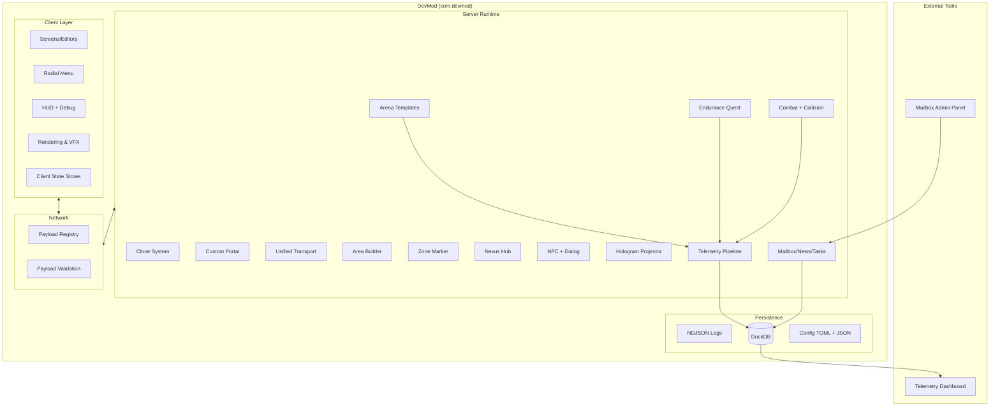

# Architettura DevMod

> Ultimo aggiornamento: 2026-01-15

DevMod e' una mod NeoForge 1.21.1 con separazione fra runtime server, layer client e servizi trasversali (network, config, telemetry, storage). L'entrypoint server e' `DevMod`, mentre il layer client e' inizializzato in `DevModClient`.

## Vista d'insieme



## Entry point e bootstrap

- `DevMod` registra registries (blocchi, item, attributi, data components), config e moduli.
- `DevModClient` inizializza keybind, bridge UI client e hook di rete lato client.
- Moduli principali bootstrap: Portal, Hologram, Clone, NPC, Debug, Area, Zone, Transport, Nexus decor.
- L2: arena template registry e config reload per Arena/Endurance/Nexus.

## Struttura del codice (macro)

```
com/devmod/
├── arena/        # template, builder, policy, telemetry
├── endurance/    # quest, wave, perk, reward, challenge
├── combat/       # combat flow, tracking, shield
├── collision/    # body-part, OBB, hit detection
├── clone/        # telepad, neurocell, reformer, macchine
├── portal/       # custom portal + rune blocks
├── transport/    # Warp Core unificato
├── area/         # Area Builder e Nexus Editor Central
├── zone/         # Zone marker/editor
├── npc/          # NPC + dialog system
├── hologram/     # proiettore 3D
├── mailbox/      # mailbox/news/task/ticket + API
├── telemetry/    # NDJSON + DuckDB
├── client/       # UI, overlay, rendering
├── network/      # payload registry + validation
└── util/         # utilities condivise
```

## Flussi chiave

- **Arena**: template registry -> policy resolver -> builder -> dimensione/area -> telemetry.
- **Endurance**: start session -> wave loop -> perk/reward -> telemetry + personal records.
- **Combat**: hit detection (body-part + OBB) -> damage breakdown -> HUD impact + telemetry.
- **Mailbox**: API + persistence DuckDB -> UI client + admin panel.
- **Telemetry**: event stream -> NDJSON + DuckDB -> dashboard/export.

## Storage e persistenza

- NDJSON e export: `run/telemetry/`.
- DuckDB schema: `src/main/resources/db/duckdb_schema.sql`.
- Config runtime: `run/config/devmod-common.toml`, `run/config/devmod-mechanics.toml`, `run/config/devmod-portals.toml`, `run/config/devmod-client.toml` + JSON in `config/devmod/`.
