# Architettura DevMod

> Ultimo aggiornamento: 2026-01-02
> Verificato: Corrisponde al codice attuale

## Vista d'Insieme

DevMod è una mod Minecraft (NeoForge 1.21.1) che aggiunge sistemi avanzati di combattimento, quest, arene e analytics.

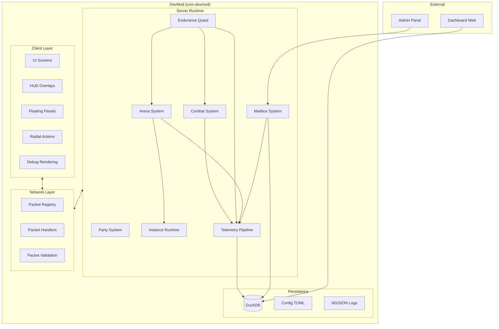

---

## Struttura Package

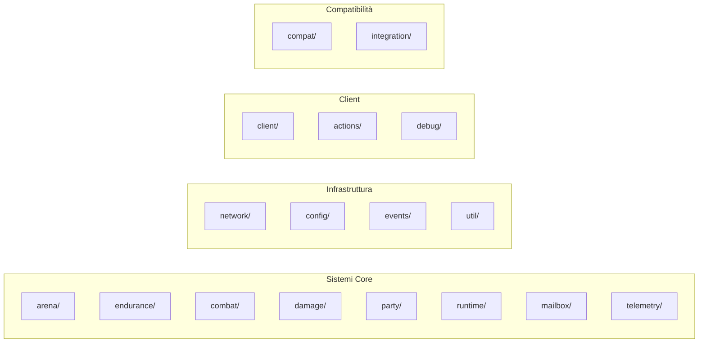

### Package Principali

| Package | Responsabilità |
|---------|----------------|
| `arena/` | Template arena, policy, build, observability |
| `endurance/` | Quest system, wave, perk, combo, reward, boss |
| `combat/` | Damage handler, hit detection, body parts |
| `damage/` | Calcolo danni, breakdown |
| `party/` | Gestione party multiplayer |
| `runtime/` | Instance manager, dynamic dimensions |
| `mailbox/` | Messaggi, news, task, ticket |
| `telemetry/` | Pipeline analytics, DuckDB, dashboard |
| `network/` | Packet registry, handler, validation |
| `config/` | Configurazione globale |
| `client/` | UI, overlay, rendering, panels |
| `actions/` | Radial menu, azioni |

---

## Flusso Dati

### Combat Flow

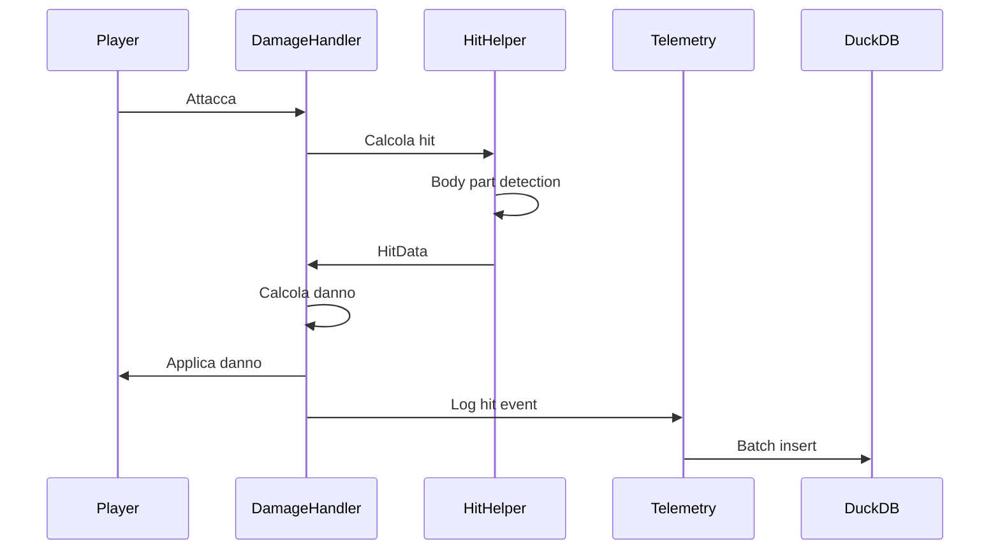

### Endurance Quest Flow

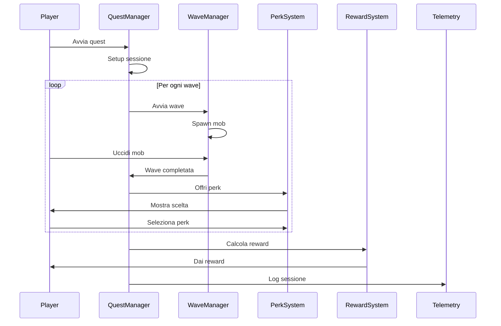

### Arena Build Flow

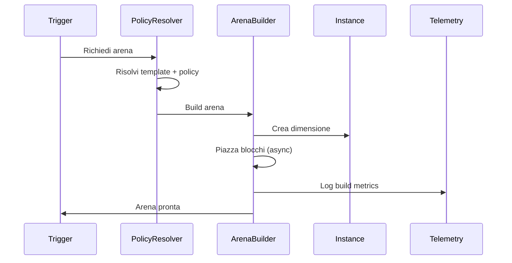

### Telemetry Pipeline

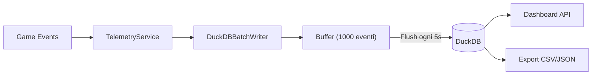

---

## Componenti Chiave

### Server Side

#### Arena System

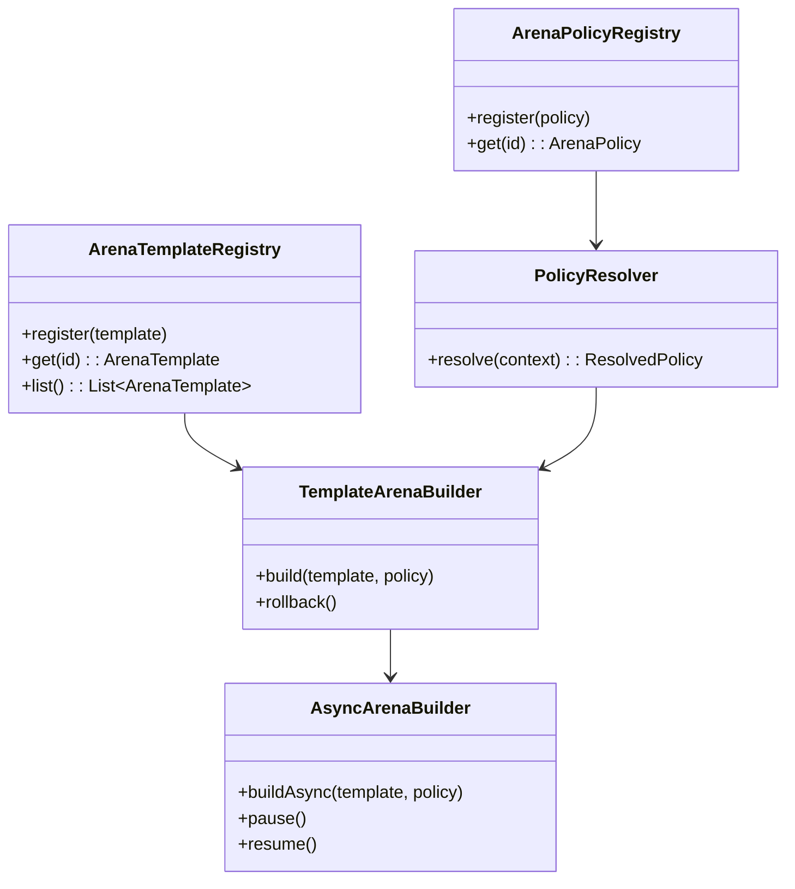

#### Endurance System

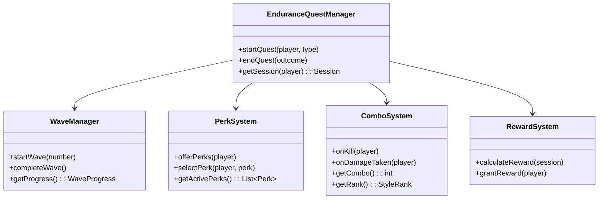

#### Telemetry System

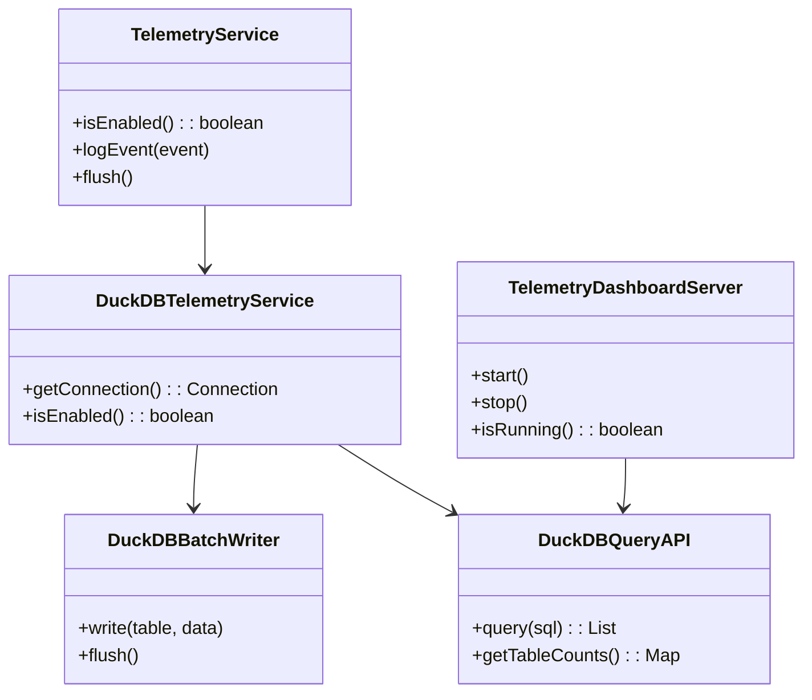

### Client Side

#### UI Layer

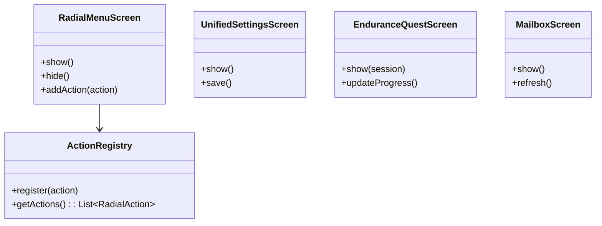

#### Radial Menu System (Data-Driven)

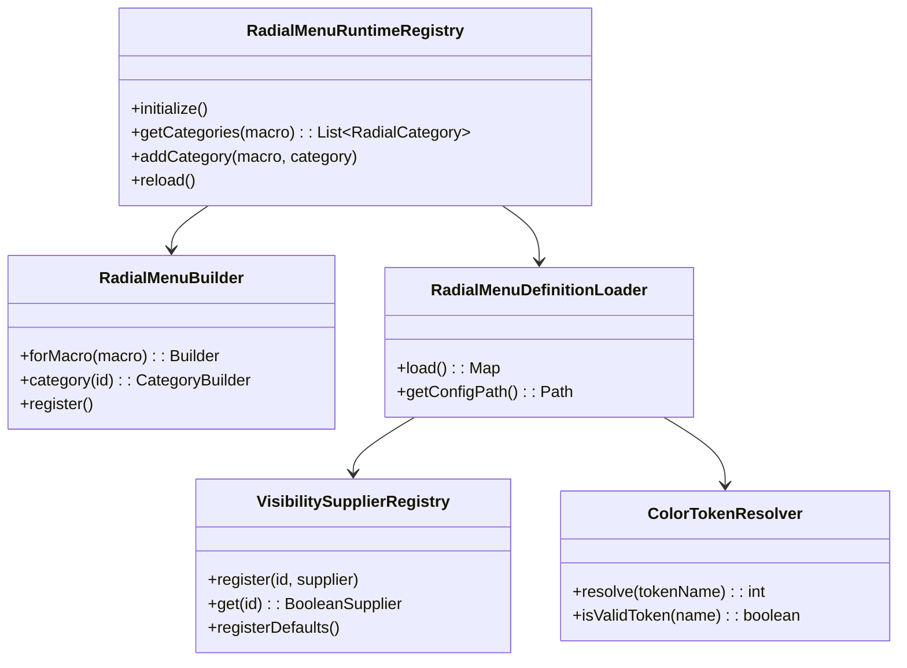

Il sistema Radial Menu supporta:

- **JSON Config**: `config/devmod/radial_menu_definitions.json`
- **Programmatic API**: `RadialMenuBuilder` per registrazione runtime
- **Visibility Suppliers**: Condizioni dinamiche per visibilità item
- **Color Tokens**: Riferimenti a `DesignTokens.Radial`

#### Floating Panels

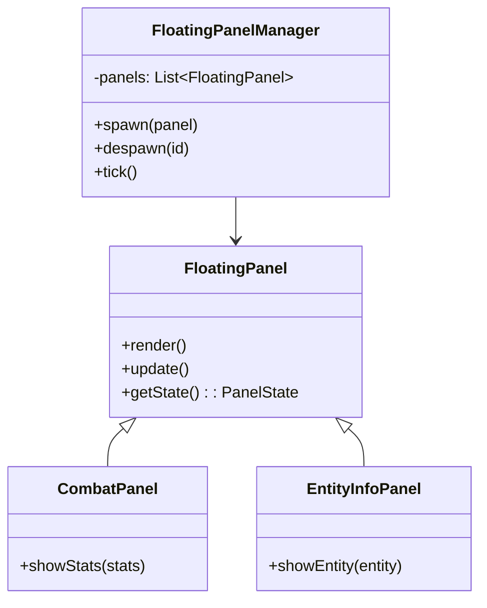

---

## Network

### Packet Flow

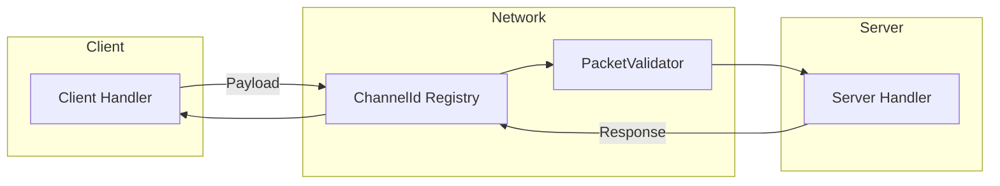

### Packet Registration

```java
// ChannelId.java definisce tutti i packet ID
// NetworkHandler.java registra i payload via RegisterPayloadHandlersEvent
// PacketValidator.java valida i packet in arrivo
```

### Network Handlers (Domain Split)

I network handler sono suddivisi per dominio:

| Handler | Responsabilità |
|---------|----------------|
| `AbilityNetworkHandler` | Payload abilità |
| `ShieldNetworkHandler` | Payload scudi |
| `ConfigNetworkHandler` | Sync configurazione |
| `EnduranceNetworkHandler` | Quest endurance |
| `PartyNetworkHandler` | Gestione party |
| `MobItemNetworkHandler` | Mob equipment |
| `MailboxNetworkHandler` | Sistema mailbox |
| `NotificationNetworkHandler` | Notifiche |

### Payload Validation

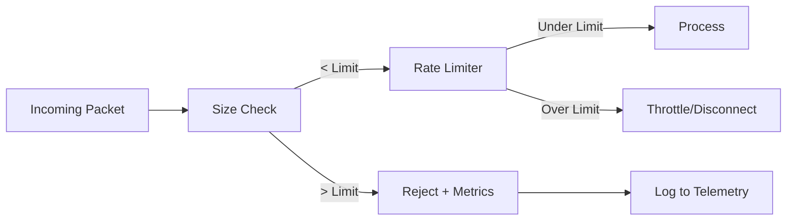

Componenti:

- **PayloadValidation**: Rate limiting per player/IP
- **SizedPayload**: Interface per payload con size estimation
- **IpRateLimiter**: Rate limit a livello IP
- **PacketValidator**: Validazione centralizzata

---

## Service Registry

Pattern DI per servizi core:

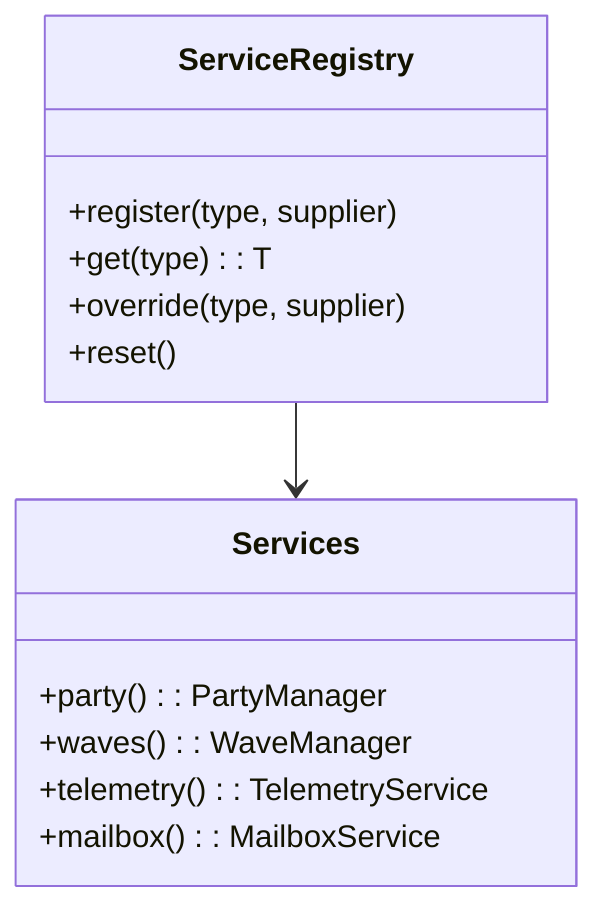

Vantaggi:

- Testing: Override dei servizi per test
- Lazy init: Servizi inizializzati on-demand
- Backward compat: Singleton esistenti funzionano ancora

---

## Event System

### Server Events

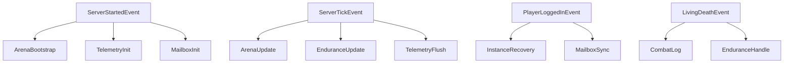

### Client Events

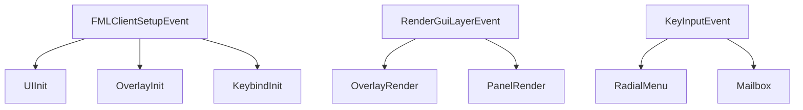

---

## Persistence

### DuckDB

Database embedded per telemetry e mailbox.

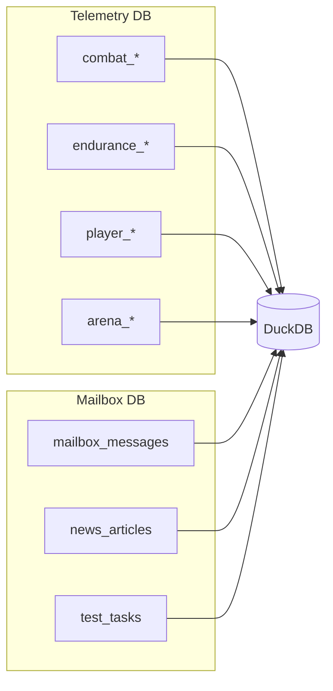

### Config

```
config/devmod/
├── devmod-common.toml      # Config comune
├── telemetry_settings.json # Settings telemetry
└── ...
```

---

## Compatibilità

### Mod Supportate

| Mod | Package | Descrizione |
|-----|---------|-------------|
| Pehkui | `compat/pehkui/` | Scaling hitbox |
| Iron's Spellbooks | `compat/irons/` | Integrazione spell |
| Little Tiles | `integration/` | Compatibilità tiles |

### Integration Pattern

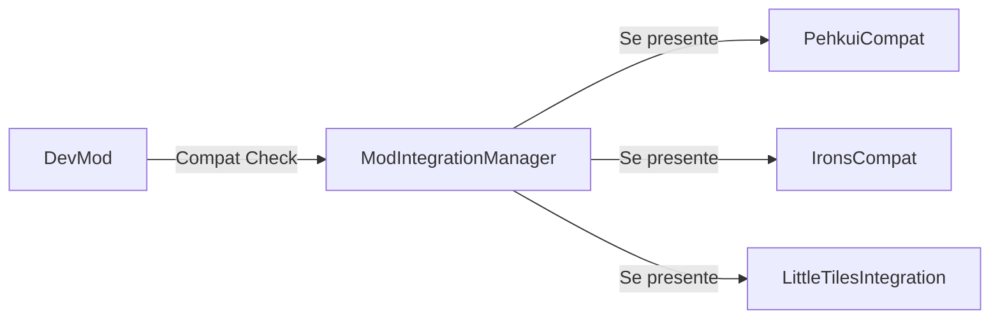

---

## Entry Points

### Mod Bootstrap

| Entry Point | File | Descrizione |
|-------------|------|-------------|
| `@Mod("devmod")` | `DevMod.java` | Bootstrap comune |
| Client init | `DevModClient.java` | Init client |
| Config events | `DevMod.java` | Load/reload config |

### Commands

| Comando | Handler | Descrizione |
|---------|---------|-------------|
| `/devtest` | `TestHarnessCommands` | Debug e test |
| `/arena` | `ArenaCommands` | Operazioni arena |
| `/devmod telemetry` | `TelemetryReloadCommand` | Gestione telemetry |
| `/devmod dashboard` | `DashboardCommand` | Dashboard server |
| `/mailbox` | `MailboxCommands` | Admin mailbox |

### Keybinds

| Tasto | Azione | Handler |
|-------|--------|---------|
| G | Menu radiale | `KeyInputHandler` |
| M | Mailbox | `KeyInputHandler` |
| T | Task tester | `KeyInputHandler` |

---

## Riferimenti

- [Database Schema](DATABASE.md)
- [Pannelli Esterni](PANELS.md)
- [Sistemi](SYSTEMS.md)
- [Quickstart](QUICKSTART.md)
