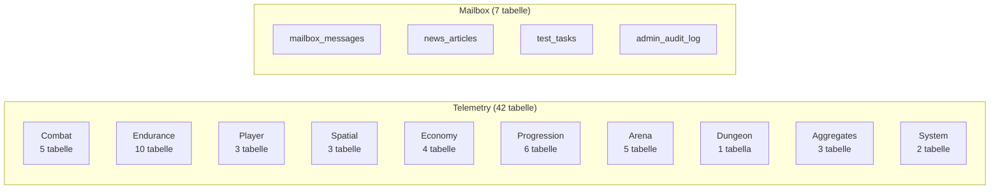
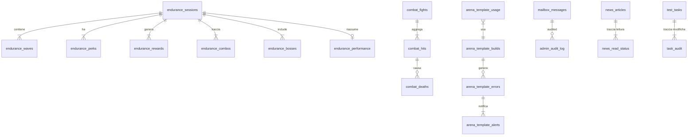

# Schema Database DevMod

> Ultimo aggiornamento: 2025-12-30
> Database: DuckDB
> Schema Version: 11 (Telemetry) + 6 (Mailbox)

DevMod utilizza DuckDB come database embedded per telemetry, analytics e persistenza mailbox. Questo documento descrive tutte le tabelle, le loro colonne e le relazioni.

---

## Panoramica

---

## Diagramma ER Semplificato

---

## Tabelle per Dominio

### Sistema

#### migrations

Traccia le versioni dello schema.

| Colonna | Tipo | Descrizione |
|---------|------|-------------|
| version | INTEGER | Versione schema (PK) |
| migrated_at | TIMESTAMP | Data migrazione |

#### performance_samples

Campioni di performance del server.

| Colonna | Tipo | Descrizione |
|---------|------|-------------|
| id | BIGINT | ID univoco (PK) |
| ts | TIMESTAMP | Timestamp campione |
| mspt | DOUBLE | Millisecondi per tick |
| tps | DOUBLE | Tick per secondo |

---

### Combat (5 tabelle)

#### combat_hits

Ogni colpo inflitto nel gioco.

| Colonna | Tipo | Descrizione |
|---------|------|-------------|
| id | BIGINT | ID univoco (PK) |
| ts | TIMESTAMP | Timestamp del colpo |
| room | VARCHAR(128) | Stanza/area |
| world | VARCHAR(128) | Dimensione |
| template_id | VARCHAR(128) | ID template arena |
| template_version | INTEGER | Versione template |
| policy_id | VARCHAR(128) | ID policy |
| policy_version | INTEGER | Versione policy |
| arena_id | UUID | ID arena |
| session_id | UUID | ID sessione endurance |
| attacker_name | VARCHAR(64) | Nome attaccante |
| attacker_type | VARCHAR(128) | Tipo entità attaccante |
| target_name | VARCHAR(64) | Nome bersaglio |
| target_type | VARCHAR(128) | Tipo entità bersaglio |
| damage | DOUBLE | Danno inflitto |
| damage_type | VARCHAR(64) | Tipo di danno |
| hp_before | DOUBLE | HP prima del colpo |
| hp_after | DOUBLE | HP dopo il colpo |
| body_part | VARCHAR(32) | Parte del corpo colpita |
| distance | DOUBLE | Distanza del colpo |
| armor_pen_bonus | DOUBLE | Bonus penetrazione armatura |
| is_miss | BOOLEAN | Se il colpo è mancato |
| is_hazard | BOOLEAN | Se è danno da hazard |
| hazard_type | VARCHAR(64) | Tipo di hazard |
| attacker_state | JSON | Stato attaccante (arma, etc.) |
| target_state | JSON | Stato bersaglio |

**Indici**: `ts`, `room`

#### combat_deaths

Morti di entità.

| Colonna | Tipo | Descrizione |
|---------|------|-------------|
| id | BIGINT | ID univoco (PK) |
| ts | TIMESTAMP | Timestamp morte |
| room | VARCHAR(128) | Stanza/area |
| world | VARCHAR(128) | Dimensione |
| template_id | VARCHAR(128) | ID template arena |
| template_version | INTEGER | Versione template |
| policy_id | VARCHAR(128) | ID policy |
| policy_version | INTEGER | Versione policy |
| arena_id | UUID | ID arena |
| session_id | UUID | ID sessione endurance |
| target_name | VARCHAR(64) | Nome vittima |
| target_type | VARCHAR(128) | Tipo entità |
| cause | VARCHAR(128) | Causa morte |
| ttk_first_hit_ms | BIGINT | Time-to-kill dal primo colpo |
| ttk_spawn_ms | BIGINT | Time-to-kill dallo spawn |

**Indici**: `ts`

#### combat_heals

Cure ricevute.

| Colonna | Tipo | Descrizione |
|---------|------|-------------|
| id | BIGINT | ID univoco (PK) |
| ts | TIMESTAMP | Timestamp cura |
| room | VARCHAR(128) | Stanza/area |
| world | VARCHAR(128) | Dimensione |
| template_id | VARCHAR(128) | ID template arena |
| template_version | INTEGER | Versione template |
| policy_id | VARCHAR(128) | ID policy |
| policy_version | INTEGER | Versione policy |
| arena_id | UUID | ID arena |
| session_id | UUID | ID sessione endurance |
| target_name | VARCHAR(64) | Nome curato |
| target_type | VARCHAR(128) | Tipo entità |
| heal_amount | DOUBLE | Quantità cura |
| hp_before | DOUBLE | HP prima |
| hp_after | DOUBLE | HP dopo |
| source | VARCHAR(64) | Fonte della cura |

#### combat_spawns

Spawn di entità.

| Colonna | Tipo | Descrizione |
|---------|------|-------------|
| id | BIGINT | ID univoco (PK) |
| ts | TIMESTAMP | Timestamp spawn |
| room | VARCHAR(128) | Stanza/area |
| world | VARCHAR(128) | Dimensione |
| template_id | VARCHAR(128) | ID template arena |
| template_version | INTEGER | Versione template |
| policy_id | VARCHAR(128) | ID policy |
| policy_version | INTEGER | Versione policy |
| arena_id | UUID | ID arena |
| session_id | UUID | ID sessione endurance |
| entity_name | VARCHAR(64) | Nome entità |
| entity_type | VARCHAR(128) | Tipo entità |
| reason | VARCHAR(64) | Motivo spawn |
| spawn_fail | BOOLEAN | Se spawn fallito |
| x, y, z | DOUBLE | Coordinate |

#### combat_fights

Aggregazione di combattimenti.

| Colonna | Tipo | Descrizione |
|---------|------|-------------|
| id | BIGINT | ID univoco (PK) |
| room | VARCHAR(128) | Stanza/area |
| world | VARCHAR(128) | Dimensione |
| template_id | VARCHAR(128) | ID template arena |
| template_version | INTEGER | Versione template |
| policy_id | VARCHAR(128) | ID policy |
| policy_version | INTEGER | Versione policy |
| arena_id | UUID | ID arena |
| session_id | UUID | ID sessione endurance |
| start_ts | TIMESTAMP | Inizio combattimento |
| end_ts | TIMESTAMP | Fine combattimento |
| duration_ms | BIGINT | Durata in ms |
| hits | INTEGER | Numero colpi |
| mob_kills | INTEGER | Mob uccisi |
| player_deaths | INTEGER | Morti giocatore |
| players | VARCHAR[] | Lista giocatori |
| mob_kills_by_type | JSON | Kill per tipo mob |
| player_deaths_by_name | JSON | Morti per giocatore |
| ttk_by_type | JSON | TTK per tipo mob |
| burst_max | DOUBLE | Burst massimo |
| hp_after_players_avg | DOUBLE | HP medio giocatori a fine |
| hp_after_mobs_avg | DOUBLE | HP medio mob a fine |

---

### Endurance (10 tabelle)

#### endurance_sessions

Sessioni di Endurance Quest.

| Colonna | Tipo | Descrizione |
|---------|------|-------------|
| id | UUID | ID sessione (PK) |
| player_id | UUID | ID giocatore |
| player_name | VARCHAR(64) | Nome giocatore |
| quest_name | VARCHAR(128) | Nome quest |
| quest_type | VARCHAR(32) | Tipo quest |
| total_waves | INTEGER | Wave totali |
| is_endless | BOOLEAN | Se è modalità endless |
| player_count | INTEGER | Numero giocatori |
| start_ts | TIMESTAMP | Inizio sessione |
| end_ts | TIMESTAMP | Fine sessione |
| outcome | VARCHAR(32) | Esito (victory/defeat/abandon) |
| waves_completed | INTEGER | Wave completate |
| total_kills | INTEGER | Uccisioni totali |
| damage_dealt | DOUBLE | Danno inflitto |
| damage_taken | DOUBLE | Danno subito |
| tokens_earned | INTEGER | Token guadagnati |
| prestige_earned | INTEGER | Prestigio guadagnato |
| blood_gems_earned | INTEGER | Blood gems guadagnate |
| no_damage_waves | INTEGER | Wave senza danno |
| template_id | VARCHAR(128) | ID template arena |
| template_version | INTEGER | Versione template |
| policy_id | VARCHAR(128) | ID policy |
| policy_version | INTEGER | Versione policy |
| instance_id | UUID | ID istanza |
| arena_id | UUID | ID arena |
| countdown_started | INTEGER | Countdown avviati |
| countdown_cancelled | INTEGER | Countdown cancellati |
| giveup_during_respawn | INTEGER | Abbandoni durante respawn |
| inventory_restore_success | INTEGER | Restore inventario riusciti |
| inventory_restore_fallback | INTEGER | Restore inventario fallback |
| external_death_respawn_count | INTEGER | Respawn da morte esterna |
| wave_blocked_detected | INTEGER | Wave bloccate rilevate |

**Indici**: `player_id`

#### endurance_waves

Eventi delle wave.

| Colonna | Tipo | Descrizione |
|---------|------|-------------|
| id | BIGINT | ID univoco (PK) |
| ts | TIMESTAMP | Timestamp evento |
| session_id | UUID | ID sessione |
| template_id | VARCHAR(128) | ID template arena |
| template_version | INTEGER | Versione template |
| policy_id | VARCHAR(128) | ID policy |
| policy_version | INTEGER | Versione policy |
| arena_id | UUID | ID arena |
| wave_number | INTEGER | Numero wave |
| event_type | VARCHAR(32) | Tipo evento (start/end) |
| mob_count | INTEGER | Mob nella wave |
| player_count | INTEGER | Giocatori attivi |
| quest_type | VARCHAR(32) | Tipo quest |
| modifiers | VARCHAR | Modificatori attivi |
| mobs_killed | INTEGER | Mob uccisi |
| duration_ms | BIGINT | Durata wave |
| no_damage | BOOLEAN | Wave senza danno |
| kills_per_second | DOUBLE | Kill per secondo |

**Indici**: `session_id`

#### endurance_wave_kills

Kill durante le wave.

| Colonna | Tipo | Descrizione |
|---------|------|-------------|
| id | BIGINT | ID univoco (PK) |
| ts | TIMESTAMP | Timestamp kill |
| session_id | UUID | ID sessione |
| template_id | VARCHAR(128) | ID template arena |
| template_version | INTEGER | Versione template |
| policy_id | VARCHAR(128) | ID policy |
| policy_version | INTEGER | Versione policy |
| arena_id | UUID | ID arena |
| wave_number | INTEGER | Numero wave |
| mob_type | VARCHAR(128) | Tipo mob ucciso |
| is_elite | BOOLEAN | Se era elite |
| killer_weapon | VARCHAR(128) | Arma usata |
| damage_dealt | DOUBLE | Danno inflitto |

**Indici**: `session_id`

#### endurance_combos

Eventi combo.

| Colonna | Tipo | Descrizione |
|---------|------|-------------|
| id | BIGINT | ID univoco (PK) |
| ts | TIMESTAMP | Timestamp |
| player_id | UUID | ID giocatore |
| session_id | UUID | ID sessione |
| template_id | VARCHAR(128) | ID template arena |
| template_version | INTEGER | Versione template |
| policy_id | VARCHAR(128) | ID policy |
| policy_version | INTEGER | Versione policy |
| arena_id | UUID | ID arena |
| event_type | VARCHAR(32) | Tipo evento |
| old_rank | VARCHAR(16) | Rank precedente |
| new_rank | VARCHAR(16) | Nuovo rank |
| style_score | INTEGER | Punteggio stile |
| current_combo | INTEGER | Combo attuale |
| milestone | INTEGER | Milestone raggiunta |
| combo_lost | INTEGER | Combo persa |
| damage_taken | DOUBLE | Danno subito |
| action_type | VARCHAR(32) | Tipo azione |
| points_earned | INTEGER | Punti guadagnati |
| style_earned | INTEGER | Stile guadagnato |

#### endurance_perks

Perk selezionati/usati.

| Colonna | Tipo | Descrizione |
|---------|------|-------------|
| id | BIGINT | ID univoco (PK) |
| ts | TIMESTAMP | Timestamp |
| player_id | UUID | ID giocatore |
| session_id | UUID | ID sessione |
| template_id | VARCHAR(128) | ID template arena |
| template_version | INTEGER | Versione template |
| policy_id | VARCHAR(128) | ID policy |
| policy_version | INTEGER | Versione policy |
| arena_id | UUID | ID arena |
| event_type | VARCHAR(32) | Tipo evento (offered/selected) |
| perk_id | VARCHAR(64) | ID perk |
| perk_name | VARCHAR(128) | Nome perk |
| tier | VARCHAR(16) | Tier perk |
| category | VARCHAR(32) | Categoria |
| stack_count | INTEGER | Stack attuali |
| total_perks | INTEGER | Perk totali |
| wave_number | INTEGER | Wave corrente |
| choices | JSON | Scelte offerte |

#### endurance_mutators

Mutatori applicati.

| Colonna | Tipo | Descrizione |
|---------|------|-------------|
| id | BIGINT | ID univoco (PK) |
| ts | TIMESTAMP | Timestamp |
| session_id | UUID | ID sessione |
| template_id | VARCHAR(128) | ID template arena |
| template_version | INTEGER | Versione template |
| policy_id | VARCHAR(128) | ID policy |
| policy_version | INTEGER | Versione policy |
| arena_id | UUID | ID arena |
| event_type | VARCHAR(32) | Tipo evento |
| mutator_id | VARCHAR(64) | ID mutatore |
| mutator_category | VARCHAR(32) | Categoria |
| wave_number | INTEGER | Wave |
| reward_multiplier | DOUBLE | Moltiplicatore reward |
| mutator_count | INTEGER | Mutatori attivi |
| mutators | JSON | Lista mutatori |

#### endurance_rewards

Ricompense ottenute.

| Colonna | Tipo | Descrizione |
|---------|------|-------------|
| id | BIGINT | ID univoco (PK) |
| ts | TIMESTAMP | Timestamp |
| player_id | UUID | ID giocatore |
| session_id | UUID | ID sessione |
| template_id | VARCHAR(128) | ID template arena |
| template_version | INTEGER | Versione template |
| policy_id | VARCHAR(128) | ID policy |
| policy_version | INTEGER | Versione policy |
| arena_id | UUID | ID arena |
| event_type | VARCHAR(32) | Tipo evento |
| currency | VARCHAR(32) | Tipo valuta |
| amount | INTEGER | Quantità |
| source | VARCHAR(64) | Fonte reward |
| item_id | VARCHAR(128) | ID item |
| item_count | INTEGER | Quantità item |
| loot_tier | VARCHAR(16) | Tier loot |
| achievement_id | VARCHAR(64) | ID achievement |
| achievement_name | VARCHAR(128) | Nome achievement |
| price | INTEGER | Prezzo (se acquisto) |
| purchase_count | INTEGER | Quantità acquistata |

#### endurance_performance

Metriche performance sessione.

| Colonna | Tipo | Descrizione |
|---------|------|-------------|
| id | BIGINT | ID univoco (PK) |
| ts | TIMESTAMP | Timestamp |
| session_id | UUID | ID sessione |
| player_id | UUID | ID giocatore |
| quest_type | VARCHAR(32) | Tipo quest |
| duration_ms | BIGINT | Durata totale |
| waves_completed | INTEGER | Wave completate |
| kills | INTEGER | Uccisioni |
| damage_dealt | DOUBLE | Danno inflitto |
| damage_taken | DOUBLE | Danno subito |
| avg_ttk_ms | DOUBLE | TTK medio |
| kps | DOUBLE | Kill per secondo |
| dtps | DOUBLE | Damage taken per secondo |
| dps | DOUBLE | Damage per secondo |
| template_id | VARCHAR(128) | ID template arena |
| template_version | INTEGER | Versione template |
| policy_id | VARCHAR(128) | ID policy |
| policy_version | INTEGER | Versione policy |
| arena_id | UUID | ID arena |

#### endurance_parties

Eventi party.

| Colonna | Tipo | Descrizione |
|---------|------|-------------|
| id | BIGINT | ID univoco (PK) |
| ts | TIMESTAMP | Timestamp |
| party_id | UUID | ID party |
| event_type | VARCHAR(32) | Tipo evento |
| leader_id | UUID | ID leader |
| leader_name | VARCHAR(64) | Nome leader |
| member_id | UUID | ID membro |
| member_name | VARCHAR(64) | Nome membro |
| quest_type | VARCHAR(32) | Tipo quest |
| party_size | INTEGER | Dimensione party |
| reason | VARCHAR(64) | Motivo evento |
| accepted | BOOLEAN | Se accettato |

#### endurance_bosses

Eventi boss.

| Colonna | Tipo | Descrizione |
|---------|------|-------------|
| id | BIGINT | ID univoco (PK) |
| ts | TIMESTAMP | Timestamp |
| session_id | UUID | ID sessione |
| template_id | VARCHAR(128) | ID template arena |
| template_version | INTEGER | Versione template |
| policy_id | VARCHAR(128) | ID policy |
| policy_version | INTEGER | Versione policy |
| arena_id | UUID | ID arena |
| event_type | VARCHAR(32) | Tipo evento (spawn/ability/death) |
| wave_number | INTEGER | Wave |
| archetype | VARCHAR(64) | Archetipo boss |
| boss_max_health | DOUBLE | HP massimi boss |
| player_count | INTEGER | Giocatori presenti |
| ability_name | VARCHAR(64) | Nome abilità usata |
| players_hit | INTEGER | Giocatori colpiti |
| ability_damage | DOUBLE | Danno abilità |
| fight_duration_ms | BIGINT | Durata fight |
| bonus_points | INTEGER | Punti bonus |
| damage_dealt_to_boss | DOUBLE | Danno inflitto al boss |

---

### Player (3 tabelle)

#### player_snapshots

Snapshot stato giocatore.

| Colonna | Tipo | Descrizione |
|---------|------|-------------|
| id | BIGINT | ID univoco (PK) |
| ts | TIMESTAMP | Timestamp |
| player_id | UUID | ID giocatore |
| player_name | VARCHAR(64) | Nome giocatore |
| trigger_type | VARCHAR(32) | Trigger dello snapshot |
| health_hp | DOUBLE | HP attuali |
| max_health_hp | DOUBLE | HP massimi |
| health_hearts | INTEGER | Cuori |
| absorption_hp | DOUBLE | HP assorbimento |
| hunger_level | INTEGER | Fame |
| saturation | DOUBLE | Saturazione |
| exhaustion | DOUBLE | Esaurimento |
| movement_speed | DOUBLE | Velocità movimento |
| velocity_x/y/z | DOUBLE | Velocità |
| movement_flags | INTEGER | Flag movimento |
| melee_damage_mult | DOUBLE | Moltiplicatore melee |
| melee_reduction | DOUBLE | Riduzione melee |
| magic_damage_mult | DOUBLE | Moltiplicatore magico |
| magic_reduction | DOUBLE | Riduzione magica |
| ranged_damage_mult | DOUBLE | Moltiplicatore ranged |
| ranged_reduction | DOUBLE | Riduzione ranged |
| armor_value | DOUBLE | Valore armatura |
| armor_toughness | DOUBLE | Durezza armatura |
| knockback_resistance | DOUBLE | Resistenza knockback |
| total_damage_reduction | DOUBLE | Riduzione danno totale |
| reach | DOUBLE | Portata |
| hitbox_width/height | DOUBLE | Dimensioni hitbox |
| pehkui_scale | DOUBLE | Scala Pehkui |
| pehkui_hitbox_scale | DOUBLE | Scala hitbox Pehkui |
| stamina | DOUBLE | Stamina |
| max_stamina | DOUBLE | Stamina massima |
| dash_cooldown | DOUBLE | Cooldown dash |
| dodge_cooldown | DOUBLE | Cooldown dodge |
| ability_flags | INTEGER | Flag abilità |
| current_combo | INTEGER | Combo attuale |
| style_rank | VARCHAR(16) | Rank stile |
| style_score | INTEGER | Punteggio stile |
| x, y, z | DOUBLE | Posizione |
| dimension | VARCHAR(128) | Dimensione |

**Indici**: `player_id`, `ts`

#### player_attribute_changes

Cambiamenti attributi.

| Colonna | Tipo | Descrizione |
|---------|------|-------------|
| id | BIGINT | ID univoco (PK) |
| ts | TIMESTAMP | Timestamp |
| player_id | UUID | ID giocatore |
| attribute_name | VARCHAR(64) | Nome attributo |
| old_value | DOUBLE | Valore precedente |
| new_value | DOUBLE | Nuovo valore |
| delta | DOUBLE | Differenza |

#### player_abilities

Uso abilità (dash, dodge, etc.).

| Colonna | Tipo | Descrizione |
|---------|------|-------------|
| id | BIGINT | ID univoco (PK) |
| ts | TIMESTAMP | Timestamp |
| player_id | UUID | ID giocatore |
| ability_type | VARCHAR(32) | Tipo abilità |
| success | BOOLEAN | Se riuscita |
| result | INTEGER | Codice risultato |
| stamina_before | DOUBLE | Stamina prima |
| stamina_after | DOUBLE | Stamina dopo |
| stamina_cost | DOUBLE | Costo stamina |
| damage_negated | DOUBLE | Danno negato |
| damage_source | VARCHAR(64) | Fonte danno |
| context | VARCHAR(64) | Contesto uso |
| regen_time_ms | BIGINT | Tempo rigenerazione |

**Indici**: `player_id`

---

### Spatial (3 tabelle)

#### spatial_heatmaps

Dati per heatmap.

| Colonna | Tipo | Descrizione |
|---------|------|-------------|
| id | BIGINT | ID univoco (PK) |
| ts | TIMESTAMP | Timestamp |
| heatmap_type | VARCHAR(32) | Tipo heatmap |
| room | VARCHAR(128) | Stanza |
| x, y, z | INTEGER | Coordinate |
| count | INTEGER | Conteggio |

**Indici**: `heatmap_type`, `room`

#### spatial_alerts

Alert spaziali.

| Colonna | Tipo | Descrizione |
|---------|------|-------------|
| id | BIGINT | ID univoco (PK) |
| ts | TIMESTAMP | Timestamp |
| alert_type | VARCHAR(32) | Tipo alert |
| player_name | VARCHAR(64) | Giocatore |
| entity_name | VARCHAR(64) | Nome entità |
| entity_type | VARCHAR(128) | Tipo entità |
| room | VARCHAR(128) | Stanza |
| x, y, z | DOUBLE | Coordinate |
| extra_data | JSON | Dati extra |

#### spatial_room_transitions

Transizioni tra stanze.

| Colonna | Tipo | Descrizione |
|---------|------|-------------|
| id | BIGINT | ID univoco (PK) |
| ts | TIMESTAMP | Timestamp |
| player_id | UUID | ID giocatore |
| player_name | VARCHAR(64) | Nome giocatore |
| room | VARCHAR(128) | Nuova stanza |

---

### Economy (4 tabelle)

#### economy_mob_kills

Kill di mob per economia.

| Colonna | Tipo | Descrizione |
|---------|------|-------------|
| id | BIGINT | ID univoco (PK) |
| ts | TIMESTAMP | Timestamp |
| mob_type | VARCHAR(128) | Tipo mob |
| total_kills | INTEGER | Kill totali |
| had_loot | BOOLEAN | Se ha droppato loot |

#### economy_mob_drops

Drop da mob.

| Colonna | Tipo | Descrizione |
|---------|------|-------------|
| id | BIGINT | ID univoco (PK) |
| ts | TIMESTAMP | Timestamp |
| mob_type | VARCHAR(128) | Tipo mob |
| room | VARCHAR(128) | Stanza |
| item_id | VARCHAR(128) | ID item |
| item_count | INTEGER | Quantità |
| x, y, z | INTEGER | Coordinate |

#### economy_item_pickups

Raccolta item.

| Colonna | Tipo | Descrizione |
|---------|------|-------------|
| id | BIGINT | ID univoco (PK) |
| ts | TIMESTAMP | Timestamp |
| player_id | UUID | ID giocatore |
| player_name | VARCHAR(64) | Nome |
| room | VARCHAR(128) | Stanza |
| item_id | VARCHAR(128) | ID item |
| item_count | INTEGER | Quantità |
| x, y, z | INTEGER | Coordinate |

#### economy_item_usage

Uso item.

| Colonna | Tipo | Descrizione |
|---------|------|-------------|
| id | BIGINT | ID univoco (PK) |
| ts | TIMESTAMP | Timestamp |
| player_id | UUID | ID giocatore |
| player_name | VARCHAR(64) | Nome |
| event_type | VARCHAR(16) | Tipo evento |
| item_id | VARCHAR(128) | ID item |
| item_count | INTEGER | Quantità |
| use_type | VARCHAR(32) | Tipo uso |

---

### Progression (6 tabelle)

#### progression_blocks

Blocchi piazzati/rotti.

| Colonna | Tipo | Descrizione |
|---------|------|-------------|
| id | BIGINT | ID univoco (PK) |
| ts | TIMESTAMP | Timestamp |
| player_id | UUID | ID giocatore |
| player_name | VARCHAR(64) | Nome |
| world_id | VARCHAR(128) | Mondo |
| room | VARCHAR(128) | Stanza |
| event_type | VARCHAR(16) | place/break |
| block_id | VARCHAR(128) | ID blocco |
| x, y, z | INTEGER | Coordinate |

#### progression_xp

Guadagno XP.

| Colonna | Tipo | Descrizione |
|---------|------|-------------|
| id | BIGINT | ID univoco (PK) |
| ts | TIMESTAMP | Timestamp |
| player_id | UUID | ID giocatore |
| player_name | VARCHAR(64) | Nome |
| world_id | VARCHAR(128) | Mondo |
| room | VARCHAR(128) | Stanza |
| event_type | VARCHAR(16) | Tipo |
| xp_amount | INTEGER | XP guadagnata |
| old_level | INTEGER | Livello precedente |
| new_level | INTEGER | Nuovo livello |
| x, y, z | INTEGER | Coordinate |

#### progression_advancements

Achievement sbloccati.

| Colonna | Tipo | Descrizione |
|---------|------|-------------|
| id | BIGINT | ID univoco (PK) |
| ts | TIMESTAMP | Timestamp |
| player_id | UUID | ID giocatore |
| player_name | VARCHAR(64) | Nome |
| world_id | VARCHAR(128) | Mondo |
| room | VARCHAR(128) | Stanza |
| advancement_id | VARCHAR(256) | ID advancement |
| title | VARCHAR(128) | Titolo |
| x, y, z | INTEGER | Coordinate |

#### progression_dimensions

Cambi dimensione.

| Colonna | Tipo | Descrizione |
|---------|------|-------------|
| id | BIGINT | ID univoco (PK) |
| ts | TIMESTAMP | Timestamp |
| player_id | UUID | ID giocatore |
| player_name | VARCHAR(64) | Nome |
| world_id | VARCHAR(128) | Mondo |
| from_dimension | VARCHAR(128) | Dimensione origine |
| to_dimension | VARCHAR(128) | Dimensione destinazione |
| x, y, z | INTEGER | Coordinate |

#### progression_trades

Scambi con villager.

| Colonna | Tipo | Descrizione |
|---------|------|-------------|
| id | BIGINT | ID univoco (PK) |
| ts | TIMESTAMP | Timestamp |
| player_id | UUID | ID giocatore |
| player_name | VARCHAR(64) | Nome |
| world_id | VARCHAR(128) | Mondo |
| room | VARCHAR(128) | Stanza |
| villager_type | VARCHAR(128) | Tipo villager |
| profession | VARCHAR(64) | Professione |
| item_bought | VARCHAR(128) | Item acquistato |
| item_bought_count | INTEGER | Quantità acquistata |
| item_sold | VARCHAR(128) | Item venduto |
| item_sold_count | INTEGER | Quantità venduta |
| x, y, z | INTEGER | Coordinate |

#### progression_fishing

Pesca.

| Colonna | Tipo | Descrizione |
|---------|------|-------------|
| id | BIGINT | ID univoco (PK) |
| ts | TIMESTAMP | Timestamp |
| player_id | UUID | ID giocatore |
| player_name | VARCHAR(64) | Nome |
| world_id | VARCHAR(128) | Mondo |
| room | VARCHAR(128) | Stanza |
| item_id | VARCHAR(128) | Item pescato |
| item_count | INTEGER | Quantità |
| x, y, z | INTEGER | Coordinate |

---

### Arena (5 tabelle)

#### arena_template_builds

Build di template arena.

| Colonna | Tipo | Descrizione |
|---------|------|-------------|
| id | BIGINT | ID univoco (PK) |
| ts | TIMESTAMP | Timestamp |
| arena_id | UUID | ID arena |
| template_id | VARCHAR(128) | ID template |
| template_version | INTEGER | Versione |
| policy_id | VARCHAR(128) | ID policy |
| policy_version | INTEGER | Versione policy |
| origin_x/y/z | INTEGER | Coordinate origine |
| dimension | VARCHAR(128) | Dimensione |
| estimated_blocks | INTEGER | Blocchi stimati |
| actual_blocks | INTEGER | Blocchi effettivi |
| estimated_ms | BIGINT | Tempo stimato |
| actual_ms | BIGINT | Tempo effettivo |
| success | BOOLEAN | Se riuscita |
| error_message | VARCHAR(512) | Messaggio errore |
| rollback_ms | BIGINT | Tempo rollback |
| blocks_reverted | INTEGER | Blocchi annullati |
| baseline_mspt | DOUBLE | MSPT base |
| avg_mspt | DOUBLE | MSPT medio |
| peak_mspt | DOUBLE | MSPT picco |
| max_build_impact_ms | DOUBLE | Impatto massimo |
| pause_count | INTEGER | Pause |
| throttle_count | INTEGER | Throttle |
| perf_aborted | BOOLEAN | Se abortita per performance |

**Indici**: `ts`, `template_id`, `arena_id`

#### arena_template_usage

Uso di template arena.

| Colonna | Tipo | Descrizione |
|---------|------|-------------|
| id | BIGINT | ID univoco (PK) |
| ts | TIMESTAMP | Timestamp |
| template_id | VARCHAR(128) | ID template |
| template_version | INTEGER | Versione |
| policy_id | VARCHAR(128) | ID policy |
| policy_version | INTEGER | Versione policy |
| player_id | UUID | ID giocatore |
| player_name | VARCHAR(64) | Nome |
| quest_type | VARCHAR(64) | Tipo quest |
| mob_id | VARCHAR(128) | Mob sfida |
| difficulty | VARCHAR(32) | Difficoltà |
| player_count | INTEGER | Giocatori |
| session_id | UUID | ID sessione |
| event_type | VARCHAR(32) | Tipo evento |
| duration_ms | BIGINT | Durata |
| waves_completed | INTEGER | Wave completate |
| outcome | VARCHAR(32) | Esito |

**Indici**: `ts`, `template_id`, `player_id`

#### arena_template_errors

Errori template arena.

| Colonna | Tipo | Descrizione |
|---------|------|-------------|
| id | BIGINT | ID univoco (PK) |
| ts | TIMESTAMP | Timestamp |
| error_id | UUID | ID errore |
| severity | VARCHAR(16) | Severità |
| error_type | VARCHAR(256) | Tipo errore |
| message | VARCHAR(512) | Messaggio |
| component | VARCHAR(128) | Componente |
| template_id | VARCHAR(128) | ID template |
| arena_id | UUID | ID arena |
| session_id | UUID | ID sessione |
| stack_frames | JSON | Stack trace |
| metadata | JSON | Metadati |

**Indici**: `ts`, `error_id`, `severity`, `template_id`

#### arena_template_alerts

Alert per errori arena.

| Colonna | Tipo | Descrizione |
|---------|------|-------------|
| id | BIGINT | ID univoco (PK) |
| ts | TIMESTAMP | Timestamp |
| error_id | UUID | ID errore |
| channel_id | VARCHAR(128) | Canale notifica |
| channel_type | VARCHAR(128) | Tipo canale |
| is_critical | BOOLEAN | Se critico |
| delivery_status | VARCHAR(32) | Stato consegna |
| attempt_count | INTEGER | Tentativi |
| next_retry_at | TIMESTAMP | Prossimo retry |
| error_message | VARCHAR(512) | Messaggio errore |

**Indici**: `ts`, `error_id`, `delivery_status`, `next_retry_at`

#### arena_spatial_events

Eventi spaziali arena.

| Colonna | Tipo | Descrizione |
|---------|------|-------------|
| id | BIGINT | ID univoco (PK) |
| ts | TIMESTAMP | Timestamp |
| template_id | VARCHAR(128) | ID template |
| template_version | INTEGER | Versione |
| session_id | UUID | ID sessione |
| event_type | VARCHAR(32) | Tipo evento |
| grid_x/z | INTEGER | Coordinate griglia |
| world_x/y/z | DOUBLE | Coordinate mondo |
| player_uuid | UUID | ID giocatore |

**Indici**: `template_id`, `event_type`, `template_version`

---

### Dungeon (1 tabella)

#### dungeon_runs

Run nei dungeon.

| Colonna | Tipo | Descrizione |
|---------|------|-------------|
| id | BIGINT | ID univoco (PK) |
| start_ts | TIMESTAMP | Inizio run |
| end_ts | TIMESTAMP | Fine run |
| duration_ms | BIGINT | Durata |
| player_id | VARCHAR(64) | ID giocatore |
| player_name | VARCHAR(64) | Nome |
| dungeon_id | VARCHAR(128) | ID dungeon |
| outcome | VARCHAR(32) | Esito |
| rooms_visited | INTEGER | Stanze visitate |
| rooms_list | VARCHAR | Lista stanze |
| deaths | INTEGER | Morti |
| kills | INTEGER | Uccisioni |
| enemies_killed | VARCHAR | Nemici uccisi |
| damage_dealt | REAL | Danno inflitto |
| damage_taken | REAL | Danno subito |
| reward_count | INTEGER | Ricompense |
| loot_collected | VARCHAR | Loot raccolto |
| last_death_room | VARCHAR(128) | Stanza ultima morte |

**Indici**: `start_ts`, `dungeon_id`, `player_id`

---

### Aggregates (3 tabelle)

Tabelle di aggregazione per analytics veloci.

#### combat_aggregates

Aggregati combat per giocatore.

| Colonna | Tipo | Descrizione |
|---------|------|-------------|
| id | BIGINT | ID univoco (PK) |
| ts | TIMESTAMP | Timestamp creazione |
| player_id | UUID | ID giocatore |
| window_start | TIMESTAMP | Inizio finestra |
| window_end | TIMESTAMP | Fine finestra |
| hit_count | INTEGER | Colpi |
| miss_count | INTEGER | Mancati |
| total_damage | DOUBLE | Danno totale |
| kill_count | INTEGER | Uccisioni |
| critical_hits | INTEGER | Colpi critici |
| weapon_stats_json | VARCHAR | Stats per arma |
| target_stats_json | VARCHAR | Stats per bersaglio |
| session_id | UUID | ID sessione |
| quest_id | UUID | ID quest |
| template_id | VARCHAR(128) | ID template |
| template_version | INTEGER | Versione |

**Indici**: `player_id`, `ts`, `session_id`

#### ability_aggregates

Aggregati abilità per giocatore.

| Colonna | Tipo | Descrizione |
|---------|------|-------------|
| id | BIGINT | ID univoco (PK) |
| ts | TIMESTAMP | Timestamp |
| player_id | UUID | ID giocatore |
| window_start | TIMESTAMP | Inizio finestra |
| window_end | TIMESTAMP | Fine finestra |
| ability_type | VARCHAR(32) | Tipo abilità |
| attempt_count | INTEGER | Tentativi |
| success_count | INTEGER | Successi |
| total_stamina_cost | DOUBLE | Costo stamina totale |
| total_damage_negated | DOUBLE | Danno negato totale |
| session_id | UUID | ID sessione |

**Indici**: `player_id`, `ts`, `session_id`

#### heatmap_aggregates

Aggregati heatmap per giocatore.

| Colonna | Tipo | Descrizione |
|---------|------|-------------|
| id | BIGINT | ID univoco (PK) |
| ts | TIMESTAMP | Timestamp |
| player_id | UUID | ID giocatore |
| window_start | TIMESTAMP | Inizio finestra |
| window_end | TIMESTAMP | Fine finestra |
| heatmap_type | VARCHAR(32) | Tipo heatmap |
| grid_data_json | VARCHAR | Dati griglia |
| grid_size | INTEGER | Dimensione griglia |
| total_samples | INTEGER | Campioni totali |
| session_id | UUID | ID sessione |
| template_id | VARCHAR(128) | ID template |

**Indici**: `player_id`, `ts`, `heatmap_type`

---

## Mailbox (7 tabelle)

### mailbox_schema_version

Versione schema mailbox.

| Colonna | Tipo | Descrizione |
|---------|------|-------------|
| version | INTEGER | Versione |
| updated_at | TIMESTAMP | Data aggiornamento |

### mailbox_messages

Messaggi in-game.

| Colonna | Tipo | Descrizione |
|---------|------|-------------|
| id | VARCHAR | ID messaggio (PK) |
| sender_uuid | VARCHAR | UUID mittente |
| sender_name | VARCHAR(64) | Nome mittente |
| recipient_uuid | VARCHAR | UUID destinatario |
| subject | VARCHAR(256) | Oggetto |
| body | TEXT | Corpo messaggio |
| message_type | VARCHAR(32) | Tipo messaggio |
| created_at | TIMESTAMP | Data creazione |
| read_at | TIMESTAMP | Data lettura |
| expires_at | TIMESTAMP | Data scadenza |
| has_attachment | BOOLEAN | Ha allegato |
| attachment_claiming | BOOLEAN | Allegato in riscossione |
| attachment_claimed | BOOLEAN | Allegato riscosso |
| attachment_data | TEXT | Dati allegato (JSON) |
| deleted | BOOLEAN | Eliminato |

**Indici**: `recipient_uuid`, `expires_at`

### news_articles

Articoli news.

| Colonna | Tipo | Descrizione |
|---------|------|-------------|
| id | VARCHAR | ID articolo (PK) |
| title | VARCHAR(256) | Titolo |
| content | TEXT | Contenuto |
| category | VARCHAR(32) | Categoria |
| author_name | VARCHAR(64) | Autore |
| created_at | TIMESTAMP | Data creazione |
| published_at | TIMESTAMP | Data pubblicazione |
| expires_at | TIMESTAMP | Data scadenza |
| priority | INTEGER | Priorità |
| active | BOOLEAN | Attivo |

**Indici**: `active, published_at`

### news_read_status

Stato lettura news.

| Colonna | Tipo | Descrizione |
|---------|------|-------------|
| player_uuid | VARCHAR | UUID giocatore (PK) |
| news_id | VARCHAR | ID news (PK) |
| read_at | TIMESTAMP | Data lettura |

### test_tasks

Task per tester.

| Colonna | Tipo | Descrizione |
|---------|------|-------------|
| id | VARCHAR | ID task (PK) |
| title | VARCHAR(256) | Titolo |
| description | TEXT | Descrizione |
| assigned_to | VARCHAR | UUID assegnatario |
| assigned_by_name | VARCHAR(64) | Nome assegnante |
| priority | INTEGER | Priorità |
| status | VARCHAR(32) | Stato |
| created_at | BIGINT | Data creazione |
| due_at | BIGINT | Scadenza |
| completed_at | BIGINT | Data completamento |
| notes | TEXT | Note |

**Indici**: `assigned_to`, `status`, `created_at`

### task_audit

Audit modifiche task.

| Colonna | Tipo | Descrizione |
|---------|------|-------------|
| id | VARCHAR | ID audit (PK) |
| task_id | VARCHAR | ID task |
| action | VARCHAR(32) | Azione |
| actor_uuid | VARCHAR | UUID attore |
| actor_name | VARCHAR(64) | Nome attore |
| old_value | TEXT | Valore precedente |
| new_value | TEXT | Nuovo valore |
| timestamp | BIGINT | Timestamp |

**Indici**: `task_id`, `timestamp`

### admin_audit_log

Log audit admin.

| Colonna | Tipo | Descrizione |
|---------|------|-------------|
| id | VARCHAR | ID log (PK) |
| action | VARCHAR(32) | Azione |
| actor_uuid | VARCHAR | UUID attore |
| actor_name | VARCHAR(64) | Nome attore |
| target_type | VARCHAR(64) | Tipo target |
| target_id | TEXT | ID target |
| details | TEXT | Dettagli |
| timestamp | BIGINT | Timestamp |

**Indici**: `action`, `actor_name`, `timestamp`

---

## File Sorgente

| Schema | File |
|--------|------|
| Telemetry | `src/main/java/com/devmod/telemetry/duckdb/DuckDBSchemaManager.java` |
| Mailbox | `src/main/java/com/devmod/mailbox/persistence/DuckDbMailboxRepository.java` |
| Tickets | `src/main/java/com/devmod/mailbox/ticket/TicketRepository.java` |
| Notifications | `src/main/java/com/devmod/notification/persistence/NotificationPreferencesRepository.java` |
