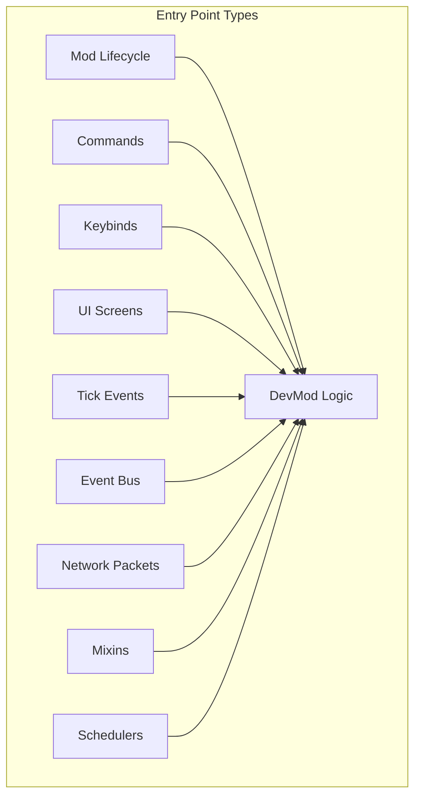
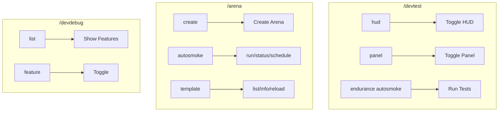
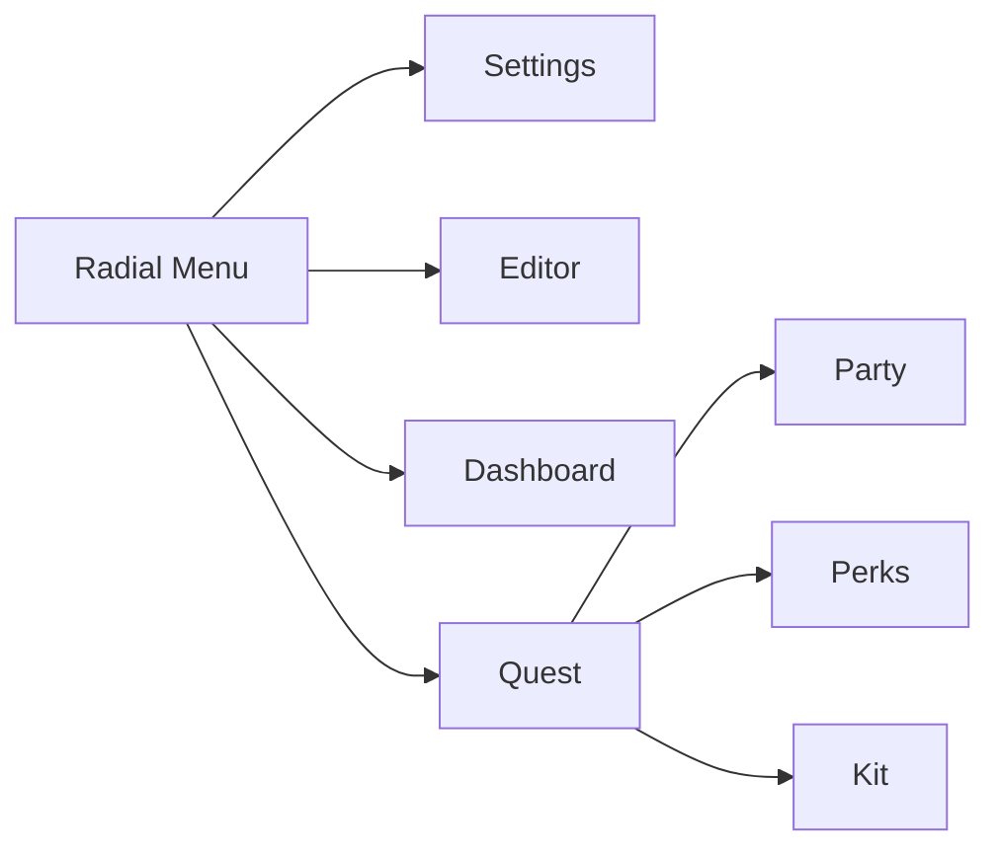
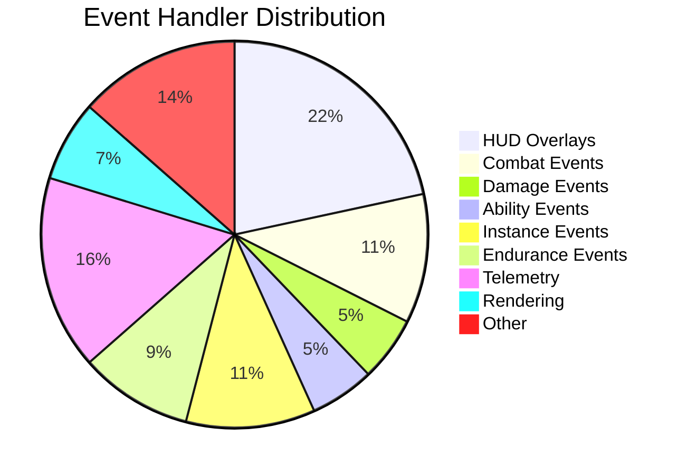
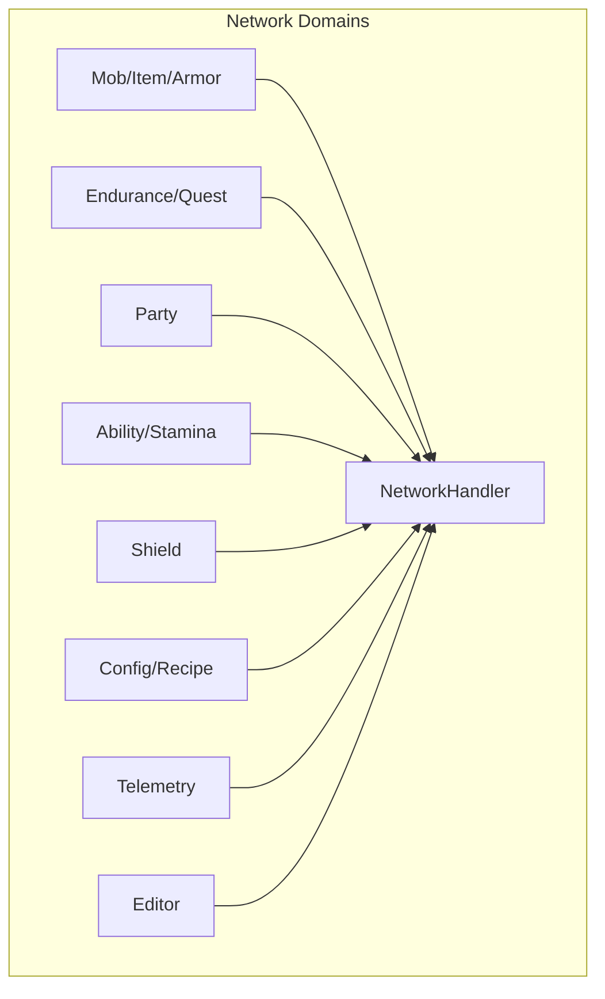
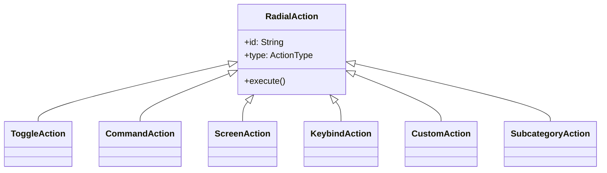

# Entry Points Inventory

> **Audit Date**: 2024-12-23
> **Source of Truth**: Codebase grep/analysis
> **Total Entry Points**: 200+

---

## Overview

This document catalogs every mechanism that triggers logic in DevMod.

---

## 1. Mod Lifecycle Events

### Main Initialization

| Event | File | Line | Method | Description |
|-------|------|------|--------|-------------|
| `@Mod("devmod")` | `DevMod.java` | 30 | constructor | Main mod registration |
| `FMLCommonSetupEvent` | `DevMod.java` | 85 | `commonSetup()` | Common setup |
| Config Loading | `DevMod.java` | 115 | `onConfigLoading()` | Config initialization |
| Config Reload | `DevMod.java` | 140 | `onConfigReload()` | Hot reload support |

### Client Initialization

| Event | File | Line | Method | Description |
|-------|------|------|--------|-------------|
| `@Mod` (client) | `DevModClient.java` | 21 | constructor | Client mod init |
| `FMLClientSetupEvent` | `DevModClient.java` | 44 | `clientSetup()` | Client setup |
| `RegisterGuiLayersEvent` | `DevModClient.java` | 37 | listener | HUD registration |

---

## 2. Commands

### Registration Events

| File | Line | Event |
|------|------|-------|
| `TestHarnessCommands.java` | 65 | `RegisterCommandsEvent` |
| `ArenaCommandEvents.java` | 72 | `RegisterCommandsEvent` |
| `DebugEvents.java` | 37 | `RegisterCommandsEvent` |
| `TelemetryEvents.java` | 241 | `RegisterCommandsEvent` |

### Command Tree

| Command | File | Line | Subcommands |
|---------|------|------|-------------|
| `/devtest` | `TestHarnessCommands.java` | 65-140 | hud, panel, endurance |
| `/arena` | `ArenaCommands.java` | 189-287 | create, autosmoke, template |
| `/devdebug` | `DebugCommand.java` | 36 | list, `<feature>` |
| `/telemetry` | `TelemetryEvents.java` | 241 | reload, status |

---

## 3. Keybinds

### Registration

| File | Line | Event |
|------|------|-------|
| `KeyInputHandler.java` | 380 | `RegisterKeyMappingsEvent` |

### Complete Keybind Map

#### Primary Access
| Key | Action | Category |
|-----|--------|----------|
| `G` | Open Radial Menu | PRIMARY |

#### Screens
| Key | Action | File Reference |
|-----|--------|----------------|
| `K` | Open Settings | `KeyInputHandler.java:89` |
| `M` | Open Weapon Editor | `KeyInputHandler.java:102` |
| `J` | Open Dashboard | `KeyInputHandler.java:115` |
| `N` | Open QA Testing | `KeyInputHandler.java:128` |

#### Debug Overlays
| Key | Overlay | Toggleable |
|-----|---------|------------|
| `O` | Debug Overlay | Yes |
| `L` | Light Overlay | Yes |
| `H` | Heatmap | Yes |
| `R` | Room Bounds | Yes |
| `P` | Pathfinding | Yes |
| `V` | Vertical Levels | Yes |
| `Y` | Safe Spot | Yes |
| `C` | Chunk Performance | Yes |
| `B` | Boss Phase | Yes |
| `Z` | Skill Efficacy | Yes |

#### Performance
| Key | Action |
|-----|--------|
| `F6` | Entity Density |
| `F8` | FPS Tracker |
| `F9` | Profiler |

#### Quest System
| Key | Action |
|-----|--------|
| `\` | Toggle Quest HUD |
| `[` | Quest Complete Task |
| `]` | Open Quest Editor |
| `F10` | Open Endurance Quest |
| `F11` | Quest Continue |
| `F12` | Quest Exit |

---

## 4. UI Screens

### Screen Registry

| Screen | File | Line | Purpose |
|--------|------|------|---------|
| `RadialMenuScreenV3` | `RadialMenuScreenV3.java` | 56 | Main radial menu |
| `ItemEditorScreen` | `ItemEditorScreen.java` | 89 | Item/weapon editor |
| `UnifiedSettingsScreen` | `UnifiedSettingsScreen.java` | 37 | Settings UI |
| `TelemetryDashboardScreen` | `TelemetryDashboardScreen.java` | 44 | Dashboard |
| `TestingHub` | `TestingHub.java` | 40 | Testing hub |
| `QATestingScreen` | `QATestingScreen.java` | 33 | QA interface |
| `EnduranceQuestScreen` | `EnduranceQuestScreen.java` | 26 | Quest UI |
| `PartyScreen` | `PartyScreen.java` | 39 | Party management |
| `PerkSelectionScreen` | `PerkSelectionScreen.java` | 25 | Perk selection |
| `KitSelectionScreen` | `KitSelectionScreen.java` | 39 | Kit selection |
| `QuickTestWizard` | `QuickTestWizard.java` | 37 | Arena quick test |

### Screen Flow

---

## 5. Tick Events

### Server Tick

| File | Line | Method | Purpose |
|------|------|--------|---------|
| `DebugEvents.java` | 28 | `onServerTick(Post)` | Debug updates |
| `InstanceEventHandler.java` | 56 | `onServerTick(Post)` | Instance management |
| `TelemetryEvents.java` | 67 | `onServerTick(Pre)` | Telemetry collection |
| `EnduranceEventHandler.java` | 528 | `onServerTick(Post)` | Quest tick |
| `AbilityEventHandler.java` | 31 | `onServerTick(Post)` | Ability cooldowns |
| `ArenaCommandEvents.java` | 168 | `onServerTick(Post)` | Arena updates |

### Client Tick

| File | Line | Method | Purpose |
|------|------|--------|---------|
| `RenderEvents.java` | 404 | `onClientTick(Post)` | Input handling |

### Entity/Player Tick

| File | Line | Method | Purpose |
|------|------|--------|---------|
| `QAEventTracker.java` | 267 | `onPlayerTick(Post)` | QA tracking |
| `PerceptionEventHandler.java` | 94 | `onEntityTick(Post)` | Perception system |

---

## 6. Event Bus Handlers

### Handler Categories (60+ classes)

#### HUD Overlays (@EventBusSubscriber, client)

| Overlay | File | Events |
|---------|------|--------|
| `ImpactHudOverlay` | `hud/ImpactHudOverlay.java` | RenderGuiLayerEvent |
| `EnduranceQuestOverlay` | `hud/EnduranceQuestOverlay.java` | RenderGuiLayerEvent |
| `StaminaHudOverlay` | `hud/StaminaHudOverlay.java` | RenderGuiLayerEvent |
| `BossPhaseOverlay` | `hud/BossPhaseOverlay.java` | RenderGuiLayerEvent |
| `PartyHudOverlay` | `hud/PartyHudOverlay.java` | RenderGuiLayerEvent |
| `EconomyOverlay` | `hud/EconomyOverlay.java` | RenderGuiLayerEvent |
| `TokenGainOverlay` | `hud/TokenGainOverlay.java` | RenderGuiLayerEvent |
| `SkillEfficacyOverlay` | `hud/SkillEfficacyOverlay.java` | RenderGuiLayerEvent |
| `EntityDensityOverlay` | `hud/EntityDensityOverlay.java` | RenderGuiLayerEvent |
| `OnboardingOverlay` | `hud/OnboardingOverlay.java` | RenderGuiLayerEvent |

#### Combat Events

| File | Line | Events Handled |
|------|------|----------------|
| `CombatEvents.java` | 23 | LivingHurtEvent, LivingDeathEvent |
| `DamageHandler.java` | 61, 487, 560 | LivingHurtEvent, LivingDamageEvent |
| `RangedHooks.java` | 26 | ProjectileImpactEvent |
| `ArrowEvents.java` | 47 | ProjectileImpactEvent |

#### Telemetry Events

| File | Line | Events |
|------|------|--------|
| `TelemetryEvents.java` | 40-281 | ServerTick, PlayerLoggedIn, EntityJoin, LivingDeath |
| `BossPhaseDetector.java` | 31 | LivingHurtEvent |
| `LootTrackingEvents.java` | * | ItemPickup, ChestOpen, etc. |
| `ProgressionTrackingEvents.java` | * | LevelUp, QuestComplete, etc. |

---

## 7. Network Packets

### Registration

| File | Line | Event |
|------|------|-------|
| `NetworkHandler.java` | 45-200 | `RegisterPayloadHandlersEvent` |

### Channel Map (46 channels)

#### By Domain

| Domain | Payloads | Handler |
|--------|----------|---------|
| Mob/Item/Armor | `UpdateMobStatsPayload`, `WeaponStatsPayload`, `ArmorStatsPayload` | `MobItemNetworkHandler` |
| Endurance/Quest | `StartQuestPayload`, `QuestSyncPayload`, `QuestActionPayload` | `EnduranceNetworkHandler` |
| Party | `PartySyncPayload`, `PartyNotificationPayload` | `PartyNetworkHandler` |
| Ability | `AbilityActionPayload`, `StaminaSyncPayload` | `AbilityNetworkHandler` |
| Shield | `ShieldImpactPayload`, `ShieldStatePayload` | `ShieldNetworkHandler` |
| Config | `GlobalConfigSyncPayload`, `RecipeSyncPayload` | `ConfigNetworkHandler` |
| Telemetry | `TelemetryBatchPayload` | `TelemetryPacketHandler` |

---

## 8. Mixin Hooks

### Configuration

| File | Package |
|------|---------|
| `devmod.mixins.json` | `com.devmod.mixin` |

### Mixin Classes

| Mixin | Target | Injections | Purpose |
|-------|--------|------------|---------|
| `DebugPacketsMixin` | `DebugPackets` | 5 | Debug visualization |
| `RecipeManagerMixin` | `RecipeManager` | 4 | Recipe caching |
| `LivingEntityRendererMixin` | `LivingEntityRenderer` | 2 | Entity rendering |
| `GameRendererMixin` | `GameRenderer` | 2 | Blur/tick injection |
| `CameraShakeMixin` | `Camera` | 1 | Camera shake |
| `ModelPartTransformMixin` | `ModelPart` | 1 | Model transform |
| `DebugRendererMixin` | `DebugRenderer` | 2 | Debug rendering |
| `MinecraftServerAccessor` | `MinecraftServer` | accessor | Server access |

---

## 9. Schedulers

### AutosmokeScheduler

| File | Line | Schedule |
|------|------|----------|
| `AutosmokeScheduler.java` | 29-210 | Cron: `0 3 * * *` (3 AM daily) |

**Commands:**
- `/arena autosmoke run` - Manual trigger
- `/arena autosmoke status` - Check status
- `/arena autosmoke schedule` - View schedule

### Other Scheduled Tasks

| Service | File | Line | Interval |
|---------|------|------|----------|
| `HeatmapCollector` | `HeatmapCollector.java` | 57 | Periodic |
| `PolicyResolver` | `PolicyResolver.java` | 61 | Periodic |
| `LeaderboardService` | `LeaderboardService.java` | 194 | Periodic |
| `TelemetryAuditJob` | `TelemetryAuditJob.java` | 63 | Periodic |
| `DashboardValidationJob` | `DashboardValidationJob.java` | 33 | Periodic |
| `BalanceReportJob` | `BalanceReportJob.java` | 40 | Periodic |
| `DuckDBBatchWriter` | `DuckDBBatchWriter.java` | 48 | Flush interval |

---

## 10. Actions Registry

### Registration

| File | Line | Method |
|------|------|--------|
| `DevModActions.java` | 14-127 | `register()` |
| `DevModClientActions.java` | 156 | `registerClientActions()` |
| `ArenaActionRegistry.java` | 19-164 | `registerCommonActions()`, `registerClientActions()` |

### Action Types

---

## Summary Table

| Type | Count | Primary Location |
|------|-------|------------------|
| Mod Lifecycle | 4 | `DevMod.java`, `DevModClient.java` |
| Commands | 4 trees | `ArenaCommands.java`, `TestHarnessCommands.java` |
| Keybinds | 40+ | `KeyInputHandler.java` |
| UI Screens | 31+ | `ui/`, `endurance/`, `party/` |
| Tick Events | 9 | Various `*EventHandler.java` |
| Event Handlers | 60+ | `@EventBusSubscriber` classes |
| Network Channels | 46 | `NetworkHandler.java` |
| Mixins | 8 classes | `mixin/` package |
| Schedulers | 8+ | `autosmoke/`, `telemetry/` |
| Actions | 100+ | `actions/`, `ArenaActionRegistry.java` |
| **TOTAL** | **200+** | |

---

## Cross-References

- [[PROJECT_TOPOLOGY]] - Project structure
- [[MOC]] - Master index
- [[areas/arena/README]] - Arena commands
- [[areas/radial/README]] - Radial menu system
- [[cross_cutting/CLIENT_SERVER]] - Client/server boundaries

---

*Generated from codebase analysis - 2024-12-23*
