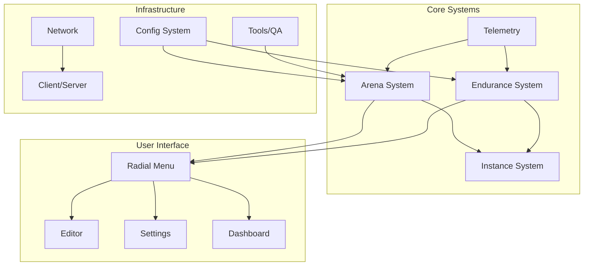

# DevMod - Map of Content (MOC)

> **Ultimo Aggiornamento**: 24 Dicembre 2024
> **Namespace**: `com.devmod.*` (unificato)
> **Scopo**: Hub navigazione centrale per tutta la documentazione DevMod
> **Obsidian**: Usa `Ctrl/Cmd + O` per navigazione rapida

---

## Inizia Qui

Nuovo su DevMod? Segui questo percorso:

1. [[PROJECT_TOPOLOGY]] - Capire la struttura codebase
2. [[ENTRYPOINTS]] - Vedere come si attiva il mod
3. [[GLOSSARY]] - Termini e concetti chiave
4. [[AUDIT_REPORT]] - Stato attuale e gap
5. [[DOCUMENTATION_STATUS]] - Stato verifica documentazione
6. [[reorg/REORG_COMPLETE]] - **NUOVO**: Riepilogo riorganizzazione Dicembre 2024

---

## Project Overview

---

## Area Dossiers

### Core Game Systems

| Area | Status | Dossier | Description |
|------|--------|---------|-------------|
| Arena System | PARTIAL | [[areas/arena/README]] | Template, policy, builder, registry |
| Endurance System | PARTIAL | [[areas/endurance/README]] | Wave-based roguelike quests |
| Instance System | PARTIAL | [[areas/instance/README]] | Dimension management, recovery |

### Data & Analytics

| Area | Status | Dossier | Description |
|------|--------|---------|-------------|
| Telemetry | PARTIAL | [[areas/telemetry/README]] | DuckDB, analytics, dashboard |

### User Experience

| Area | Status | Dossier | Description |
|------|--------|---------|-------------|
| Radial Menu / UX | DONE | [[areas/radial/README]] | Keybinds, commands, UI navigation |

### Infrastructure

| Area | Status | Dossier | Description |
|------|--------|---------|-------------|
| Client/Server | PARTIAL | [[areas/client_server/README]] | Boundaries, proxies, dist safety |
| Config System | PARTIAL | [[areas/config/README]] | Feature flags, hot reload |
| Tools/QA | PARTIAL | [[areas/tools/README]] | Autosmoke, CI gates, testing |

---

## Cross-Cutting Concerns

| Topic | Document | Key Issues |
|-------|----------|------------|
| Concurrency | [[cross_cutting/CONCURRENCY]] | Locks, rate limits, thread pools |
| Client/Server Safety | [[cross_cutting/CLIENT_SERVER]] | OnlyIn, dist executor, packages |
| Telemetry Conventions | [[cross_cutting/TELEMETRY_CONVENTIONS]] | Naming, correlation IDs |
| Error Handling | [[cross_cutting/ERROR_HANDLING]] | Error codes, taxonomy |

---

## Area Deep-Dives

### Instance System

| Document | Purpose |
|----------|---------|
| [[areas/instance/README]] | Area dossier |
| [[areas/instance/INSTANCE_DIMENSION_SYSTEM]] | Full dimension architecture |
| [[areas/instance/INSTANCE_SYSTEM_TEST_STRATEGY]] | Testing strategy |
| [[areas/instance/INSTANCE_SYSTEM_MANUAL_TEST_CHECKLIST]] | Manual test checklist |

### Radial Menu / UX

| Document | Purpose |
|----------|---------|
| [[areas/radial/README]] | Area dossier |
| [[areas/radial/RADIAL_AUDIT]] | Full audit |
| [[areas/radial/RADIAL_BUTTON_CONTRACT]] | Button API contract |
| [[areas/radial/RADIAL_CENSUS]] | All menu items census |
| [[areas/radial/RADIAL_NAV_MAP]] | Navigation map |
| [[areas/radial/RADIAL_QA_SCENARIOS]] | QA test scenarios |

### Client/Server

| Document | Purpose |
|----------|---------|
| [[areas/client_server/README]] | Area dossier |
| [[areas/client_server/CLIENT_BOUNDARY_AUDIT]] | Full boundary audit |

---

## Audit & Traceability

| Document | Purpose |
|----------|---------|
| [[AUDIT_REPORT]] | Gap analysis, P0/P1 issues, recommendations |
| [[TRACEABILITY_MATRIX]] | Feature → Entrypoint → Components → Telemetry |
| [[GLOSSARY]] | Key terms (ArenaHandle, ResolvedArena, etc.) |

---

## Quick Reference

### Key Entry Points

| What | Where | Keybind |
|------|-------|---------|
| Radial Menu | `RadialMenuScreenV3` | `G` |
| Settings | `UnifiedSettingsScreen` | `K` |
| Weapon Editor | `ItemEditorScreen` | `M` |
| Dashboard | `TelemetryDashboardScreen` | `J` |
| Quest | `EnduranceQuestScreen` | `F10` |

### Key Commands

| Command | Purpose |
|---------|---------|
| `/arena create <template>` | Create arena from template |
| `/arena autosmoke run` | Run automated tests |
| `/devtest hud` | Toggle HUD |
| `/devdebug list` | List debug features |

### Key Files

| Purpose | File |
|---------|------|
| Mod Entry | `DevMod.java` |
| Client Entry | `DevModClient.java` |
| Network | `NetworkHandler.java` |
| Keybinds | `KeyInputHandler.java` |
| Actions | `DevModActions.java` |

---

## Indice Documentazione

### Architettura & Design

- [[ARCHITECTURE]] - Architettura alto livello
- [[PROJECT_TOPOLOGY]] - Struttura package
- [[ENTRYPOINTS]] - Inventario entry point
- [[FEATURES]] - Lista feature
- [[GAME_DESIGN_ANALYSIS]] - Documento game design
- [[UX_PLAYER_JOURNEY]] - Esperienza giocatore

### Riorganizzazione Dicembre 2024

- [[reorg/REORG_COMPLETE]] - Riepilogo completamento
- [[reorg/ARCHITECTURE_DIAGRAM]] - Diagrammi architettura Mermaid
- [[reorg/REFACTOR_AUDIT]] - Audit refactor (god classes, duplicati)
- [[reorg/REFACTOR_EXECUTION_PLAN]] - Piano esecuzione
- [[reorg/BASELINE_AUDIT]] - Audit baseline iniziale

### Documentazione Sottosistemi

- [[arena-template-rework/README]] - Docs template arena
- [[editor-design-system/README]] - Sistema UI editor
- [[prismatic-shield-integration/00-overview]] - Sistema scudo
- [[recipe-editor-spec/README]] - Editor ricette
- [[telemetry/MISSING_TELEMETRY_HOOKS]] - Hook telemetry
- [[testing/TESTING]] - Guida testing

### Audit & Status

- [[AUDIT_REPORT]] - Current audit findings
- [[project/BUG_LOG]] - Known bugs
- [[areas/client_server/CLIENT_BOUNDARY_AUDIT]] - Client/server audit
- [[editor-design-system/RENDERING_AUDIT]] - Rendering audit
- [[areas/tools/null-suppression-audit]] - Null safety audit

### Project Management

- [[project/NEXT_STEPS]] - Next steps
- [[project/TODO_WARNINGS]] - Warnings & todos
- [[DOCS_INVENTORY]] - Documentation inventory

### Testing

- [[testing/TESTING]] - Main testing guide
- [[testing/PROGRESSIVE_TEST_PLAN]] - Progressive test plan
- [[testing/TEST_HARNESS]] - Test harness config
- [[testing/L0_REPORT]] - L0 smoke tests
- [[testing/L1_REPORT]] through [[testing/L6_REPORT]] - Level reports

---

## Legend

| Status | Meaning |
|--------|---------|
| DONE | Fully implemented and tested |
| PARTIAL | Implemented but incomplete or has gaps |
| MISSING | Not implemented or not found |
| BLOCKED | Blocked by dependencies |

---

## Navigation Tips

- Use `[[wikilinks]]` to navigate between documents
- Use `Ctrl/Cmd + Click` on links to follow them
- Use graph view to see document relationships
- Use tags like `#gap`, `#p0`, `#todo` for filtering

---

*This MOC is the single source of truth for DevMod documentation navigation.*
