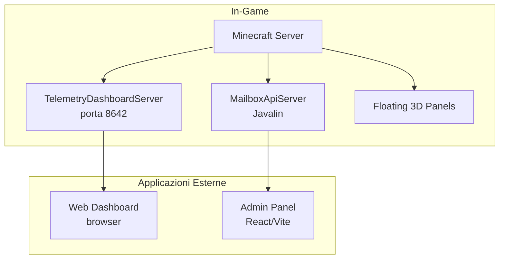

# Pannelli Esterni DevMod

> Ultimo aggiornamento: 2025-12-30

DevMod include diversi pannelli esterni per visualizzazione dati, amministrazione e debug. Questa guida spiega come avviarli e usarli.

---

## Panoramica



---

## 1. Dashboard Telemetry

Dashboard web per visualizzare analytics e telemetry in tempo reale.

### Avvio

Il dashboard server si avvia **automaticamente** quando il server Minecraft parte. Non richiede configurazione.

### Accesso

- **URL**: `http://127.0.0.1:8642/dashboard`
- **Porta**: 8642 (localhost only per sicurezza)

### Metodi di Accesso

#### Via Comando

```
/devmod dashboard open    # Apre nel browser
/devmod dashboard start   # Avvia server (se fermato)
/devmod dashboard stop    # Ferma server
/devmod dashboard status  # Mostra stato
```

#### Via Keybind

Il keybind per aprire la dashboard è **non assegnato** di default. Puoi assegnarlo nelle impostazioni di Minecraft.

#### Direttamente nel Browser

Apri manualmente: `http://127.0.0.1:8642/dashboard`

### Endpoint API

Il server espone numerosi endpoint REST per analytics:

#### Endpoint Base

| Endpoint | Descrizione |
|----------|-------------|
| `/api/health` | Stato server |
| `/api/summary` | Statistiche riassuntive |
| `/api/tables` | Lista tabelle DuckDB |
| `/api/query` | Query SQL personalizzate (POST, solo SELECT) |

#### Endpoint Combat

| Endpoint | Descrizione |
|----------|-------------|
| `/api/combat/hits` | Colpi inflitti |
| `/api/combat/deaths` | Morti |
| `/api/combat/fights` | Combattimenti aggregati |
| `/api/combat/weapons` | Statistiche armi |

#### Endpoint Endurance

| Endpoint | Descrizione |
|----------|-------------|
| `/api/endurance/sessions` | Sessioni quest |
| `/api/endurance/waves` | Wave completate |
| `/api/endurance/perks` | Statistiche perk |
| `/api/endurance/performance` | Metriche performance |

#### Endpoint Player

| Endpoint | Descrizione |
|----------|-------------|
| `/api/player/snapshots` | Snapshot giocatori |
| `/api/player/abilities` | Uso abilità |

#### Endpoint Spatial

| Endpoint | Descrizione |
|----------|-------------|
| `/api/spatial/heatmaps` | Dati heatmap |
| `/api/spatial/transitions` | Transizioni stanze |

#### Endpoint Economy

| Endpoint | Descrizione |
|----------|-------------|
| `/api/economy/drops` | Drop da mob |
| `/api/economy/kills` | Kill mob aggregati |

#### Endpoint Analytics Avanzati

| Endpoint | Descrizione |
|----------|-------------|
| `/api/analytics/overview` | Overview generale |
| `/api/analytics/hits-timeline` | Timeline colpi |
| `/api/analytics/damage-by-bodypart` | Danno per parte corpo |
| `/api/analytics/damage-by-type` | Danno per tipo |
| `/api/analytics/weapon-stats` | Statistiche armi dettagliate |
| `/api/analytics/mob-kills` | Analisi uccisioni mob |
| `/api/analytics/ttk` | Time-to-kill |
| `/api/analytics/dps-timeline` | DPS nel tempo |
| `/api/analytics/player-stats` | Statistiche giocatore |
| `/api/analytics/player-comparison` | Confronto giocatori |
| `/api/analytics/trends` | Trend temporali |
| `/api/analytics/performance` | Performance server |
| `/api/analytics/fight-analysis` | Analisi combattimenti |

#### Endpoint Arena (richiede token)

| Endpoint | Descrizione |
|----------|-------------|
| `/api/arena/token` | Genera token auth |
| `/api/analytics/arena/templates` | Lista template |
| `/api/analytics/arena/build-metrics` | Metriche build |
| `/api/analytics/arena/performance` | Performance arena |
| `/api/analytics/arena/spawn-heatmap` | Heatmap spawn |
| `/api/analytics/arena/death-heatmap` | Heatmap morti |
| `/api/analytics/arena/wave-correlation` | Correlazione wave |

### Parametri Query

La maggior parte degli endpoint supporta questi parametri:

| Parametro | Tipo | Descrizione |
|-----------|------|-------------|
| `from` | ISO timestamp | Data inizio |
| `to` | ISO timestamp | Data fine |
| `limit` | integer | Limite risultati |
| `range` | string | Range rapido: `1h`, `6h`, `24h`, `7d`, `all` |
| `templateId` | string | Filtra per template arena |
| `templateVersion` | integer | Filtra per versione template |

### Autenticazione Arena

Per gli endpoint arena è necessario un token:

1. Genera token: `GET /api/arena/token?user=myuser&full=true`
2. Usa token: `Authorization: Bearer <token>` oppure `?token=<token>`

Il token scade dopo 24 ore.

---

## 2. Admin Panel

Applicazione web React per gestire mailbox, news e task.

### Prerequisiti

- **Node.js** 18+ installato
- **npm** o **yarn**

### Installazione

```bash
cd admin-panel
npm install
```

### Avvio

```bash
npm run dev
```

L'applicazione sarà disponibile su `http://localhost:5173` (porta default Vite).

### Build Produzione

```bash
npm run build
npm run preview  # Per testare la build
```

### Pagine Disponibili

| Pagina | URL | Descrizione |
|--------|-----|-------------|
| Login | `/login` | Autenticazione |
| Dashboard | `/` | Statistiche generali |
| Messages | `/messages` | Gestione messaggi mailbox |
| News | `/news` | Gestione articoli news |
| Users | `/users` | Gestione utenti |
| Tasks | `/tasks` | Task per tester |
| Tickets | `/tickets` | Ticket supporto |
| Audit | `/audit` | Log audit admin |
| Config | `/config` | Configurazione |

### Configurazione Backend

L'Admin Panel si connette al `MailboxApiServer` che gira sul server Minecraft. Assicurati che:

1. Il server Minecraft sia avviato
2. Il `MailboxApiServer` sia attivo (controllare i log)
3. La porta sia accessibile (default: configurata in `MailboxApiServer`)

Per modificare l'URL del backend, edita `admin-panel/src/api/client.ts`.

### Stack Tecnologico

- **React** 18.3.1
- **React Router** 6.28 (SPA routing)
- **React Query** 5.62 (@tanstack) per data fetching
- **Axios** 1.7.9 per HTTP
- **Tailwind CSS** 3.4 per stili
- **Vite** 6.0 per build
- **TypeScript** 5.7

---

## 3. Floating 3D Panels

Pannelli 3D che appaiono nel mondo di gioco per mostrare informazioni contestuali.

### Caratteristiche

- Massimo **12 pannelli** contemporanei
- Distanza di rendering: **32 blocchi**
- Supporto per hover e click
- Possibilità di "pinnare" pannelli

### Tipi di Pannelli

| Tipo | Descrizione |
|------|-------------|
| `CombatPanel` | Statistiche combattimento in tempo reale |
| `EntityInfoPanel` | Informazioni sull'entità guardata |

### Attivazione

I pannelli si attivano automaticamente in base al contesto:

- **CombatPanel**: Durante il combattimento
- **EntityInfoPanel**: Guardando un'entità

### Configurazione

Il `FloatingPanelManager` gestisce i pannelli. Puoi configurare:

- `MAX_PANELS`: Numero massimo pannelli (default: 12)
- `RENDER_DISTANCE`: Distanza rendering (default: 32 blocchi)

### File Correlati

```
src/main/java/com/devmod/client/panels/
├── core/
│   ├── FloatingPanelManager.java   # Manager principale
│   ├── FloatingPanel.java          # Classe base
│   └── PanelRenderer.java          # Rendering
├── types/
│   ├── CombatPanel.java            # Pannello combat
│   └── EntityInfoPanel.java        # Pannello info entità
├── PanelInteractionHandler.java    # Gestione interazioni
├── ContextDetector.java            # Rilevamento contesto
└── EntityTracker.java              # Tracking entità
```

---

## 4. Telemetry Dashboard Screen (In-Game)

Schermata in-game per visualizzare telemetry senza aprire il browser.

### Accesso

- **Classe**: `TelemetryDashboardScreen`
- **Keybind**: Non assegnato di default
- **Azione**: Disponibile nel menu radiale

### Funzionalità

- Visualizzazione dati telemetry
- Grafici base
- Export dati

---

## Troubleshooting

### Dashboard non si apre

1. Verifica che il server sia avviato: `/devmod dashboard status`
2. Controlla i log per errori sulla porta 8642
3. Verifica che la porta non sia in uso da altre applicazioni

### Admin Panel non si connette

1. Verifica che il server Minecraft sia avviato
2. Controlla i log per `MailboxApiServer`
3. Verifica che CORS sia configurato correttamente

### Floating Panels non appaiono

1. Verifica di essere in modalità client
2. Controlla che il `FloatingPanelManager` sia inizializzato
3. Verifica la distanza dall'entità target

### Errori DuckDB

1. Verifica che DuckDB sia abilitato: `/devmod telemetry status`
2. Controlla i permessi sulla cartella del database
3. Verifica lo spazio su disco

---

## Riferimenti

- [TelemetryDashboardServer.java](../src/main/java/com/devmod/telemetry/dashboard/TelemetryDashboardServer.java)
- [Admin Panel](../admin-panel/)
- [FloatingPanelManager.java](../src/main/java/com/devmod/client/panels/core/FloatingPanelManager.java)
