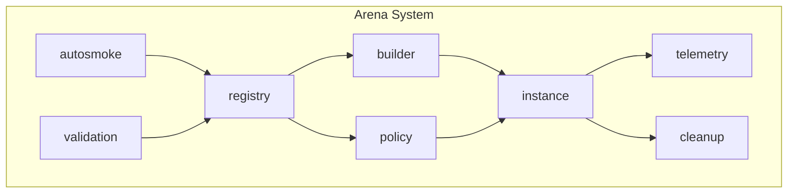
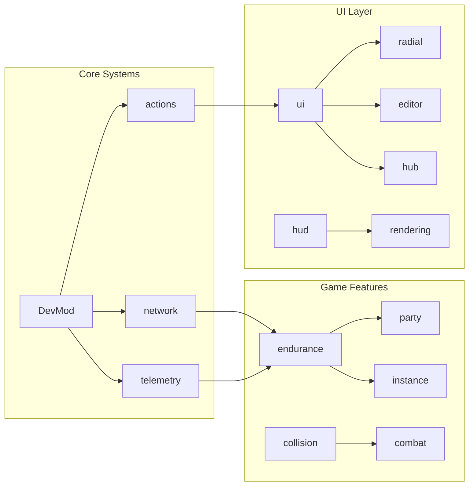

# Project Topology

> **Audit Date**: 2024-12-23
> **Source of Truth**: Codebase analysis
> **Status**: VERIFIED against actual code

---

## Overview

DevMod is a NeoForge mod for Minecraft 1.21.1 that provides advanced combat mechanics, telemetry, and game design tools.

| Property | Value |
|----------|-------|
| Mod ID | `devmod` |
| Version | 0.1.0 |
| Minecraft | 1.21.1 |
| NeoForge | 21.1.215 |
| Java | 21 |
| Authors | Frenk012, Vassago |

---

## Package Structure

```
src/main/java/
├── com/devmod/arena/          # Arena Template System (55 packages)
└── com/frenkvs/devmod/        # Main Mod Package (30+ subpackages)
```

---

## Main Packages

### com.devmod.arena (Arena Template System)

Sistema dedicato alla gestione di arene, template, policy e automazione QA.



| Package | Classes | Purpose |
|---------|---------|---------|
| [[areas/arena/README\|registry]] | 30 | Template registry, schema validation, bootstrap |
| [[areas/arena/README\|builder]] | 10 | Transactional arena construction |
| [[areas/arena/README\|policy]] | 9 | Policy resolver, routing, template selection |
| [[areas/arena/README\|override]] | 8 | Extension override system |
| [[areas/arena/README\|autosmoke]] | 8 | Automated testing/generation |
| [[areas/arena/README\|alert]] | 8 | Alert and notification system |
| [[areas/arena/README\|spawn]] | 6 | Entity spawn management |
| [[areas/arena/README\|cleanup]] | 6 | Resource cleanup |
| [[areas/arena/README\|config]] | 5 | Arena configuration |
| [[areas/arena/README\|validation]] | 4 | Instance validation |
| [[areas/arena/README\|pool]] | 4 | Object pool management |
| [[areas/arena/README\|logging]] | 4 | Arena logging |
| [[areas/arena/README\|hud]] | 4 | HUD overlay for arena |
| [[areas/arena/README\|fallback]] | 4 | Fallback/recovery system |
| [[areas/arena/README\|telemetry]] | 3 | Arena telemetry |
| [[areas/arena/README\|snapshot]] | 3 | State snapshots |
| [[areas/arena/README\|security]] | 3 | Security validation |
| [[areas/arena/README\|recovery]] | 3 | Recovery service |
| [[areas/arena/README\|monitoring]] | 3 | Monitoring service |
| [[areas/arena/README\|metrics]] | 3 | Metrics collection |
| [[areas/arena/README\|command]] | 3 | Arena commands |
| [[areas/arena/README\|budget]] | 3 | Resource budget |
| [[areas/arena/README\|api]] | 3 | Public API |
| [[areas/arena/README\|analytics]] | 3 | Data analytics |

**Key Files:**
- `ArenaTemplate.java` - Template definition
- `TemplateRegistryBootstrap.java` - Registry initialization
- `PolicyResolver.java` - Policy engine
- `TemplateArenaBuilder.java` - Builder pattern implementation

---

### com.devmod (Main Package)

#### Root Level (52 classes)

**Core System:**
- `DevMod.java` - Main mod entry point (`@Mod("devmod")`)
- `DevModClient.java` - Client initialization
- `Config.java`, `ModConfig.java` - Configuration
- `CommonModEvents.java`, `ClientModEvents.java` - Event handling
- `NetworkHandler.java` - Network packet registration

**Combat System:**
- `CombatEvents.java` - Combat event handlers
- `DamageHandler.java` - Damage calculation
- `HitHelper.java`, `HitContext.java` - Hit detection
- `ArmorStats.java`, `WeaponStats.java` - Stat definitions
- `ActualDamageTracker.java` - Damage tracking

**Mob Configuration:**
- `MobConfigManager.java` - Mob configuration
- `MobConfigScreen.java` - Config UI
- `MobPresetManager.java` - Presets

---

### Subpackage Map



| Package | Classes | Purpose | Key Dependencies |
|---------|---------|---------|------------------|
| **endurance** | 65 | Roguelike wave system | party, instance, telemetry |
| **ui** | 68+ | UI framework | radial, editor, hub |
| **telemetry** | 40+ | Analytics + DuckDB | duckdb, combat, endurance |
| **actions** | 16 | Action registry | ui, network |
| **hud** | 29 | In-game overlays | rendering, endurance |
| **network** | 25 | Packet handling | handlers (7 subclasses) |
| **rendering** | 24 | Debug/VFX rendering | collision, shader |
| **collision** | 18 | OBB collision | bodypart, obb, registry |
| **party** | 20 | Multiplayer party | network, endurance |
| **instance** | 9 | Dimension management | arena, recovery |
| **recipe** | 15 | Recipe editor | network, persistence |
| **panels** | 55+ | Debug panels | core, ui, types |
| **client** | 12 | Client bridge | input, ui |
| **abilities** | 7 | Ability system | network, combat |
| **mixin** | 8 | Mixin hooks | (Minecraft internals) |

---

## Resource Structure

```
src/main/resources/
├── assets/devmod/
│   ├── lang/
│   │   ├── en_us.json
│   │   └── it_it.json
│   ├── textures/gui/icons/radial/
│   ├── models/item/
│   └── shaders/core/
├── data/devmod/
│   ├── presets/           # 6 JSON presets
│   ├── tags/item/         # 6 item tags
│   ├── test_templates/
│   └── structures/
├── db/                    # DuckDB database
├── dashboard/             # Dashboard data
├── schemas/               # JSON schemas
│   ├── arena_policy.schema.json
│   └── arena_template.schema.json
└── devmod.mixins.json     # Mixin configuration
```

---

## Configuration Files

### build.gradle
```groovy
minecraft_version=1.21.1
neo_version=21.1.215
parchment_mappings_version=2024.11.17
```

### neoforge.mods.toml
- Loader: `javafml`
- Dependencies: NeoForge [21.1.215,)
- Mixin config: `devmod.mixins.json`

### devmod.mixins.json
```json
{
  "package": "com.devmod.mixin",
  "mixins": ["MinecraftServerAccessor", "RecipeManagerMixin"],
  "client": ["GameRendererMixin", "CameraShakeMixin",
             "ModelPartTransformMixin", "LivingEntityRendererMixin"]
}
```

---

## Statistics

| Metric | Count |
|--------|-------|
| Total Java Classes | 862 |
| Test Classes | 114 |
| Arena Packages | 55 |
| Main Subpackages | 30+ |
| Network Payloads | 46 |
| Mixin Hooks | 8 classes, 17+ injections |
| Documentation Files | 130+ |

---

## Key Entry Points

See [[ENTRYPOINTS]] for complete inventory.

| Type | Primary File |
|------|--------------|
| Mod Init | `DevMod.java:30` |
| Client Init | `DevModClient.java:21` |
| Commands | `ArenaCommands.java`, `TestHarnessCommands.java` |
| Keybinds | `KeyInputHandler.java:52-364` |
| Network | `NetworkHandler.java:45-200` |

---

## Cross-References

- [[MOC]] - Master index
- [[ENTRYPOINTS]] - All entry points
- [[areas/arena/README]] - Arena system
- [[areas/endurance/README]] - Endurance system
- [[areas/telemetry/README]] - Telemetry system
- [[AUDIT_REPORT]] - Audit findings

---

*Generated from codebase analysis - 2024-12-23*
