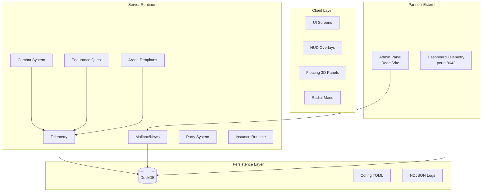

# Documentazione DevMod

> Ultimo aggiornamento: 2025-12-30
> Versione: 0.1.0 | Minecraft 1.21.1 | NeoForge 21.1.215

DevMod è una mod per Minecraft che aggiunge sistemi avanzati di combattimento, quest endurance, arene template-based, telemetry analytics e molto altro.

---

## Indice Rapido

| Documento | Descrizione |
|-----------|-------------|
| [Architettura](ARCHITECTURE.md) | Architettura del progetto con diagrammi |
| [Database](DATABASE.md) | Schema completo DuckDB (~50 tabelle) |
| [Pannelli Esterni](PANELS.md) | Come usare Dashboard, Admin Panel, Floating Panels |
| [Sistemi](SYSTEMS.md) | Spiegazione dettagliata dei sistemi core |
| [Quickstart](QUICKSTART.md) | Come iniziare a sviluppare |

---

## Panoramica del Progetto



---

## Struttura del Codice

```
src/main/java/com/devmod/
├── arena/          # Sistema Arena Template
├── endurance/      # Sistema Endurance Quest
├── combat/         # Sistema di combattimento
├── damage/         # Calcolo danni
├── party/          # Sistema party multiplayer
├── runtime/        # Gestione istanze dinamiche
├── mailbox/        # Mailbox, news, task, ticket
├── telemetry/      # Telemetry e analytics (DuckDB)
├── notification/   # Sistema notifiche
├── network/        # Packet registry e handler
├── config/         # Configurazione
├── client/         # Layer client (UI, overlay, rendering)
├── actions/        # Radial actions
├── compat/         # Compatibilità con altre mod
└── util/           # Utility condivise
```

---

## Feature Principali

### Arena Templates
Sistema per creare arene basate su template con policy configurabili, build async/sync, autosmoke testing.

### Endurance Quest
Sistema roguelike con wave progressive, boss, perk, combo, reward e gamification completa.

### Combat System
Sistema di combattimento avanzato con body-part detection, damage breakdown, hit tracking.

### Telemetry & Analytics
Pipeline completa di telemetry con persistenza DuckDB, dashboard web, export dati.

### Mailbox System
Sistema di messaggistica in-game con news, task per tester, ticket support, admin panel.

---

## Pannelli Esterni

DevMod include diversi pannelli esterni per gestione e analytics:

| Pannello | URL/Comando | Descrizione |
|----------|-------------|-------------|
| Dashboard Telemetry | `http://127.0.0.1:8642/dashboard` | Analytics in tempo reale |
| Admin Panel | `cd admin-panel && npm run dev` | Gestione mailbox/news |
| Floating Panels | In-game | Pannelli 3D nel mondo |

Vedi [PANELS.md](PANELS.md) per istruzioni complete.

---

## Comandi Principali

| Comando | Descrizione |
|---------|-------------|
| `/devtest` | HUD, panel, debug tools, endurance helpers |
| `/arena` | Operazioni arena template |
| `/devmod telemetry` | Reload, dump, export telemetry |
| `/devmod dashboard` | Apri/avvia/ferma dashboard |
| `/mailbox` | Operazioni admin mailbox |
| `/news` | CRUD news |

---

## Keybind Default

| Tasto | Azione |
|-------|--------|
| `G` | Apri menu radiale |
| `M` | Apri mailbox |
| `T` | Apri task tester |

---

## Risorse

```
src/main/resources/
├── assets/devmod/      # Texture, shader, lang
├── data/devmod/        # Data pack
├── schemas/            # JSON schema
├── db/                 # Schema DuckDB
└── dashboard/          # Asset web dashboard
```

---

## Link Utili

- [Database Schema](DATABASE.md) - Tutte le tabelle DuckDB
- [Pannelli Esterni](PANELS.md) - Come usare i pannelli
- [Architettura](ARCHITECTURE.md) - Diagrammi e struttura
- [Sistemi](SYSTEMS.md) - Dettaglio sistemi core
- [Quickstart](QUICKSTART.md) - Setup sviluppo
