# Sistemi Core DevMod

> Ultimo aggiornamento: 2025-12-30

Questa guida spiega in dettaglio come funzionano i sistemi principali di DevMod.

---

## 1. Arena Template System

Il sistema Arena permette di creare arene modulari basate su template configurabili.

### Componenti

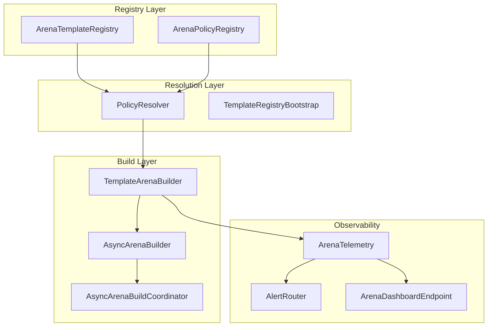

### Concetti Chiave

#### Template
Un template definisce la struttura fisica di un'arena:
- **Blocchi**: Definizione dei blocchi da piazzare
- **Spawn points**: Punti di spawn per mob e giocatori
- **Bounds**: Confini dell'arena
- **Metadata**: Informazioni aggiuntive

#### Policy
Una policy definisce il comportamento di un'arena:
- **Mob config**: Quali mob spawnare
- **Wave config**: Configurazione wave
- **Loot config**: Drop e ricompense
- **Difficulty scaling**: Scalatura difficoltà

#### Build Process

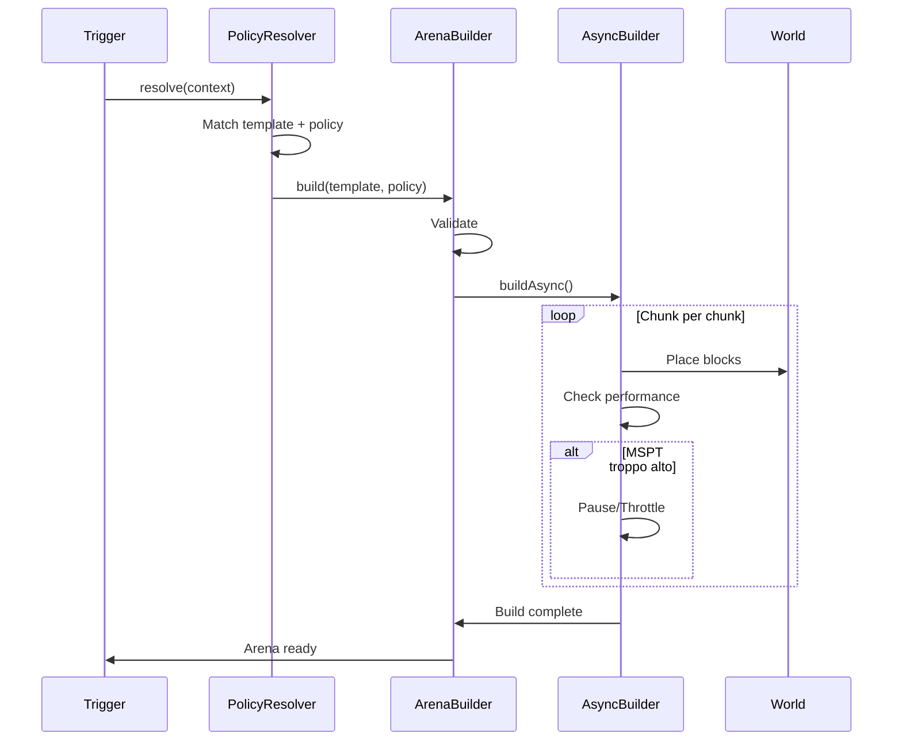

### File Principali

| File | Descrizione |
|------|-------------|
| `ArenaTemplateRegistry.java` | Registro template |
| `ArenaPolicyRegistry.java` | Registro policy |
| `PolicyResolver.java` | Risoluzione template+policy |
| `TemplateArenaBuilder.java` | Builder sincrono |
| `AsyncArenaBuilder.java` | Builder asincrono |
| `AsyncArenaBuildCoordinator.java` | Coordinatore build |
| `ArenaTelemetry.java` | Telemetry arena |
| `AlertRouter.java` | Routing alert |

---

## 2. Endurance Quest System

Sistema roguelike con wave progressive, perk, combo e ricompense.

### Architettura

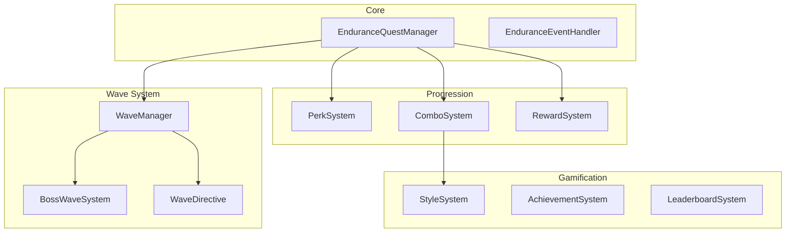

### Flow di una Sessione

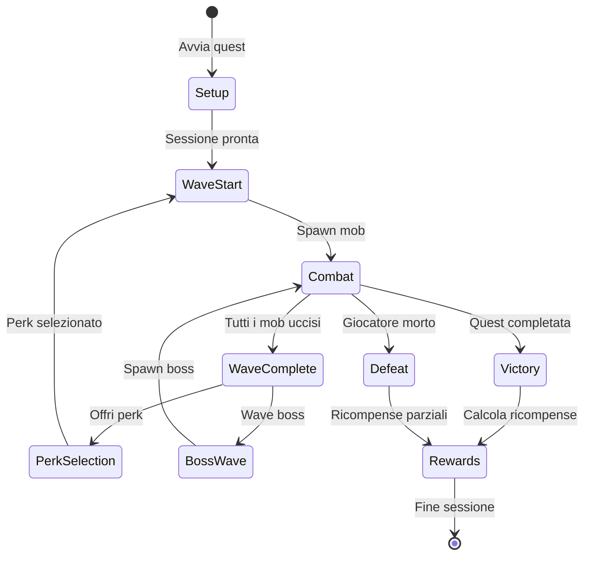

### Perk System

I perk sono potenziamenti temporanei selezionabili tra le wave:

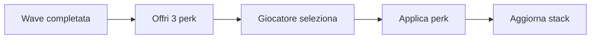

**Categorie Perk:**
- **Offensive**: Aumentano danno
- **Defensive**: Riducono danno subito
- **Utility**: Abilità speciali
- **Legendary**: Perk rari e potenti

### Combo System

Il sistema combo premia il gioco aggressivo:

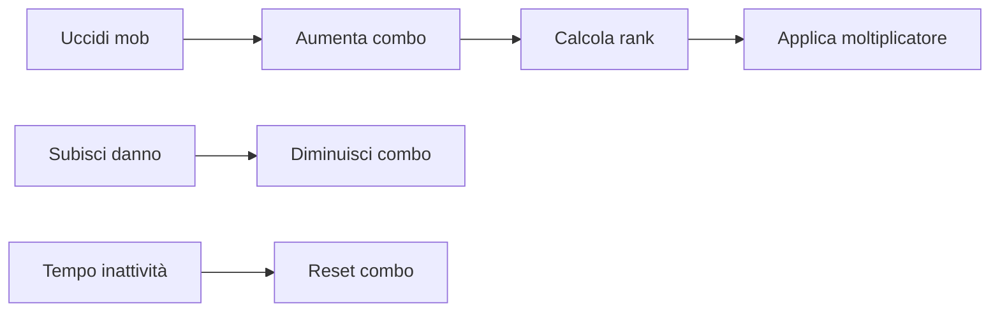

**Style Ranks:**
| Rank | Combo | Moltiplicatore |
|------|-------|----------------|
| D | 0-4 | 1.0x |
| C | 5-14 | 1.2x |
| B | 15-29 | 1.5x |
| A | 30-49 | 2.0x |
| S | 50-99 | 2.5x |
| SS | 100+ | 3.0x |

### File Principali

| File | Descrizione |
|------|-------------|
| `EnduranceQuestManager.java` | Orchestratore principale |
| `EnduranceEventHandler.java` | Handler eventi |
| `WaveManager.java` | Gestione wave |
| `BossWaveSystem.java` | Sistema boss |
| `PerkSystem.java` | Sistema perk |
| `ComboSystem.java` | Sistema combo |
| `RewardSystem.java` | Sistema ricompense |

---

## 3. Combat System

Sistema di combattimento avanzato con body-part detection e damage breakdown.

### Architettura

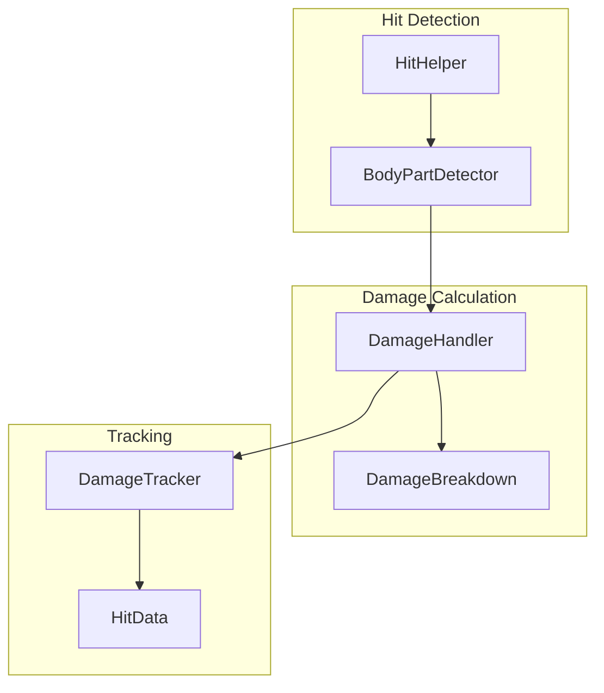

### Body Part Detection

Il sistema rileva quale parte del corpo viene colpita:

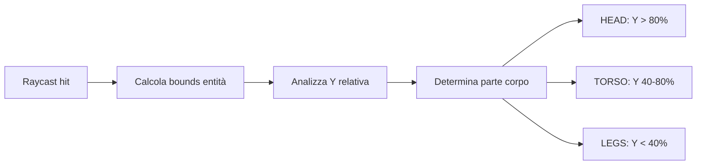

**Moltiplicatori Danno:**
| Parte | Moltiplicatore |
|-------|----------------|
| HEAD | 2.0x |
| TORSO | 1.0x |
| LEGS | 0.75x |
| ARMS | 0.85x |

### Damage Breakdown

Il danno viene calcolato considerando:

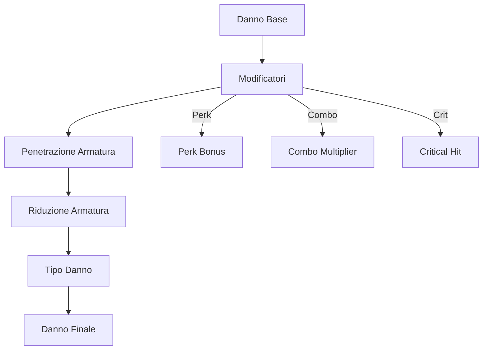

### File Principali

| File | Descrizione |
|------|-------------|
| `DamageHandler.java` | Handler principale danno |
| `HitHelper.java` | Utility hit detection |
| `DamageBreakdown.java` | Breakdown del danno |
| `DamageTracker.java` | Tracking danno |
| `HitData.java` | Dati hit |

---

## 4. Mailbox System

Sistema di messaggistica in-game con news, task e ticket.

### Architettura

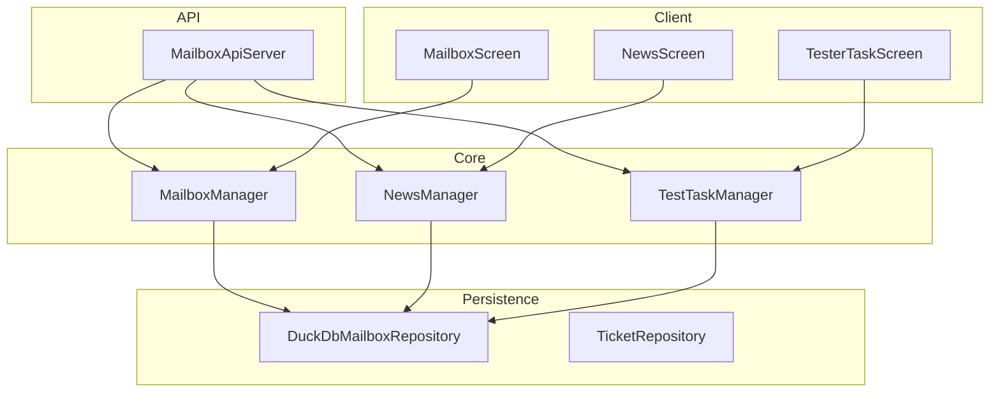

### Tipi di Messaggio

| Tipo | Descrizione |
|------|-------------|
| `SYSTEM` | Messaggi di sistema |
| `PLAYER` | Messaggi tra giocatori |
| `REWARD` | Ricompense con allegato |
| `ANNOUNCEMENT` | Annunci globali |

### Allegati

I messaggi possono avere allegati (item) che vengono riscossi:

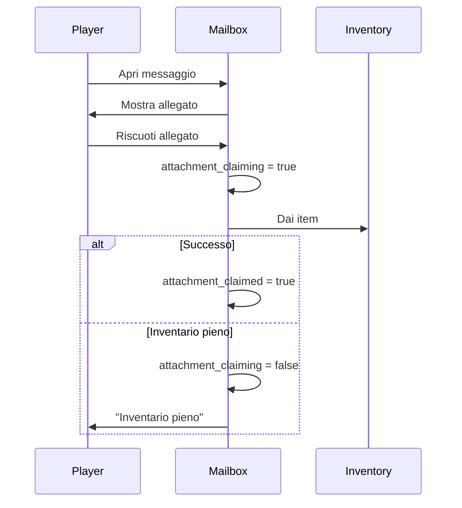

### File Principali

| File | Descrizione |
|------|-------------|
| `MailboxManager.java` | Manager messaggi |
| `NewsManager.java` | Manager news |
| `TestTaskManager.java` | Manager task |
| `DuckDbMailboxRepository.java` | Persistenza DuckDB |
| `MailboxApiServer.java` | API server (Javalin) |
| `MailboxScreen.java` | UI client |

---

## 5. Party System

Sistema per gestire gruppi di giocatori nelle quest multiplayer.

### Architettura

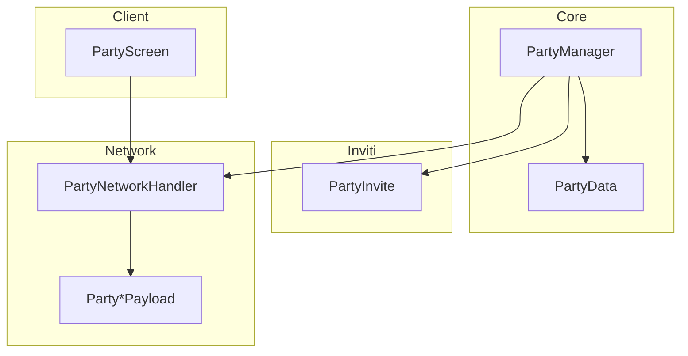

### Party Lifecycle

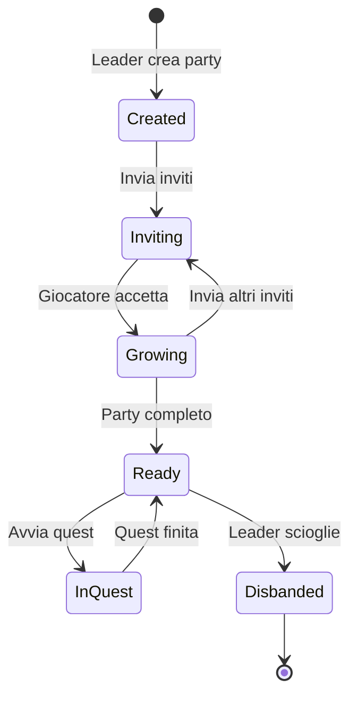

### File Principali

| File | Descrizione |
|------|-------------|
| `PartyManager.java` | Manager party |
| `PartyData.java` | Dati party |
| `PartyInvite.java` | Inviti |
| `PartyNetworkHandler.java` | Network handler |
| `PartyScreen.java` | UI client |

---

## 6. Instance Runtime

Sistema per gestire dimensioni dinamiche (istanze separate per arene/dungeon).

### Architettura

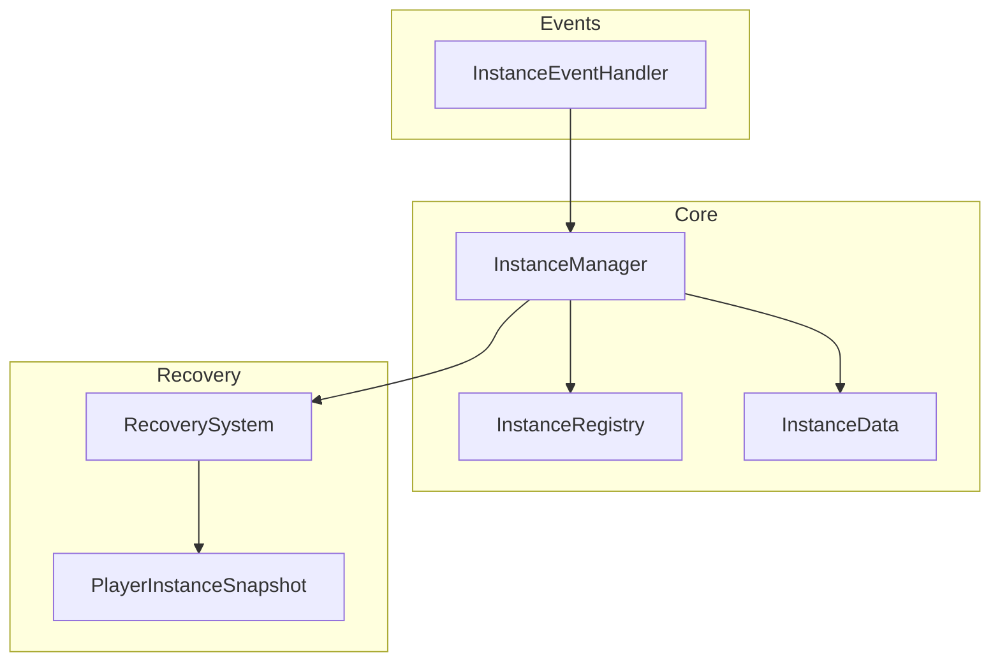

### Instance Lifecycle

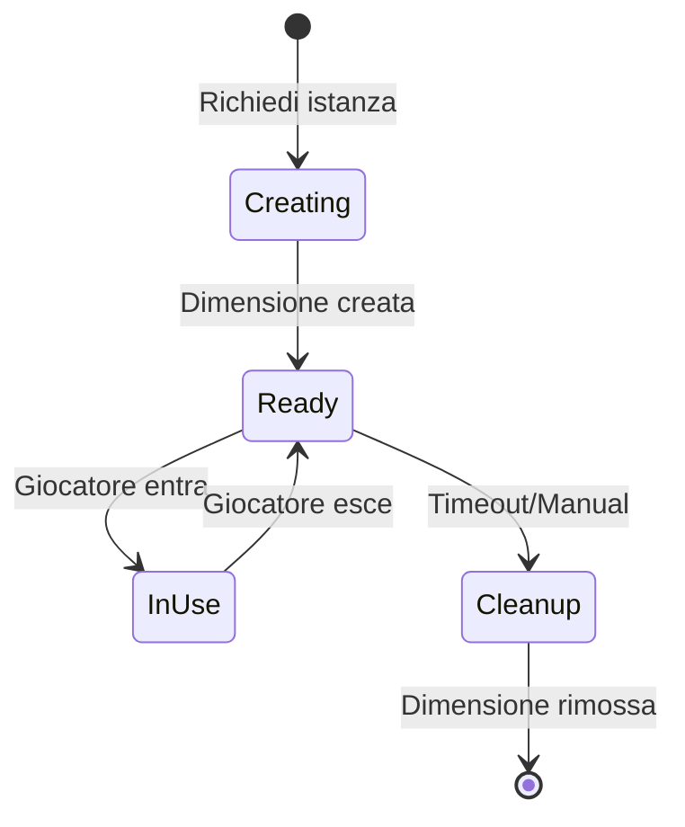

### Recovery System

Se un giocatore si disconnette in un'istanza:

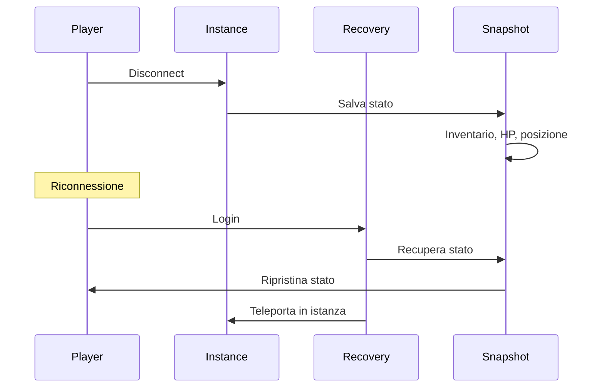

### File Principali

| File | Descrizione |
|------|-------------|
| `InstanceManager.java` | Manager istanze |
| `InstanceRegistry.java` | Registro istanze |
| `InstanceData.java` | Dati istanza |
| `RecoverySystem.java` | Sistema recovery |
| `PlayerInstanceSnapshot.java` | Snapshot giocatore |
| `InstanceEventHandler.java` | Handler eventi |

---

## 7. Telemetry Pipeline

Sistema per raccogliere, processare e visualizzare analytics.

### Architettura

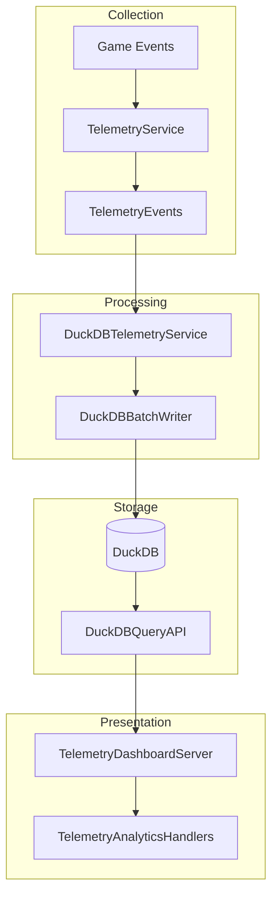

### Batch Writing

Per ottimizzare le performance, gli eventi vengono bufferizzati:

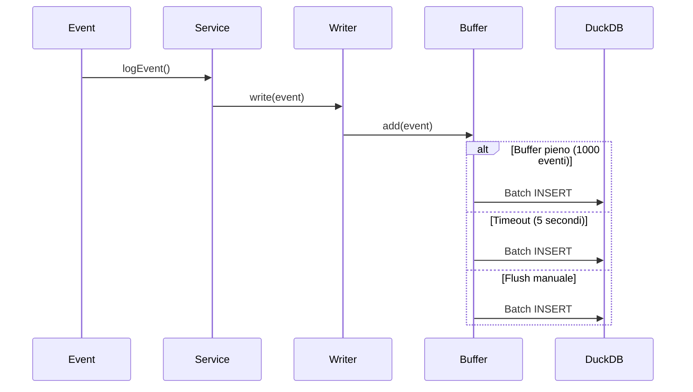

### File Principali

| File | Descrizione |
|------|-------------|
| `TelemetryService.java` | Servizio principale |
| `TelemetryEvents.java` | Handler eventi |
| `DuckDBTelemetryService.java` | Servizio DuckDB |
| `DuckDBBatchWriter.java` | Writer batch |
| `DuckDBQueryAPI.java` | API query |
| `DuckDBSchemaManager.java` | Gestione schema |
| `TelemetryDashboardServer.java` | Server dashboard |

---

## Riferimenti

- [Architettura](ARCHITECTURE.md)
- [Database Schema](DATABASE.md)
- [Pannelli Esterni](PANELS.md)
- [Quickstart](QUICKSTART.md)
