# Architettura DevMod - Documentazione Completa

> **Versione**: 2.0 Post-Riorganizzazione
> **Data**: 24 Dicembre 2024
> **Stato Build**: PASS (2740 test superati)
> **Classi Java Totali**: 862

---

## Indice

1. [Panoramica Generale](#1-panoramica-generale)
2. [Struttura Root Package](#2-struttura-root-package)
3. [Layer Architetturale](#3-layer-architetturale)
4. [Moduli Core](#4-moduli-core)
5. [Sistema Arena](#5-sistema-arena)
6. [Sistema Combat](#6-sistema-combat)
7. [Sistema UI](#7-sistema-ui)
8. [Sistema Endurance](#8-sistema-endurance)
9. [Infrastruttura](#9-infrastruttura)
10. [Flusso delle Dipendenze](#10-flusso-delle-dipendenze)
11. [Riepilogo Quantitativo](#11-riepilogo-quantitativo)

---

## 1. Panoramica Generale

### Filosofia Architetturale

DevMod segue un'architettura a **layer separati** dove ogni modulo ha responsabilità ben definite. La riorganizzazione ha eliminato il namespace legacy `com.devmod` consolidando tutto sotto `com.devmod.*`.

### Principi Guida

- **Separazione delle Responsabilità**: Ogni package gestisce un solo dominio
- **Root Package Minimale**: Solo 3 file entrypoint nel root
- **Modularità**: I sistemi sono indipendenti e comunicano via interfacce
- **Testabilità**: Struttura che favorisce unit testing e game testing

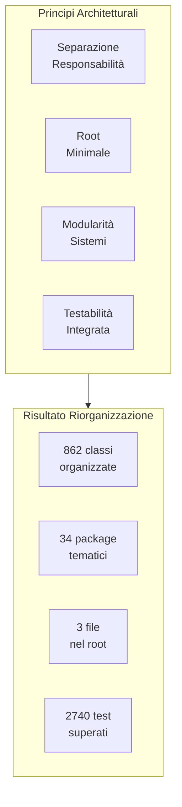

---

## 2. Struttura Root Package

### Il Cuore del Mod

Il root package `com.devmod/` contiene **esclusivamente** i tre file di ingresso del mod. Questa scelta architetturale garantisce chiarezza immediata su dove inizia l'esecuzione.

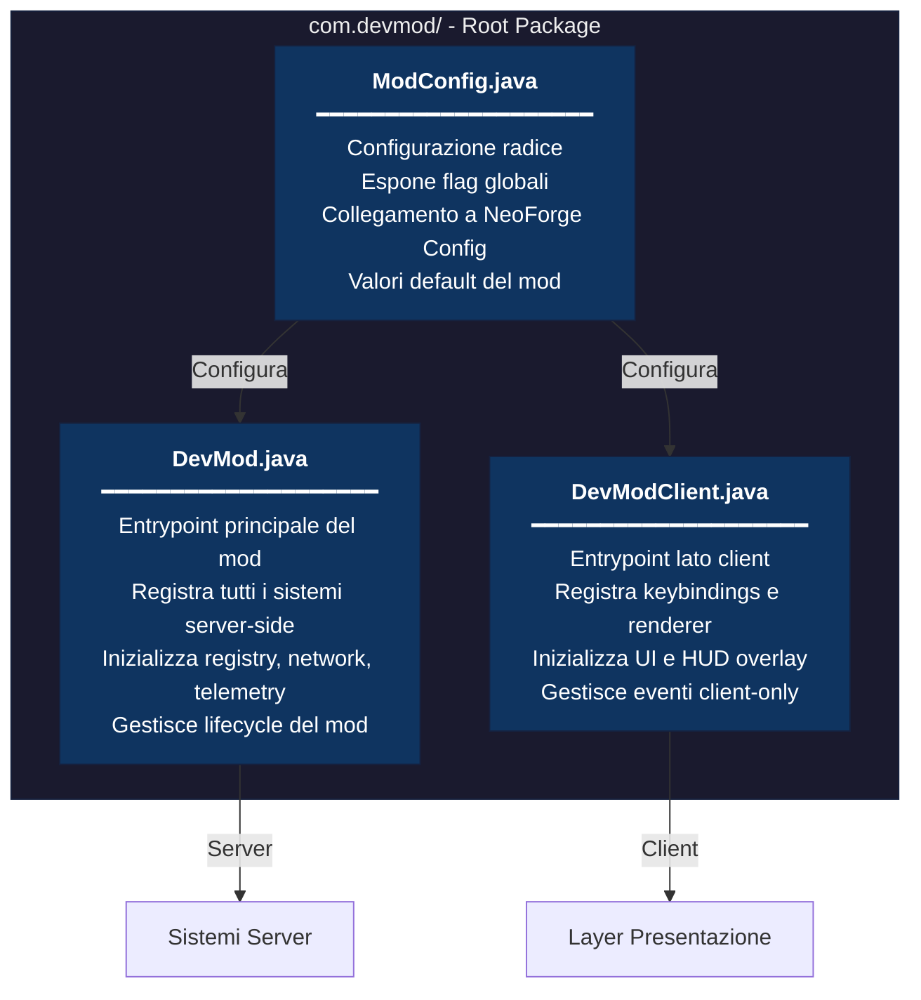

### Perché Solo 3 File?

| Motivazione | Beneficio |
|-------------|-----------|
| **Chiarezza** | Sviluppatore nuovo trova subito gli entrypoint |
| **Manutenibilità** | Meno file = meno conflitti merge |
| **Convenzione NeoForge** | Allineamento con best practice della community |
| **Separazione Client/Server** | Evita errori di caricamento classi client su server dedicati |

---

## 3. Layer Architetturale

### Struttura a 5 Layer

L'architettura è organizzata in 5 layer distinti, dal più basso (Core) al più alto (Presentation).

```mermaid
graph TB
    subgraph L5["LAYER 5: PRESENTATION - Interfaccia Utente"]
        direction LR
        UI["<b>ui/</b><br/>227 classi<br/>━━━━━━━━━━<br/>Schermate, editor,<br/>radial menu, wizard"]
        HUD["<b>hud/</b><br/>29 classi<br/>━━━━━━━━━━<br/>Overlay in-game,<br/>barre salute, info"]
        PANELS["<b>panels/</b><br/>14 classi<br/>━━━━━━━━━━<br/>Pannelli testing,<br/>debug visivo"]
        RENDERING["<b>rendering/</b><br/>27 classi<br/>━━━━━━━━━━<br/>Renderer custom,<br/>effetti visuali"]
    end

    subgraph L4["LAYER 4: GAMEPLAY - Logica di Gioco"]
        direction LR
        ARENA["<b>arena/</b><br/>188 classi<br/>━━━━━━━━━━<br/>Sistema arene,<br/>template, spawn"]
        ENDURANCE["<b>endurance/</b><br/>69 classi<br/>━━━━━━━━━━<br/>Quest wave-based,<br/>perk, reward"]
        PARTY["<b>party/</b><br/>20 classi<br/>━━━━━━━━━━<br/>Sistema gruppi,<br/>matchmaking"]
        QUEST["<b>quest/</b><br/>5 classi<br/>━━━━━━━━━━<br/>Sistema quest<br/>generico"]
    end

    subgraph L3["LAYER 3: SYSTEMS - Sistemi di Gioco"]
        direction LR
        COMBAT["<b>combat/</b><br/>9 classi<br/>━━━━━━━━━━<br/>Danno, hit detection,<br/>body parts"]
        COLLISION["<b>collision/</b><br/>13 classi<br/>━━━━━━━━━━<br/>Hitbox custom,<br/>ray tracing"]
        ABILITIES["<b>abilities/</b><br/>7 classi<br/>━━━━━━━━━━<br/>Abilità giocatore,<br/>cooldown"]
        EFFECTS["<b>effects/</b><br/>5 classi<br/>━━━━━━━━━━<br/>Effetti status,<br/>buff/debuff"]
    end

    subgraph L2["LAYER 2: INFRASTRUCTURE - Servizi Trasversali"]
        direction LR
        NETWORK["<b>network/</b><br/>31 classi<br/>━━━━━━━━━━<br/>Payload, sicurezza,<br/>sync client-server"]
        TELEMETRY["<b>telemetry/</b><br/>62 classi<br/>━━━━━━━━━━<br/>Analytics, DuckDB,<br/>heatmap, metriche"]
        INSTANCE["<b>instance/</b><br/>9 classi<br/>━━━━━━━━━━<br/>Gestione istanze,<br/>stato giocatore"]
        MIXIN["<b>mixin/</b><br/>8 classi<br/>━━━━━━━━━━<br/>Hook nel codice<br/>Minecraft vanilla"]
    end

    subgraph L1["LAYER 1: CORE - Fondamenta"]
        direction LR
        CONFIG["<b>config/</b><br/>9 classi<br/>━━━━━━━━━━<br/>Gestori config<br/>per ogni sistema"]
        STATS["<b>stats/</b><br/>5 classi<br/>━━━━━━━━━━<br/>Dati statistiche<br/>armi, armature"]
        COMPONENTS["<b>components/</b><br/>6 classi<br/>━━━━━━━━━━<br/>Data components<br/>MC 1.21+"]
        ATTRIBUTES["<b>attributes/</b><br/>6 classi<br/>━━━━━━━━━━<br/>Attributi custom<br/>entità"]
        EVENTS["<b>events/</b><br/>9 classi<br/>━━━━━━━━━━<br/>Handler eventi<br/>NeoForge"]
    end

    L5 --> L4
    L4 --> L3
    L3 --> L2
    L2 --> L1

    style L5 fill:#2d3436,stroke:#636e72,color:#dfe6e9
    style L4 fill:#2d3436,stroke:#636e72,color:#dfe6e9
    style L3 fill:#2d3436,stroke:#636e72,color:#dfe6e9
    style L2 fill:#2d3436,stroke:#636e72,color:#dfe6e9
    style L1 fill:#2d3436,stroke:#636e72,color:#dfe6e9
```

### Regole di Dipendenza

| Layer | Può Dipendere Da | Non Può Dipendere Da |
|-------|------------------|----------------------|
| Presentation | Gameplay, Systems, Infrastructure, Core | - |
| Gameplay | Systems, Infrastructure, Core | Presentation |
| Systems | Infrastructure, Core | Presentation, Gameplay |
| Infrastructure | Core | Presentation, Gameplay, Systems |
| Core | Nessuno (solo librerie esterne) | Tutti gli altri layer |

---

## 4. Moduli Core

### Dettaglio Package Fondamentali

Questi package formano la base su cui tutti gli altri sistemi si appoggiano.

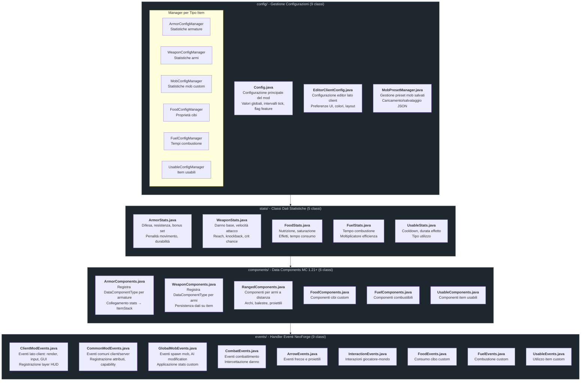

---

## 5. Sistema Arena

### Panoramica

Il sistema Arena è il modulo più complesso del mod con **188 classi** organizzate in **55 subpackage**. Gestisce la creazione, esecuzione e monitoraggio di arene di combattimento.

```mermaid
graph TB
    subgraph ARENA_MAIN["arena/ - Sistema Arena Completo (188 classi)"]
        direction TB

        subgraph ARENA_CORE["CORE - Nucleo del Sistema"]
            direction LR

            REG["<b>registry/ (30)</b><br/>━━━━━━━━━━━━━━<br/>ArenaTemplateRegistry<br/>ArenaTemplate<br/>TemplateValidator<br/>TemplateLoader<br/>ManifestReader<br/>VersionManager"]

            BLD["<b>builder/ (10)</b><br/>━━━━━━━━━━━━━━<br/>ArenaBuilder<br/>BuildTransaction<br/>BlockPlacement<br/>StructureResolver<br/>BuildProgress"]

            CMD["<b>command/ (3)</b><br/>━━━━━━━━━━━━━━<br/>ArenaCommand<br/>TestCommand<br/>AdminCommand"]
        end

        subgraph ARENA_POLICY["POLICY - Regole e Override"]
            direction LR

            POL["<b>policy/ (9)</b><br/>━━━━━━━━━━━━━━<br/>PolicyResolver<br/>ArenaPolicy<br/>PolicyValidator<br/>DefaultPolicies<br/>PolicyMerger"]

            OVR["<b>override/ (8)</b><br/>━━━━━━━━━━━━━━<br/>OverrideManager<br/>TemplateOverride<br/>RuntimeOverride<br/>OverrideStack"]

            CFG["<b>config/ (5)</b><br/>━━━━━━━━━━━━━━<br/>ArenaConfig<br/>SpawnConfig<br/>RewardConfig<br/>DifficultyConfig"]
        end

        subgraph ARENA_RUNTIME["RUNTIME - Esecuzione"]
            direction LR

            SPN["<b>spawn/ (6)</b><br/>━━━━━━━━━━━━━━<br/>SpawnManager<br/>SpawnSlot<br/>RuntimeSpawnValidator<br/>SpawnQueue"]

            CLN["<b>cleanup/ (6)</b><br/>━━━━━━━━━━━━━━<br/>CleanupManager<br/>EntityRemover<br/>BlockRestorer<br/>StateReset"]

            POOL["<b>pool/ (4)</b><br/>━━━━━━━━━━━━━━<br/>ArenaPool<br/>PoolManager<br/>PoolConfig<br/>Recycling"]

            SNP["<b>snapshot/ (3)</b><br/>━━━━━━━━━━━━━━<br/>ArenaSnapshot<br/>StateCapture<br/>Restoration"]

            IDN["<b>identity/ (3)</b><br/>━━━━━━━━━━━━━━<br/>ArenaIdentity<br/>ArenaHandle<br/>IdentityManager"]

            INST["<b>instance/ (4)</b><br/>━━━━━━━━━━━━━━<br/>ArenaInstance<br/>InstanceLifecycle<br/>InstanceState"]
        end

        subgraph ARENA_MONITOR["MONITORING - Osservabilità"]
            direction LR

            AUT["<b>autosmoke/ (8)</b><br/>━━━━━━━━━━━━━━<br/>AutosmokeGuard<br/>SmokeScheduler<br/>SmokeResult<br/>HealthCheck"]

            ALR["<b>alert/ (8)</b><br/>━━━━━━━━━━━━━━<br/>AlertManager<br/>AlertRule<br/>AlertChannel<br/>Notification"]

            LOG["<b>logging/ (4)</b><br/>━━━━━━━━━━━━━━<br/>ArenaLogger<br/>EventLog<br/>AuditTrail"]

            MET["<b>metrics/ (3)</b><br/>━━━━━━━━━━━━━━<br/>MetricsCollector<br/>PerformanceMetrics<br/>UsageStats"]

            MON["<b>monitoring/ (3)</b><br/>━━━━━━━━━━━━━━<br/>DashboardData<br/>HealthStatus<br/>Watchdog"]
        end

        subgraph ARENA_SAFETY["SAFETY - Gestione Errori"]
            direction LR

            FLB["<b>fallback/ (4)</b><br/>━━━━━━━━━━━━━━<br/>FallbackStrategy<br/>GracefulDegradation<br/>RecoveryPlan"]

            RCV["<b>recovery/ (3)</b><br/>━━━━━━━━━━━━━━<br/>RecoveryManager<br/>StateRecovery<br/>DataIntegrity"]

            SEC["<b>security/ (3)</b><br/>━━━━━━━━━━━━━━<br/>SecurityValidator<br/>AccessControl<br/>RateLimiter"]

            VAL["<b>validation/ (3)</b><br/>━━━━━━━━━━━━━━<br/>RuntimeValidator<br/>PreflightCheck<br/>ValidationResult"]
        end

        subgraph ARENA_UI["UI & ANALYTICS"]
            direction LR

            AHUD["<b>hud/ (4)</b><br/>━━━━━━━━━━━━━━<br/>ArenaHUD<br/>ProgressBar<br/>WaveIndicator"]

            ATEL["<b>telemetry/ (3)</b><br/>━━━━━━━━━━━━━━<br/>ArenaTelemetry<br/>EventTracking<br/>Analytics"]

            AUI["<b>ui/ (3)</b><br/>━━━━━━━━━━━━━━<br/>ArenaTestWizard<br/>TemplateSelector<br/>ConfigPanel"]
        end

        subgraph ARENA_OTHER["ALTRI SUBPACKAGE (48+ classi)"]
            direction LR

            GAM["gamification/<br/>Achievements, Score"]
            REW["rewards/<br/>RewardSystem"]
            LDB["leaderboard/<br/>Rankings"]
            NET["network/<br/>ArenaPackets"]
            API["api/<br/>PublicAPI"]
            MIG["migration/<br/>VersionMigration"]
        end
    end

    ARENA_CORE --> ARENA_POLICY
    ARENA_POLICY --> ARENA_RUNTIME
    ARENA_RUNTIME --> ARENA_MONITOR
    ARENA_MONITOR --> ARENA_SAFETY
    ARENA_SAFETY --> ARENA_UI
    ARENA_UI --> ARENA_OTHER

    style ARENA_MAIN fill:#0a0a0a,stroke:#333,color:#eee
```

### Flusso Lifecycle Arena

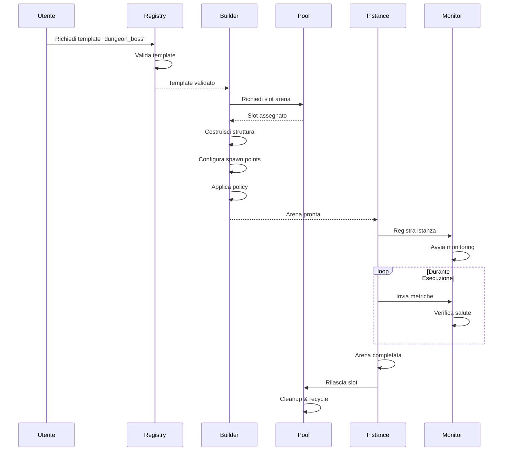

---

## 6. Sistema Combat

### Architettura Combattimento

Il sistema combat gestisce il calcolo del danno, la hit detection con body parts, e gli effetti visuali.

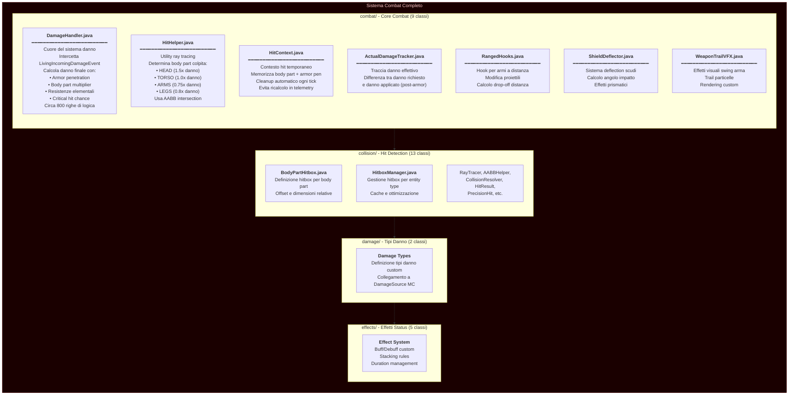

### Flusso Calcolo Danno

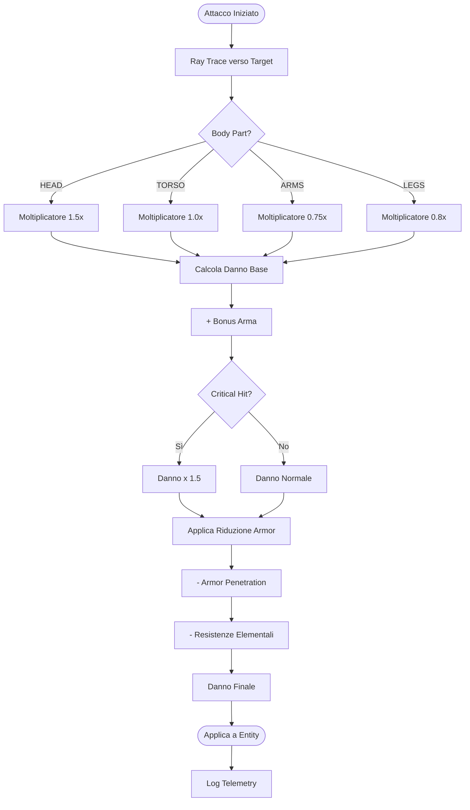

---

## 7. Sistema UI

### Panoramica Interfaccia Utente

Il sistema UI è il più grande del mod con **227 classi** che gestiscono ogni aspetto dell'interfaccia.

```mermaid
graph TB
    subgraph UI_SYSTEM["Sistema UI Completo (227 classi)"]
        direction TB

        subgraph UI_EDITOR["editor/ - Editor Item (~80 classi)"]
            direction TB

            ED_MAIN["<b>ItemEditorScreen.java</b><br/>Schermata principale editor<br/>Tab-based navigation<br/>Preview real-time item"]

            ED_COMP["<b>components/</b><br/>EditorButton, Slider,<br/>ColorPicker, NumberInput,<br/>Dropdown, Toggle, etc."]

            ED_TABS["<b>tabs/</b><br/>GeneralTab, StatsTab,<br/>EffectsTab, VisualsTab,<br/>AdvancedTab"]

            ED_SYS["<b>systems/</b><br/>UndoRedo, Validation,<br/>Preview, Export/Import"]
        end

        subgraph UI_SCREENS["screens/ - Schermate (~40 classi)"]
            direction TB

            SC_MOB["<b>MobConfigScreen</b><br/>Configurazione mob custom<br/>Stats, equipment, AI"]

            SC_TEL["<b>TelemetryDashboardScreen</b><br/>Visualizzazione analytics<br/>Grafici, heatmap"]

            SC_SET["<b>SettingsScreen</b><br/>Impostazioni mod<br/>Keybindings, preferenze"]

            SC_OTHER["WelcomeScreen,<br/>ArenaSelector,<br/>PartyManager, etc."]
        end

        subgraph UI_RADIAL["radial/ - Menu Radiale (~15 classi)"]
            direction TB

            RAD_MAIN["<b>RadialMenuScreenV3.java</b><br/>Menu radiale principale<br/>Azioni rapide context-aware"]

            RAD_ACT["<b>RadialAction.java</b><br/>Definizione azioni<br/>Icon, callback, conditions"]

            RAD_STATE["<b>RadialMenuState.java</b><br/>Stato menu, selezione,<br/>hover, animazioni"]
        end

        subgraph UI_UNIFIED["unified/ - UI Unificata (~20 classi)"]
            direction TB

            UNI_SET["<b>UnifiedSettingsScreen</b><br/>Settings consolidate<br/>Tutte le opzioni in un posto"]

            UNI_PAG["<b>pages/</b><br/>GeneralPage, CombatPage,<br/>TelemetryPage, DebugPage"]
        end

        subgraph UI_COMP["components/ - Componenti Riutilizzabili (~30 classi)"]
            direction TB

            COMP_BTN["Buttons, IconButton,<br/>ToggleButton, ButtonRow"]

            COMP_INPUT["TextInput, NumberField,<br/>SearchBox, Autocomplete"]

            COMP_DISPLAY["ProgressBar, Chart,<br/>Table, List, Grid"]

            COMP_DIALOG["ConfirmDialog, AlertDialog,<br/>InputDialog, FileDialog"]
        end

        subgraph UI_TESTING["testing/ - Pannelli Test (~25 classi)"]
            TEST_PANEL["TestingHub,<br/>WeaponTestPanel,<br/>ArmorTestPanel,<br/>CombatSimulator"]
        end

        subgraph UI_WIZARD["wizard/ - Wizard (~10 classi)"]
            WIZ["QuickTestWizard,<br/>SetupWizard,<br/>ImportWizard"]
        end
    end

    subgraph HUD_SYSTEM["hud/ - Overlay In-Game (29 classi)"]
        direction TB

        HUD_QUICK["<b>QuickHelpOverlay</b><br/>Help contestuale<br/>Shortcut reminder"]

        HUD_IMPACT["<b>Impact3DPanelManager</b><br/>Visualizzazione impatti<br/>Damage numbers 3D"]

        HUD_DEBUG["<b>DebugOverlay</b><br/>Info debug<br/>Performance stats"]

        HUD_OTHER["HealthBar, ManaBar,<br/>CooldownDisplay,<br/>ComboCounter, etc."]
    end

    subgraph PANELS_SYSTEM["panels/ - Pannelli Speciali (14 classi)"]
        PAN["Testing panels,<br/>Debug panels,<br/>Admin panels"]
    end

    subgraph RENDERING_SYSTEM["rendering/ - Rendering Custom (27 classi)"]
        RND_WORLD["<b>WorldRenderEvents</b><br/>Rendering mondo<br/>Effetti custom"]

        RND_ENTITY["Entity renderers,<br/>Hitbox visualization,<br/>Trail effects"]

        RND_UI["UI renderers,<br/>Custom widgets,<br/>Animations"]
    end

    UI_SYSTEM --> HUD_SYSTEM
    HUD_SYSTEM --> PANELS_SYSTEM
    PANELS_SYSTEM --> RENDERING_SYSTEM

    style UI_SYSTEM fill:#001a00,stroke:#004d00,color:#ccffcc
    style HUD_SYSTEM fill:#001a00,stroke:#004d00,color:#ccffcc
```

---

## 8. Sistema Endurance

### Quest Wave-Based

Il sistema Endurance gestisce sfide a onde progressive con sistema perk, shop e reward.

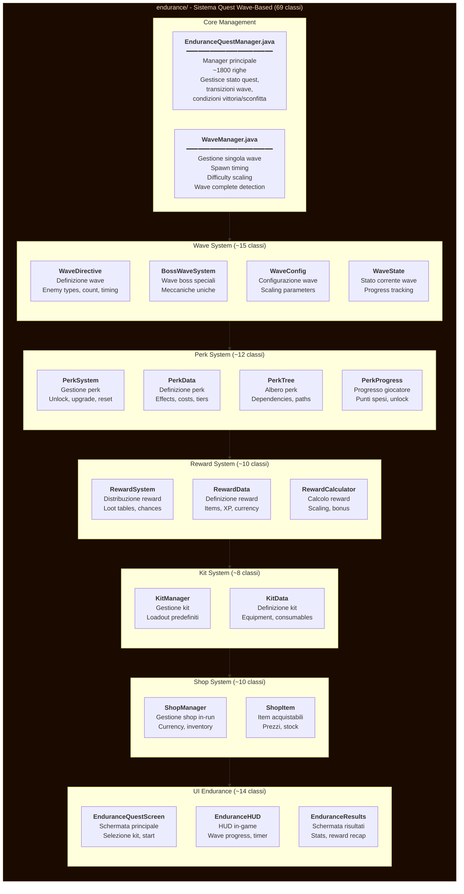

### Flusso Quest Endurance

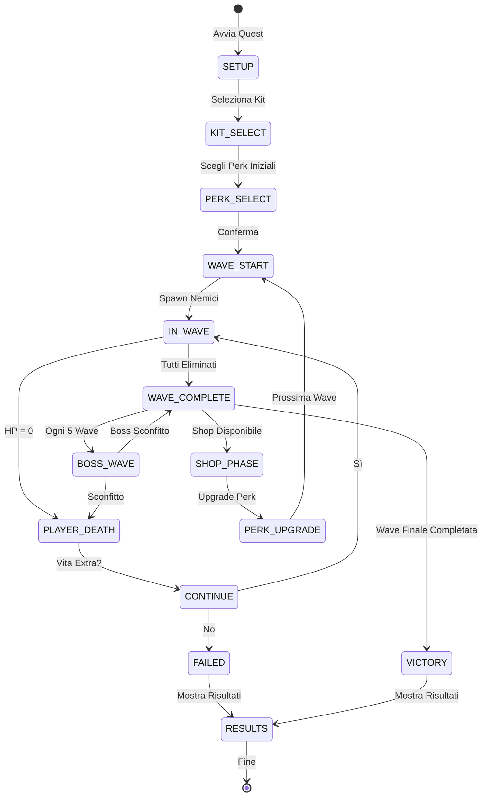

---

## 9. Infrastruttura

### Servizi Trasversali

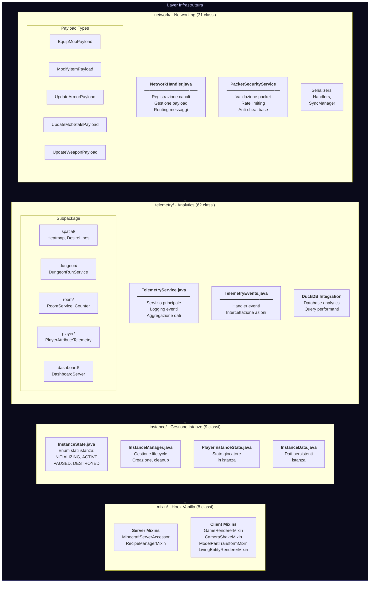

---

## 10. Flusso delle Dipendenze

### Grafo Dipendenze Completo

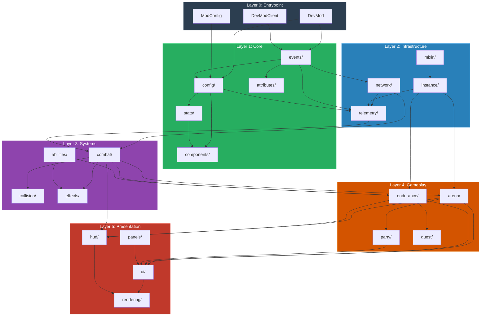

---

## 11. Riepilogo Quantitativo

### Distribuzione Classi per Package

| Package | Classi | % Totale | Layer | Descrizione |
|---------|--------|----------|-------|-------------|
| **ui/** | 227 | 26.3% | Presentation | Interfaccia utente completa |
| **arena/** | 188 | 21.8% | Gameplay | Sistema arene |
| **endurance/** | 69 | 8.0% | Gameplay | Quest wave-based |
| **telemetry/** | 62 | 7.2% | Infrastructure | Analytics e metriche |
| **network/** | 31 | 3.6% | Infrastructure | Comunicazione rete |
| **testing/** | 29 | 3.4% | Support | Utilità testing |
| **hud/** | 29 | 3.4% | Presentation | Overlay in-game |
| **rendering/** | 27 | 3.1% | Presentation | Rendering custom |
| **party/** | 20 | 2.3% | Gameplay | Sistema gruppi |
| **debug/** | 16 | 1.9% | Support | Strumenti debug |
| **actions/** | 16 | 1.9% | Support | Azioni radial menu |
| **recipe/** | 15 | 1.7% | Support | Editor ricette |
| **panels/** | 14 | 1.6% | Presentation | Pannelli speciali |
| **collision/** | 13 | 1.5% | Systems | Hit detection |
| **instance/** | 9 | 1.0% | Infrastructure | Gestione istanze |
| **events/** | 9 | 1.0% | Core | Handler eventi |
| **config/** | 9 | 1.0% | Core | Configurazioni |
| **combat/** | 9 | 1.0% | Systems | Combattimento |
| **mixin/** | 8 | 0.9% | Infrastructure | Hook Minecraft |
| **abilities/** | 7 | 0.8% | Systems | Abilità giocatore |
| **util/** | 6 | 0.7% | Support | Utilità generiche |
| **components/** | 6 | 0.7% | Core | Data components |
| **attributes/** | 6 | 0.7% | Core | Attributi custom |
| **stats/** | 5 | 0.6% | Core | Classi statistiche |
| **quest/** | 5 | 0.6% | Gameplay | Sistema quest |
| **integration/** | 5 | 0.6% | Support | Integrazioni esterne |
| **gametest/** | 5 | 0.6% | Support | Game test |
| **effects/** | 5 | 0.6% | Systems | Effetti status |
| **client/** | 4 | 0.5% | Support | Codice client-only |
| **damage/** | 2 | 0.2% | Systems | Tipi danno |
| **tags/** | 1 | 0.1% | Support | Sistema tag |
| **migration/** | 1 | 0.1% | Support | Helper migrazione |
| **bridge/** | 1 | 0.1% | Support | Bridge cross-mod |
| **ammo/** | 1 | 0.1% | Support | Sistema munizioni |
| **TOTALE** | **~862** | **100%** | | |

### Distribuzione per Layer

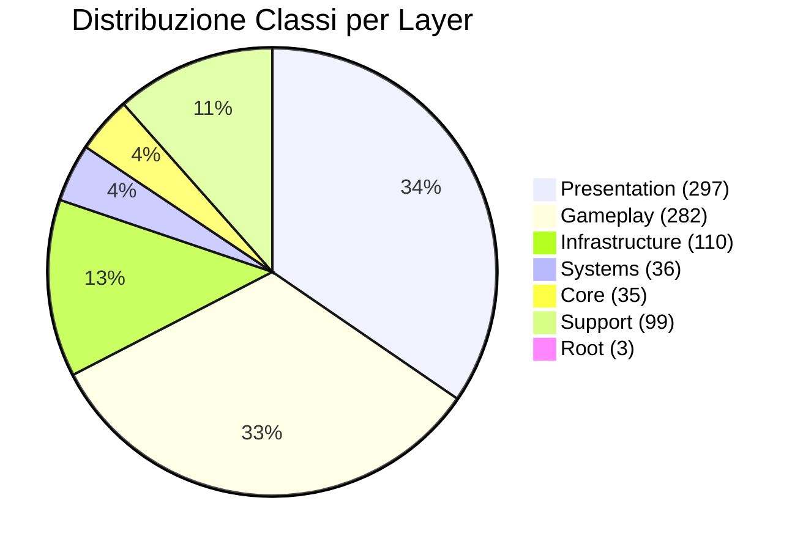

---

## 12. Consolidamento UIConstants (Fase 7)

### Struttura Prima/Dopo

Il sistema UIConstants è stato unificato in un'unica classe canonica.

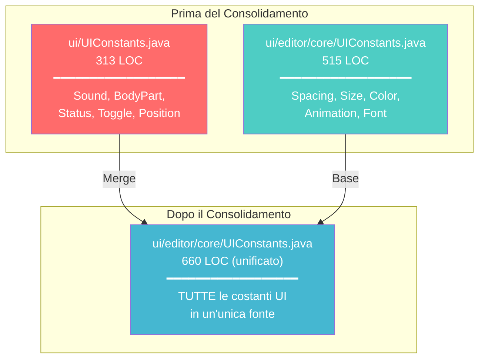

### Classi Aggiunte

| Classe Interna | Descrizione | Esempio Uso |
|----------------|-------------|-------------|
| `Sound` | Feedback audio UI | `Sound.CLICK`, `Sound.SUCCESS` |
| `BodyPart` | Colori body part | `BodyPart.HEAD`, `BodyPart.LEGS` |
| `Status` | Colori stato | `Status.SUCCESS`, `Status.ERROR` |
| `Toggle` | Colori toggle | `Toggle.ON`, `Toggle.OFF_HOVER` |
| `Position` | Costanti posizione | `Position.TITLE_Y`, `Position.CONTENT_START_Y` |

### Costanti Aggiunte

| Categoria | Costanti |
|-----------|----------|
| **Spacing** | `PADDING_XS/SM/MD/LG/XL`, `GAP_SMALL/MEDIUM/LARGE`, `HEADER_HEIGHT` |
| **Size** | `SIDEBAR_WIDTH_*`, `DIALOG_WIDTH_*`, `BUTTON_HEIGHT_PROMINENT` |
| **Background** | `SCREEN()`, `TOOLTIP()`, `HUD_PANEL()`, `GLOW()` |
| **Border** | `LIGHT()`, `GLOW()` |
| **Text** | `WHITE()`, `ACCENT()` |
| **Accent** | `PURPLE()`, `YELLOW()`, `GOLD()` |

### File Aggiornati

50+ file hanno ricevuto aggiornamento import:

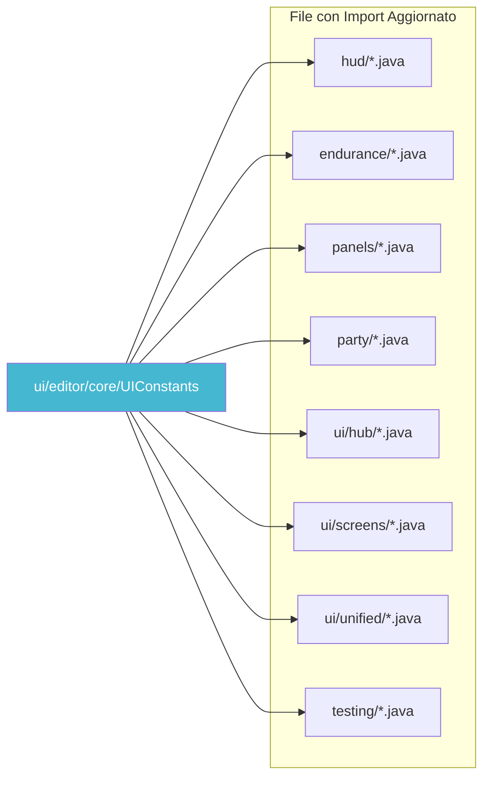

---

## Note Finali

### Punti di Forza Architettura

1. **Separazione Netta**: Ogni layer ha responsabilità chiare
2. **Root Minimale**: Solo 3 file entrypoint
3. **Modularità**: Sistemi indipendenti e testabili
4. **Scalabilità**: Facile aggiungere nuovi moduli
5. **UIConstants Unificato**: Una sola fonte di verità per costanti UI

### Aree di Evoluzione Futura

1. **Phase 5 Deferred**: Rename `hud/` → `overlay/`, `network/` → `transport/`
2. **Step 3**: DamageHandler split con pipeline pattern
3. **Step 4**: Consolidamento duplicati UI (ConfirmDialog, HelpOverlay)

---

*Documento generato: 24 Dicembre 2024*
*Versione: 2.1 - Aggiunto consolidamento UIConstants*
*Autore: Claude Code*
