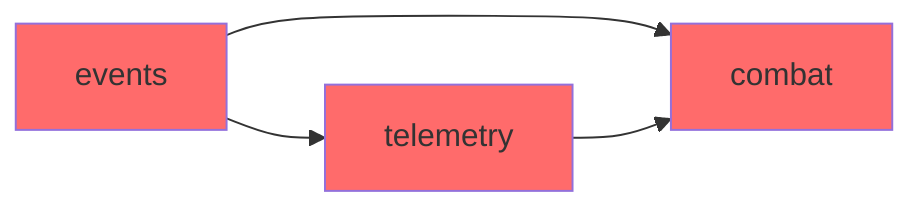

# Refactor Audit - Analisi Reale del Codice

> **Data Audit**: 24 Dicembre 2024
> **Ultimo Aggiornamento**: 24 Dicembre 2024 (post-consolidamento UIConstants)
> **Metodo**: Analisi automatica LOC, imports, struttura package
> **Threshold God Class**: 600 LOC
> **Build Status**: ✅ PASS - 2740 test

---

## Stato Completamento

```
┌─────────────────────────────────────────────────────────┐
│              RIEPILOGO AUDIT REFACTORING                │
├─────────────────────────────────────────────────────────┤
│ Duplicati Rimossi:          5/11 (45%)                  │
│ God Classes Splittate:      0/33 (da fare)              │
│ UIConstants Consolidato:    ✅ COMPLETATO               │
│ Combat Events Dedup:        ✅ COMPLETATO               │
│ Single-class pkg:           33 (bassa priorità)         │
└─────────────────────────────────────────────────────────┘
```

---

## 1. God Classes (>600 LOC)

### Criticità ALTA (>1500 LOC)

| File | LOC | Metodi | Severità | Note |
|------|-----|--------|----------|------|
| `endurance/EnduranceQuestManager.java` | **2939** | 210 | **CRITICA** | Monster class, gestisce tutto: state, wave, perk, reward, shop |
| `actions/client/DevModClientActions.java` | **2490** | ~80 | **CRITICA** | Mega-switch di azioni client, viola OCP |
| `ui/editor/ItemEditorScreen.java` | **2381** | ~60 | **CRITICA** | Screen monolitico, mix logica/UI |
| `arena/builder/ArenaBuilder.java` | **1474** | ~40 | ALTA | Builder complesso ma potenzialmente ok |
| `telemetry/duckdb/DuckDBBatchWriter.java` | **1473** | ~30 | ALTA | Troppa logica batch in un file |
| `telemetry/duckdb/DuckDBQueryAPI.java` | **1392** | ~35 | ALTA | API query monolitica |

### Criticità MEDIA (600-1500 LOC)

| File | LOC | Note |
|------|-----|------|
| `arena/dashboard/ArenaDashboardEndpoint.java` | 1338 | HTTP handler monolitico |
| `telemetry/duckdb/DuckDBTelemetryService.java` | 1337 | Service troppo grande |
| `ui/radial/RadialMenuScreenV3.java` | 1329 | Screen complesso |
| `endurance/KitSelectionScreen.java` | 1324 | Screen monolitico |
| `telemetry/endurance/EnduranceTelemetryService.java` | 1302 | Telemetry per endurance |
| `endurance/WaveManager.java` | 1287 | Gestione wave |
| `testing/QATestingScreen.java` | 1252 | Screen testing |
| `telemetry/duckdb/DuckDBSchemaManager.java` | 1225 | Schema DDL |
| `arena/command/ArenaCommands.java` | 1209 | Command handler |
| `endurance/EnduranceQuestScreen.java` | 1173 | Screen |
| `endurance/RewardSystem.java` | 1160 | Sistema reward |
| `network/handlers/MobItemNetworkHandler.java` | 1119 | Network handler |
| `endurance/BossWaveSystem.java` | 1059 | Sistema boss |
| `testing/DynamicTestGenerator.java` | 1042 | Test generator |
| `telemetry/dashboard/TelemetryDashboardServer.java` | 1025 | Server HTTP |
| `endurance/GamificationManager.java` | 1003 | Gamification |
| `ui/wizard/QuickTestWizard.java` | 990 | Wizard |
| `telemetry/TelemetryService.java` | 987 | Service principale |

### Riepilogo God Classes

```
CRITICA (>1500 LOC): 6 file
ALTA (1000-1500 LOC): 12 file
MEDIA (600-1000 LOC): ~15 file
TOTALE: 33+ file sopra soglia 600 LOC
```

---

## 2. Classi Duplicate (11 conflitti)

### Duplicati Identici - ✅ COMPLETATO

| Classe | Path 1 | Path 2 | Stato |
|--------|--------|--------|-------|
| `ArrowEvents.java` | ~~`combat/`~~ | `events/` ✅ | ✅ RIMOSSO combat/ |
| `CombatEvents.java` | ~~`combat/`~~ | `events/` ✅ | ✅ RIMOSSO combat/ |

### Duplicati Divergenti - PARZIALE

| Classe | Path 1 | Path 2 | Stato |
|--------|--------|--------|-------|
| `UIConstants.java` | ~~`ui/`~~ | `ui/editor/core/` ✅ | ✅ MERGED (660 LOC) |
| `ConfirmDialog.java` | `ui/` | `ui/editor/systems/` | 📋 Step 4 |
| `HelpOverlay.java` | `ui/` | `ui/editor/systems/` | 📋 Step 4 |
| `DebugOverlay.java` | `ui/` | `ui/editor/debug/` | 📋 Step 4 |
| `ButtonRow.java` | `ui/testing/panel/` | `ui/editor/components/` | 📋 Step 4 |
| `TelemetryPage.java` | `ui/unified/pages/` | `ui/testing/pages/` | 📋 Step 4 |
| `DebugOverlaysPage.java` | `ui/unified/pages/` | `ui/testing/pages/` | 📋 Step 4 |
| `RadialAction.java` | `ui/radial/` | `actions/` | ⚠️ Scopi diversi, ok |

### Duplicati con Scopi Diversi (ok tenere separati)

| Classe | Path 1 | Path 2 | Motivo |
|--------|--------|--------|--------|
| `Bounds.java` | `ui/editor/core/` (19 LOC) | `arena/registry/` (33 LOC) | Domini diversi, rinominare uno |

---

## 3. Package Single-Class (33 package)

### Da Consolidare (package con 1 sola classe)

#### Root Level (4 package)
```
bridge/           → ClientUiBridge.java      → MOVE to client/
tags/             → ModTags.java             → MOVE to util/
ammo/             → AmmoSystem.java          → MOVE to combat/
migration/        → ArmorMigrationHelper.java → MOVE to util/
```

#### UI (5 package)
```
ui/wizard/        → QuickTestWizard.java     → MOVE to ui/screens/
ui/components/    → ScrollableArea.java      → MOVE to ui/core/
ui/radial/config/ → RadialMenuConstants.java → MOVE to ui/radial/
ui/radial/input/  → RadialSearchHandler.java → MOVE to ui/radial/
ui/editor/favorites/ → FavoritePresetStore.java → MOVE to ui/editor/
```

#### Arena (14 package)
```
arena/            → ArenaCommandEvents.java  → MOVE to arena/event/
arena/dryrun/     → DryRunEstimator.java     → MOVE to arena/builder/
arena/retention/  → RetentionJob.java        → MOVE to arena/lifecycle/
arena/serialization/ → TemplateSerializer.java → MOVE to arena/registry/
arena/health/     → HealthCheckEndpoint.java → MOVE to arena/monitoring/
arena/network/    → BuildProgressPayload.java → MOVE to arena/transport/
arena/template/   → TemplatePlaceholder.java → MOVE to arena/registry/
arena/admin/      → HotReloadEndpoint.java   → MOVE to arena/monitoring/
arena/tags/       → PredefinedTag.java       → MOVE to arena/registry/
arena/dashboard/  → ArenaDashboardEndpoint.java → MOVE to arena/monitoring/
arena/naming/     → InstanceName.java        → MOVE to arena/identity/
arena/instance/   → ArenaInstance.java       → MOVE to arena/runtime/
arena/gate/       → InstanceOnlyGate.java    → MOVE to arena/security/
arena/obsolescence/ → TemplateObsolescenceHandler.java → MOVE to arena/lifecycle/
arena/performance/ → PerformanceBudgetEnforcer.java → MOVE to arena/monitoring/
arena/error/      → UserFriendlyError.java   → MOVE to arena/safety/
```

#### Telemetry (5 package)
```
telemetry/combat/ → FightSessionService.java → MOVE to telemetry/services/
telemetry/util/   → BitPackedFlags.java      → MOVE to util/
telemetry/skills/ → SkillTrackingService.java → MOVE to telemetry/services/
telemetry/damage/ → DamageTrackingService.java → MOVE to telemetry/services/
telemetry/endurance/ → EnduranceTelemetryService.java → MOVE to telemetry/services/
```

#### Altri (5 package)
```
client/input/     → KeyInputHandler.java     → MOVE to client/
collision/compat/ → GeckoLibCompat.java      → MOVE to collision/
collision/integration/ → OBBHitHelper.java   → MOVE to collision/
collision/rendering/ → OBBDebugRenderer.java → MOVE to rendering/
```

---

## 4. Analisi Dipendenze Circolari

### Import Analysis

#### events/ importa:
```
9x DevMod
8x actions
6x testing
6x config
5x stats
5x components
2x combat    ← POTENZIALE CICLO
1x telemetry ← POTENZIALE CICLO
```

#### combat/ importa:
```
4x hud
4x DevMod
3x util
3x rendering
3x network
3x config
2x stats
```

#### telemetry/ importa:
```
1x combat (HitContext) ← CICLO CONFERMATO
```

### Cicli Identificati



**Ciclo 1**: `events → combat → (indiretto via telemetry) → events`

**Soluzione**:
1. Estrarre `HitContext` in package `domain/` o `combat/api/`
2. Telemetry dipende solo da interfacce, non implementazioni
3. Events non deve importare telemetry direttamente

---

## 5. Analisi DamageHandler

```
Path: com.devmod.combat.DamageHandler.java
LOC: 660
Metodi: 23
```

### Responsabilità Attuali

1. **Intercettazione eventi** (`LivingIncomingDamageEvent`)
2. **Identificazione arma** (weapon stats lookup)
3. **Body part detection** (ray tracing)
4. **Calcolo armor penetration**
5. **Calcolo resistenze**
6. **Calcolo critical hit**
7. **Calcolo danno finale**
8. **Recording hit context** (per telemetry)
9. **Logging**

### Violazioni

- **Single Responsibility**: fa troppo
- **Open/Closed**: modificare calcolo richiede modificare classe
- **Testabilità**: logica accoppiata a eventi Minecraft

### Refactor Suggerito

```
combat/
├── core/
│   ├── CombatSystem.java (facade)
│   ├── DamageContext.java (DTO)
│   └── DamageResult.java (DTO)
├── pipeline/
│   ├── DamagePipeline.java (orchestrator)
│   └── DamageRule.java (interface)
├── rules/
│   ├── ArmorPenetrationRule.java
│   ├── BodyPartMultiplierRule.java
│   ├── CriticalHitRule.java
│   └── FinalClampRule.java
└── events/
    └── CombatEventHandler.java (solo intercettazione)
```

---

## 6. Analisi EnduranceQuestManager

```
Path: com.devmod.endurance.EnduranceQuestManager.java
LOC: 2939
Metodi: 210
```

### Responsabilità Attuali (Stimate)

1. **Quest lifecycle** (start, end, abort)
2. **Wave management** (start wave, complete wave)
3. **Player session tracking**
4. **Death/respawn handling**
5. **Perk system integration**
6. **Reward distribution**
7. **Shop management**
8. **Inventory snapshot/restore**
9. **Telemetry events**
10. **Instance dimension handling**
11. **Template selection**
12. **Settings management**
13. **Difficulty scaling**
14. **Boss wave integration**
15. **Gamification integration**

### Violazioni

- **God Class**: 210 metodi, 15+ responsabilità
- **Single Responsibility**: fa TUTTO
- **Testabilità**: impossibile unit test
- **Manutenibilità**: ogni modifica rischia regressioni

### Refactor Suggerito

```
endurance/
├── core/
│   ├── EnduranceOrchestrator.java (facade, <300 LOC)
│   └── EnduranceConstants.java
├── session/
│   ├── SessionManager.java
│   ├── SessionState.java
│   └── SessionSnapshot.java
├── quest/
│   ├── QuestFlowController.java
│   └── QuestStateMachine.java
├── wave/
│   ├── WaveController.java
│   ├── WaveSpawnService.java
│   └── DifficultyScaler.java
├── perk/
│   └── (già esiste PerkSystem.java)
├── reward/
│   └── (già esiste RewardSystem.java)
├── recovery/
│   ├── DeathHandler.java
│   └── InventoryRestorer.java
└── telemetry/
    └── EnduranceTelemetryFacade.java
```

---

## 7. Riepilogo Priorità Refactor

### P0 - Critico (da fare subito)

| Task | Effort | Rischio | Beneficio |
|------|--------|---------|-----------|
| Eliminare 11 duplicati | Medio | Basso | Alto |
| Split EnduranceQuestManager | Alto | Medio | Molto Alto |
| Split DevModClientActions | Alto | Medio | Alto |

### P1 - Importante

| Task | Effort | Rischio | Beneficio |
|------|--------|---------|-----------|
| Split ItemEditorScreen | Alto | Medio | Alto |
| Consolidare 33 single-class packages | Basso | Basso | Medio |
| Naming standard (hud→overlay, etc.) | Medio | Basso | Medio |
| Break cicli dipendenze | Medio | Medio | Alto |

### P2 - Desiderabile

| Task | Effort | Rischio | Beneficio |
|------|--------|---------|-----------|
| Split DamageHandler (già 660 LOC, ok) | Medio | Basso | Medio |
| Arena consolidation | Medio | Basso | Medio |
| Domain layer | Alto | Basso | Alto |

---

## 8. Metriche Target

| Metrica | Attuale | Target |
|---------|---------|--------|
| File > 600 LOC | 33+ | 0 |
| File > 400 LOC | 50+ | <10 |
| Classi duplicate | 11 | 0 |
| Single-class packages | 33 | <5 |
| Cicli dipendenze | 1+ | 0 |

---

*Audit completato: 24 Dicembre 2024*
