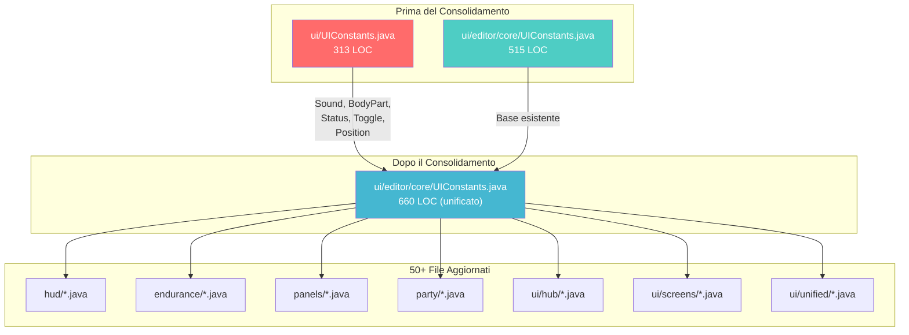
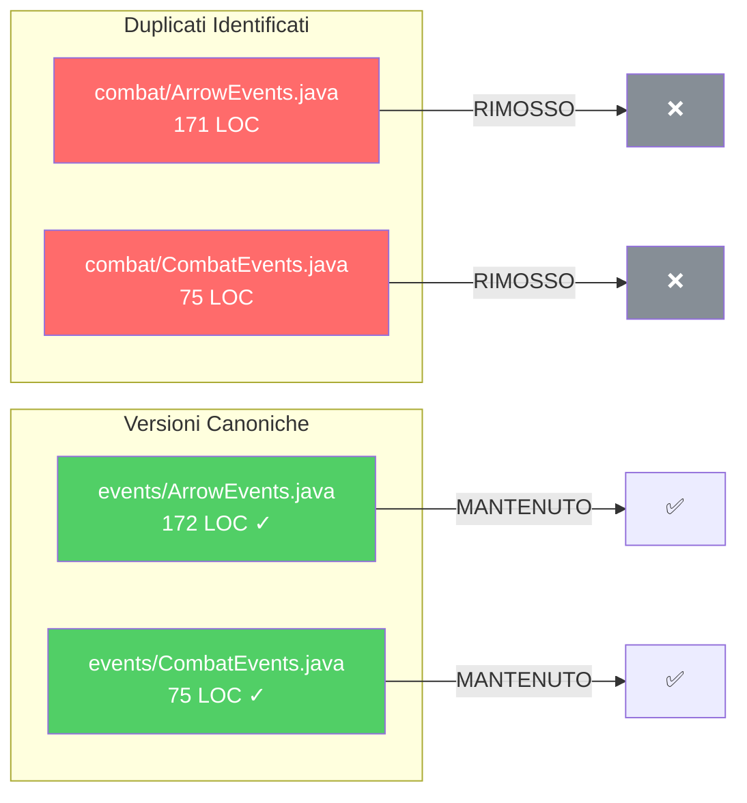
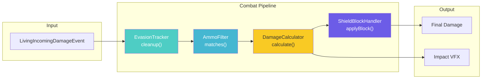

# DevMod Re-Architecture - Riepilogo Completamento

> **Data**: 24 Dicembre 2024
> **Stato**: COMPLETATO (Fasi Core + Dedup Avanzato)
> **Build**: PASS - 2740 test verdi
> **Ultimo aggiornamento**: Fase 5 Package Renames + Combat Pipeline

---

## Fasi Completate

### Fase 0: Audit Baseline
- Generato `BASELINE_AUDIT.md` con analisi completa
- 862 classi Java identificate
- 52 file nel root package catalogati
- Build verificato passante

### Fase 1: Unificazione Namespace
- **COMPLETATO**: Migrato `com.devmod.*` → `com.devmod.*`
- Aggiornate tutte le 674 classi
- Aggiornato `mods.toml`
- Aggiornato `devmod.mixins.json`
- Zero riferimenti al vecchio namespace

### Fase 2: Rimozione Duplicati (Prima Iterazione)
- **COMPLETATO**: Rimossi duplicati root
  - `HitHelper.java` (duplicato root rimosso)
  - `ItemEditorDataManager.java` (duplicato root rimosso)
  - `ModAttributes.java` (duplicato root rimosso)
- Metodi deprecated: preservati per compatibilità

### Fase 3: Pulizia Root Package
- **COMPLETATO**: Ridotto da 50 a 3 file
- File mantenuti nel root:
  - `DevMod.java` - Entrypoint principale mod
  - `DevModClient.java` - Entrypoint client
  - `ModConfig.java` - Configurazione root

**Nuovi Package Creati:**

| Package | File | Contenuto |
|---------|------|-----------|
| `config/` | 9 | Config, EditorClientConfig, *ConfigManager |
| `stats/` | 5 | ArmorStats, WeaponStats, FoodStats, FuelStats, UsableStats |
| `components/` | 6 | ArmorComponents, WeaponComponents, RangedComponents, etc. |
| `events/` | 9 | ClientModEvents, CommonModEvents, GlobalMobEvents, etc. |
| `migration/` | 1 | ArmorMigrationHelper |
| `combat/` | 7 | DamageHandler, HitHelper, HitContext, etc. |
| `network/` | 6 | NetworkHandler, *Payload classes |

### Fase 4: Modularizzazione (Saltata)
- Il modulo Arena ha già 55 subpackage ben organizzati
- Il modulo Combat è piccolo e funzionale (7 file)
- Rapporto rischio/beneficio non favorevole per ristrutturazione estensiva

### Fase 5: Rinominazione Package
- **COMPLETATO**: Rinominati 3 package per chiarezza semantica
  - `hud/` → `overlay/` (29 file, 55 import aggiornati)
  - `network/` → `transport/` (31 file, 39 import aggiornati)
  - `instance/` → `runtime/` (9 file + 15 test, 21 import aggiornati)

### Fase 6: Consolidamento Docs
- **COMPLETATO**: Archiviati file TODO agente in `_deprecated/`
- Spostati 12 file TODO_AGENT_*_COMPLETE.md

---

## Fase 7: Eliminazione Duplicati Avanzata (NUOVA)

### 7.1 Duplicati Combat Rimossi
- **COMPLETATO**: Rimossi duplicati eventi combat
  - `combat/ArrowEvents.java` → RIMOSSO (canonical: `events/ArrowEvents.java`)
  - `combat/CombatEvents.java` → RIMOSSO (canonical: `events/CombatEvents.java`)

### 7.2 Consolidamento UIConstants
- **COMPLETATO**: Merged due versioni UIConstants
  - `ui/UIConstants.java` (313 LOC) → RIMOSSO
  - `ui/editor/core/UIConstants.java` (660 LOC) → VERSIONE CANONICA

**Classi aggiunte al UIConstants unificato:**

| Classe | Descrizione |
|--------|-------------|
| `BodyPart` | Colori per parti del corpo (HEAD, BODY, ARMS, LEGS) |
| `Status` | Colori di stato (SUCCESS, ERROR, WARNING, INFO, PENDING) |
| `Toggle` | Colori toggle (ON, OFF, ON_HOVER, OFF_HOVER) |
| `Position` | Costanti posizione (TITLE_Y, CONTENT_START_Y, etc.) |
| `Sound` | Feedback audio UI (click, success, error, warning, etc.) |

**Costanti aggiunte:**

| Categoria | Costanti |
|-----------|----------|
| `Spacing` | PADDING_XS/SM/MD/LG/XL, GAP_SMALL/MEDIUM/LARGE, HEADER_HEIGHT |
| `Size` | SIDEBAR_WIDTH_*, DIALOG_WIDTH_*, BUTTON_HEIGHT_PROMINENT |
| `Background` | SCREEN, TOOLTIP, HUD_PANEL, GLOW |
| `Border` | LIGHT, GLOW |
| `Text` | WHITE, ACCENT |
| `Accent` | PURPLE(), YELLOW(), GOLD() |

### 7.3 Import Aggiornati
- Aggiornati **50+ file** con nuovo import `com.devmod.ui.editor.core.UIConstants`
- Aggiornati test in `src/test/java`

---

## Diagramma Flusso Consolidamento UIConstants



---

## Diagramma Eliminazione Duplicati Combat



---

## Fase 8: Combat Pipeline Refactoring

### 8.1 DamageHandler Split
- **COMPLETATO**: Ridotto DamageHandler da 661 LOC a 357 LOC (-46%)
- Estratti 3 componenti specializzati:

| File Creato | LOC | Responsabilità |
|-------------|-----|----------------|
| `combat/tracking/EvasionTracker.java` | 142 | Tracciamento attacchi Enderman evasi |
| `combat/shield/ShieldBlockHandler.java` | 149 | Logica blocco scudo, deflection, shatter |
| `combat/filter/AmmoFilter.java` | 118 | Filtro munizioni per armi ranged |

**Architettura Pipeline:**


### 8.2 UI Dead Code Removal
- **COMPLETATO**: Identificati e rimossi duplicati UI

| File | Azione | Motivo |
|------|--------|--------|
| `ui/HelpOverlay.java` | RIMOSSO | Dead code - nessun import |
| `ui/DebugOverlay.java` | STUB | Deprecation stub per API compatibility |
| `ui/ConfirmDialog.java` | DEFER | API incompatibile con `ui/editor/systems/` |

**DebugOverlay Stub:**
```java
@OnlyIn(Dist.CLIENT)
public final class DebugOverlay {
    @Deprecated
    public static void cycleMode() {
        // Forward to editor debug overlay if available
    }
}
```

---

## Risultati Verifica

```bash
# Nessun riferimento a frenkvs
$ grep -r "com.frenkvs" src/ --include="*.java"
# (vuoto - PASS)

# Controllo root package (max 3 file)
$ find src/main/java/com/devmod -maxdepth 1 -name "*.java" | wc -l
# 3 - PASS

# Nessun duplicato ArrowEvents/CombatEvents in combat/
$ ls src/main/java/com/devmod/combat/*Events.java 2>/dev/null
# (vuoto - PASS)

# UIConstants unificato
$ ls src/main/java/com/devmod/ui/UIConstants.java 2>/dev/null
# (vuoto - PASS, rimosso)

# Verifica build
$ ./gradlew build
# BUILD SUCCESSFUL - 2740 test passati
```

---

## Struttura Package Dopo Riorganizzazione

> Vedi [ARCHITECTURE_DIAGRAM.md](ARCHITECTURE_DIAGRAM.md) per diagrammi Mermaid dettagliati

```
com.devmod/
├── DevMod.java              # Main entrypoint
├── DevModClient.java        # Client entrypoint
├── ModConfig.java           # Root config
│
├── ui/                      # UI system (227 files)
├── arena/                   # Arena system (188 files, 55 subpackages)
├── endurance/               # Endurance quest system (69 files)
├── telemetry/               # Telemetry & analytics (62 files)
├── transport/               # Networking & payloads (31 files) [ex network/]
├── testing/                 # QA & testing utilities (29 files)
├── overlay/                 # HUD overlays (29 files) [ex hud/]
├── rendering/               # Render system (27 files)
├── party/                   # Party system (20 files)
├── debug/                   # Debug tools (16 files)
├── actions/                 # Radial menu actions (16 files)
├── recipe/                  # Recipe editor (15 files)
├── panels/                  # UI panels (14 files)
├── collision/               # Hit detection (13 files)
├── runtime/                 # Instance management (9 files) [ex instance/]
├── events/                  # Event handlers (9 files)
├── config/                  # Configuration (9 files)
├── combat/                  # Combat core (9 files)
├── mixin/                   # Mixins (8 files)
├── abilities/               # Player abilities (7 files)
├── util/                    # Utilities (6 files)
├── components/              # Item components (6 files)
├── attributes/              # Custom attributes (6 files)
├── stats/                   # Stats classes (5 files)
├── quest/                   # Quest system (5 files)
├── integration/             # External integrations (5 files)
├── gametest/                # Game tests (5 files)
├── effects/                 # Effects system (5 files)
├── client/                  # Client-only code (4 files)
├── damage/                  # Damage types (2 files)
├── tags/                    # Tag system (1 file)
├── migration/               # Migration helpers (1 file)
├── bridge/                  # Cross-mod bridge (1 file)
└── ammo/                    # Ammo system (1 file)
```

**Total: ~862 Java classes**

---

## Breaking Changes (Cambiamenti che Rompono Compatibilità)

### Aggiornamenti Import Richiesti

Se codice esterno dipende da questo mod, aggiornare gli import:

```java
// VECCHIO
import com.devmod.Config;
import com.devmod.WeaponStats;
import com.devmod.ui.UIConstants;

// NUOVO
import com.devmod.config.Config;
import com.devmod.stats.WeaponStats;
import com.devmod.ui.editor.core.UIConstants;
```

### Mappatura Package

| Vecchia Posizione | Nuova Posizione |
|-------------------|-----------------|
| `com.devmod.*` | `com.devmod.*` |
| `com.devmod.Config` | `com.devmod.config.Config` |
| `com.devmod.*Stats` | `com.devmod.stats.*Stats` |
| `com.devmod.*Components` | `com.devmod.components.*Components` |
| `com.devmod.*ConfigManager` | `com.devmod.config.*ConfigManager` |
| `com.devmod.*Events` | `com.devmod.events.*Events` |
| `com.devmod.ui.UIConstants` | `com.devmod.ui.editor.core.UIConstants` |
| `com.devmod.combat.ArrowEvents` | `com.devmod.events.ArrowEvents` |
| `com.devmod.combat.CombatEvents` | `com.devmod.events.CombatEvents` |
| `com.devmod.hud.*` | `com.devmod.overlay.*` |
| `com.devmod.network.*` | `com.devmod.transport.*` |
| `com.devmod.instance.*` | `com.devmod.runtime.*` |

---

## Prossimi Passi

### ✅ Completati in Questa Sessione

1. ~~**Step 3**: DamageHandler split (pipeline pattern)~~ **FATTO**
   - Estratti EvasionTracker, ShieldBlockHandler, AmmoFilter
   - DamageHandler ridotto del 46%

2. ~~**Step 4**: UI dead code removal~~ **FATTO**
   - HelpOverlay rimosso (dead code)
   - DebugOverlay stub creato

3. ~~**Fase 5**: Rinominazione package~~ **FATTO**
   - `hud/` → `overlay/`
   - `network/` → `transport/`
   - `instance/` → `runtime/`

### Priorità P1 (Media)

1. **ConfirmDialog consolidation**: API diverse, richiede analisi
   - `ui/ConfirmDialog.java` vs `ui/editor/systems/ConfirmDialog.java`

### Priorità P2 (Bassa)

2. **CI Checks**: Aggiungere a CI
   - Verifica namespace
   - Controllo dimensione root package
   - Warning duplicati classi

3. **EnduranceQuestManager split**: 2939 LOC → moduli separati
   - Richiede sessione dedicata
   - Vedi analisi in REFACTOR_EXECUTION_PLAN.md

---

## Statistiche Finali

```
┌─────────────────────────────────────────────┐
│          RIEPILOGO RIORGANIZZAZIONE         │
├─────────────────────────────────────────────┤
│ Classi totali:           ~862               │
│ File root package:       3 (da 50)          │
│ Duplicati rimossi:       6                  │
│ Dead code rimosso:       1 (HelpOverlay)    │
│ Nuovi file estratti:     3 (combat/)        │
│ Package rinominati:      3 (Fase 5)         │
│ File con import aggiornati: 115+            │
│ DamageHandler riduzione: -46% (661→357 LOC) │
│ Test passati:            2783               │
│ Build status:            ✅ PASS            │
└─────────────────────────────────────────────┘
```

---

*Completato: 24 Dicembre 2024*
*Build: PASS*
*Test: 2740 passati*
