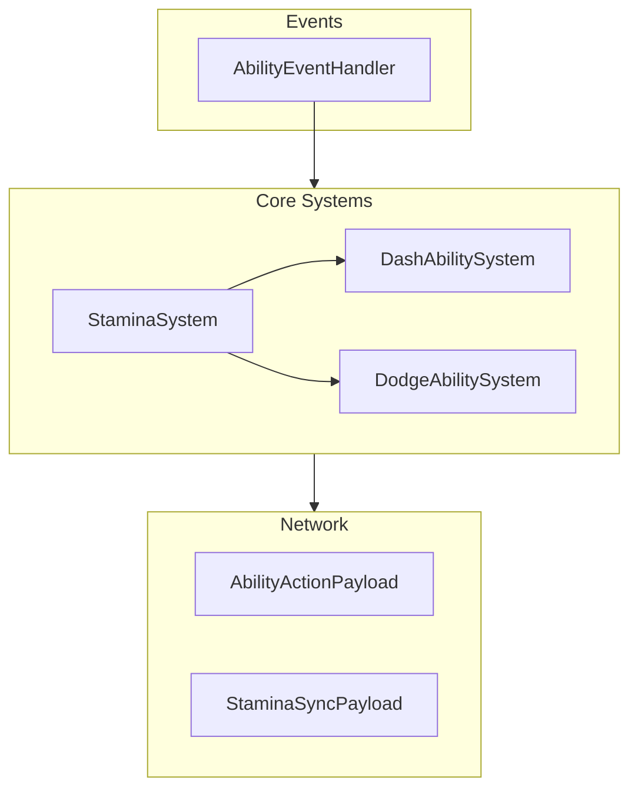
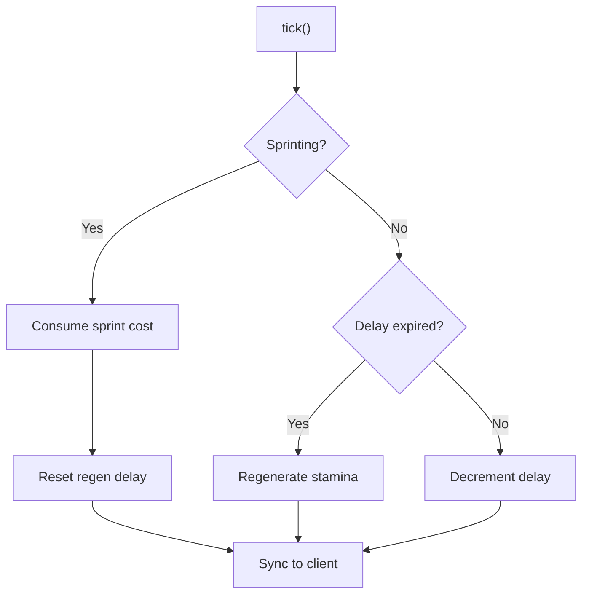

# Abilities Package

> Ultimo aggiornamento: 2025-12-30

Sistema abilità con stamina, dash e dodge con i-frames.

---

## Panoramica



---

## Struttura Package

```
com.devmod.abilities/
├── StaminaSystem.java          # Gestione stamina
├── DashAbilitySystem.java      # Abilità dash
├── DodgeAbilitySystem.java     # Abilità dodge con i-frames
├── AbilityEventHandler.java    # Event handler
├── AbilityActionPayload.java   # Payload azioni
└── StaminaSyncPayload.java     # Sync stamina client
```

---

## StaminaSystem

Singleton per gestione stamina player.

### Costanti Default

| Costante | Valore | Descrizione |
|----------|--------|-------------|
| DEFAULT_MAX_STAMINA | 100.0f | Stamina massima |
| DEFAULT_REGEN_RATE | 10.0f/s | Rigenerazione |
| DEFAULT_REGEN_DELAY | 1.0f s | Delay pre-regen |
| SPRINT_COST_PER_SECOND | 5.0f | Costo sprint |
| JUMP_COST | 5.0f | Costo salto |

### StaminaCosts

```java
class StaminaCosts {
    static final float DASH = 25.0f;
    static final float DODGE = 20.0f;
    static final float DOUBLE_JUMP = 15.0f;
    static final float SPRINT_PER_SECOND = 5.0f;
    static final float JUMP = 5.0f;
    static final float HEAVY_ATTACK = 30.0f;
    static final float BLOCK = 10.0f;
    static final float PARRY = 15.0f;
}
```

### StaminaData

```java
class StaminaData {
    float currentStamina;
    float maxStamina;
    float regenRate;
    float regenDelay;
    int regenDelayTicks;

    // Moltiplicatori perk
    float maxStaminaMultiplier = 1.0f;
    float regenRateMultiplier = 1.0f;
    float consumptionMultiplier = 1.0f;
}
```

### Metodi

```java
// Query
float getStamina(UUID playerId)
float getMaxStamina(UUID playerId)
float getStaminaPercent(UUID playerId)  // 0.0-1.0
boolean isExhausted(UUID playerId)      // stamina <= 0

// Consumo
boolean hasStamina(UUID playerId, float amount)
boolean consumeStamina(UUID playerId, float amount)
void forceConsumeStamina(UUID playerId, float amount)  // Permette negativo (cap -20)

// Ripristino
void restoreStamina(UUID playerId, float amount)
void fillStamina(UUID playerId)

// Modificatori perk
void setMaxStaminaMultiplier(UUID, float)
void setRegenRateMultiplier(UUID, float)
void setConsumptionMultiplier(UUID, float)
void resetModifiers(UUID)

// Lifecycle
void tick(ServerPlayer player)  // Sprint, regen, sync
void onPlayerJump(UUID playerId)
void syncToClient(ServerPlayer player)
void cleanupPlayer(UUID playerId)
```

### Flusso Tick



---

## DashAbilitySystem

Singleton per abilità dash.

### Costanti Default

| Costante | Valore |
|----------|--------|
| DEFAULT_DASH_DISTANCE | 5.0 blocks |
| DEFAULT_DASH_DURATION_TICKS | 5 (0.25s) |
| DEFAULT_COOLDOWN_TICKS | 40 (2s) |
| DEFAULT_STAMINA_COST | 25.0f |

### DashData

```java
class DashData {
    int cooldownTicks, maxCooldownTicks;
    float dashSpeed, staminaCost;
    boolean isDashing;
    int dashDurationTicks, maxDashDurationTicks;
    long lastDashTime;
    int dashCount;
}
```

### Metodi

```java
// Query
boolean canDash(UUID playerId)
int getCooldownTicks(UUID)
float getCooldownPercent(UUID)  // 0.0-1.0
boolean isDashAvailable(UUID)
boolean isDashing(UUID)
int getDashCount(UUID)

// Esecuzione
boolean tryDash(ServerPlayer player)
// 1. Check cooldown + stamina
// 2. Consume stamina
// 3. Apply velocity
// 4. Play sound
// 5. Start cooldown
// 6. Log telemetry

// Modificatori perk
void setCooldownMultiplier(UUID, float)
void setDashSpeedMultiplier(UUID, float)
void setStaminaCostMultiplier(UUID, float)
void resetModifiers(UUID)

// Lifecycle
void tick(ServerPlayer player)
void cleanupPlayer(UUID)
```

### Effetto Dash

```java
void performDash(ServerPlayer player, DashData data) {
    Vec3 lookVec = player.getLookAngle();
    Vec3 velocity = lookVec.scale(data.dashSpeed);

    // Mantieni Y se non guarda su/giù
    if (Math.abs(lookVec.y) < 0.5) {
        velocity = new Vec3(velocity.x, 0, velocity.z);
    }

    player.setDeltaMovement(velocity);
    player.playSound(SoundEvents.PLAYER_ATTACK_SWEEP);
}
```

---

## DodgeAbilitySystem

Singleton per dodge con invincibility frames.

### Costanti Default

| Costante | Valore |
|----------|--------|
| DEFAULT_DODGE_SPEED | 0.8f |
| DEFAULT_COOLDOWN_TICKS | 30 (1.5s) |
| DEFAULT_STAMINA_COST | 20.0f |
| DEFAULT_IFRAMES_TICKS | 8 (0.4s) |
| DEFAULT_DODGE_DURATION_TICKS | 6 |
| PERFECT_DODGE_WINDOW_TICKS | 5 |

### DodgeDirection Enum

```java
enum DodgeDirection {
    LEFT, RIGHT, BACK, FORWARD
}
```

### DodgeData

```java
class DodgeData {
    int cooldownTicks, maxCooldownTicks;
    float dodgeSpeed, staminaCost;
    int iframesTicks, maxIframesTicks;
    boolean isDodging;
    int dodgeDurationTicks, maxDodgeDurationTicks;
    int perfectDodgeWindowTicks;
    long lastDodgeTime;
    DodgeDirection lastDodgeDirection;
    int dodgeCount, perfectDodgeCount;
}
```

### Metodi

```java
// Query
boolean canDodge(UUID playerId)
int getCooldownTicks(UUID)
float getCooldownPercent(UUID)
boolean isDodgeAvailable(UUID)
boolean hasIFrames(UUID)  // Invincibilità attiva
boolean isDodging(UUID)
int getDodgeCount(UUID)
int getPerfectDodgeCount(UUID)

// Esecuzione
boolean tryDodge(ServerPlayer player, DodgeDirection direction)

// Perfect dodge
void onDamageDuringDodge(UUID playerId)
// Se danno durante perfect dodge window → +1 perfect dodge

// Modificatori perk
void setCooldownMultiplier(UUID, float)
void setIFramesMultiplier(UUID, float)
void setStaminaCostMultiplier(UUID, float)
void resetModifiers(UUID)

// Lifecycle
void tick(ServerPlayer player)
void cleanupPlayer(UUID)
```

### Calcolo Direzione

```java
void performDodge(ServerPlayer player, DodgeDirection dir, DodgeData data) {
    float yaw = player.getYRot();
    Vec3 movement = switch(dir) {
        case LEFT -> Vec3.directionFromRotation(0, yaw - 90);
        case RIGHT -> Vec3.directionFromRotation(0, yaw + 90);
        case BACK -> Vec3.directionFromRotation(0, yaw + 180);
        case FORWARD -> Vec3.directionFromRotation(0, yaw);
    };

    player.setDeltaMovement(movement.scale(data.dodgeSpeed));
    data.iframesTicks = data.maxIframesTicks;
    data.perfectDodgeWindowTicks = PERFECT_DODGE_WINDOW_TICKS;
}
```

---

## AbilityEventHandler

Event handler per orchestrazione sistemi.

### Eventi Gestiti

```java
@SubscribeEvent
void onServerTick(ServerTickEvent event) {
    // Per ogni player online (non creative/spectator)
    StaminaSystem.INSTANCE.tick(player);
    DashAbilitySystem.INSTANCE.tick(player);
    DodgeAbilitySystem.INSTANCE.tick(player);
}

@SubscribeEvent(priority = EventPriority.HIGH)
void onPlayerDamage(LivingDamageEvent event) {
    // Se player ha i-frames → cancella danno
    if (DodgeAbilitySystem.INSTANCE.hasIFrames(playerId)) {
        DodgeAbilitySystem.INSTANCE.onDamageDuringDodge(playerId);
        event.setCanceled(true);
    }
}

@SubscribeEvent
void onPlayerLogout(PlayerLoggedOutEvent event) {
    // Cleanup + export telemetry
    StaminaSystem.INSTANCE.cleanupPlayer(playerId);
    DashAbilitySystem.INSTANCE.cleanupPlayer(playerId);
    DodgeAbilitySystem.INSTANCE.cleanupPlayer(playerId);
    AbilityTelemetryService.exportAndClear(playerId);
}

@SubscribeEvent
void onPlayerLogin(PlayerLoggedInEvent event) {
    // Init stamina piena
    StaminaSystem.INSTANCE.fillStamina(playerId);
}
```

---

## Network Payloads

### AbilityActionPayload

Client → Server per trigger abilità.

```java
record AbilityActionPayload(
    AbilityType ability,  // DASH, DODGE
    int direction         // Per dodge direction
) {
    // Factory
    static AbilityActionPayload dash()
    static AbilityActionPayload dodge(DodgeDirection dir)

    // Query
    DodgeDirection getDodgeDirection()
}
```

### StaminaSyncPayload

Server → Client per HUD.

```java
record StaminaSyncPayload(
    float currentStamina,
    float maxStamina
)
```

---

## Integrazione Combo

```java
// In DashAbilitySystem.tryDash()
ComboSystem.INSTANCE.onStyleAction(player, "dash");

// In DodgeAbilitySystem.tryDodge()
ComboSystem.INSTANCE.onStyleAction(player, "dodge");

// In DodgeAbilitySystem.onDamageDuringDodge()
if (isPerfectDodge) {
    ComboSystem.INSTANCE.onStyleAction(player, "perfect_dodge");
}
```

---

## Dipendenze

- Minecraft Server/Player API
- NeoForge Event Bus
- `com.devmod.network.NetworkHandler` - Packet sync
- `com.devmod.endurance.ComboSystem` - Style points
- `com.devmod.telemetry.player.AbilityTelemetryService` - Analytics
- SLF4J - Logging
