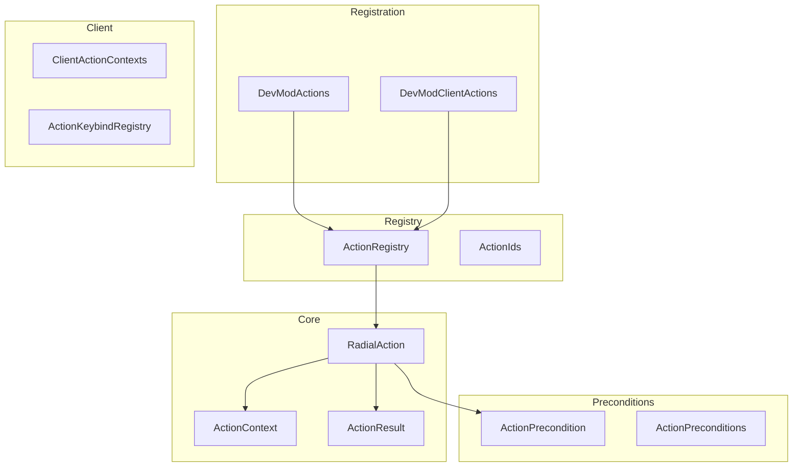

# Actions System

> Ultimo aggiornamento: 2025-12-30

Sistema azioni per radial menu, keybind e comandi.

---

## Panoramica



---

## Struttura Package

```
com.devmod.actions/
├── RadialAction.java              # Definizione azione
├── ActionContext.java             # Contesto esecuzione
├── ActionResult.java              # Risultato invocazione
├── ActionType.java                # Tipi azione
├── ActionOrigin.java              # Origine azione
├── ActionCategory.java            # Categorie menu
├── ActionPrecondition.java        # Interface precondizioni
├── ActionPreconditions.java       # Factory precondizioni
├── ActionRegistry.java            # Registry centrale
├── ActionIds.java                 # Costanti ID (~300)
├── ActionCommandInvoker.java      # Adapter comandi
├── DevModActions.java             # Registrazione server
└── client/
    ├── DevModClientActions.java   # Registrazione client
    ├── ClientActionContexts.java  # Factory context client
    ├── ActionKeybindRegistry.java # Mapping keybind
    └── OnboardingActionPayload.java
```

---

## RadialAction

Definizione completa di un'azione.

### Campi

| Campo | Tipo | Descrizione |
|-------|------|-------------|
| `id` | String | ID univoco |
| `labelKey` | String | Chiave i18n label |
| `descriptionKey` | String | Chiave i18n descrizione |
| `category` | ActionCategory | Categoria menu |
| `actionType` | ActionType | Tipo per telemetry |
| `menuPath` | String | Path gerarchico menu |
| `iconItem` | Item | Item per icona |
| `visibilityPredicate` | Predicate | Controllo visibilità |
| `precondition` | ActionPrecondition | Precondizione esecuzione |
| `handler` | Consumer<ActionContext> | Handler esecuzione |
| `requiresConfirm` | boolean | Richiede conferma |
| `toggle` | boolean | È toggle? |
| `activePredicate` | Predicate | Stato toggle attivo |
| `permissionLevel` | int | Livello permesso (-1=nessuno) |
| `uiFeedback` | UIFeedback | Tipo feedback |

### UIFeedback Enum

- `NONE` - Nessun feedback
- `TOAST` - Toast notification
- `DIALOG` - Dialog/popup
- `CHAT` - Feedback chat

### Builder

```java
RadialAction action = RadialAction.builder("my_action")
    .labelKey("action.devmod.my_action")
    .descriptionKey("action.devmod.my_action.desc")
    .category(ActionCategory.TOOLS)
    .actionType(ActionType.RUN_SERVER_COMMAND)
    .icon(Items.DIAMOND)
    .precondition(ActionPreconditions.requiresPlayer())
    .handler(ctx -> {
        // Esegui azione
    })
    .permissionLevel(2)
    .uiFeedback(UIFeedback.TOAST)
    .build();
```

---

## ActionContext

Contesto per esecuzione azione.

### Campi

| Campo | Tipo | Descrizione |
|-------|------|-------------|
| `player` | Player | Player (nullable) |
| `serverPlayer` | ServerPlayer | Server player (nullable) |
| `source` | CommandSourceStack | Source comando (nullable) |
| `commandInvoker` | Function | Funzione esecuzione comando |
| `commandPrompt` | Consumer | Apertura prompt comando |
| `payload` | Object | Payload custom (nullable) |
| `origin` | ActionOrigin | Origine azione |
| `clientSide` | boolean | Esecuzione client? |
| `confirmed` | boolean | Utente ha confermato? |
| `screenOpen` | boolean | Schermo aperto? |
| `shiftDown` | boolean | Shift premuto? |
| `ctrlDown` | boolean | Ctrl premuto? |
| `altDown` | boolean | Alt premuto? |

### Metodi

```java
// Accessors
Player getPlayer()
ServerPlayer getServerPlayer()
CommandSourceStack getSource()
Level getLevel()

// Payload
<T> T getPayload(Class<T> type)

// Feedback
void sendSuccess(String message)
void sendFailure(String message)

// Comandi
void executeCommand(String command)
void openCommandPrompt(String prefill)

// Modifiers
ActionContext withConfirmed()
ActionContext withPayload(Object payload)
```

### Factory Methods

```java
// Da comando
ActionContext.fromCommand(CommandContext<CommandSourceStack> ctx)
ActionContext.fromCommand(CommandSourceStack source)

// Client (vedi ClientActionContexts)
ClientActionContexts.forRadial()
ClientActionContexts.forKeybind()
```

---

## ActionResult

Risultato strutturato di invocazione.

### Status Enum

- `OK` - Esecuzione riuscita
- `BLOCKED` - Bloccata da precondizione/permesso
- `FAILED` - Fallita durante esecuzione

### Error Codes

| Codice | Descrizione |
|--------|-------------|
| `ERROR_UNKNOWN_ACTION` | Azione non trovata |
| `ERROR_PRECONDITION_FAILED` | Precondizione fallita |
| `ERROR_PERMISSION_DENIED` | Permesso negato |
| `ERROR_REQUIRES_CONFIRM` | Richiede conferma |
| `ERROR_EXCEPTION` | Eccezione durante esecuzione |
| `ERROR_RPC_FAILED` | RPC fallito |
| `ERROR_DESKTOP_UNSUPPORTED` | Desktop non supportato |
| `ERROR_URL_UNKNOWN` | URL sconosciuto |

### Factory Methods

```java
ActionResult.ok(long durationMs)
ActionResult.ok(long durationMs, String message)
ActionResult.blocked(String errorCode, String message)
ActionResult.failed(String errorCode, String message, long durationMs)
```

---

## ActionPreconditions

Factory per precondizioni comuni.

```java
// Sempre passa
ActionPreconditions.always()

// Controlli side
ActionPreconditions.clientOnly()
ActionPreconditions.serverOnly()

// Controlli player
ActionPreconditions.requiresPlayer()
ActionPreconditions.requiresServerPlayer()

// Controlli payload
ActionPreconditions.requiresPayload(Class<?> type, String errorKey)

// Controlli UI
ActionPreconditions.screenClosed()

// Controlli permessi
ActionPreconditions.requiresPermission(int level)
ActionPreconditions.requiresPermissionOrClient(int level)

// Custom
ActionPreconditions.withMessage(Predicate<ActionContext> test, String errorKey)
```

### Composizione

```java
ActionPrecondition combined = ActionPreconditions.requiresPlayer()
    .and(ActionPreconditions.screenClosed())
    .and(ctx -> customCheck(ctx));
```

---

## ActionRegistry

Registry singleton per tutte le azioni.

### Metodi

```java
// Registrazione
void register(RadialAction action)

// Query
List<RadialAction> listActions()
RadialAction getAction(String id)
List<RadialAction> search(String query)
List<RadialAction> actionsForContext(ActionContext ctx)

// Invocazione
boolean invoke(String actionId, ActionContext ctx)
ActionResult invokeWithResult(String actionId, ActionContext ctx)
```

### Telemetry Events

| Evento | Descrizione |
|--------|-------------|
| `radial_action_invoked` | Azione eseguita |
| `radial_action_blocked` | Bloccata da precondizione |
| `radial_action_failed` | Eccezione durante esecuzione |

---

## ActionIds

~300 costanti per ID azioni.

### Categorie

```java
// UI/Screens
OPEN_SETTINGS, OPEN_RADIAL_MENU, OPEN_TESTING_HUB, OPEN_ITEM_EDITOR,
OPEN_MOB_CONFIG, OPEN_TELEMETRY_DASHBOARD, OPEN_ENDURANCE_SCREEN, ...

// Debug Toggles
TOGGLE_DEBUG_OVERLAY, TOGGLE_PATHFINDING_DEBUG, TOGGLE_LOS_DEBUG,
TOGGLE_HEATMAP_DEATH, TOGGLE_HEATMAP_MOVEMENT, ...

// Config Toggles
TOGGLE_BODY_PART_DETECTION, TOGGLE_TELEMETRY, TOGGLE_IMPACT_HUD,
TOGGLE_SCREEN_SHAKE, TOGGLE_PROJECTILE_TRAILS, ...

// Endurance
ENDURANCE_START, ENDURANCE_CONTINUE, ENDURANCE_EXIT, ...

// Abilities
ABILITY_DASH, ABILITY_DODGE

// Commands
COMMAND_GAMEMODE_CREATIVE, COMMAND_HEAL, COMMAND_TIME_DAY, ...

// Arena
ARENA_CREATE, ARENA_TEMPLATE_LIST, ARENA_AUTOSMOKE, ...

// Telemetry
TELEMETRY_RELOAD, TELEMETRY_EXPORT_HEATMAPS, ...
```

---

## DevModActions

Registrazione azioni server-side.

```java
public static void registerCommon() {
    registerCommandActions();   // gamemode, heal, time, weather
    registerServerActions();    // arena, debug, telemetry, etc.
}
```

## DevModClientActions

Registrazione azioni client-side.

```java
public static void register() {
    registerUiActions();        // Screen openers
    registerDebugActions();     // Debug toggles
    registerConfigActions();    // Config toggles
    registerTelemetryActions(); // Telemetry controls
    registerQuestActions();     // Quest management
    registerEnduranceActions(); // Wave management
    registerAbilityActions();   // Dash, dodge
    registerKeybindHints();     // Keybind registry
}
```

---

## Client Context Factory

```java
// Per radial menu
ActionContext ctx = ClientActionContexts.forRadial();

// Per keybind
ActionContext ctx = ClientActionContexts.forKeybind();

// Custom
ActionContext ctx = ClientActionContexts.forClient(ActionOrigin.UI, payload);
```

### Context Setup

- `clientSide = true`
- Cattura modifier keys (Shift, Ctrl, Alt)
- Rileva schermo aperto
- Fornisce command invoker via player connection

---

## Dipendenze

- `com.devmod.util.I18n` - Traduzioni
- `com.devmod.telemetry` - Logging azioni
- Minecraft KeyMapping - Keybind
