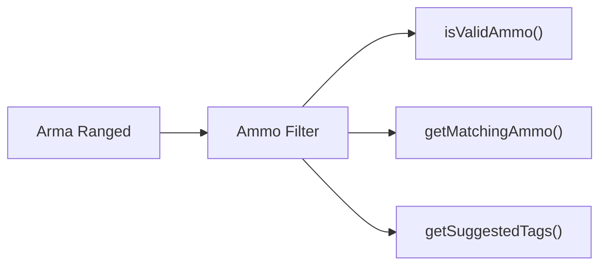
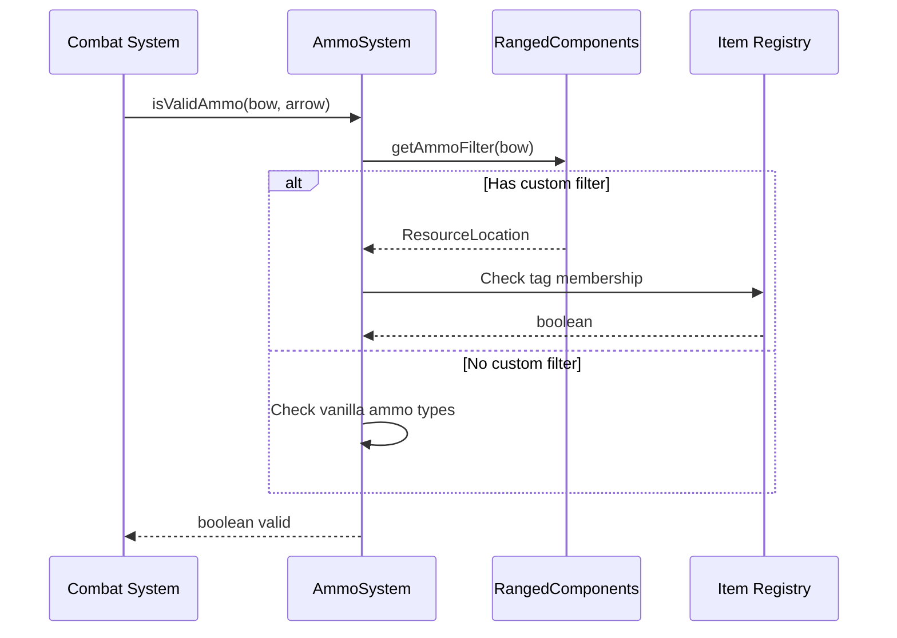

# Ammo System

> Ultimo aggiornamento: 2025-12-30

Sistema gestione munizioni per armi ranged.

---

## Panoramica

Package minimale per validazione e filtering munizioni per bow e crossbow.

---

## Struttura Package

```
com.devmod.ammo/
└── AmmoSystem.java    # Utility gestione munizioni
```

---

## AmmoSystem

Classe utility finale per gestione munizioni ranged.

### Funzionalità Principali



---

## Metodi

### Validazione

```java
// Valida se munizione è compatibile con arma
boolean isValidAmmo(ItemStack weapon, ItemStack ammo)
// Checks:
// 1. Custom ammo filter se presente
// 2. Fallback a comportamento vanilla
// Supporta bow e crossbow
```

### Gestione Filtri

```java
// Recupera filtro custom
ResourceLocation getAmmoFilter(ItemStack weapon)
// Ritorna null se nessun filtro

// Imposta filtro custom
void setAmmoFilter(ItemStack weapon, ResourceLocation tagId)
// tagId: es. "minecraft:arrows"

// Rimuove filtro
void clearAmmoFilter(ItemStack weapon)
```

### Query Munizioni

```java
// Tutte le munizioni compatibili
List<ItemStack> getMatchingAmmo(ItemStack weapon)
// Usa filtro custom o vanilla default

// Da tag specifico
List<ItemStack> getItemsFromTag(ResourceLocation tagId)
List<ItemStack> getItemsFromTagString(String tagString)
// Accetta "#minecraft:arrows" o "minecraft:arrows"

// Munizioni vanilla default
List<ItemStack> getVanillaAmmo(ItemStack weapon)
// Bow: Arrow, Spectral Arrow, Tipped Arrow
// Crossbow: + Firework Rocket
```

### Utility UI

```java
// Nomi per display
List<String> getMatchingAmmoNames(ItemStack weapon, int maxItems)
// Limitato per performance UI

// Conteggio
int countMatchingAmmo(ItemStack weapon)

// Check filtro esistente
boolean hasCustomAmmoFilter(ItemStack weapon)

// Validazione tag
boolean isValidTagString(String tagString)
// Verifica esistenza e contenuto tag
```

### Suggerimenti Autocomplete

```java
List<AmmoSuggestion> getSuggestedTags()
// Ritorna tag comuni:
// - #minecraft:arrows
// - #minecraft:spectral_arrows
// - #minecraft:tipped_arrows
// - #minecraft:fireworks
// - #minecraft:tridents
```

---

## AmmoSuggestion Record

```java
record AmmoSuggestion(
    String value,        // "#minecraft:arrows"
    String displayName   // "Arrows"
) {
    boolean isTag()                    // value starts with #
    ResourceLocation toResourceLocation()
}
```

---

## Integrazione con RangedComponents

```java
// Il filtro è salvato nel componente AMMO_TAG_FILTER
DataComponentType<ResourceLocation> AMMO_TAG_FILTER =
    RangedComponents.AMMO_TAG_FILTER.get();

// Lettura
ResourceLocation filter = weapon.get(AMMO_TAG_FILTER);

// Scrittura
weapon.set(AMMO_TAG_FILTER, tagId);
```

---

## Flusso Validazione



---

## Esempi Utilizzo

### Impostare Filtro Custom

```java
ItemStack bow = player.getMainHandItem();

// Solo frecce spettrali
AmmoSystem.setAmmoFilter(bow,
    ResourceLocation.withDefaultNamespace("spectral_arrows"));

// Rimuovi filtro
AmmoSystem.clearAmmoFilter(bow);
```

### Verificare Compatibilità

```java
ItemStack bow = player.getMainHandItem();
ItemStack arrow = getArrowFromInventory(player);

if (AmmoSystem.isValidAmmo(bow, arrow)) {
    // Può sparare
} else {
    // Munizione non compatibile
    player.sendSystemMessage(
        I18n.translate("error.ammo.incompatible")
    );
}
```

### Mostrare Munizioni Compatibili

```java
ItemStack crossbow = player.getMainHandItem();

List<String> ammoNames = AmmoSystem.getMatchingAmmoNames(crossbow, 5);
// ["Arrow", "Spectral Arrow", "Tipped Arrow", "Firework Rocket"]

// Per tooltip
for (String name : ammoNames) {
    tooltip.add(Component.literal("  • " + name));
}
```

---

## Dipendenze

- `com.devmod.components.RangedComponents` - Storage filtro
- Minecraft BuiltInRegistries - Item registry
- Minecraft TagKey - Tag system
