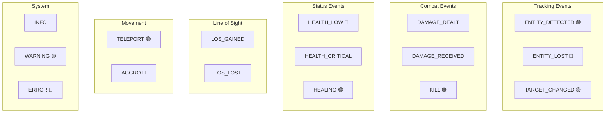

# Attributes System

> Ultimo aggiornamento: 2025-12-30

Attributi combat custom e logging eventi per debug/HUD.

---

## Panoramica

Il package attributes fornisce:
1. **ModAttributes** - Attributi combat custom registrati via NeoForge
2. **AttributeLogEntry** - Sistema logging per eventi combat/tracking

---

## Struttura Package

```
com.devmod.attributes/
├── ModAttributes.java       # Registry attributi custom
└── AttributeLogEntry.java   # Log entry per eventi
```

---

## ModAttributes

Registry centrale per attributi combat usando DeferredRegister.

### Attributi Combat

| Attributo | Range | Default | Descrizione |
|-----------|-------|---------|-------------|
| `CRIT_CHANCE` | 0-100 | 0 | Probabilità colpo critico (%) |
| `CRIT_MULTIPLIER` | 1.0-5.0 | 1.5 | Moltiplicatore danno critico |
| `ARMOR_SHRED` | 0-66 | 0 | Riduzione armatura nemica |
| `LIFE_STEAL` | 0-100 | 0 | % danno convertito in heal |
| `DAMAGE_BONUS` | 0-100 | 0 | Aumento danno generico (%) |

### Attributi Tipo Danno

| Attributo | Range | Default | Descrizione |
|-----------|-------|---------|-------------|
| `DAMAGE_VS_UNDEAD` | 0-200 | 0 | Danno extra vs undead (%) |
| `DAMAGE_VS_ARTHROPODS` | 0-200 | 0 | Danno extra vs arthropod (%) |
| `DAMAGE_VS_PLAYERS` | 0-200 | 0 | Danno extra vs player (%) |
| `TRUE_DAMAGE_PERCENT` | 0-100 | 0 | % danno che bypassa armatura |

### Registrazione

```java
public static final DeferredRegister<Attribute> ATTRIBUTES =
    DeferredRegister.create(Registries.ATTRIBUTE, DevMod.MODID);

public static final Supplier<Attribute> CRIT_CHANCE = ATTRIBUTES.register(
    "crit_chance",
    () -> new RangedAttribute(
        "attribute.devmod.crit_chance",
        0.0,   // default
        0.0,   // min
        100.0  // max
    ).setSyncable(true)
);
```

### Utilizzo

```java
// Lettura attributo
double critChance = entity.getAttributeValue(ModAttributes.CRIT_CHANCE.get());

// Modifica temporanea
AttributeInstance instance = entity.getAttribute(ModAttributes.CRIT_CHANCE.get());
instance.addTransientModifier(new AttributeModifier(
    ResourceLocation.fromNamespaceAndPath("devmod", "perk_bonus"),
    0.15,  // +15%
    AttributeModifier.Operation.ADD_VALUE
));
```

---

## AttributeLogEntry

Record per logging eventi con timestamp e posizione.

### Struttura

```java
public record AttributeLogEntry(
    Type type,
    String message,
    @Nullable Vec3 position,
    long timestamp
) { }
```

### Tipi Evento



### Type Enum

| Tipo | Colore | Prefisso |
|------|--------|----------|
| ENTITY_DETECTED | Verde | [DETECT] |
| ENTITY_LOST | Rosso | [LOST] |
| TARGET_CHANGED | Giallo | [TARGET] |
| DAMAGE_DEALT | Rosso chiaro | [DMG] |
| DAMAGE_RECEIVED | Rosso scuro | [HIT] |
| KILL | Arancione | [KILL] |
| HEALTH_LOW | Rosso | [HP LOW] |
| HEALTH_CRITICAL | Rosso scuro | [HP CRIT] |
| HEALING | Verde | [HEAL] |
| LOS_GAINED | Verde chiaro | [LOS+] |
| LOS_LOST | Grigio | [LOS-] |
| TELEPORT | Magenta | [TP] |
| AGGRO | Rosso | [AGGRO] |
| INFO | Grigio | [INFO] |
| WARNING | Giallo | [WARN] |
| ERROR | Rosso | [ERROR] |

### Metodi

```java
// Messaggio formattato con prefisso colorato
Component getFormattedMessage()

// Età entry in millisecondi
long getAge()

// Età formattata (es. "5s", "1m 30s")
String getFormattedAge()

// Alpha per fade-out (0.0 - 1.0)
float getAlpha(long maxAge)
```

### Utilizzo per Debug HUD

```java
// Crea entry
AttributeLogEntry entry = new AttributeLogEntry(
    AttributeLogEntry.Type.DAMAGE_DEALT,
    "Dealt 15.5 damage to Zombie",
    target.position(),
    System.currentTimeMillis()
);

// Render con fade
float alpha = entry.getAlpha(5000); // 5 sec max age
if (alpha > 0) {
    renderWithAlpha(entry.getFormattedMessage(), alpha);
}
```

---

## Integrazione

### Con Combat System

```java
// In DamageCalculator
float critChance = (float) attacker.getAttributeValue(ModAttributes.CRIT_CHANCE.get());
if (random.nextFloat() < critChance / 100f) {
    float critMult = (float) attacker.getAttributeValue(ModAttributes.CRIT_MULTIPLIER.get());
    damage *= critMult;
}
```

### Con Perk System

```java
// Perk che aumenta crit chance
public void applyPerk(ServerPlayer player) {
    AttributeInstance crit = player.getAttribute(ModAttributes.CRIT_CHANCE.get());
    crit.addTransientModifier(new AttributeModifier(
        PERK_CRIT_ID, 10.0, Operation.ADD_VALUE
    ));
}
```

---

## Dipendenze

- NeoForge DeferredRegister
- Minecraft Attribute system
- `com.devmod.combat` - Utilizzo in calcolo danno
- `com.devmod.endurance` - Perk system
