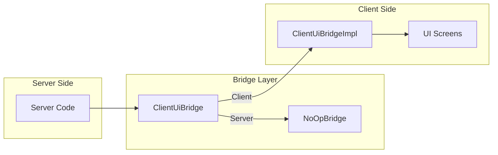

# Bridge Package

> Ultimo aggiornamento: 2025-12-30

Bridge pattern per comunicazione server-client UI.

---

## Panoramica



---

## Struttura Package

```
com.devmod.bridge/
└── ClientUiBridge.java    # Interface + holder + no-op
```

---

## ClientUiBridge

Interface per operazioni UI dal server code.

### Pattern

- **Singleton Holder** - Lazy initialization
- **No-op Default** - Safe per ambiente server
- **Bridge Pattern** - Astrae implementazione client

### NotificationType Enum

| Tipo | Uso |
|------|-----|
| INFO | Informazioni generali |
| SUCCESS | Operazione completata |
| WARNING | Avvertimento |
| ERROR | Errore |

---

## Metodi Interface

### Gestione Bridge

```java
// Singleton access
static ClientUiBridge get()

// Registrazione (chiamato lato client)
static void register(ClientUiBridge bridge)
```

### Operazioni Screen

```java
// Apertura screen
void openSettings()
void openRadialMenu()
void openTestingHub()
void openItemEditor()
void openMobConfig()
void openTelemetryDashboard()
void openWelcomeScreen()
void openArenaQuickTestWizard()
void openEnduranceQuestScreen(String templateId)
void openPartyScreen()

// Stato screen
boolean isScreenOpen()
void closeScreen()
```

### Operazioni HUD

```java
void toggleQuickHelp()
void toggleDebugOverlay()
```

### Notifiche

```java
void showNotification(String message, NotificationType type)
```

---

## Implementazioni

### NoOpBridge (Default)

Implementazione vuota per ambiente server.

```java
class NoOpBridge implements ClientUiBridge {
    // Tutti i metodi sono no-op
    // showNotification() logga invece di mostrare

    @Override
    void openSettings() { /* no-op */ }

    @Override
    void showNotification(String msg, NotificationType type) {
        LOGGER.debug("Notification ({}): {}", type, msg);
    }

    @Override
    boolean isScreenOpen() { return false; }
}
```

### ClientUiBridgeImpl (Client)

Implementazione reale registrata lato client.

```java
// In client initialization
ClientUiBridge.register(new ClientUiBridgeImpl());
```

---

## Utilizzo

### Da Server Code

```java
// Apri settings (safe anche su dedicated server)
ClientUiBridge.get().openSettings();

// Mostra notifica
ClientUiBridge.get().showNotification(
    "Operation complete",
    NotificationType.SUCCESS
);

// Check screen
if (!ClientUiBridge.get().isScreenOpen()) {
    ClientUiBridge.get().openRadialMenu();
}
```

### Registrazione Client

```java
// In client mod initializer
@SubscribeEvent
public static void onClientSetup(FMLClientSetupEvent event) {
    ClientUiBridge.register(new ClientUiBridgeImpl());
}
```

---

## Vantaggi Pattern

| Aspetto | Beneficio |
|---------|-----------|
| **Type Safety** | Interface definisce contratto |
| **Server Safe** | NoOpBridge evita crash su server |
| **Decoupling** | Server code non dipende da client classes |
| **Testability** | Facile mock per unit test |
| **Lazy Loading** | Bridge caricato solo quando necessario |

---

## Dipendenze

- SLF4J - Logging
