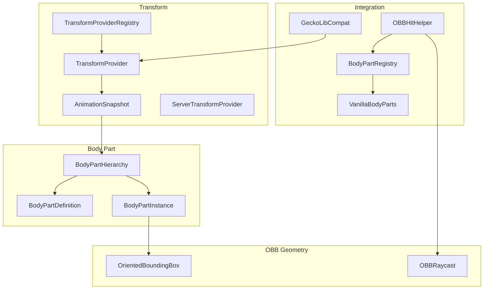
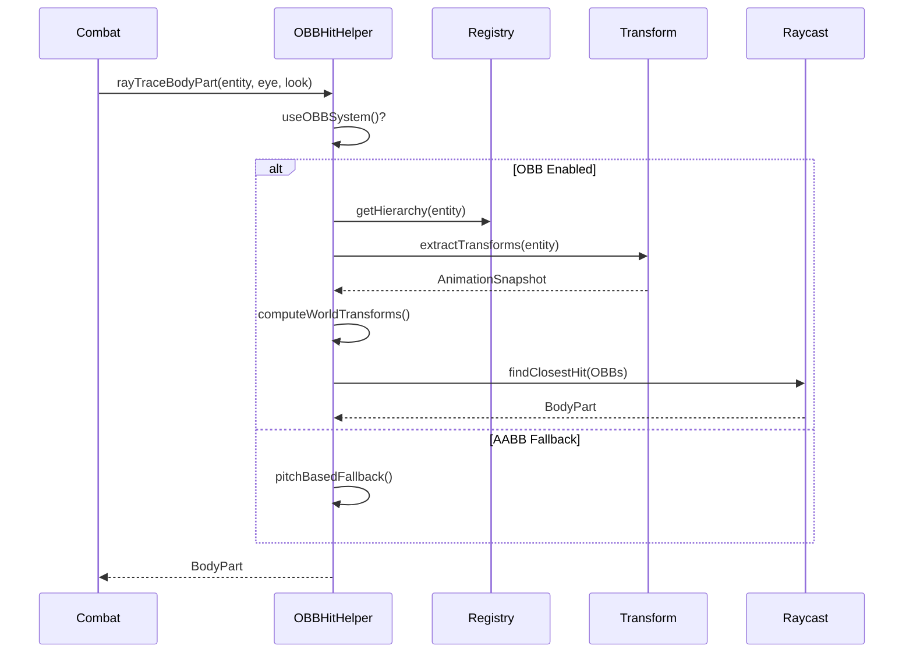

# Collision System

> Ultimo aggiornamento: 2025-12-30

Sistema hitbox OBB (Oriented Bounding Box) per body part detection.

---

## Panoramica



---

## Struttura Package

```
com.devmod.collision/
├── bodypart/
│   ├── BodyPartDefinition.java    # Definizione parte
│   ├── BodyPartInstance.java      # Istanza pooled
│   └── BodyPartHierarchy.java     # Gerarchia parti
├── transform/
│   ├── AnimationSnapshot.java     # Snapshot animazione
│   ├── TransformProvider.java     # Interface provider
│   ├── ServerTransformProvider.java   # Provider server
│   └── TransformProviderRegistry.java # Registry side-aware
├── obb/
│   ├── OrientedBoundingBox.java   # Geometria OBB
│   └── OBBRaycast.java            # Raycast OBB
├── integration/
│   └── OBBHitHelper.java          # API principale
├── registry/
│   ├── BodyPartRegistry.java      # Registry entity→hierarchy
│   └── VanillaBodyParts.java      # Definizioni vanilla
└── compat/
    └── GeckoLibCompat.java        # Compatibilità GeckoLib
```

---

## BodyPartDefinition

Record per definizione parte corpo.

### Campi

| Campo | Tipo | Descrizione |
|-------|------|-------------|
| `id` | String | ID univoco (es. "head") |
| `bodyPartType` | BodyPart | Mapping HitHelper.BodyPart |
| `localOffset` | Vec3 | Offset da bone parent |
| `halfExtents` | Vec3 | Dimensioni OBB / 2 |
| `parentBoneId` | String | Nome bone attachment |
| `parentPartId` | String | Parent per gerarchia |
| `renderColor` | int | Colore debug ARGB |
| `damageMultiplier` | float | Moltiplicatore danno |

### Factory Methods

```java
// Preset standard
BodyPartDefinition.head()
BodyPartDefinition.body()
BodyPartDefinition.leftArm()
BodyPartDefinition.rightArm()
BodyPartDefinition.leftLeg()
BodyPartDefinition.rightLeg()
```

### Builder

```java
BodyPartDefinition part = BodyPartDefinition.builder("custom_part")
    .bodyPartType(BodyPart.BODY)
    .localOffset(0, 1, 0)
    .halfExtents(0.3, 0.4, 0.2)
    .parentBone("body")
    .damageMultiplier(1.2f)
    .renderColor(0xFFFF0000)
    .build();
```

---

## BodyPartInstance

Istanza pooled per performance.

### Object Pool

```java
static final int POOL_SIZE = 256;
static final Pool<BodyPartInstance> POOL;

// Acquisizione
BodyPartInstance instance = BodyPartInstance.acquire(definition);
BodyPartInstance[] instances = BodyPartInstance.acquireMultiple(definitions);

// Rilascio
instance.release();
```

### Metodi

```java
// Update
void update(Matrix4f modelPartTransform, long currentTick)
void updateSimple(Vec3 entityPos, float entityYRot, long tick)
void invalidate()

// Query
OrientedBoundingBox getWorldOBB()
OrientedBoundingBox getWorldOBBOrNull()
boolean isStale(long currentTick, int maxAge)
```

---

## BodyPartHierarchy

Gerarchia parti con ordine topologico.

### Costruzione

```java
BodyPartHierarchy hierarchy = BodyPartHierarchy.builder()
    .add(BodyPartDefinition.body())
    .add(BodyPartDefinition.head())
    .add(BodyPartDefinition.leftArm())
    .add(BodyPartDefinition.rightArm())
    .add(BodyPartDefinition.leftLeg())
    .add(BodyPartDefinition.rightLeg())
    .build();

// Oppure flat (no parent-child)
BodyPartHierarchy flat = BodyPartHierarchy.flat(definitions);
```

### Metodi

```java
// Query
BodyPartDefinition getPart(String partId)
Collection<BodyPartDefinition> getAllParts()
int getPartCount()
List<String> getChildren(String partId)
List<String> getRootPartIds()
boolean hasPart(String partId)

// Transform
Map<String, BodyPartInstance> computeWorldTransforms(AnimationSnapshot snapshot)
Map<String, BodyPartInstance> computeSimpleTransforms(Vec3 pos, float yRot, long tick)

// Debug
List<String> getTransformChain(String partId)
```

---

## AnimationSnapshot

Record immutabile per stato animazione.

### Campi

```java
int entityId
long tickCaptured
float partialTick
Vec3 entityPosition
float yBodyRot, yHeadRot, xHeadRot
Map<String, Matrix4f> partTransforms
boolean isValid
```

### TTL

```java
static final int SNAPSHOT_TTL_TICKS = 2;

boolean isStale(long currentTick)
```

### Factory

```java
// Builder
AnimationSnapshot.builder(entityId, tick, partialTick)
    .entityPosition(pos)
    .yBodyRot(rot)
    .addPartTransform("head", matrix)
    .build();

// Shorthand
AnimationSnapshot.simple(entityId, tick, partialTick, pos, yBodyRot)
AnimationSnapshot.fromEntity(entity, tick, partialTick)
AnimationSnapshot.fromEntityInterpolated(entity, tick, partialTick)
```

---

## TransformProvider

Interface per estrazione transform animazione.

```java
interface TransformProvider {
    AnimationSnapshot extractTransforms(
        LivingEntity entity,
        float partialTick,
        long currentTick
    );

    void clearCache(int entityId);
    void clearAllCaches();
    int getCacheSize();
}
```

### ServerTransformProvider

Singleton con cache e cleanup.

```java
// Singleton
ServerTransformProvider.INSTANCE

// Cache
static final int MAX_CACHE_SIZE = 256;
Map<Integer, AnimationSnapshot> cache;

// Stima bone transform
Matrix4f computeSimpleBoneTransforms(entity)
// Usa: attack animation, walk cycle
```

### TransformProviderRegistry

Registry side-aware con reflection per client.

```java
// Auto-detect side
TransformProvider getProvider()

// Esplicito
TransformProvider getServerProvider()
TransformProvider getClientProvider()

// Cache management
void clearAllCaches()
void clearCache(int entityId)
```

---

## OrientedBoundingBox

Geometria OBB con quaternion rotation.

### Campi

```java
Vec3 center          // Centro world-space
Vec3 halfExtents     // Dimensioni / 2
Quaternionf rotation // Orientamento
Vector3f[] axes      // Assi cached (lazy)
```

### Factory

```java
OrientedBoundingBox.fromAABB(AABB aabb)
OrientedBoundingBox.fromCenterAndSize(center, size)
OrientedBoundingBox.create(center, halfExtents, rotation)
```

### Trasformazioni

```java
OrientedBoundingBox transform(Matrix4f matrix)
OrientedBoundingBox translate(Vec3 offset)
OrientedBoundingBox rotate(Quaternionf rotation)
OrientedBoundingBox rotateAround(Vec3 point, Quaternionf rotation)
OrientedBoundingBox scale(float factor)
```

### Query

```java
boolean contains(Vec3 point)
Vec3 closestPoint(Vec3 point)
double distanceTo(Vec3 point)
double distanceToSq(Vec3 point)
```

### Conversioni Spazio

```java
Vec3 worldToLocal(Vec3 worldPoint)
Vec3 localToWorld(Vec3 localPoint)
Vec3 localDirectionToWorld(Vec3 localDir)
Vec3 worldDirectionToLocal(Vec3 worldDir)
```

### Rendering

```java
AABB toWorldAABB()
Vec3[] getCorners()     // 8 vertici
int[][] getEdgeIndices() // 12 edge pairs
```

---

## OBBRaycast

Raycast con slab method.

### OBBHitResult

```java
record OBBHitResult(
    boolean hit,
    Vec3 point,      // Punto impatto
    Vec3 normal,     // Normale superficie
    double distance, // Distanza da origin
    int faceIndex    // Faccia colpita (0-5)
)
```

### Metodi

```java
// Full raycast
OBBHitResult raycast(
    OrientedBoundingBox obb,
    Vec3 rayOrigin,
    Vec3 rayDirection,
    double maxDistance
)

// Fast AABB raycast
OBBHitResult raycastAABB(AABB aabb, Vec3 origin, Vec3 dir, double maxDist)

// Boolean test
boolean intersects(OBB obb, Vec3 origin, Vec3 dir, double maxDist)

// Multi-OBB
int findClosestHit(List<OBB> obbs, Vec3 origin, Vec3 dir, double maxDist)
IndexedHitResult findClosestHitWithResult(...)

// Broad phase
boolean broadPhaseIntersects(OBB obb, Vec3 origin, Vec3 dir, double maxDist)
```

---

## OBBHitHelper

API principale per body part detection.

### Flusso Raycast



### Metodi

```java
// Check config
boolean useOBBSystem()

// Main API con fallback
BodyPart rayTraceBodyPart(
    LivingEntity entity,
    Vec3 eyePosition,
    Vec3 lookVector,
    double reach
)

// OBB only
BodyPart rayTraceBodyPartOBB(entity, eye, look, reach)

// Simple (no bone transforms)
BodyPart rayTraceBodyPartSimple(entity, eye, look, reach)

// Fallback
BodyPart pitchBasedFallback(float pitch)

// Debug
List<BodyPartInstance> getBodyPartInstances(entity)
List<BodyPartInstance> getSimpleBodyPartInstances(entity)
boolean hasCustomBodyParts(entity)

// Reach
double getDynamicReach(entity)
```

---

## BodyPartRegistry

Singleton per mapping entity type → hierarchy.

### Inizializzazione

```java
// Durante mod setup
BodyPartRegistry.INSTANCE.initialize();
// Registra VanillaBodyParts
```

### Metodi

```java
// Registrazione
void register(EntityType<?> type, BodyPartHierarchy hierarchy)
void register(ResourceLocation key, BodyPartHierarchy hierarchy)
void register(String key, BodyPartHierarchy hierarchy)
void unregister(EntityType<?> type)

// Query
BodyPartHierarchy getHierarchy(Entity entity)
BodyPartHierarchy getHierarchyForType(EntityType<?> type)
boolean hasCustomParts(Entity entity)
Set<ResourceLocation> getRegisteredTypes()
int getRegisteredCount()

// Fallback adattivo
BodyPartHierarchy getAdaptiveHierarchy(Entity entity)
// Usa aspect ratio per determinare tipo:
// - Tall & thin → HUMANOID
// - Wide → QUADRUPED
// - Long → HORIZONTAL

// Default setters
void setDefaultHumanoid(BodyPartHierarchy)
void setDefaultQuadruped(BodyPartHierarchy)
void setDefaultHorizontal(BodyPartHierarchy)
void setDefaultTall(BodyPartHierarchy)

// Management
void clear()
void reload()
```

---

## VanillaBodyParts

Definizioni preset per entity vanilla.

### Preset Disponibili

| Preset | Entity | Parti |
|--------|--------|-------|
| HUMANOID | Player, Zombie, Skeleton | body, head, left_arm, right_arm, left_leg, right_leg |
| QUADRUPED | Cow, Pig, Horse | body, head, front_left, front_right, back_left, back_right |
| HORIZONTAL | Dragon, Phantom, Guardian | front, middle, back |
| TALL_HUMANOID | Enderman, Iron Golem | Elongated humanoid |
| ARTHROPOD | Spider | head, body, abdomen, 8 legs |
| CREEPER | Creeper | body, head, 4 legs |

### Factory Methods

```java
BodyPartHierarchy createHumanoid()
BodyPartHierarchy createQuadruped()
BodyPartHierarchy createHorizontal()
BodyPartHierarchy createTallHumanoid()
BodyPartHierarchy createArthropod()
BodyPartHierarchy createCreeper()

void registerAll(BodyPartRegistry registry)
```

---

## GeckoLibCompat

Compatibilità GeckoLib via reflection.

### Detection

```java
boolean isGeckoLibPresent()  // Cached
boolean isGeckoLibEntity(Entity entity)
```

### Estrazione Transform

```java
Map<String, Matrix4f> extractGeckoLibTransforms(LivingEntity entity)
```

### Bone Name Mapping

```java
// GeckoLib → Standard
STANDARD_BONE_MAPPINGS = {
    "head" → "head",
    "body" → "body",
    "leftArm" → "left_arm",
    "rightArm" → "right_arm",
    "leftLeg" → "left_leg",
    "rightLeg" → "right_leg"
}

String mapBoneName(String geckoLibName)
```

---

## Dipendenze

- JOML - Matrix4f, Quaternionf, Vector3f
- Minecraft - Vec3, AABB, LivingEntity, EntityType
- NeoForge - FMLEnvironment (side detection)
- `com.devmod.combat.HitHelper` - BodyPart enum
- `com.devmod.config.Config` - OBB enable flag
- SLF4J - Logging
