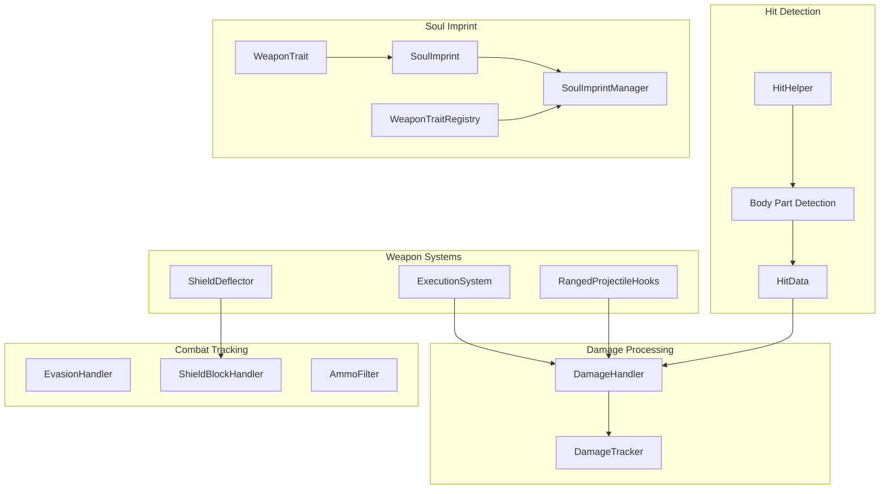
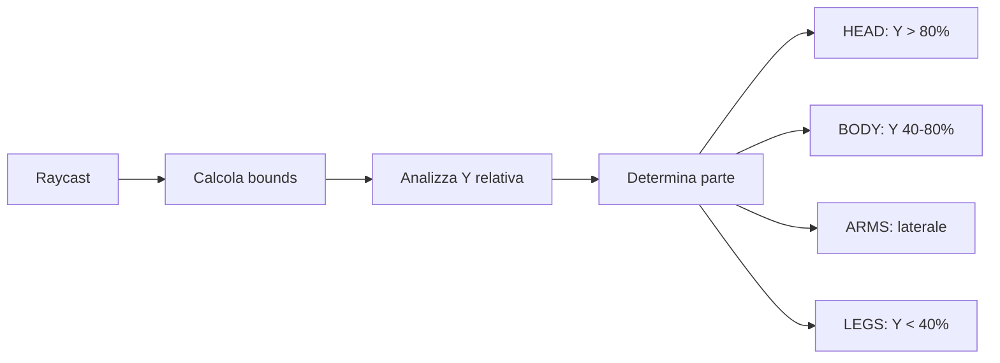
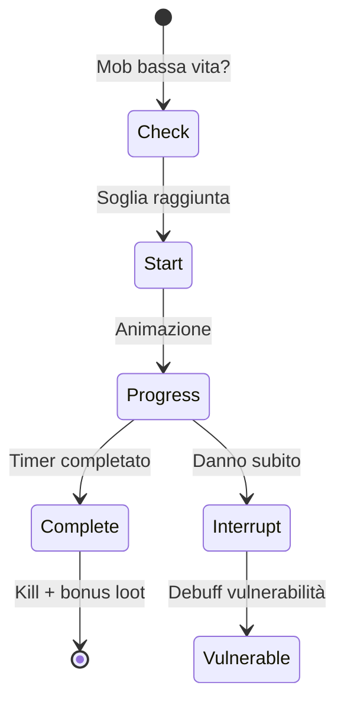
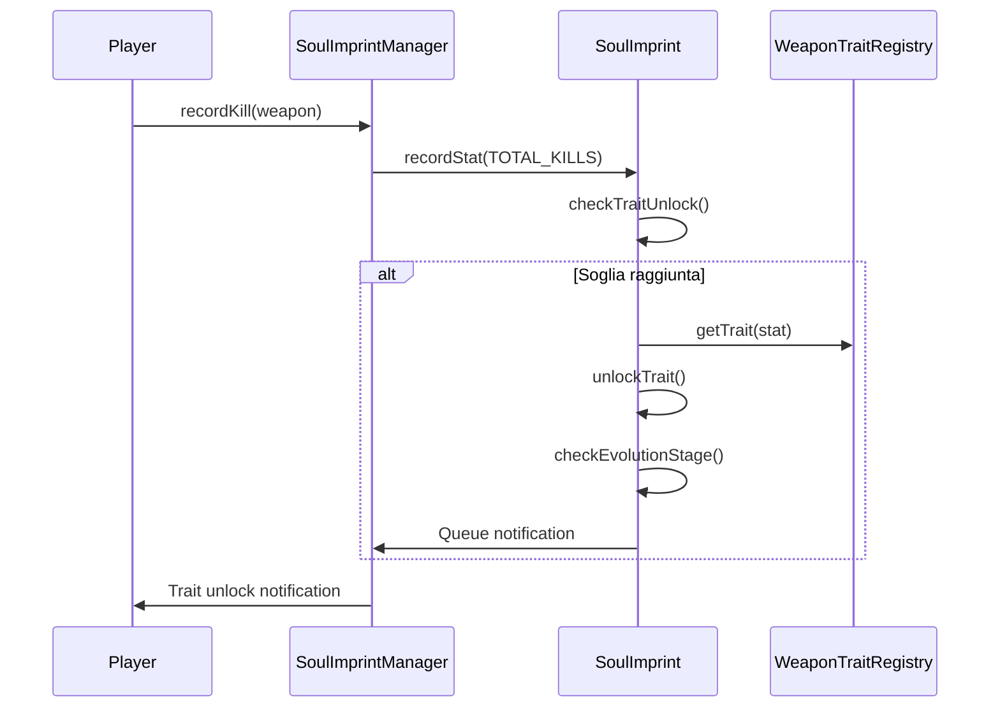
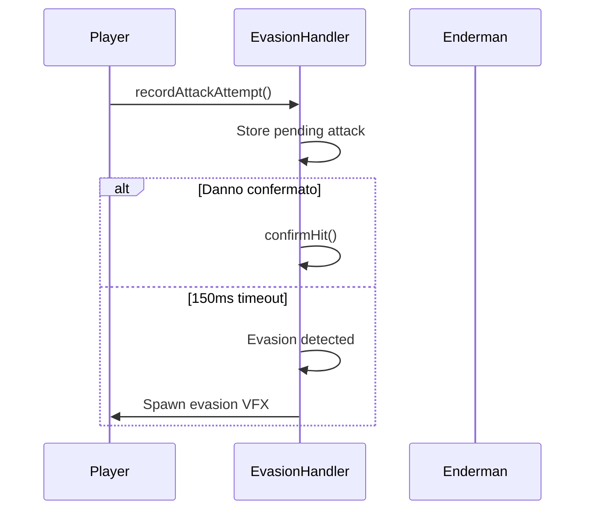

# Combat System

> Ultimo aggiornamento: 2025-12-30

Sistema di combattimento avanzato con body-part detection, weapon traits, shield mechanics e tracking.

---

## Panoramica



---

## Struttura Package

```
com.devmod.combat/
├── DamageHandler.java           # Handler principale eventi danno
├── DamageTracker.java           # Tracking danno post-applicazione
├── HitData.java                 # Context store per hit info
├── HitHelper.java               # Body part detection con cache
├── ExecutionSystem.java         # Sistema esecuzioni
├── ShieldDeflector.java         # Deflessione proiettili
├── RangedProjectileHooks.java   # Modifica proiettili
├── signature/
│   ├── WeaponTrait.java         # Definizione trait
│   ├── SoulImprint.java         # Progressione arma
│   ├── SoulImprintManager.java  # Manager imprint
│   └── WeaponTraitRegistry.java # Registry trait
├── tracking/
│   └── EvasionHandler.java      # Tracking evasioni
├── filter/
│   └── AmmoFilter.java          # Filtro munizioni
└── shield/
    └── ShieldBlockHandler.java  # Gestione blocco scudo
```

---

## Componenti Principali

### HitHelper - Body Part Detection

Sistema di rilevamento parti del corpo con 95% di accuratezza.



**Moltiplicatori Danno:**

| Parte | Moltiplicatore |
|-------|----------------|
| HEAD | 2.0x |
| BODY | 1.0x |
| ARMS | 0.85x |
| LEGS | 0.75x |

**Metodi Chiave:**
- `rayTraceBodyPartAABB()` - Detection principale con cache
- `rayTraceBodyPartWithHitPoint()` - Ritorna parte e posizione
- `getBodyPart()` - Detection semplificata per proiettili

### DamageHandler - Processamento Danno

Handler centrale per eventi danno melee e ranged.

**Responsabilità:**
- Identifica arma e parte del corpo colpita
- Applica filtri munizioni per armi ranged
- Integra con `DamageCalculator` per breakdown
- Gestisce blocco scudo pre-danno
- Applica effetti post-hit (lifesteal, status)
- Invia feedback via action bar

### ExecutionSystem - Sistema Esecuzioni

Meccanica di uccisione istantanea per mob a bassa vita.



**Configurazione:**
- Soglia HP: configurabile (default 10%)
- Cooldown per-istanza
- Bonus drop: +30%
- Integrazione combo system

---

## Soul Imprint System

Sistema di progressione armi basato su statistiche di combattimento.

### WeaponTrait

12 trait predefiniti con effetti unici:

| Trait | Stat Richiesta | Effetto |
|-------|----------------|---------|
| EXECUTIONER | HEADSHOTS | +15% danno headshot |
| TYRANT_SLAYER | BOSS_KILLS | +30% vs boss |
| STYLISH | SSS_WAVES | +20% style gain |
| BLOODTHIRSTY | TOTAL_KILLS | 0.5% lifesteal |
| HARMONIC | PERFECT_RESONANCES | +50% resonance |
| PRECISION | CRITICAL_HITS | +10% crit chance |
| RELENTLESS | HIGH_COMBOS | -20% combo decay |
| GUARDIAN | NO_HIT_WAVES | +5% damage reduction |
| DEVASTATING | TOTAL_DAMAGE | +5% all damage |
| FINISHER | EXECUTE_KILLS | Execute below 10% HP |
| CLEAVING | MULTI_KILLS | +3% damage |
| RETALIATING | PARRY_KILLS | +8% damage |

### SoulImprint

Traccia statistiche per arma:
- `ImprintStat`: TOTAL_KILLS, HEADSHOTS, BOSS_KILLS, SSS_WAVES, CRITICAL_HITS, etc.
- 5 stadi evoluzione (0-4)
- Nomi unici generati allo stadio 4
- Persistenza NBT via DataComponents

### Flusso Evoluzione



---

## Shield System

### ShieldDeflector

Meccanica di deflessione proiettili per scudi energetici.

**Calcoli:**
- Ray-sphere intersection per punto impatto
- Riflessione perfetta con spread opzionale
- "Return to sender" verso tiratore originale
- Formula rotazione Rodrigues per spread

### ShieldBlockHandler

Gestisce il blocco scudo standard.

**Risultati Blocco:**
- `BlockResult`: danno residuo, shatter, deflessione
- Calcolo forza blocco da armor stats
- Shatter su danno elevato
- Cooldown basato su recovery speed

---

## Tracking Systems

### EvasionHandler

Traccia tentativi di evasione (es. Enderman teleport).



### AmmoFilter

Valida frecce contro filtri munizioni dell'arma.

**Supporto:**
- Filtri per item ID
- Filtri per tag
- Fallback se nessun filtro specificato

---

## Integrazione

### Eventi Gestiti

| Evento | Handler |
|--------|---------|
| `LivingIncomingDamageEvent` | DamageHandler |
| `LivingDamageEvent.Post` | DamageTracker |
| `AttackEntityEvent` | EvasionHandler |
| `EntityJoinLevelEvent` | RangedProjectileHooks |

### Dipendenze

- `com.devmod.damage` - Calcolo danno
- `com.devmod.stats` - WeaponStats, ArmorStats
- `com.devmod.telemetry` - Logging eventi
- `com.devmod.endurance` - Combo system

---

## File Correlati

- [DamageCalculator](../damage/README.md) - Calcolo danno
- [WeaponStats](../stats/README.md) - Statistiche armi
- [OBBHitHelper](../collision/README.md) - Hit detection avanzato
