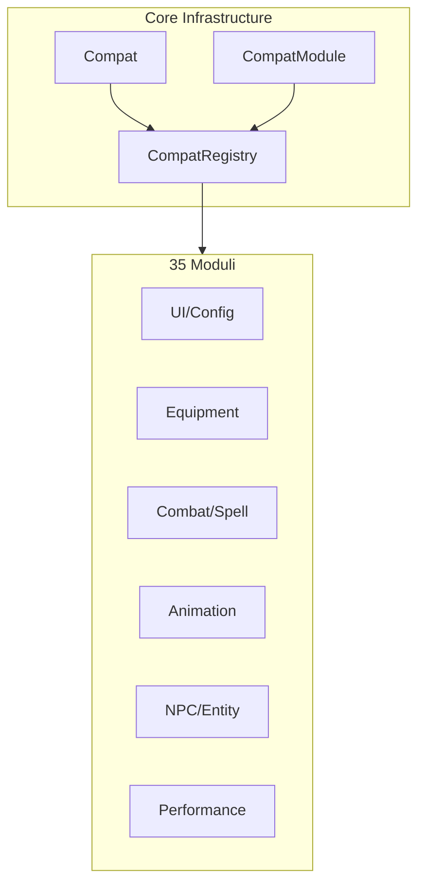

# Compatibility System

> Ultimo aggiornamento: 2025-12-30

Framework compatibilità per integrazione con 35+ mod di terze parti.

---

## Panoramica



---

## Struttura Package

```
com.devmod.compat/
├── Compat.java              # Utility detection mod
├── CompatModule.java        # Interface modulo
├── CompatRegistry.java      # Registry centrale
└── modules/
    ├── ClothConfigCompat.java
    ├── AccessoriesCompat.java
    ├── CuriosCompat.java
    ├── IronsSpellbooksCompat.java
    ├── SpellEngineCompat.java
    ├── GeckoLibModuleCompat.java
    ├── SparkCompat.java
    └── ... (35 moduli totali)
```

---

## Core Infrastructure

### Compat

Utility per detection e version check mod.

```java
// Check mod loaded (cached)
boolean loaded = Compat.isLoaded("irons_spellbooks");

// Check multiple
boolean allLoaded = Compat.areAllLoaded("curios", "accessories");
boolean anyLoaded = Compat.isAnyLoaded("curios", "accessories");

// Get version
String version = Compat.getVersion("geckolib");

// Safe execution
Compat.runIfLoaded("spark", () -> {
    // Code che richiede Spark
});

// Class loading safe
Class<?> clazz = Compat.loadClass("io.redspace.ironsspellbooks.api.magic.MagicData");
boolean exists = Compat.classExists("some.Class");
```

**Mod IDs Predefiniti:**
```java
class Mods {
    static final String CURIOS = "curios";
    static final String IRONS_SPELLBOOKS = "irons_spellbooks";
    static final String GECKOLIB = "geckolib";
    static final String SPARK = "spark";
    // ... 50+ costanti
}
```

### CompatModule Interface

```java
public interface CompatModule {
    String modId();
    String displayName();

    void initCommon();                    // Init server+client
    void initClient();                    // Init client only
    void registerActions(ActionRegistry); // Registra azioni
    void shutdown();                      // Cleanup

    int priority();                       // Ordine init (lower = earlier)
    boolean isActive();                   // Modulo funzionale?
    String getFeatureDescription();
    String getMinVersion();
    boolean isVersionCompatible();
}
```

### CompatRegistry

Registry centrale e lifecycle manager.

```java
// Registrazione
CompatRegistry.register(new IronsSpellbooksCompat());
CompatRegistry.registerAll(module1, module2, module3);

// Inizializzazione (in FMLCommonSetupEvent)
CompatRegistry.initCommon();

// Inizializzazione client (in FMLClientSetupEvent)
CompatRegistry.initClient();

// Query
CompatModule module = CompatRegistry.getModule("irons_spellbooks");
boolean active = CompatRegistry.isModuleActive("curios");
Set<String> activeMods = CompatRegistry.getActiveModIds();

// Debug
String report = CompatRegistry.getStatusReport();
```

---

## Moduli per Categoria

### Equipment/Accessories

| Modulo | Mod | Features |
|--------|-----|----------|
| AccessoriesCompat | accessories | Detect accessori (ring, necklace, cape, etc.) |
| CuriosCompat | curios | Curio slot detection |

```java
// Esempio Curios
List<ItemStack> rings = CuriosCompat.findCurios(player, "ring");
ItemStack necklace = CuriosCompat.findFirstCurio(player, "necklace");
```

### Combat/Spell Systems

| Modulo | Mod | Features |
|--------|-----|----------|
| IronsSpellbooksCompat | irons_spellbooks | Mana tracking, spell detection |
| SpellEngineCompat | spell_engine | Spell container |
| SpellPowerCompat | spell_power | Spell power per school |
| ApothicAttributesCompat | apothicattributes | Extended combat attributes |
| RelicsCompat | relics | Relic detection e leveling |
| ShieldApiCompat | shield_api | Custom shield properties |
| RangedWeaponApiCompat | ranged_weapon_api | Custom ranged stats |

```java
// Iron's Spellbooks
float mana = IronsSpellbooksCompat.getMana(player);
boolean casting = IronsSpellbooksCompat.isCasting(player);
String spell = IronsSpellbooksCompat.getCastingSpellName(player);

// Spell Power
float firePower = SpellPowerCompat.getSpellPower(player, "fire");
String strongest = SpellPowerCompat.getStrongestSchool(player);
```

### Animation/Model

| Modulo | Mod | Features |
|--------|-----|----------|
| GeckoLibModuleCompat | geckolib | Animation e bone transforms |
| AzureLibCompat | azurelib | AzureLib animations |
| PlayerAnimatorCompat | playeranimator | Custom player animations |
| EmotecraftCompat | emotecraft | Emote detection |

```java
// GeckoLib
if (GeckoLibModuleCompat.isGeckoLibEntity(entity)) {
    Map<String, Matrix4f> bones = GeckoLibModuleCompat.extractBoneTransforms(entity);
}
```

### NPC/Entity

| Modulo | Mod | Features |
|--------|-----|----------|
| EasyNpcCompat | easy_npc | NPC spawning per arena |
| DummmmmmyCompat | dummmmmmy | Training dummy con damage tracking |
| MowziesMobsCompat | mowziesmobs | Boss detection e abilities |
| SmartBrainLibCompat | smartbrainlib | AI behavior tracking |

```java
// Training Dummy
DummmmmmyCompat.spawnDummy(level, pos, "training_dummy");
float totalDmg = DummmmmmyCompat.getTotalDamage(dummy);
float dps = DummmmmmyCompat.getDps(dummy);
DummmmmmyCompat.resetDamage(dummy);
```

### UI/Maps

| Modulo | Mod | Features |
|--------|-----|----------|
| ClothConfigCompat | cloth_config | Config screen building |
| JourneyMapCompat | journeymap | Waypoint creation |
| EmiCompat | emi | Recipe lookup |

```java
// JourneyMap waypoints
JourneyMapCompat.createArenaWaypoint("Arena Boss", pos, color);
JourneyMapCompat.createSpawnWaypoint("Spawn Point", pos);
```

### Performance Monitoring

| Modulo | Mod | Features |
|--------|-----|----------|
| SparkCompat | spark | TPS e MSPT monitoring |
| C2MECompat | c2me | Chunk threading info |
| ModernFixCompat | modernfix | Memory optimizations |
| FerriteCoreCompat | ferritecore | BlockState optimization |
| LithiumCompat | lithium | Game logic optimization |
| SodiumCompat | sodium | Render optimization |
| EntityCullingCompat | entityculling | Entity occlusion |

```java
// Spark
double tps = SparkCompat.getTps10Seconds();
double mspt = SparkCompat.getMspt1Minute();
boolean healthy = SparkCompat.isTpsHealthy();
```

### Graphics

| Modulo | Mod | Features |
|--------|-----|----------|
| IrisCompat | iris | Shader pack detection |

```java
boolean shaders = IrisCompat.areShadersEnabled();
String pack = IrisCompat.getCurrentShaderPack();
```

---

## Pattern Architetturali

### Lazy Initialization

```java
private static boolean initialized = false;
private static Method getManaMethod;

public void initCommon() {
    if (initialized) return;
    try {
        Class<?> magicData = Class.forName("...");
        getManaMethod = magicData.getMethod("getMana");
        initialized = true;
    } catch (Exception e) {
        // Graceful degradation
    }
}
```

### Reflection-Safe

```java
public static float getMana(Player player) {
    if (!initialized) return 0f;
    try {
        Object magicData = getMagicData(player);
        return (float) getManaMethod.invoke(magicData);
    } catch (Exception e) {
        return 0f; // Safe default
    }
}
```

### Version Compatibility

```java
// Try multiple package paths
private static Class<?> findClass() {
    String[] paths = {
        "io.redspace.ironsspellbooks.api.magic.MagicData",  // Newer
        "io.redspace.ironsspells.api.magic.MagicData"       // Older
    };
    for (String path : paths) {
        try {
            return Class.forName(path);
        } catch (ClassNotFoundException ignored) {}
    }
    return null;
}
```

---

## Ordine Inizializzazione

| Priority | Moduli |
|----------|--------|
| 10 | ClothConfig |
| 18-19 | GeckoLib, AzureLib |
| 20-25 | Curios, Accessories, SpellPower, Irons, Emi |
| 30-35 | JourneyMap, SmartBrain, Relics, MowziesMobs |
| 40-45 | EasyNpc, Dummmmmmy, ModernFix, FerriteCore |
| 50 | Spark, Elixirum |

---

## Statistiche

| Metrica | Valore |
|---------|--------|
| Moduli totali | 35 |
| Classi core | 3 |
| Mod supportate | 35+ |
| Reflection paths | 100+ |
