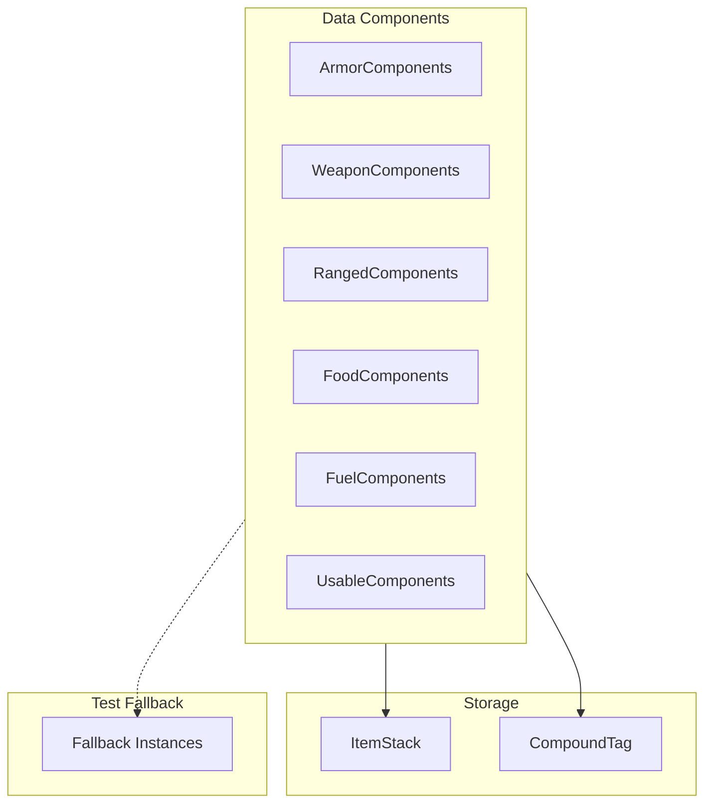

# Components System

> Ultimo aggiornamento: 2025-12-30

Registrazione DataComponentType per stats item usando NeoForge DeferredRegister.

---

## Panoramica



---

## Struttura Package

```
com.devmod.components/
├── ArmorComponents.java     # Stats armatura
├── WeaponComponents.java    # Stats arma melee
├── RangedComponents.java    # Stats arma ranged
├── FoodComponents.java      # Stats cibo
├── FuelComponents.java      # Stats combustibile
└── UsableComponents.java    # Stats item usabili
```

---

## Pattern Comune

Tutte le classi seguono lo stesso pattern:

```java
public final class XxxComponents {
    private XxxComponents() {} // Non instantiabile

    // DeferredRegister
    public static final DeferredRegister<DataComponentType<?>> COMPONENTS =
        DeferredRegister.create(Registries.DATA_COMPONENT_TYPE, DevMod.MODID);

    // Componente registrato
    public static final DeferredHolder<DataComponentType<?>, DataComponentType<CompoundTag>> XXX_STATS =
        COMPONENTS.register("xxx_stats", () ->
            DataComponentType.<CompoundTag>builder()
                .persistent(CompoundTag.CODEC)
                .networkSynchronized(ByteBufCodecs.COMPOUND_TAG)
                .build()
        );

    // Fallback per test
    private static volatile DataComponentType<CompoundTag> fallbackXxxStats;

    // Accessor con fallback
    public static DataComponentType<CompoundTag> xxxStatsComponent() {
        if (XXX_STATS.isBound()) {
            return XXX_STATS.get();
        }
        if (Boolean.getBoolean("devmod.allowFallbackComponents")) {
            return fallbackXxxStats();
        }
        return null; // o throw exception
    }

    // Check binding
    public static boolean isXxxStatsBound() {
        return XXX_STATS.isBound();
    }
}
```

---

## ArmorComponents

Componente per statistiche armatura.

```java
// Componente registrato
ARMOR_STATS  // CompoundTag con ArmorStats serializzato

// Metodi
armorStatsComponent()  // Ritorna componente o fallback
isArmorStatsBound()    // Check se registrato
```

**Legacy Migration:**
- Sostituisce tag NBT "ArmorModStats"

---

## WeaponComponents

Componente per statistiche arma melee.

```java
// Componente registrato
WEAPON_STATS  // CompoundTag con WeaponStats serializzato

// Metodi
weaponStatsComponent()
isWeaponStatsBound()
```

**Legacy Migration:**
- Sostituisce tag NBT "WeaponModStats"

---

## RangedComponents

Componenti specifici per armi ranged (bow, crossbow).

### Componenti Registrati

| Componente | Tipo | Descrizione |
|------------|------|-------------|
| `DRAW_TIME_TICKS` | Float | Durata caricamento |
| `PROJECTILE_SPEED` | Float | Velocità proiettile |
| `PROJECTILE_GRAVITY` | Float | Gravità proiettile |
| `PROJECTILE_SPREAD` | Float | Spread/precisione |
| `BASE_ARROW_DAMAGE` | Float | Danno base freccia |
| `MULTISHOT_COUNT` | Integer | Conteggio multishot |
| `PIERCING_LEVEL` | Integer | Livello piercing |
| `AMMO_TAG_FILTER` | ResourceLocation | Filtro munizioni tag |

### Metodi

```java
boolean isAnyBound()       // Qualsiasi componente bound
boolean isAmmoFilterBound() // Specifico per ammo filter
```

---

## FoodComponents

Componente per statistiche cibo.

```java
FOOD_STATS  // CompoundTag con FoodStats serializzato

// Ritorna null se non bound (no exception)
foodStatsComponent()
isFoodStatsBound()
```

---

## FuelComponents

Componente per statistiche combustibile.

```java
FUEL_STATS  // CompoundTag con FuelStats serializzato

fuelStatsComponent()
isFuelStatsBound()
```

---

## UsableComponents

Componente per item usabili.

```java
USABLE_STATS  // CompoundTag con UsableStats serializzato

usableStatsComponent()
isUsableStatsBound()
```

---

## Fallback System

Per ambienti test senza registry completo:

```java
// Abilita via system property
-Ddevmod.allowFallbackComponents=true

// Crea fallback sincronizzato
private static synchronized DataComponentType<CompoundTag> fallbackWeaponStats() {
    if (fallbackWeaponStats == null) {
        fallbackWeaponStats = DataComponentType.<CompoundTag>builder()
            .persistent(CompoundTag.CODEC)
            .networkSynchronized(ByteBufCodecs.COMPOUND_TAG)
            .build();
    }
    return fallbackWeaponStats;
}
```

---

## Utilizzo

### Lettura Stats

```java
ItemStack weapon = player.getMainHandItem();
DataComponentType<CompoundTag> component = WeaponComponents.weaponStatsComponent();

if (component != null && weapon.has(component)) {
    CompoundTag tag = weapon.get(component);
    WeaponStats stats = WeaponStats.load(tag);
    // usa stats...
}
```

### Scrittura Stats

```java
WeaponStats stats = new WeaponStats();
stats.attackDamage = 10.0f;
stats.critChance = 0.15f;

CompoundTag tag = new CompoundTag();
stats.save(tag);

DataComponentType<CompoundTag> component = WeaponComponents.weaponStatsComponent();
if (component != null) {
    weapon.set(component, tag);
}
```

### Check Esistenza

```java
if (WeaponComponents.isWeaponStatsBound()) {
    // Safe to use weapon components
}
```

---

## Registrazione

Nel mod initializer:

```java
public DevMod(IEventBus modEventBus) {
    ArmorComponents.COMPONENTS.register(modEventBus);
    WeaponComponents.COMPONENTS.register(modEventBus);
    RangedComponents.COMPONENTS.register(modEventBus);
    FoodComponents.COMPONENTS.register(modEventBus);
    FuelComponents.COMPONENTS.register(modEventBus);
    UsableComponents.COMPONENTS.register(modEventBus);
}
```

---

## Dipendenze

- NeoForge DeferredRegister
- Minecraft DataComponents API
- `com.devmod.stats` - Stats DTOs
