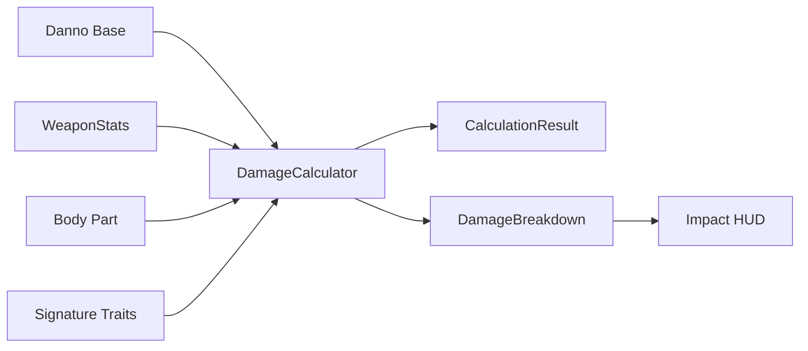
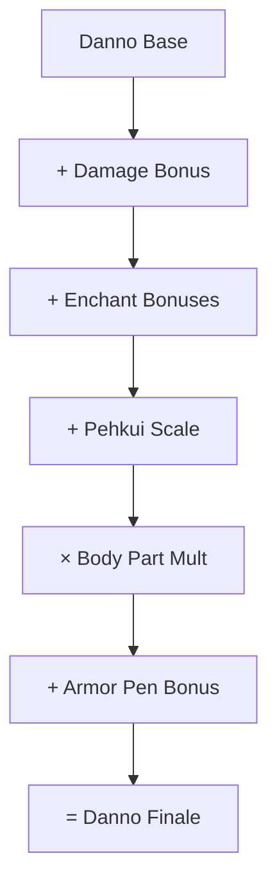
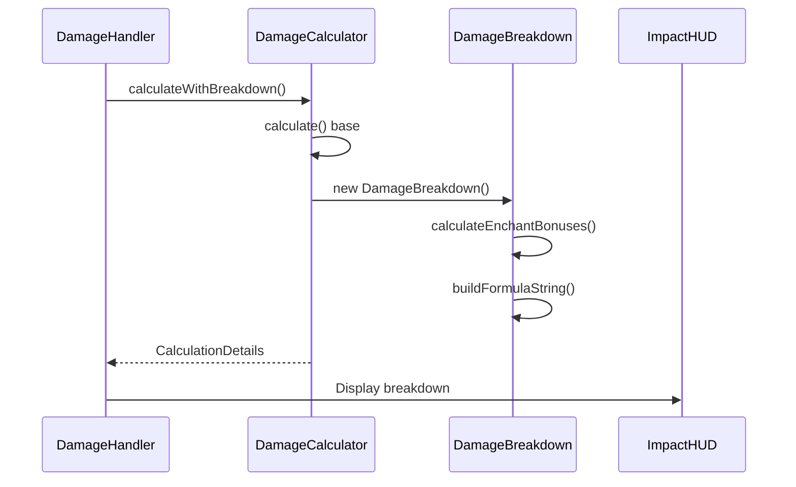

# Damage System

> Ultimo aggiornamento: 2025-12-30

Sistema di calcolo danno con breakdown dettagliato per HUD.

---

## Panoramica



---

## Struttura Package

```
com.devmod.damage/
├── DamageCalculator.java    # Calcolo danno principale
└── DamageBreakdown.java     # Breakdown per HUD
```

---

## DamageCalculator

Classe utility finale per tutti i calcoli danno.

### CalculationResult

Record con risultati del calcolo:

| Campo | Descrizione |
|-------|-------------|
| `finalDamage` | Danno finale dopo modificatori |
| `armorPenBonus` | Bonus da penetrazione armatura |
| `trueDamagePortion` | Danno che bypassa armatura |
| `armorReduction` | Riduzione armatura custom (0.0-0.8) |
| `bodyPartMultiplier` | Moltiplicatore parte corpo |

### Metodi Principali

```java
// Calcolo base
calculate(baseDamage, stats, bodyPartMult, victim, source)

// Con breakdown per HUD
calculateWithBreakdown(weapon, attacker, victim, bodyPart, baseDamage, stats, source)

// Per danno ambientale
calculateEnvironmentalWithBreakdown(victim, baseDamage)

// Applicazione trait signature
applySignatureTraitEffects(baseDamage, weapon, isHeadshot, isBoss, healthPercent)
```

### Formula Calcolo



### Formule Armor Penetration

Supporta 4 modalità via config:

| Formula | Descrizione |
|---------|-------------|
| SIMPLE | `armorPen * baseDamage * 0.01` |
| VANILLA_ACCURATE | Calcolo vanilla con armor value |
| PERCENTAGE | Percentuale diretta |
| FLAT_BONUS | Bonus fisso |

### Riduzione Armatura Custom

```java
calculateCustomArmorReduction(player, source)
```

- Accumula riduzione da tutti i pezzi armatura
- Cap massimo: 80%
- Considera tipo danno: fire, explosion, magic, physical, projectile

---

## DamageBreakdown

Classe per visualizzazione danno nell'HUD.

### Campi

| Campo | Tipo | Descrizione |
|-------|------|-------------|
| `baseWeaponDamage` | float | Danno base arma |
| `enchantBonuses` | List<EnchantBonus> | Bonus incantesimi |
| `pehkuiSizeBonus` | float | Bonus scala Pehkui |
| `pehkuiScale` | float | Scala attaccante |
| `bodyPartMultiplier` | float | Moltiplicatore parte |
| `armorPenetrationBonus` | float | Bonus armor pen |
| `finalDamage` | float | Danno finale |

### EnchantBonus Record

```java
record EnchantBonus(String name, int level, float bonus)
```

### Calcolo Enchant

| Incantesimo | Formula |
|-------------|---------|
| Sharpness | 1.0 + 0.5 × (livello - 1) |
| Smite | 2.5 × livello (solo vs undead) |
| Bane of Arthropods | 2.5 × livello (solo vs arthropod) |

### Formula String

Genera stringa per HUD:
```
(12.0+3.0+3.0) × 0.90 = 16.2
 base  ench pehk   body   final
```

### Costruttori

```java
// Calcolo completo
DamageBreakdown(weapon, attacker, target, baseDmg, bodyPartMult, armorPenBonus)

// Per sync network (valori pre-calcolati)
DamageBreakdown(baseDmg, enchantTotal, pehkuiBonus, bodyPartMult, armorPenBonus, finalDmg)
```

---

## Integrazione Pehkui

Se Pehkui mod è presente:
- Scala attaccante influenza danno
- Formula: `25% × base × (scala - 1.0)`
- Solo se scala > 1.0

---

## Bug Fix Documentati

| ID | Descrizione |
|----|-------------|
| BUG-001 | Usa scala attaccante (non target) per bonus size |
| BUG-004 | Smite/Bane solo su entity type corretti |
| BUG-010 | Formula strings cached per immutabilità |

---

## Dipendenze

- `com.devmod.combat` - HitHelper, SoulImprintManager
- `com.devmod.config` - ArmorConfigManager, Config
- `com.devmod.stats` - ArmorStats, WeaponStats
- `com.devmod.integration` - ModIntegrationManager (Pehkui)

---

## Esempio Flusso


