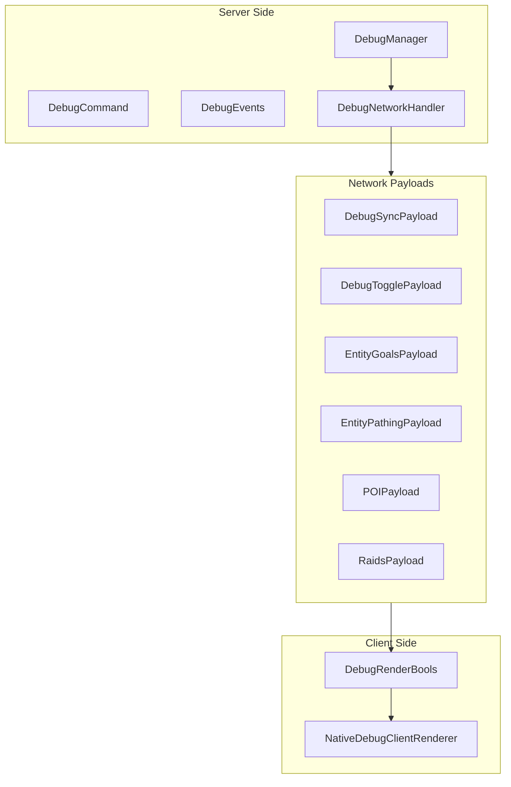
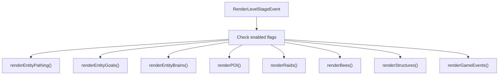

# Debug System

> Ultimo aggiornamento: 2025-12-30

Sistema debug con visualizzazioni per pathfinding, AI, POI e altro.

---

## Panoramica



---

## Struttura Package

```
com.devmod.debug/
├── DebugFeature.java               # Enum feature
├── DebugManager.java               # Manager stato
├── DebugCommand.java               # Comando /devdebug
├── DebugEvents.java                # Event listener
├── DebugNetworkHandler.java        # Network handler
├── NativeDebugSender.java          # Sender packets (disabled)
├── DebugSyncPayload.java           # Sync state
├── DebugTogglePayload.java         # Toggle request
├── EntityGoalsPayload.java         # AI goals data
├── EntityPathingPayload.java       # Pathfinding data
├── POIPayload.java                 # POI data
├── RaidsPayload.java               # Raids data
└── client/
    ├── DebugRenderBools.java       # Flag rendering
    └── NativeDebugClientRenderer.java  # Renderer
```

---

## DebugFeature Enum

16 feature debug disponibili.

| Feature | Descrizione |
|---------|-------------|
| ENTITY_PATHING | Pathfinding mob |
| ENTITY_GOALS | AI goals mob |
| ENTITY_BRAINS | Brain/memoria mob |
| POI | Points of Interest |
| BLOCK_UPDATES | Block updates |
| STRUCTURE_GENERATIONS | Strutture generate |
| RAIDS | Info raid |
| GAME_EVENTS | Game events (sculk) |
| BEE_HIVES | Arnie api |
| BEES | Comportamento api |
| WATER | Debug acqua |
| HEIGHTMAP | Heightmap |
| COLLISION | Collision boxes |
| LIGHT | Livelli luce |
| SOLID_FACES | Facce solide |
| CHUNK | Info chunk |
| SPAWN_CHUNKS | Spawn chunks |

---

## DebugManager

Singleton per stato feature per player.

### Struttura Dati

```java
Map<UUID, Set<DebugFeature>> playerFeatures  // ConcurrentHashMap
```

### Metodi

```java
// Toggle
boolean toggle(ServerPlayer player, DebugFeature feature)

// Enable/Disable
void enable(ServerPlayer player, DebugFeature feature)
void disable(ServerPlayer player, DebugFeature feature)

// Query
boolean isEnabled(ServerPlayer player, DebugFeature feature)
boolean isEnabled(UUID playerId, DebugFeature feature)
Set<DebugFeature> getEnabledFeatures(ServerPlayer player)

// Global queries
Set<UUID> getPlayersWithFeature(DebugFeature feature)
boolean anyPlayerHasFeature(DebugFeature feature)
int getActivePlayerCount()

// Cleanup
void clearPlayer(UUID playerId)
```

---

## DebugCommand

Comando `/devdebug` con subcomandi.

### Sintassi

```
/devdebug              # Help
/devdebug list         # Lista feature e stato
/devdebug off          # Disabilita tutte
/devdebug <feature>    # Toggle feature specifica
```

### Permessi

Richiede op level 2.

### RadialActions Registrate

| Action ID | Descrizione |
|-----------|-------------|
| DEBUG_COMMAND_HELP | Mostra help |
| DEBUG_COMMAND_LIST | Lista feature |
| DEBUG_COMMAND_OFF | Disabilita tutte |
| DEBUG_COMMAND_TOGGLE | Toggle singola |

---

## DebugEvents

Event listener per lifecycle.

```java
@SubscribeEvent
void onRegisterCommands(RegisterCommandsEvent event)
// Registra /devdebug

@SubscribeEvent
void onServerTick(ServerTickEvent event)
// Tick NativeDebugSender per tutti i livelli

@SubscribeEvent
void onPlayerLogout(PlayerEvent.PlayerLoggedOutEvent event)
// Cleanup stato player
```

---

## Network Payloads

### DebugSyncPayload

Server → Client per sync stato.

```java
record DebugSyncPayload(
    String featureId,
    boolean enabled
)
```

### DebugTogglePayload

Client → Server per richiesta toggle.

```java
record DebugTogglePayload(
    String featureId
)
```

### EntityGoalsPayload

Dati AI goals per entity.

```java
record EntityGoalsPayload(
    int entityId,
    String entityName,
    double posX, posY, posZ,
    List<GoalInfo> goals,
    List<GoalInfo> targetGoals
)

record GoalInfo(
    int priority,
    boolean isRunning,
    String name
)
```

### EntityPathingPayload

Dati pathfinding per entity.

```java
record EntityPathingPayload(
    int entityId,
    String entityName,
    List<PathNode> nodes,
    double targetX, targetY, targetZ,
    boolean canReach,
    float maxDistanceToWaypoint
)

record PathNode(
    int x, y, z,
    int nodeType,    // 0=normal, 1=open, 2=closed, 3=target
    float costMalus
)
```

### POIPayload

Points of Interest.

```java
record POIPayload(
    List<POIInfo> pois
)

record POIInfo(
    int x, y, z,
    String type,
    int freeTickets,
    int maxTickets
)
```

### RaidsPayload

Info raid attivi.

```java
record RaidsPayload(
    List<RaidInfo> raids
)

record RaidInfo(
    int raidId,
    int centerX, centerY, centerZ,
    int badOmenLevel,
    int groupsSpawned,
    int numGroups,
    boolean isActive,
    boolean isVictory
)
```

---

## Client Rendering

### DebugRenderBools

Flag per controllo rendering.

```java
class DebugRenderBools {
    static boolean ENTITY_PATHING;
    static boolean ENTITY_GOALS;
    static boolean ENTITY_BRAINS;
    static boolean POI;
    static boolean BLOCK_UPDATES;
    static boolean STRUCTURES;
    static boolean RAIDS;
    static boolean GAME_EVENTS;
    static boolean BEES;
    static boolean BEE_HIVES;
    // ... altri

    static void clearAll()  // Reset tutti a false
}
```

### NativeDebugClientRenderer

Renderer per visualizzazioni debug.



### Visualizzazioni

| Feature | Rendering |
|---------|-----------|
| ENTITY_PATHING | Linee colorate per path (verde=completato, giallo=corrente, rosso=futuro) |
| ENTITY_GOALS | Lista goals sopra mob con priorità e stato running |
| ENTITY_BRAINS | Linea rossa a target, box sopra mob (rosso=aggressivo) |
| POI | Box colorati per tipo (rosso=letti, blu=workstation, giallo=meeting) |
| RAIDS | Box wireframe rosso grande, box arancione al centro |
| BEES | Linea gialla a arnia, rosa a fiore, indicatore nectar/angry |
| STRUCTURES | Box ciano per bounding box strutture |
| GAME_EVENTS | Box ciano per sculk sensor, sfera range detection |

### Helper Methods

```java
void drawLine(Vec3 from, Vec3 to, int color)
void drawBox(AABB box, int color)
boolean hasAnyEnabled()
```

---

## Note Tecniche

### NativeDebugSender (Disabilitato)

> Temporaneamente disabilitato per problemi mixin in NeoForge 1.21.1:
> - DebugRendererMixin ha field shadowing issues
> - PathfindingDebugPayload causa IndexOutOfBoundsException
>
> I metodi sono preservati ma commentati.

### Limitazioni

- Funziona solo in singleplayer (richiede accesso diretto al server)
- Reflection-safe per camera position
- Gestisce ConcurrentModificationException durante iterazione entity

---

## Dipendenze

- NeoForge Event System
- `com.devmod.actions` - ActionRegistry
- Minecraft DebugPackets (via mixin)
