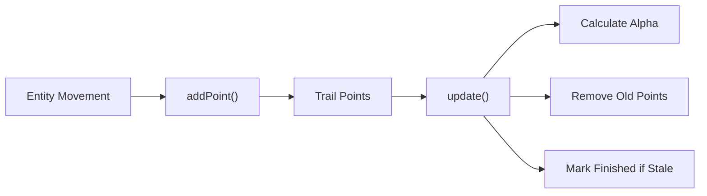
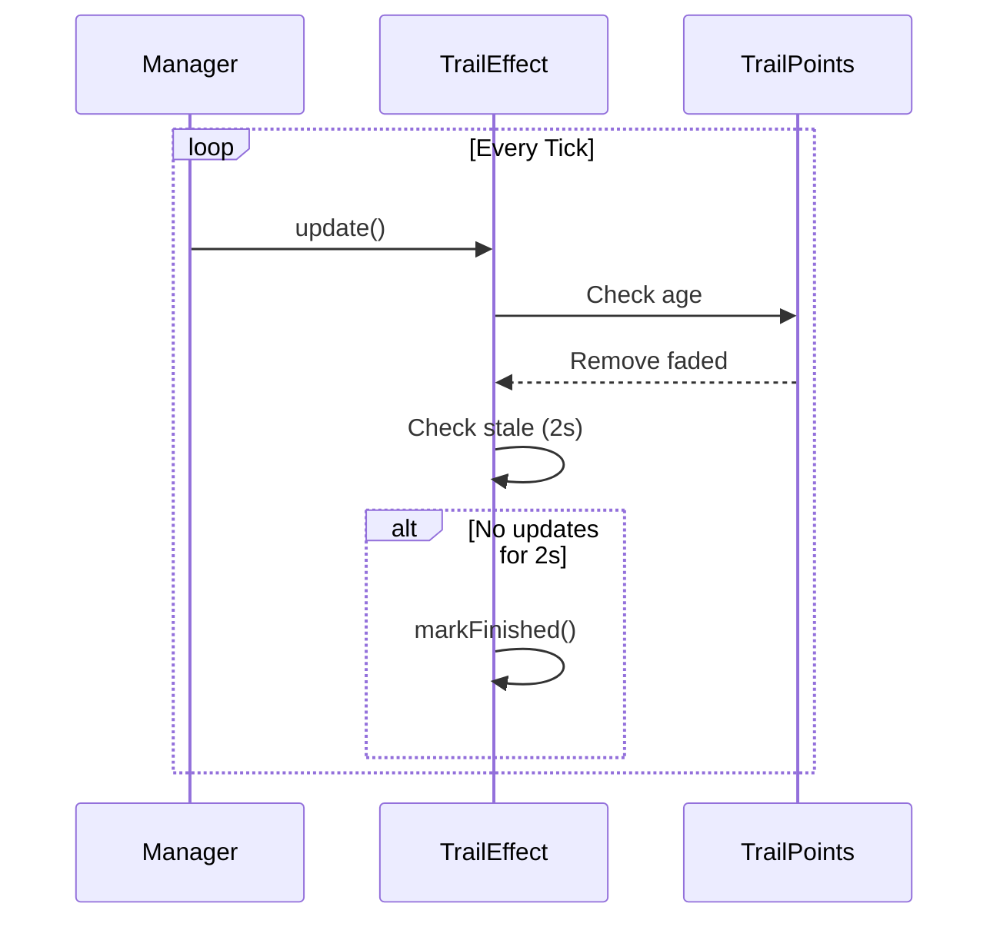

# Effects System

> Ultimo aggiornamento: 2025-12-30

Sistema effetti visivi trail per entità.

---

## Panoramica

Package minimale focalizzato su effetti trail per movimento entità.

---

## Struttura Package

```
com.devmod.effects/
└── TrailEffect.java    # Gestione trail visivi
```

---

## TrailEffect

Gestisce effetti trail visivi che seguono il movimento delle entità.

### Caratteristiche

- Lista dinamica di punti trail legati a un'entità
- Lifecycle configurabile (max points, colore, larghezza, fade time)
- Rimozione automatica trail stale (2 secondi inattività)
- Calcolo alpha trasparenza per effetti fade

### Struttura



### Costruttore

```java
TrailEffect(
    int entityId,    // ID entità associata
    int color,       // Colore RGB trail
    float width,     // Larghezza linea
    int maxPoints,   // Max punti mantenuti
    float fadeTime   // Tempo fade in ticks
)
```

### Metodi Principali

| Metodo | Descrizione |
|--------|-------------|
| `addPoint(Vec3)` | Aggiunge punto al trail |
| `update()` | Tick update - prune e stale check |
| `getPoints()` | Lista punti attivi |
| `getPointAlpha(TrailPoint)` | Calcola alpha per fade (0-1) |
| `getEntityId()` | ID entità |
| `getColor()` | Colore trail |
| `getWidth()` | Larghezza trail |
| `isFinished()` | Trail completato/expired |
| `markFinished()` | Marca manualmente come finito |

### TrailPoint Inner Class

```java
static class TrailPoint {
    Vec3 position;      // Posizione mondo
    long timestamp;     // Tempo creazione (ms)

    TrailPoint(Vec3 position, long timestamp)
}
```

### Costanti

| Costante | Valore | Descrizione |
|----------|--------|-------------|
| `STALE_THRESHOLD_MS` | 2000 | Timeout inattività (ms) |

### Flusso Update



### Calcolo Alpha

```java
float getPointAlpha(TrailPoint point) {
    long age = System.currentTimeMillis() - point.timestamp;
    float fadeMs = fadeTime * 50; // ticks to ms
    if (age >= fadeMs) return 0.0f;
    return 1.0f - (age / fadeMs);
}
```

---

## Utilizzo

### Creazione Trail

```java
TrailEffect trail = new TrailEffect(
    entity.getId(),
    0xFF0000,     // Rosso
    2.0f,         // Larghezza
    50,           // Max 50 punti
    20.0f         // 20 tick fade (1 secondo)
);
```

### Aggiornamento Continuo

```java
// Nel tick loop
if (entity.isAlive()) {
    trail.addPoint(entity.position());
}
trail.update();

// Nel render loop
for (TrailPoint point : trail.getPoints()) {
    float alpha = trail.getPointAlpha(point);
    if (alpha > 0) {
        renderTrailSegment(point.position, trail.getColor(), alpha);
    }
}
```

### Cleanup

```java
if (trail.isFinished()) {
    trailManager.remove(trail);
}
```

---

## Integrazione

Tipicamente usato con:
- Dash ability (trail durante dash)
- Projectile trails
- Boss attack indicators
- Debug visualization

---

## Dipendenze

- Minecraft Vec3
- Java Collections
