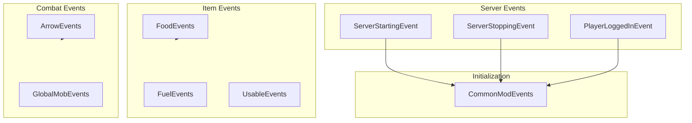
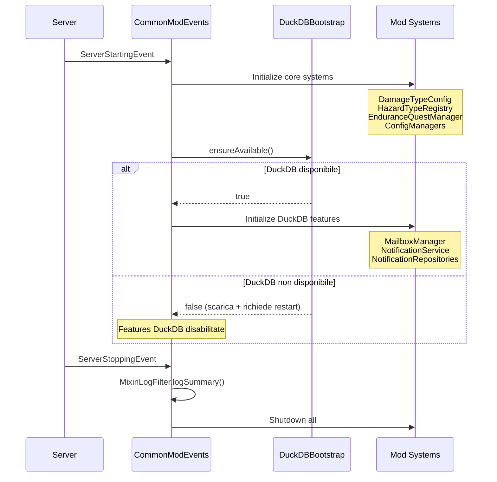
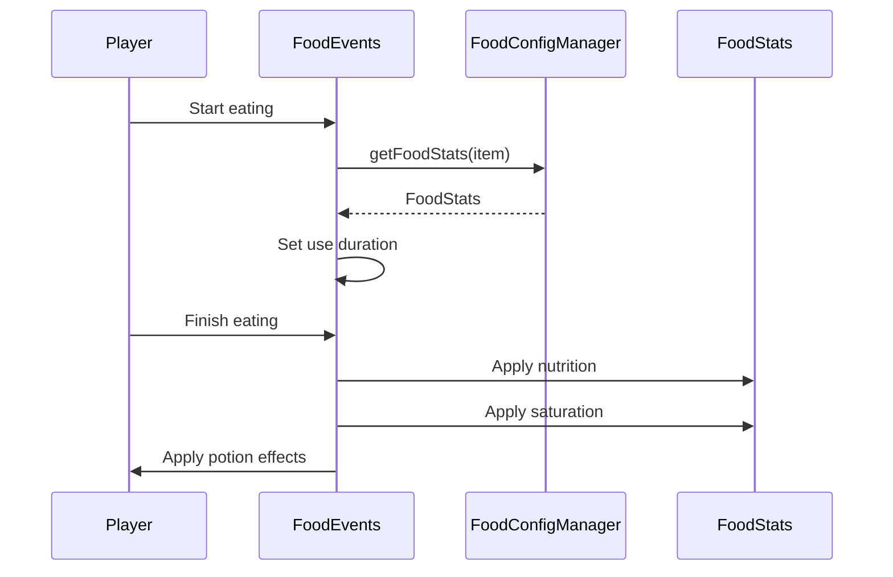
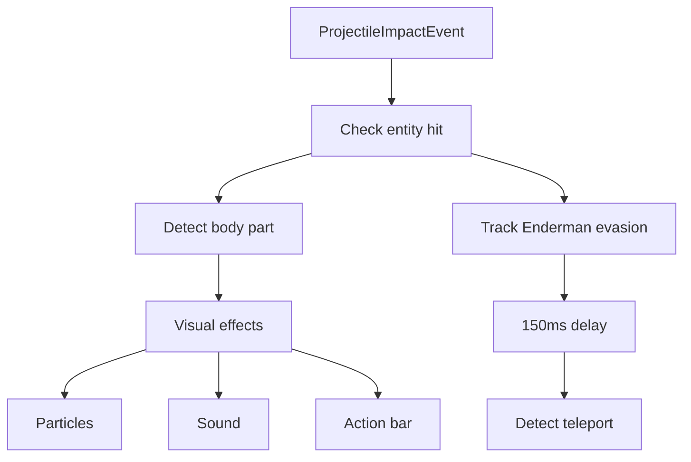

# Events System

> Ultimo aggiornamento: 2025-12-30

Handler eventi NeoForge per lifecycle server, item use, proiettili e entità.

---

## Panoramica



---

## Struttura Package

```
com.devmod.events/
├── CommonModEvents.java    # Lifecycle server e sync
├── FoodEvents.java         # Consumo cibo custom
├── FuelEvents.java         # Burn time combustibili
├── UsableEvents.java       # Item use duration/cooldown
├── ArrowEvents.java        # Impatto frecce e body part
└── GlobalMobEvents.java    # Spawn/despawn entità
```

---

## CommonModEvents

Handler centrale per inizializzazione e sincronizzazione.

### Eventi Server



### Flusso Inizializzazione con Guardia DuckDB

La novità principale è la **guardia condizionale DuckDB**. Alcuni sistemi richiedono DuckDB e vengono inizializzati **solo se disponibile**:

```java
// Prima: inizializza sistemi che NON richiedono DuckDB
DamageTypeConfig.INSTANCE.load();
HazardTypeRegistry.INSTANCE.initialize();
EnduranceQuestManager.INSTANCE.initialize();
// ... altri sistemi indipendenti

// Poi: check DuckDB
boolean duckDbAvailable = DuckDBBootstrap.ensureAvailable(gameDir);

if (duckDbAvailable) {
    // Solo se DuckDB è pronto
    MailboxManager.INSTANCE.initialize();
    NotificationService.INSTANCE.initialize();
    NotificationRepositories.initialize();
    PartyNotificationBridge.register();
} else {
    LOGGER.warn("DuckDB not available - Mailbox/Notifications disabled");
    LOGGER.warn("Restart the server after download completes");
}
```

### Sistemi Inizializzati

**Sempre (non richiedono DuckDB):**

| Sistema | Descrizione |
|---------|-------------|
| DamageTypeConfig | Config tipi danno |
| HazardTypeRegistry | Registry hazard ambientale |
| EnduranceQuestManager | Manager quest endurance |
| ArmorConfigManager | Config armature |
| WeaponConfigManager | Config armi |
| FuelConfigManager | Config combustibili |
| DailyChallengeManager | Sfide giornaliere |
| WeeklyChallengeManager | Sfide settimanali |
| MailboxConfig | Config mailbox (file-based) |
| LeaderboardSystem | Sistema classifiche |

**Solo con DuckDB:**

| Sistema | Descrizione |
|---------|-------------|
| MailboxManager | Messaggi in-game (DuckDB storage) |
| NotificationService | Centro notifiche unificato |
| NotificationHistoryRepository | Storico notifiche (DuckDB) |
| NotificationPreferencesRepository | Preferenze utente (DuckDB) |
| PartyNotificationBridge | Bridge eventi party → notifiche |

### Shutdown e MixinLogFilter

Al shutdown, viene loggato un sommario dei messaggi mixin filtrati:

```java
@SubscribeEvent
public static void onServerStopping(ServerStoppingEvent event) {
    // Log quanti warning mixin sono stati soppressi
    MixinLogFilter.logSummary();
    // Output: "[DevMod] Suppressed 42 mixin-related warnings"

    // Shutdown sistemi...
}
```

### Player Sync

Anche il sync al login rispetta la guardia DuckDB:

```java
@SubscribeEvent
public static void onPlayerLoggedIn(PlayerEvent.PlayerLoggedInEvent event) {
    // SEMPRE: Sync game mechanics config
    PacketDistributor.sendToPlayer(player, gameMechanicsPayload);

    // SEMPRE: Init telemetry aggregator
    if (AggregationConfig.AGGREGATION_ENABLED) {
        TelemetryAggregatorRegistry.INSTANCE.onPlayerJoin(player.getUUID());
    }

    // SOLO CON DUCKDB:
    if (DuckDBBootstrap.isAvailable()) {
        // Sync mailbox
        MailboxNetworkHandler.sendMailboxSync(player);
        MailboxNetworkHandler.sendAccessSync(player);

        // Sync news
        MailboxNetworkHandler.sendNewsSync(player);

        // Sync tasks (se tester)
        if (MailboxPermissions.hasPermission(player, TESTER)) {
            MailboxNetworkHandler.sendTaskSync(player);
        }

        // Sync tickets
        TicketNetworkHandler.sendTicketSync(player);

        // Sync notification preferences
        NotificationPreferencesRepository.loadAndSync(player);
    }
}
```

### Equipment Validation

```java
@SubscribeEvent
public static void onEquipmentChange(LivingEquipmentChangeEvent event) {
    // Sanitize weapon/armor stats
    // Refresh tool components
    // Validate modifiers
}
```

---

## FoodEvents

Gestisce consumo cibo con stats custom.

### Eventi Gestiti

| Evento | Handler | Descrizione |
|--------|---------|-------------|
| `LivingEntityUseItemEvent.Start` | `onItemUseStart` | Modifica durata consumo |
| `LivingEntityUseItemEvent.Finish` | `onItemUseFinish` | Applica nutrition, saturation, effetti |

### Flusso



---

## FuelEvents

Gestisce burn time custom per combustibili.

```java
@SubscribeEvent
public static void onFuelBurnTime(FurnaceFuelBurnTimeEvent event) {
    FuelStats stats = FuelConfigManager.getFuelStats(item);
    if (stats != null) {
        int burnTime = (int)(stats.burnTime * stats.efficiencyMultiplier);
        event.setBurnTime(burnTime);
    }
}
```

---

## UsableEvents

Gestisce durata uso e cooldown per item consumabili.

### Eventi Gestiti

| Evento | Descrizione |
|--------|-------------|
| `Start` | Modifica durata uso |
| `Finish` | Applica cooldown |
| `Tick` | Effetti continui (placeholder) |
| `Stop` | Early-release (placeholder) |

---

## ArrowEvents

Gestisce impatto frecce con body part detection.

### Funzionalità



### Body Part Detection

Usa `HitHelper` per determinare parte colpita:
- HEAD, BODY, ARMS, LEGS
- Messaggi localizzati via I18n
- Colori per parte corpo

### Evasion Tracking

```java
// Track potential Enderman evasion
if (target instanceof EnderMan) {
    trackPotentialEvasion(target, arrow);
    // Schedule check dopo 150ms
    executor.schedule(() -> {
        if (!hitConfirmed) {
            spawnEvasionPanel();
        }
    }, 150, TimeUnit.MILLISECONDS);
}
```

---

## GlobalMobEvents

Traccia lifecycle entità per performance e debug.

### Eventi Gestiti

| Evento | Handler | Descrizione |
|--------|---------|-------------|
| `EntityJoinLevelEvent` | `onEntityJoin` | Queue spawn per processing differito |
| `EntityLeaveLevelEvent` | `onEntityLeave` | Log removal in instance dimensions |

### Performance Optimization

```java
@SubscribeEvent
public static void onEntityJoin(EntityJoinLevelEvent event) {
    if (event.getEntity() instanceof LivingEntity living) {
        // Defer processing to prevent TPS drops during mass spawns
        DeferredEntityProcessor.queue(living);
    }
}
```

### Instance Dimension Tracking

```java
@SubscribeEvent
public static void onEntityLeave(EntityLeaveLevelEvent event) {
    if (isDynamicInstanceDimension(level)) {
        // Detailed logging with stack trace for debugging
        LOGGER.debug("Entity {} removed in instance {}. Reason: {}",
            entity.getName(), level.dimension(), getRemovalReason(event));
    }
}
```

---

## Pattern Comuni

### EventBusSubscriber

Tutti i file usano:

```java
@EventBusSubscriber(modid = DevMod.MODID, bus = EventBusSubscriber.Bus.GAME)
public class EventHandler {
    @SubscribeEvent
    public static void onEvent(EventType event) { ... }
}
```

### Config Manager Pattern

```java
// Recupera config per item
XxxStats stats = XxxConfigManager.getStats(item);
if (stats != null && !stats.isDefault()) {
    // Applica stats custom
}
```

### Client-Safe Reflection

Per VFX client-side da eventi server:

```java
private static void spawnEffectClientSafe(Entity entity) {
    try {
        Class<?> clientClass = Class.forName("com.devmod.client.EffectRenderer");
        Method method = clientClass.getMethod("spawn", Entity.class);
        method.invoke(null, entity);
    } catch (Exception e) {
        // Silently fail on dedicated server
    }
}
```

---

## Dipendenze

- `com.devmod.config` - Tutti i ConfigManager
- `com.devmod.combat` - HitHelper per body part
- `com.devmod.telemetry` - TelemetryAggregatorRegistry
- `com.devmod.mailbox` - MailboxManager, NewsManager
- `com.devmod.notification` - NotificationService
