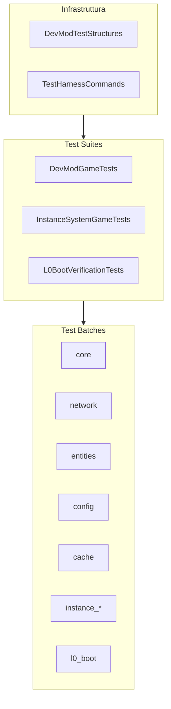

# GameTest System

> Ultimo aggiornamento: 2025-12-30

Framework di test automatizzati basato su NeoForge GameTest.

---

## Panoramica



---

## Struttura Package

```
com.devmod.gametest/
├── DevModGameTests.java           # Test suite principale
├── InstanceSystemGameTests.java   # Test sistema istanze
├── L0BootVerificationTests.java   # Verifica bootstrap
├── DevModTestStructures.java      # Utility strutture test
└── TestHarnessCommands.java       # Comando /devtest
```

---

## DevModGameTests

Suite principale con 68+ test organizzati in batch.

### Test Batches

| Batch | Setup/Cleanup | Descrizione |
|-------|---------------|-------------|
| `core` | setupCoreBatch/cleanupCoreBatch | Config armi |
| `network` | setupNetworkBatch/cleanupNetworkBatch | Payload network |
| `entities` | setupEntitiesBatch/cleanupEntitiesBatch | Config mob |
| `config` | setupConfigBatch/cleanupConfigBatch | Fallback chain |
| `cache` | - | Test cache HitHelper |

### Test Principali

```java
// Weapon Stats
weaponStatsDefaultValues()      // Verifica range default
weaponStatsNbtRoundTrip()       // Serializzazione NBT

// Damage
damageMultiplierOrdering()      // HEAD >= BODY >= ARMS >= LEGS
damageCalculationBasic()        // Formula danno core
damageCalculationZeroDamage()   // Edge case zero

// Network
networkPayloadMobStats()        // UpdateMobStatsPayload
networkPayloadWeapon()          // UpdateWeaponPayload
networkPayloadExtremeValues()   // MAX_VALUE handling

// Body Part
bodyPartDetectionHeightBased()  // HitHelper detection

// Config
mobConfigManagerStorage()       // Storage mob config
weaponConfigGlobalStats()       // Stats globali per item
configFallbackChain()           // specific NBT > global > defaults
```

### Costanti

```java
static final String TEMPLATE_EMPTY = "empty";
static final String TEMPLATE_5X5 = "empty_5x5";
static final float EPSILON = 0.001f;  // Tolleranza confronto float
```

---

## InstanceSystemGameTests

Test per il sistema di istanze dinamiche.

### Batch Instance

| Batch | Test |
|-------|------|
| `instance_smoke` | Manager init, recovery, dimension manager |
| `instance_flow` | Snapshot creation, NBT round-trip |
| `instance_state` | State machine, player management |
| `instance_recovery` | Recovery detection, UUID parsing |

### Test Smoke

```java
instanceManagerInitialized()         // InstanceManager.isReady()
recoverySystemInitialized()          // RecoverySystem accessible
dynamicDimensionManagerInitialized() // DynamicDimensionManager.isReady()
instanceRegistryAccessible()         // Query operations
```

### Test State Machine

```java
instanceStateEnumOrder()        // Validazione ordinal enum
instanceDataStateTransition()   // CREATING -> READY -> ACTIVE
instanceDataPlayerManagement()  // Add/remove, capacity limits
instanceDataDestructionScheduling()  // Schedule/cancel destruction
```

### Test Flow

```java
snapshotCreationCapture()       // PlayerInstanceSnapshot structure
snapshotNbtRoundTrip()          // Serializzazione snapshot
instanceDataMapRoundTrip()      // Serializzazione InstanceData
voidPlatformAndChunkPreload()   // Void dimension con piattaforma
```

---

## L0BootVerificationTests

Verifica bootstrap critica - tutti i test sono `required = true`.

### Test L0 (11 test)

```java
l0_01_serverStarted()           // Server started senza crash
l0_02_instanceManagerReady()    // InstanceManager ready
l0_03_recoverySystemReady()     // RecoverySystem accessible
l0_04_dimensionManagerReady()   // DynamicDimensionManager ready
l0_05_registryAccessible()      // InstanceRegistry operations
l0_06a_mobConfigAccessible()    // MobConfigManager accessible
l0_06b_weaponConfigAccessible() // WeaponConfigManager accessible
l0_07_entityTypesRegistered()   // ZOMBIE, SKELETON, SPIDER, CREEPER
l0_08_itemsAccessible()         // DIAMOND_SWORD, IRON_SWORD, BOW
l0_09_stateEnumsValid()         // InstanceState, PlayerInstanceState
l0_10_dataStructuresWork()      // InstanceData, PlayerInstanceSnapshot
```

---

## DevModTestStructures

Event listener e utility per strutture test.

### Costanti Dimensioni

```java
EMPTY_3X3_SIZE = 3
EMPTY_5X5_SIZE = 5
COMBAT_ARENA_WIDTH = 7
COMBAT_ARENA_HEIGHT = 5
COMBAT_ARENA_DEPTH = 7
```

### Metodi

```java
// Registrazione test
@SubscribeEvent
void registerTests(RegisterGameTestsEvent event)

// Costruzione struttura
void buildEmptyStructure(
    ServerLevel level,
    BlockPos pos,
    int width, int height, int depth,
    boolean withBarriers
)
// Crea: pavimento STONE, aria sopra, opzionali BARRIER walls

// Query dimensioni
BlockPos getStructureSize(String templateName)
// Supporta: "empty_3x3", "empty_5x5", "combat_arena"
```

---

## TestHarnessCommands

Comando `/devtest` per testing manuale e 25+ RadialAction.

### Struttura Comando

```
/devtest
├── hud [on|off|toggle|export|import]
├── panel [on|off|toggle]
├── debug [on|off|toggle]
├── endurance
│   ├── stats
│   ├── perks
│   ├── smoke
│   ├── export [<table>|all]
│   └── autosmoke
├── debugbox <size>
├── debugclear
├── panelclear
├── info
├── qa
└── bodypart <part>
```

### Handler Principali

```java
// HUD
setHudOn() / setHudOff() / toggleHud()
exportHudPreset() / importHudPreset()

// Panel
setPanelOn() / setPanelOff() / togglePanel()

// Debug
setDebugOn() / setDebugOff() / toggleDebug()

// Endurance
enduranceStats()      // Stats player
endurancePerks()      // Top 5 perk usage
enduranceSmoke()      // Row count tabelle
exportTableFromContext()  // Export NDJSON
enduranceAutoSmoke()  // Auto 2-wave test
```

### RadialActions Registrate

| Action ID | Descrizione |
|-----------|-------------|
| DEVTEST_HUD_* | Controlli HUD |
| DEVTEST_PANEL_* | Controlli panel |
| DEVTEST_DEBUG_* | Controlli debug |
| DEVTEST_ENDURANCE_* | Controlli endurance |
| DEVTEST_QA | Apre Testing Hub |

---

## Statistiche

| Metrica | Valore |
|---------|--------|
| File Java | 5 |
| Test Methods | 68+ |
| Required Tests | 18+ |
| Test Batches | 10 |
| Command Subcommands | 30+ |
| Action Registrations | 25+ |

---

## Dipendenze

- NeoForge GameTest Framework
- `com.devmod.combat.HitHelper` - Body part detection
- `com.devmod.config.*` - Config managers
- `com.devmod.network.*` - Network payloads
- `com.devmod.runtime.*` - Instance system
- `com.devmod.telemetry.duckdb.*` - DuckDB access
- `com.devmod.actions.*` - Action system
