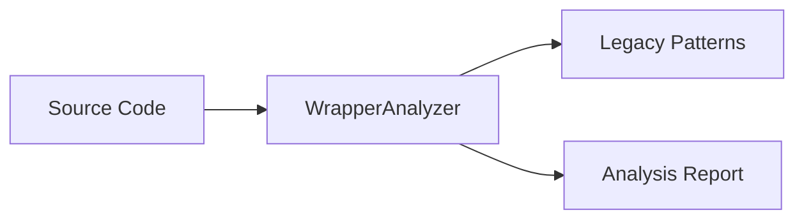

# Migration Package

> Ultimo aggiornamento: 2025-12-30

Tool per analisi e migrazione API legacy.

---

## Panoramica



---

## Struttura Package

```
com.devmod.migration/
└── (vuoto - package riservato)

com.devmod.arena.migration/
└── WrapperAnalyzer.java    # Analizzatore API legacy
```

---

## WrapperAnalyzer

Analizzatore statico per rilevare uso API legacy Arena.

### Record Types

```java
// Risultato analisi
record AnalysisResult(
    List<LegacyUsage> usages,
    long analysisTimeMs
)

// Singolo uso legacy
record LegacyUsage(
    Path file,
    int lineNumber,
    String pattern,
    String matchedText,
    String migrationHint
)

// Pattern da cercare
record LegacyPattern(
    String name,
    Pattern regex,
    String migrationHint
)

// Chain chiamate runtime
record CallerChain(
    StackTraceElement[] elements
)
```

### Pattern Legacy

```java
static final List<LegacyPattern> LEGACY_PATTERNS = [
    // Vecchi wrapper API
    "ArenaWrapper\\.",
    "LegacyArenaBuilder\\.",
    "OldTemplateLoader\\.",
    // ... altri pattern
]
```

### Metodi

```java
// Costruttore
WrapperAnalyzer(Path sourceRoot)

// Analisi
AnalysisResult analyze()
// - Walk del source tree
// - Match pattern su ogni file .java
// - Calcola line numbers
// - Ritorna usages + timing

// Telemetry runtime
static CallerChain captureCallerChain()
// Cattura stack trace per debug
```

### Utilizzo

```java
WrapperAnalyzer analyzer = new WrapperAnalyzer(
    Path.of("src/main/java")
);

AnalysisResult result = analyzer.analyze();

for (LegacyUsage usage : result.usages()) {
    System.out.printf(
        "%s:%d - %s%n  Hint: %s%n",
        usage.file(),
        usage.lineNumber(),
        usage.matchedText(),
        usage.migrationHint()
    );
}

System.out.printf(
    "Analyzed in %dms, found %d legacy usages%n",
    result.analysisTimeMs(),
    result.usages().size()
);
```

### Output Esempio

```
src/main/java/com/devmod/arena/OldCode.java:42 - ArenaWrapper.create()
  Hint: Use ArenaBuilder.create() instead

src/main/java/com/devmod/arena/Legacy.java:87 - LegacyArenaBuilder.build()
  Hint: Use ArenaBuilder.build() with new API

Analyzed in 156ms, found 2 legacy usages
```

---

## Dipendenze

- Java NIO - File walking
- Java Regex - Pattern matching
- SLF4J - Logging
