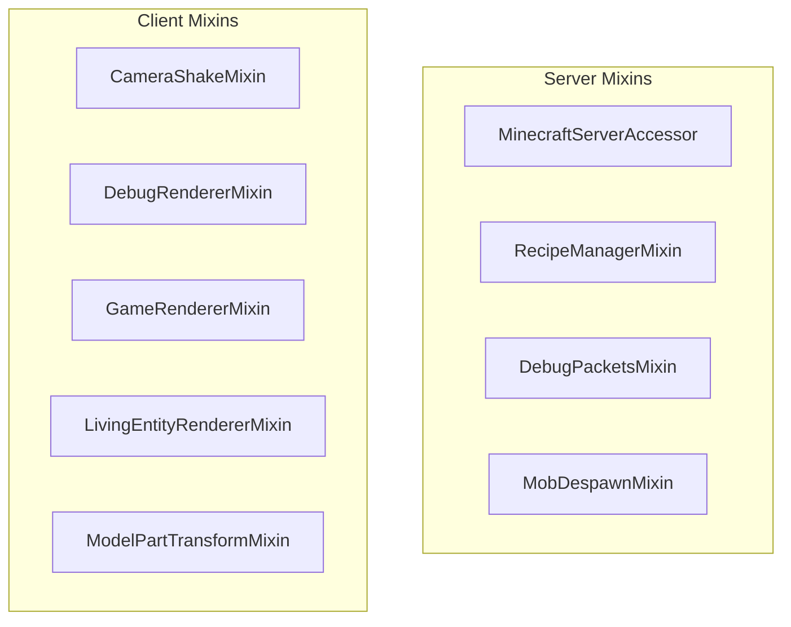
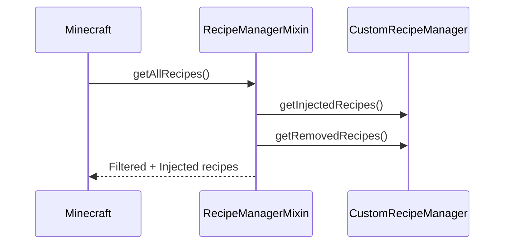
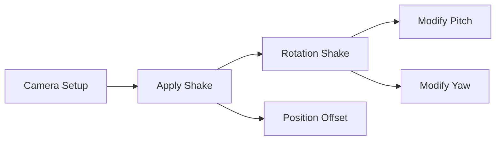

# Mixin System

> Ultimo aggiornamento: 2025-12-30

Mixin per modificare comportamenti Minecraft vanilla.

---

## Panoramica



---

## Struttura Package

```
com.devmod.mixin/
├── MinecraftServerAccessor.java    # Accessor server internals
├── RecipeManagerMixin.java         # Inject custom recipes
├── DebugPacketsMixin.java          # Route debug packets
├── MobDespawnMixin.java            # Prevent endurance mob despawn
└── client/
    ├── CameraShakeMixin.java           # Screen shake effects
    ├── DebugRendererMixin.java         # Debug visualization toggle
    ├── GameRendererMixin.java          # Screen effects management
    ├── LivingEntityRendererMixin.java  # Transform capture start/end
    └── ModelPartTransformMixin.java    # Bone transform capture
```

---

## Server Mixins

### MinecraftServerAccessor

Accessor interface per campi interni MinecraftServer.

```java
@Mixin(MinecraftServer.class)
public interface MinecraftServerAccessor {
    @Accessor
    Map<ResourceKey<Level>, ServerLevel> getLevels();

    @Accessor
    Executor getExecutor();

    @Accessor
    LevelStorageSource.LevelStorageAccess getStorageSource();
}
```

**Uso:** Accesso a dimensioni dinamiche e storage.

### RecipeManagerMixin

Inietta ricette custom nel sistema vanilla.



**Injection Points:**
- `devmod$injectAllRecipes()` - Intercetta getAllRecipes
- `devmod$injectRecipeFor()` - Intercetta recipe matching
- `devmod$injectByKey()` - Intercetta byKey lookups

### DebugPacketsMixin

Route debug packets ai player con feature abilitate.

```java
@Inject(method = "sendPathFindingPacket", at = @At("HEAD"))
private static void devmod_sendPathFindingPacket(...) {
    sendToPlayers(DebugFeature.ENTITY_PATHING, packet);
}
```

**Features Supportate:**
- PathFinding, GoalSelector, POI
- Raids, NeighborsUpdate

### MobDespawnMixin

Previene despawn di mob spawned da endurance quest.

```java
@Inject(method = "checkDespawn", at = @At("HEAD"), cancellable = true)
private void devmod$preventEnduranceMobDespawn(CallbackInfo ci) {
    if (hasEnduranceQuestTag()) {
        ci.cancel();
    }
}
```

---

## Client Mixins

### CameraShakeMixin

Applica effetti screen shake alla camera.



```java
@Inject(method = "setup", at = @At("TAIL"))
private void devmod$applyScreenShake(...) {
    // Apply rotation shake (camera-local space)
    // Apply position offset (bobbing)
}
```

### DebugRendererMixin

Abilita/disabilita rendering debug basato su config.

```java
@Inject(method = "render", at = @At("HEAD"))
private void devmod_render(...) {
    if (DebugRenderBools.ENTITY_PATHING) {
        pathfindingRenderer.render(...);
    }
    if (DebugRenderBools.ENTITY_GOALS) {
        goalSelectorRenderer.render(...);
    }
    // ... altri renderer
}
```

**Renderer Supportati:**
- Pathfinding, AI Goals, Raids, Brains
- Bees, Game Events, Structures, POI, Breeze

### GameRendererMixin

Gestisce effetti schermo e blur.

```java
@Inject(method = "processBlurEffect", at = @At("HEAD"), cancellable = true)
private void devmod$skipBlurForModScreens(CallbackInfo ci) {
    if (isDevModScreen()) {
        ci.cancel();
    }
}

@Inject(method = "tick", at = @At("TAIL"))
private void devmod$tickShakeEffects() {
    ScreenShakeManager.tick();
}
```

### LivingEntityRendererMixin

Cattura transform per collision detection OBB.

```java
@Inject(method = "render", at = @At("HEAD"))
private void devmod$beginTransformCapture(...) {
    if (shouldCaptureTransforms()) {
        TransformCapture.begin(entity);
    }
}

@Inject(method = "render", at = @At("TAIL"))
private void devmod$endTransformCapture(...) {
    if (shouldCaptureTransforms()) {
        TransformCapture.end(entity);
    }
}
```

### ModelPartTransformMixin

Registra transform mondo di parti modello.

```java
@Inject(method = "render", at = @At(value = "INVOKE", target = "translateAndRotate"))
private void devmod$captureTransform(PoseStack poseStack, ...) {
    if (TransformCapture.isCapturing()) {
        Matrix4f worldTransform = poseStack.last().pose();
        TransformCapture.record(partName, worldTransform);
    }
}
```

---

## Configurazione

### mixin.json

```json
{
  "required": true,
  "package": "com.devmod.mixin",
  "compatibilityLevel": "JAVA_21",
  "mixins": [
    "MinecraftServerAccessor",
    "RecipeManagerMixin",
    "DebugPacketsMixin",
    "MobDespawnMixin"
  ],
  "client": [
    "client.CameraShakeMixin",
    "client.DebugRendererMixin",
    "client.GameRendererMixin",
    "client.LivingEntityRendererMixin",
    "client.ModelPartTransformMixin"
  ]
}
```

---

## Note Tecniche

### Field Shadowing Issues

> DebugRendererMixin ha problemi di field shadowing in NeoForge 1.21.1.
> I debug packets non vengono renderizzati senza fix al mixin.

### Transform Capture

Il sistema OBB richiede che:
1. `LivingEntityRendererMixin` inizi/finisca capture
2. `ModelPartTransformMixin` registri ogni transform
3. Il sistema collision legga i transform catturati

---

## Dipendenze

- SpongePowered Mixin
- `com.devmod.collision` - OBB system
- `com.devmod.debug` - Debug rendering
- `com.devmod.client` - Screen shake
