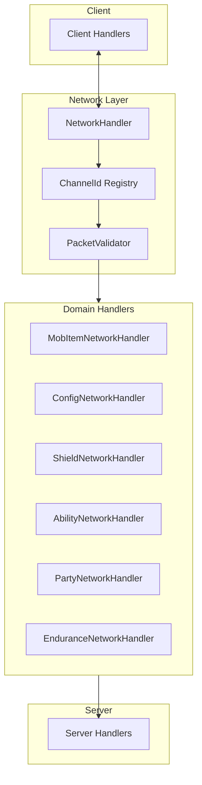
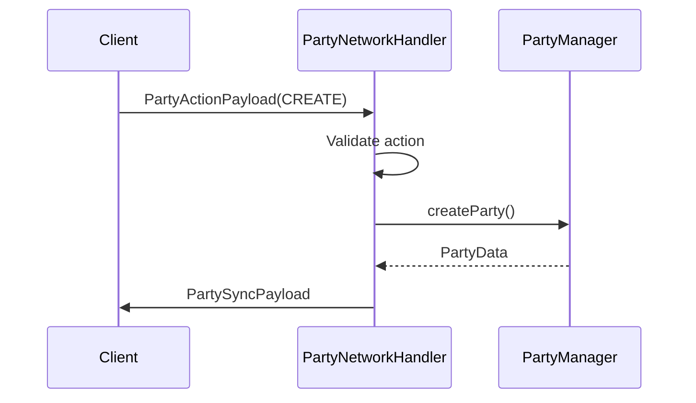

# Network System

> Ultimo aggiornamento: 2025-12-30

Infrastruttura di rete per comunicazione client-server con 70+ payload e validazione sicurezza.

---

## Panoramica



---

## Struttura Package

```
com.devmod.network/
├── NetworkHandler.java              # Registrazione principale
├── NetworkHandlerBase.java          # Classe base utility
├── ChannelId.java                   # Registry canali (123+)
├── PacketValidator.java             # Validazione sicurezza
├── handlers/
│   ├── MobItemNetworkHandler.java   # Mob e item stats
│   ├── ConfigNetworkHandler.java    # Sync configurazione
│   ├── ShieldNetworkHandler.java    # Effetti scudo
│   ├── AbilityNetworkHandler.java   # Sistema abilità
│   ├── PartyNetworkHandler.java     # Sistema party
│   └── EnduranceNetworkHandler.java # Quest endurance
└── payloads/
    ├── ArmorStatsPayload.java
    ├── WeaponStatsPayload.java
    ├── RangedWeaponStatsPayload.java
    ├── ShieldStatePayload.java
    ├── ShieldImpactPayload.java
    ├── GlobalConfigSyncPayload.java
    ├── GameMechanicsSyncPayload.java
    ├── ImpactSyncPayload.java
    └── ... (19 payload totali)
```

---

## ChannelId Registry

Enum centralizzato con 123+ canali organizzati per feature.

### Categorie Canali

| Categoria | Range ID | Esempi |
|-----------|----------|--------|
| Mob/Item | 1-10 | MOB_STATS, WEAPON_LEGACY, EQUIP_MOB |
| Endurance | 11-30 | QUEST_START, WAVE_UPDATE, PERK_SELECT |
| Party | 31-45 | PARTY_ACTION, INVITE_RESPONSE, PARTY_SYNC |
| Config | 46-60 | GLOBAL_CONFIG_SYNC, RECIPE_SYNC |
| Item Stats | 61-75 | ARMOR_STATS, WEAPON_STATS_V2, FOOD_STATS |
| Shield | 76-85 | SHIELD_STATE, SHIELD_IMPACT, SHIELD_SHATTER |
| Ability | 86-95 | ABILITY_ACTION, STAMINA_SYNC |
| Arena | 96-110 | ARENA_STATUS, ARENA_METRICS |
| Mailbox | 111-120 | NOTIFICATION_OVERLAY, PREFS_UPDATE |

### Direction Enum

```java
enum Direction {
    CLIENT_TO_SERVER,
    SERVER_TO_CLIENT
}
```

---

## PacketValidator

Singleton per validazione sicurezza con rate limiting.

### Validazioni

| Tipo | Limite |
|------|--------|
| Health | 0 - 1024 |
| Damage | -1000 - 10000 |
| Armor | 0 - 100 |
| Multipliers | 0 - 100 |
| Speed | 0 - 10 |
| String Length | Max 256 |

### Rate Limiting

```java
// Configurazione per tipo packet
Map<String, RateLimitConfig> rateLimits = Map.of(
    "mob_stats", new RateLimitConfig(10, 1000),  // 10 req/sec
    "weapon_stats", new RateLimitConfig(20, 1000),
    "telemetry_batch", new RateLimitConfig(5, 1000)
);
```

### Metodi Chiave

```java
// Validazione completa
ValidationResult validate(ServerPlayer player, String packetType, Object payload)

// Controlli specifici
boolean isOperator(ServerPlayer player)
boolean checkRateLimit(UUID playerId, String packetType)
float clampHealth(float value)
float clampDamage(float value)
String sanitizeString(String input)
```

---

## NetworkHandler

Handler principale che registra tutti i payload.

### Registrazione

```java
@SubscribeEvent
public static void register(RegisterPayloadHandlersEvent event) {
    // Registra 70+ payload con handler
    registrar.playToServer(...)
    registrar.playToClient(...)
}
```

### ClientPayloadHooks Interface

```java
interface ClientPayloadHooks {
    void handleShieldState(ShieldStatePayload payload);
    void handleShieldImpact(ShieldImpactPayload payload);
    void handlePartySyncPayload(PartySyncPayload payload);
    void handleQuestSequencePayload(QuestSequencePayload payload);
    // ... 25+ metodi
}
```

---

## Domain Handlers

### MobItemNetworkHandler

Gestisce modifiche item e mob.

| Metodo | Payload | Descrizione |
|--------|---------|-------------|
| `handleMobStats` | UpdateMobStatsPayload | Aggiorna attributi mob |
| `handleWeaponStats` | WeaponStatsPayload | Aggiorna stats arma |
| `handleRangedStats` | RangedWeaponStatsPayload | Stats arma ranged |
| `handleArmorStats` | ArmorStatsPayload | Stats armatura |
| `handleFoodStats` | FoodStatsPayload | Stats cibo |
| `handleFuelStats` | FuelStatsPayload | Stats combustibile |
| `handleEquipMob` | EquipMobPayload | Equipaggia mob |
| `handleModifyItem` | ModifyItemPayload | Modifica item |

### PartyNetworkHandler

Gestisce sistema party.



**Azioni Supportate:**
- CREATE_PARTY, TOGGLE_READY, LEAVE_PARTY
- KICK_MEMBER, SET_QUEST_TYPE, SET_MOB_TYPE
- DISBAND_PARTY, START_QUEST

### EnduranceNetworkHandler

Gestisce quest endurance.

| Handler | Descrizione |
|---------|-------------|
| `handleStartQuest` | Avvia quest con settings |
| `handleQuestAction` | CONTINUE, GIVE_UP, EXIT |
| `handleShopPurchase` | Acquisti shop (rate limited) |
| `handlePerkSelection` | Selezione perk |
| `handleWaveDirective` | Scelte risk/reward |

---

## Payload Patterns

### Record-based Payload

```java
public record WeaponStatsPayload(
    CompoundTag stats,
    ItemStack weapon,
    boolean isGlobal
) implements CustomPacketPayload {

    public static final Type<WeaponStatsPayload> TYPE =
        new Type<>(ResourceLocation.fromNamespaceAndPath(MODID, "weapon_stats"));

    public static final StreamCodec<RegistryFriendlyByteBuf, WeaponStatsPayload> STREAM_CODEC =
        StreamCodec.composite(
            ByteBufCodecs.COMPOUND_TAG, WeaponStatsPayload::stats,
            ItemStack.STREAM_CODEC, WeaponStatsPayload::weapon,
            ByteBufCodecs.BOOL, WeaponStatsPayload::isGlobal,
            WeaponStatsPayload::new
        );

    @Override
    public Type<? extends CustomPacketPayload> type() {
        return TYPE;
    }
}
```

### Factory Methods

```java
// Success/Failure factories
public static EditorApplyConfirmPayload success(String scope, String itemId) { ... }
public static EditorApplyConfirmPayload failure(String message) { ... }

// Action factories
public static PartyActionPayload toggleReady() { ... }
public static PartyActionPayload kickMember(UUID targetId) { ... }
```

---

## Sicurezza

### Limiti Stringhe

| Payload | Campo | Max Length |
|---------|-------|------------|
| UnifiedNotificationPayload | titleKey | 512 |
| UnifiedNotificationPayload | paramsJson | 2048 |
| NotificationPreferencesUpdatePayload | categoryPrefsJson | 8192 |
| PartySyncPayload | memberName | 64 |

### Validazione Anti-Cheat

```java
// Esempio validazione proiettile
if (projectileSpeed > MAX_PROJECTILE_SPEED) {
    PacketValidator.logViolation(player, "projectile_speed_exceed");
    return;
}
```

---

## Statistiche

| Metrica | Valore |
|---------|--------|
| Canali totali | 123+ |
| Payload registrati | 70+ |
| Rate limit configs | 7 |
| Validatori valori | 50+ |

---

## Dipendenze

- NeoForge Network API
- `com.devmod.party` - PartyManager
- `com.devmod.endurance` - EnduranceQuestManager
- `com.devmod.config` - Config managers
