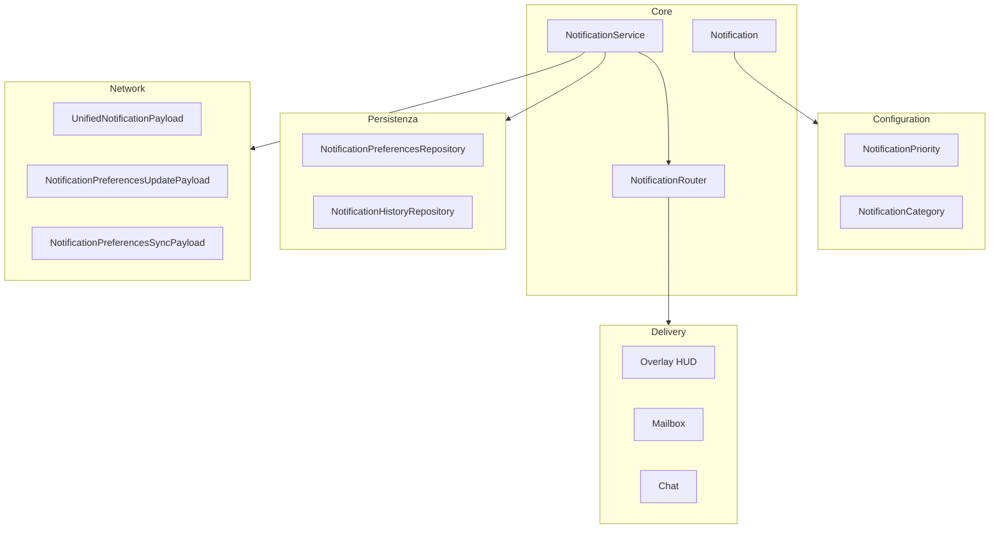
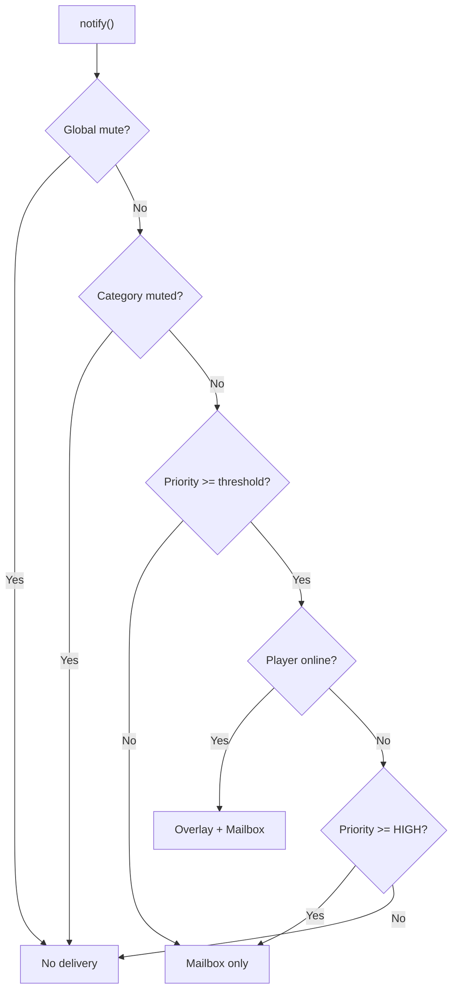

# Notification System

> Ultimo aggiornamento: 2025-12-30

Sistema notifiche unificato con routing, persistenza e preferenze utente.

---

## Panoramica



---

## Struttura Package

```
com.devmod.notification/
├── Notification.java                    # Record notifica
├── NotificationPriority.java            # Enum priorità
├── NotificationCategory.java            # Enum categorie
├── NotificationService.java             # Servizio principale
├── NotificationRouter.java              # Routing logic
├── PartyNotificationBridge.java         # Bridge eventi party
├── NotificationParamsCodec.java         # JSON codec
├── PartyInviteActionData.java           # Action data inviti
├── NotificationCenterActionData.java    # Action data center
├── network/
│   ├── NotificationNetworkHandler.java
│   ├── UnifiedNotificationPayload.java
│   ├── NotificationPreferencesUpdatePayload.java
│   └── NotificationPreferencesSyncPayload.java
└── persistence/
    ├── NotificationPreferencesRepository.java
    └── NotificationHistoryRepository.java
```

---

## Notification Record

Struttura immutabile per notifiche.

### Campi

| Campo | Tipo | Descrizione |
|-------|------|-------------|
| `id` | UUID | ID univoco |
| `category` | NotificationCategory | Categoria |
| `priority` | NotificationPriority | Priorità |
| `titleKey` | String | Chiave i18n titolo |
| `messageKey` | String | Chiave i18n messaggio |
| `params` | Map<String,String> | Parametri template |
| `iconId` | String | ID icona |
| `soundId` | String | ID suono |
| `actionId` | String | ID azione click |
| `actionDataJson` | String | Dati azione JSON |
| `displayDurationMs` | long | Durata display |
| `createdAt` | Instant | Timestamp creazione |
| `sendToMailbox` | boolean | Persistere in mailbox |
| `showOverlay` | boolean | Mostrare overlay |

### Builder Pattern

```java
Notification notification = Notification.builder()
    .category(NotificationCategory.ACHIEVEMENT)
    .priority(NotificationPriority.HIGH)
    .titleKey("notification.achievement.unlock")
    .messageKey("notification.achievement.desc")
    .param("name", "First Blood")
    .icon("achievement_icon")
    .sound("achievement_sound")
    .action("open_achievements")
    .displayDuration(5000)
    .sendToMailbox(true)
    .build();
```

### Factory Methods

```java
Notification.simple(category, priority, titleKey)
Notification.withMessage(category, priority, titleKey, messageKey)
```

---

## NotificationPriority

Livelli priorità con comportamenti default.

| Priorità | Level | Duration | Banner |
|----------|-------|----------|--------|
| LOW | 0 | 1000ms | No |
| NORMAL | 1 | 3000ms | No |
| HIGH | 2 | 5000ms | Yes |
| URGENT | 3 | 6000ms | Yes |
| CRITICAL | 4 | 8000ms | Yes |

### Metodi

```java
int getLevel()
long getDefaultDurationMs()
boolean shouldUseBannerDisplay()
boolean isAtLeast(NotificationPriority other)
```

---

## NotificationCategory

13 categorie notifiche.

| Categoria | ID | Overlay Default | Mailbox Default |
|-----------|----|-----------------|-----------------|
| PARTY | party | true | true |
| ACHIEVEMENT | achievement | true | true |
| RECORD | record | true | true |
| SEASON | season | true | true |
| TOKEN | token | true | false |
| REWARD | reward | true | true |
| COMBAT | combat | true | false |
| RESONANCE | resonance | true | false |
| QUEST | quest | true | true |
| MAILBOX | mailbox | true | false |
| NEWS | news | true | true |
| ADMIN | admin | true | true |
| SYSTEM | system | true | false |

---

## NotificationService

Singleton per invio notifiche.

### Inizializzazione

```java
NotificationService.initialize()
NotificationService.shutdown()
```

### API Core

```java
// Single player
void notify(UUID playerId, Notification notification)

// Batch
void notifyAll(Collection<UUID> playerIds, Notification notification)

// Broadcast
void broadcast(Notification notification)
```

### Convenience Methods (30+)

```java
// Badge/Achievement
void notifyBadgeUnlock(UUID playerId, String badgeName)
void notifyAchievementUnlock(UUID playerId, String achievementName)
void notifyPrestigeMilestone(UUID playerId, int level)

// Rewards
void notifyTokenGain(UUID playerId, int amount, String reason)
void notifyQuestRewards(UUID playerId, RewardData rewards)
void notifyChallengeReward(UUID playerId, String challengeName)

// Combat
void notifyComboDecay(UUID playerId)
void notifyResonance(UUID playerId, int tier)
void notifyResonanceTier(UUID playerId, int tier)

// Social
void notifyPartyInvite(UUID playerId, PartyInvite invite)
void notifyParty(UUID partyId, PartyEvent event, Map<String,String> params)

// Quest
void notifyRecord(UUID playerId, String recordType, String value)
void notifyQuestEvent(UUID playerId, QuestEvent event)
void notifySeasonTierUp(UUID playerId, int newTier)

// Waves
void notifyWaveStart(UUID playerId, int waveNumber)
void notifyWaveComplete(UUID playerId, int waveNumber)
void notifyChainOffer(UUID playerId, ChainOffer offer)
void notifyChainComplete(UUID playerId, int chainLength)

// Mailbox/News
void notifyMailboxMessage(UUID playerId, String subject)
void notifyNewsArticle(UUID playerId, String title)
void notifyAdmin(UUID playerId, String message)
```

---

## NotificationRouter

Routing basato su preferenze e stato player.

### NotificationPreferences

```java
class NotificationPreferences {
    boolean globalMute;
    NotificationPriority minOverlayPriority;
    boolean preferChatOverOverlay;
    float masterVolume;  // 0.0-1.0
    Map<NotificationCategory, CategoryPreference> categoryPrefs;
}

record CategoryPreference(
    boolean overlayEnabled,
    boolean soundEnabled,
    float soundVolume
)
```

### RoutingDecision

```java
record RoutingDecision(
    boolean sendOverlay,
    boolean sendMailbox,
    boolean sendChat
) {
    boolean hasAnyDelivery()
}
```

### Routing Logic



---

## PartyNotificationBridge

Bridge tra PartyManager events e notification system.

### Eventi Gestiti

| Evento Party | Notifica |
|--------------|----------|
| onInviteSent | Party invite notification |
| onInviteDeclined | Invite declined |
| onInviteExpired | Invite expired |
| onMemberJoined | Member joined party |
| onMemberLeft | Member left party |
| onMemberKicked | Member kicked |
| onPartyDisbanded | Party disbanded |
| onLeadershipTransferred | New leader |
| onQuestStarted | Quest starting |
| onQuestFinished | Quest complete |

---

## Persistenza

### NotificationPreferencesRepository

DuckDB-backed per preferenze utente.

```java
// Schema
CREATE TABLE notification_preferences (
    player_uuid VARCHAR PRIMARY KEY,
    global_mute BOOLEAN,
    min_overlay_priority INTEGER,
    prefer_chat BOOLEAN,
    master_volume FLOAT,
    category_prefs_json VARCHAR
)
```

### NotificationHistoryRepository

DuckDB-backed per storico notifiche.

```java
// Schema
CREATE TABLE notification_history (
    id VARCHAR PRIMARY KEY,
    player_uuid VARCHAR,
    category VARCHAR,
    priority INTEGER,
    title_key VARCHAR,
    message_key VARCHAR,
    params_json VARCHAR,
    icon_id VARCHAR,
    sound_id VARCHAR,
    action_id VARCHAR,
    action_data_json VARCHAR,
    created_at TIMESTAMP,
    read_at TIMESTAMP,
    related_entity_id VARCHAR,
    display_duration_ms INTEGER
)

// Indexes
CREATE INDEX idx_history_player_created ON notification_history(player_uuid, created_at DESC)
CREATE INDEX idx_history_player_category ON notification_history(player_uuid, category)
```

### Metodi Repository

```java
// Preferences
CompletableFuture<NotificationPreferences> loadPreferences(UUID playerId)
void savePreferences(NotificationPreferences prefs)
NotificationPreferences getPreferences(UUID playerId)  // Cached

// History
CompletableFuture<Void> save(UUID playerId, Notification notification)
CompletableFuture<List<Notification>> getHistory(UUID playerId, int limit, int offset)
CompletableFuture<List<Notification>> getHistoryByCategory(UUID playerId, NotificationCategory cat, int limit)
CompletableFuture<Integer> getUnreadCount(UUID playerId)
void markAsRead(UUID notificationId)
void deleteOlderThan(Instant cutoff)
```

---

## Network Payloads

### UnifiedNotificationPayload

Server → Client per display notifica.

**Limiti Sicurezza:**
- MAX_STRING_LENGTH: 512
- MAX_PARAMS_LENGTH: 2048

### NotificationPreferencesUpdatePayload

Client → Server per aggiornamento preferenze.

**Limite:** MAX_JSON_LENGTH: 8192

### NotificationPreferencesSyncPayload

Server → Client per sync preferenze.

---

## Integrazione

### Con MailboxManager

```java
// Persistenza in mailbox con expiration
MailboxManager.addMessage(playerId, message, expirationDays);
```

### Con MessageTemplateRegistry

```java
// Template per messaggi complessi
String formatted = MessageTemplateRegistry.format("achievement_unlock", params);
```

---

## Dipendenze

- `com.devmod.mailbox` - MailboxManager
- `com.devmod.party` - PartyManager
- `com.devmod.telemetry.duckdb` - DuckDBConnectionManager
- PacketDistributor - Network
