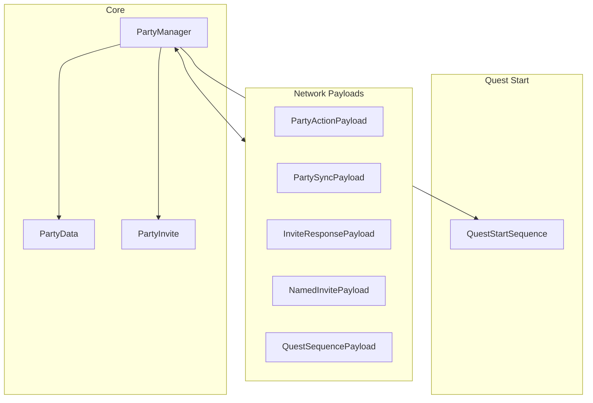
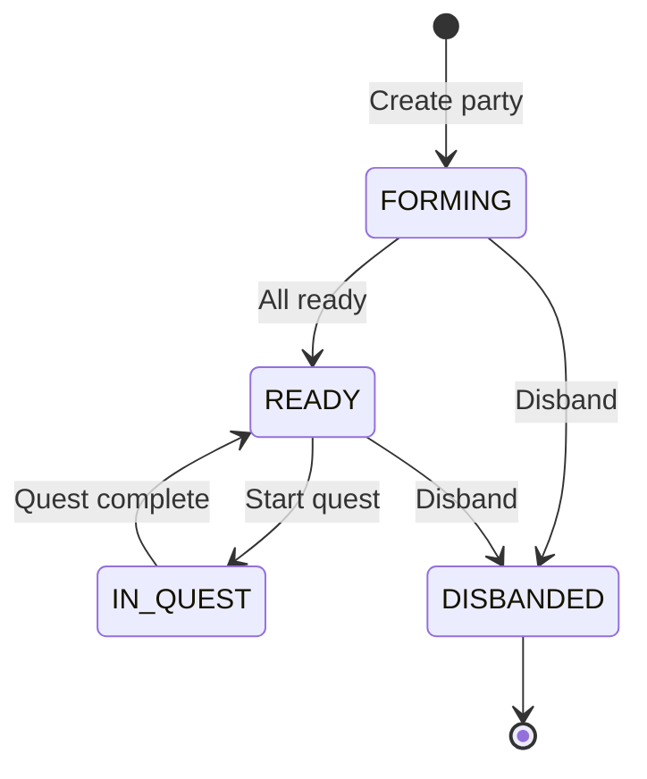
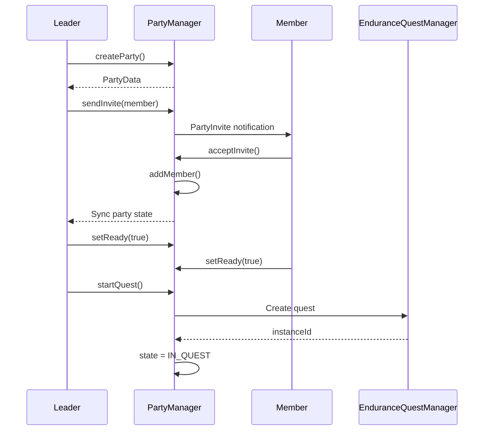
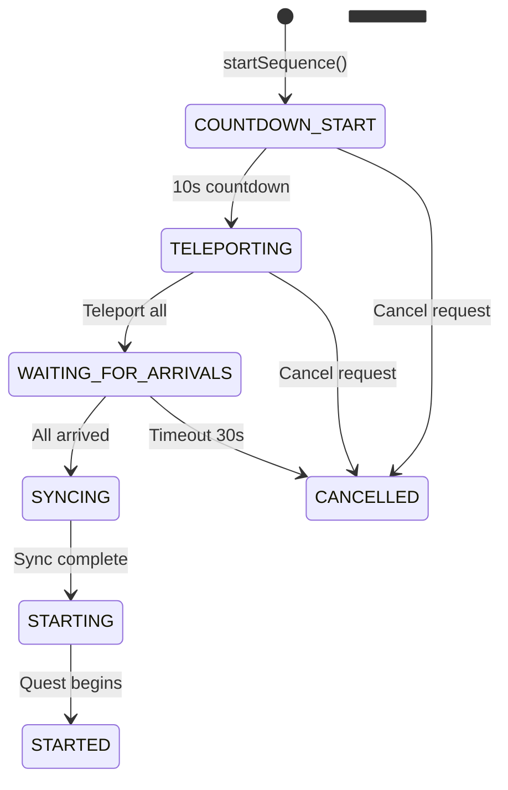

# Party System

> Ultimo aggiornamento: 2025-12-30

Sistema party multiplayer per quest cooperative.

---

## Panoramica



---

## Struttura Package

```
com.devmod.party/
├── PartyManager.java           # Manager singleton
├── PartyData.java              # Dati party
├── PartyInvite.java            # Inviti
├── QuestStartSequence.java     # Sequenza avvio quest
└── payloads/
    ├── PartyActionPayload.java
    ├── PartySyncPayload.java
    ├── InviteResponsePayload.java
    ├── NamedInvitePayload.java
    ├── OnlinePlayersPayload.java
    ├── ArrivalConfirmPayload.java
    ├── CancelSequencePayload.java
    └── QuestSequencePayload.java
```

---

## PartyData

Stato completo del party.

### Campi

| Campo | Tipo | Descrizione |
|-------|------|-------------|
| `partyId` | UUID | ID univoco party |
| `leaderId` | UUID | Leader party |
| `members` | Set<UUID> | Membri (thread-safe) |
| `memberReady` | Map<UUID, Boolean> | Stato ready |
| `pendingInvites` | Map<UUID, PartyInvite> | Inviti pendenti |
| `questType` | QuestType | Tipo quest |
| `selectedMobId` | ResourceLocation | Mob selezionato |
| `state` | PartyState | Stato corrente |
| `instanceId` | UUID | Istanza quest attiva |
| `createdAt` | long | Timestamp creazione |

### PartyState Enum



### Metodi Chiave

```java
// Member management
void addMember(UUID playerId)
void removeMember(UUID playerId)
void kickMember(UUID playerId)
boolean hasMember(UUID playerId)

// Ready status
void setReady(UUID playerId, boolean ready)
boolean isReady(UUID playerId)
boolean allMembersReady()

// Invites
boolean canInvite()
PartyInvite createInvite(UUID senderId, String senderName, UUID receiverId)
void cleanupExpiredInvites()

// Quest
boolean canStartQuest()
void startQuest(UUID instanceId)
void finishQuest()
```

---

## PartyInvite

Rappresenta un invito con timeout.

### Campi

| Campo | Descrizione |
|-------|-------------|
| `inviteId` | UUID invito |
| `senderId` | UUID mittente |
| `senderName` | Nome mittente |
| `receiverId` | UUID destinatario |
| `partyId` | UUID party |
| `questType` | Tipo quest |
| `createdAt` | Timestamp |
| `status` | InviteStatus |

### InviteStatus

- `PENDING` - In attesa risposta
- `ACCEPTED` - Accettato
- `DECLINED` - Rifiutato
- `EXPIRED` - Scaduto (30s timeout)
- `CANCELLED` - Cancellato

### Metodi

```java
boolean isExpired()           // Timeout 30 secondi
long getRemainingTimeMs()
boolean canRespond()          // PENDING e non expired
void accept()
void decline()
```

---

## PartyManager

Singleton per gestione globale party.

### Strutture Dati

```java
Map<UUID, PartyData> parties           // Tutti i party
Map<UUID, UUID> playerToParty          // Player -> Party lookup
Map<UUID, List<PartyInvite>> playerPendingInvites  // Inviti ricevuti
List<PartyEventListener> listeners     // Event subscribers
```

### Lifecycle



### Event Listener Interface

```java
interface PartyEventListener {
    void onPartyCreated(PartyData party);
    void onPartyDisbanded(UUID partyId);
    void onMemberJoined(PartyData party, UUID playerId);
    void onMemberLeft(PartyData party, UUID playerId);
    void onMemberKicked(PartyData party, UUID playerId, UUID kickedBy);
    void onLeadershipTransferred(PartyData party, UUID oldLeader, UUID newLeader);
    void onInviteSent(PartyInvite invite);
    void onInviteDeclined(PartyInvite invite);
    void onInviteExpired(PartyInvite invite);
    void onQuestStarted(PartyData party, UUID instanceId);
    void onQuestFinished(PartyData party);
}
```

---

## QuestStartSequence

Orchestrazione avvio quest multiplayer.

### Fasi



### Timing

| Fase | Durata |
|------|--------|
| PRE_TELEPORT_COUNTDOWN | 10 secondi |
| ARRIVAL_TIMEOUT | 30 secondi |
| WAVE_COUNTDOWN | 10 secondi |

### Validazione Pre-Quest

```java
ValidationResult validatePartyForQuest(MinecraftServer server, PartyData party)
// Checks:
// - Tutti online
// - Tutti vivi
// - Nessuno in combat
// - Nessuna quest attiva
// - Minimo player richiesti
```

### Arrival Confirmation

```java
boolean confirmArrival(UUID partyId, UUID playerId, MinecraftServer server)
// Verifica:
// - Sequenza attiva
// - Player in party
// - Posizione nell'arena bounds
```

---

## Network Payloads

### PartyActionPayload

```java
record PartyActionPayload(
    Action action,
    @Nullable UUID targetPlayerId,
    int questTypeOrdinal,
    @Nullable String mobId
)

enum Action {
    TOGGLE_READY, LEAVE_PARTY, KICK_MEMBER,
    SET_QUEST_TYPE, SET_MOB_TYPE, DISBAND_PARTY,
    START_QUEST, CREATE_PARTY
}
```

### PartySyncPayload

```java
record PartySyncPayload(
    boolean hasParty,
    UUID partyId,
    UUID leaderId,
    List<PartyMemberInfo> members,
    int questTypeOrdinal,
    int stateOrdinal,
    UUID instanceId,
    String selectedMobId
)

record PartyMemberInfo(
    UUID playerId,
    String playerName,
    boolean isReady,
    boolean isLeader,
    boolean isOnline
)
```

### QuestSequencePayload

```java
record QuestSequencePayload(
    UUID partyId,
    Phase phase,
    int secondsRemaining,
    int totalMembers,
    List<UUID> arrivedMembers,
    String title,
    String subtitle,
    List<String> infoLines
)

enum Phase {
    COUNTDOWN_START, TELEPORTING, WAITING_FOR_ARRIVALS,
    SYNCING, STARTING, STARTED, CANCELLED,
    BRIEFING, SAFE_WINDOW, WAVE_INCOMING, BOSS_INTRO
}
```

---

## Sicurezza

### Limiti

| Parametro | Limite |
|-----------|--------|
| MAX_PLAYERS | 100 |
| MAX_MEMBERS | 20 |
| MAX_NAME_LENGTH | 64 |
| MAX_TEXT_LENGTH | 128 |
| INVITE_TIMEOUT | 30 secondi |

### Arena Bounds Check

```java
// Verifica arrivo nella posizione corretta
if (!arenaBounds.contains(player.position())) {
    return false; // Non confermare arrivo
}
```

---

## Integrazione

### Con EnduranceQuestManager

```java
// Avvio quest per party
EnduranceQuestManager.startQuestForParty(partyData, settings);
```

### Con InstanceArenaManager

```java
// Preparazione arena
CompletableFuture<PreparedArena> future =
    InstanceArenaManager.prepareArena(template, policy);
```

### Con NotificationService

```java
// Notifiche party
NotificationService.notifyParty(partyId, PartyEvent.MEMBER_JOINED, params);
```

---

## Dipendenze

- `com.devmod.endurance` - EnduranceQuestManager
- `com.devmod.runtime` - InstanceArenaManager
- `com.devmod.notification` - NotificationService
- `com.devmod.telemetry` - EnduranceTelemetryService
