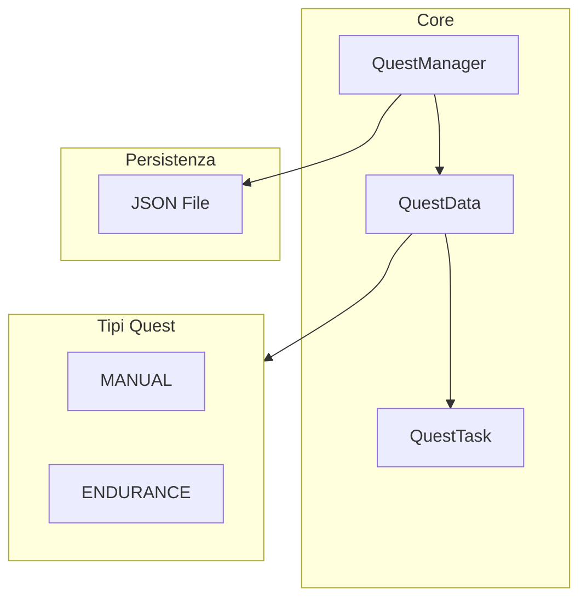

# Quest System

> Ultimo aggiornamento: 2025-12-30

Sistema quest con supporto per quest manuali e endurance.

---

## Panoramica



---

## Struttura Package

```
com.devmod.quest/
├── QuestManager.java    # Manager singleton
├── QuestData.java       # Dati quest
└── QuestTask.java       # Task singolo
```

---

## QuestTask

Rappresenta un singolo task all'interno di una quest.

### Campi

| Campo | Tipo | Descrizione |
|-------|------|-------------|
| `id` | String | ID univoco task |
| `description` | String | Descrizione task |
| `completed` | boolean | Stato completamento |
| `note` | String | Note opzionali |

### Metodi

```java
String getId()
String getDescription()
boolean isCompleted()
void setCompleted(boolean completed)
String getNote()
void setNote(String note)
boolean hasNote()
```

---

## QuestData

Modello dati quest con supporto dual-mode.

### QuestType Enum

```java
enum QuestType {
    MANUAL,     // Quest user-created con task manuali
    ENDURANCE   // Quest auto-generated (wave-based)
}
```

### Campi Base

| Campo | Tipo | Descrizione |
|-------|------|-------------|
| `id` | String | ID univoco quest |
| `name` | String | Nome display |
| `tasks` | List<QuestTask> | Lista task |
| `currentTaskIndex` | int | Indice task corrente |
| `questNote` | String | Note quest |
| `questType` | QuestType | Tipo quest |

### Campi Endurance

| Campo | Tipo | Descrizione |
|-------|------|-------------|
| `targetMobId` | String | Mob da combattere |
| `totalWaves` | int | Numero wave totali |
| `currentWave` | int | Wave corrente (0-based) |
| `endlessMode` | boolean | Modalità infinita |
| `totalKills` | int | Kill totali |
| `totalPoints` | int | Punti accumulati |
| `startTimeMillis` | long | Timestamp inizio |
| `questActive` | boolean | Quest in corso |

### Metodi Task

```java
List<QuestTask> getTasks()
void addTask(QuestTask task)
int getCurrentTaskIndex()
void setCurrentTaskIndex(int index)
QuestTask getCurrentTask()
void advanceToNextTask()
```

### Metodi Progress

```java
float getCompletionPercentage()  // 0.0 - 100.0
boolean isComplete()
String getProgressSummary()       // es. "2/5 tasks"
```

### Metodi Endurance

```java
// Factory method
static QuestData createEnduranceQuest(
    String mobId,
    String mobDisplayName,
    int waves,
    boolean endless
)

// Queries
boolean isEnduranceQuest()
String getTargetMobId()
int getTotalWaves()
int getCurrentWave()
boolean isEndlessMode()

// Progress
void incrementWave()
void addKill()
void addKills(int count)
void addPoints(int points)
int getTotalKills()
int getTotalPoints()

// Lifecycle
void startQuest()
void stopQuest()
boolean isQuestActive()
long getStartTimeMillis()
long getElapsedSeconds()
String getElapsedTimeFormatted()  // "MM:SS"
```

---

## QuestManager

Singleton per gestione globale quest.

### Pattern

```java
public static final QuestManager INSTANCE = new QuestManager();
```

### Strutture Dati

```java
List<QuestData> quests          // Tutte le quest
QuestData activeQuest           // Quest attiva
boolean dirty                   // Flag modifiche non salvate
List<Runnable> changeListeners  // UI callbacks
```

### Metodi Quest Management

```java
void addQuest(QuestData quest)
void removeQuest(String questId)
List<QuestData> getAllQuests()
QuestData getActiveQuest()
void setActiveQuest(QuestData quest)
void setActiveQuestById(String questId)
```

### Metodi Task

```java
QuestTask getCurrentTask()
void completeCurrentTask()
void setCurrentTaskNote(String note)
void setActiveQuestNote(String note)
String getCurrentTaskNote()
```

### Persistenza

```java
void markDirty()
boolean isDirty()
void save()               // Salva se dirty
void load()               // Carica o crea demo
void clearAllQuests()
void createDemoQuest()    // Quest tutorial iniziale
```

### Listeners

```java
void addChangeListener(Runnable listener)
void removeChangeListener(Runnable listener)
void notifyListeners()
```

---

## Persistenza JSON

### File Location

```
config/devmod/quest_data.json
```

### Struttura JSON

```json
{
  "quests": [
    {
      "id": "tutorial_quest",
      "name": "Tutorial Quest",
      "questType": "MANUAL",
      "tasks": [
        {
          "id": "task_1",
          "description": "Complete first objective",
          "completed": false,
          "note": null
        }
      ],
      "currentTaskIndex": 0,
      "questNote": null
    }
  ],
  "activeQuestId": "tutorial_quest"
}
```

### Save/Load

```java
// Internal save data class
class QuestSaveData {
    List<QuestData> quests;
    String activeQuestId;
}

// Save
void save() {
    if (!dirty) return;
    QuestSaveData data = new QuestSaveData();
    data.quests = quests;
    data.activeQuestId = activeQuest != null ? activeQuest.getId() : null;
    String json = GSON.toJson(data);
    Files.writeString(getQuestDataFile(), json);
    dirty = false;
}
```

---

## Demo Quest

Creata automaticamente se non esistono quest:

```java
void createDemoQuest() {
    QuestData demo = new QuestData("tutorial", "Tutorial Quest");
    demo.addTask(new QuestTask("step1", "Open the radial menu (G key)"));
    demo.addTask(new QuestTask("step2", "Access the settings"));
    demo.addTask(new QuestTask("step3", "Test a combat encounter"));
    addQuest(demo);
}
```

---

## Endurance Quest Factory

```java
static QuestData createEnduranceQuest(
    String mobId,
    String mobDisplayName,
    int waves,
    boolean endless
) {
    QuestData quest = new QuestData(
        "endurance_" + System.currentTimeMillis(),
        "Endurance: " + mobDisplayName
    );
    quest.questType = QuestType.ENDURANCE;
    quest.targetMobId = mobId;
    quest.totalWaves = waves;
    quest.endlessMode = endless;

    // Auto-generate wave tasks
    for (int i = 1; i <= waves; i++) {
        quest.addTask(new QuestTask(
            "wave_" + i,
            "Complete Wave " + i
        ));
    }
    if (endless) {
        quest.addTask(new QuestTask("endless", "Survive endless waves"));
    }

    return quest;
}
```

---

## Integrazione UI

### Change Listeners

```java
// In UI initialization
QuestManager.INSTANCE.addChangeListener(() -> {
    refreshQuestDisplay();
});

// In UI cleanup
QuestManager.INSTANCE.removeChangeListener(refreshCallback);
```

### Progress Display

```java
QuestData quest = QuestManager.INSTANCE.getActiveQuest();
if (quest != null) {
    String progress = quest.getProgressSummary(); // "2/5 tasks"
    float percent = quest.getCompletionPercentage();

    if (quest.isEnduranceQuest()) {
        String time = quest.getElapsedTimeFormatted();
        int kills = quest.getTotalKills();
        int wave = quest.getCurrentWave() + 1;
    }
}
```

---

## Dipendenze

- Gson - JSON serialization
- `com.devmod.util.ConfigPaths` - File paths
- SLF4J - Logging
