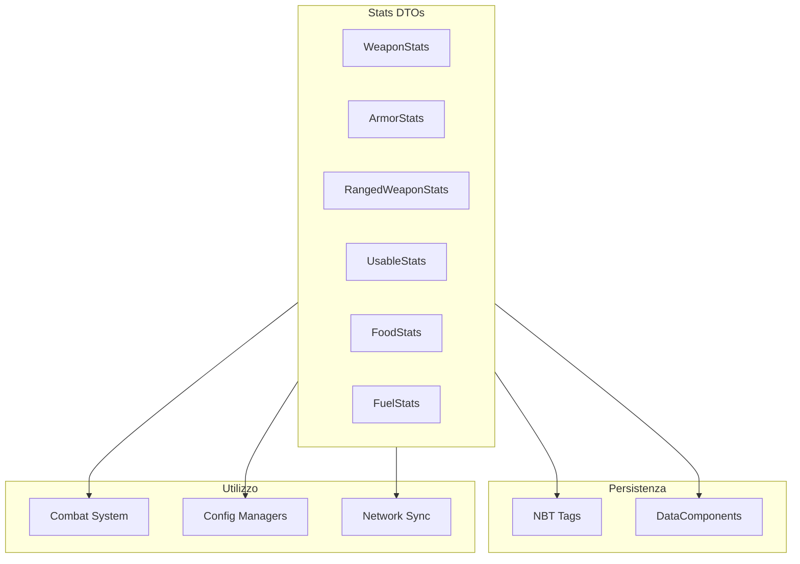
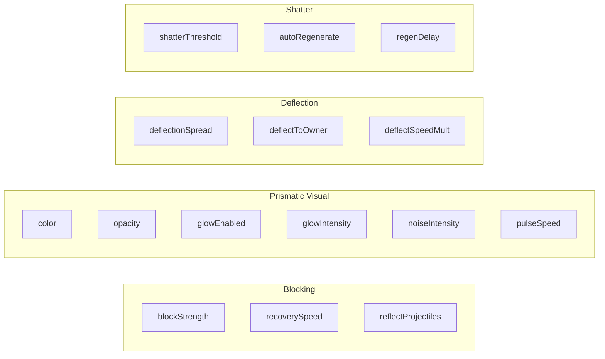

# Stats System

> Ultimo aggiornamento: 2025-12-30

Data Transfer Objects (DTO) per statistiche item con serializzazione NBT.

---

## Panoramica



---

## Struttura Package

```
com.devmod.stats/
├── WeaponStats.java        # Stats armi melee
├── ArmorStats.java         # Stats armature e scudi
├── RangedWeaponStats.java  # Stats armi ranged
├── UsableStats.java        # Stats item consumabili
├── FoodStats.java          # Stats cibo
└── FuelStats.java          # Stats combustibili
```

---

## WeaponStats

Statistiche complete per armi melee.

### Campi Principali

| Categoria | Campi |
|-----------|-------|
| **Hit Location** | headMult, bodyMult, armsMult, legsMult |
| **Core Combat** | attackDamage, attackSpeed, attackReach, attackKnockback |
| **Armor Pen** | armorPenetration, armorShred |
| **Critical** | critChance, critDamage (default 1.5) |
| **Damage Bonus** | baseDamageBonus, damageBonus, sweepingRatio |
| **Type Bonus** | fireDamageBonus, magicDamageBonus, damageVsUndead, damageVsArthropods, damageVsPlayers |
| **Special** | lifesteal, trueDamagePercent |
| **Durability** | maxDurability, currentDamage, repairCost, unbreakable |
| **Tool Rules** | toolRules, toolDefaultMiningSpeed, toolDamagePerBlock, clearToolRules |

### ToolRuleData

```java
class ToolRuleData {
    String blockTag;      // es. "minecraft:mineable/pickaxe"
    float speed;          // velocità mining
    boolean correctForDrops; // drop corretto
}
```

### Metodi

```java
// Serializzazione
void save(CompoundTag tag)
static WeaponStats load(CompoundTag tag)

// Utility
WeaponStats copy()
boolean isDefault()
float calculateDPS(float baseItemDamage)
```

### Esempio DPS

```java
float dps = stats.calculateDPS(baseItemDamage);
// Formula: (baseDamage + attackDamage + baseDamageBonus) * (1 + damageBonus/100) * attackSpeed
```

---

## ArmorStats

Statistiche armatura con sistema scudo avanzato.

### Riduzioni Danno

| Campo | Range | Descrizione |
|-------|-------|-------------|
| `physicalReduction` | 0.0-1.0 | Riduzione danno fisico |
| `fireReduction` | 0.0-1.0 | Riduzione danno fuoco |
| `magicReduction` | 0.0-1.0 | Riduzione danno magico |
| `explosionReduction` | 0.0-1.0 | Riduzione danno esplosione |
| `projectileReduction` | 0.0-1.0 | Riduzione danno proiettile |

### Modificatori Vanilla

| Campo | Descrizione |
|-------|-------------|
| `armorBonus` | Bonus armatura |
| `toughnessBonus` | Bonus toughness |
| `knockbackResistance` | Resistenza knockback |

### Sistema Scudo



### Metodi

```java
float getReductionFor(boolean fire, boolean magic, boolean explosion, boolean projectile)
// Calcola riduzione totale per tipo danno specifico
```

---

## RangedWeaponStats

Statistiche per bow, crossbow e trident.

### Campi

| Campo | Default | Descrizione |
|-------|---------|-------------|
| `drawSpeed` | 1.0 | Velocità caricamento |
| `chargeTime` | - | Tempo carica (ticks) |
| `accuracy` | 1.0 | Precisione |
| `range` | - | Gittata |
| `projectileSpeed` | 3.0 | Velocità proiettile |
| `projectileGravity` | 0.05 | Gravità proiettile |
| `projectileSpread` | 0.0 | Spread proiettile |
| `baseDamage` | - | Danno base |
| `piercing` | 0 | Livello piercing |
| `multishotCount` | 1 | Numero proiettili multishot |
| `infinityOverride` | false | Override infinity |
| `critChance` | 0.0 | Chance critico |
| `critDamage` | 1.5 | Moltiplicatore critico |
| `ammoFilter` | null | Filtro munizioni (ResourceLocation) |

### Trident Specifici

| Campo | Default | Descrizione |
|-------|---------|-------------|
| `riptideDistance` | 1.0 | Distanza riptide |
| `loyaltySpeed` | 1.0 | Velocità ritorno |
| `riptideRequiresWater` | true | Richiede acqua |
| `channeling` | false | Channeling enabled |

### Factory Method

```java
static RangedWeaponStats getStats(ItemStack item)
// Legge da DataComponents e CustomData NBT
// Imposta default in base al tipo arma
```

---

## UsableStats

Statistiche per item consumabili/usabili.

### Campi

| Campo | Descrizione |
|-------|-------------|
| `useDuration` | Durata uso (ticks) |
| `cooldownDuration` | Cooldown dopo uso |
| `useAnimation` | Nome animazione (ItemUseAnimation) |
| `isThrowable` | Può essere lanciato |
| `projectileSpeed` | Velocità proiettile |
| `projectileGravity` | Gravità proiettile |
| `projectileInaccuracy` | Imprecisione |
| `projectileDamage` | Danno proiettile |
| `consumeOnUse` | Consumato all'uso |
| `remainderItem` | Item restante (ResourceLocation) |

---

## FoodStats

Statistiche cibo con effetti pozioni.

### Campi

| Campo | Range | Descrizione |
|-------|-------|-------------|
| `nutrition` | 0-20 | Punti fame |
| `saturation` | 0.0-2.0 | Modificatore saturazione |
| `consumptionTime` | ticks | Tempo consumo |
| `isMeat` | boolean | Commestibile da lupi |
| `isFastFood` | boolean | Consumo veloce |
| `canAlwaysEat` | boolean | Mangiabile sempre |
| `effects` | List | Effetti pozione |

### FoodEffect Record

```java
record FoodEffect(
    String effectId,      // "minecraft:speed"
    int duration,         // ticks
    int amplifier,        // livello - 1
    float probability     // 0.0 - 1.0
)
```

### Calcolo Saturazione

```java
float getActualSaturation() {
    return nutrition * saturation * 2.0f;
}
```

---

## FuelStats

Statistiche combustibili per fornaci.

### Campi

| Campo | Default | Descrizione |
|-------|---------|-------------|
| `burnTime` | - | Tempo combustione (ticks) |
| `overrideDefault` | false | Override vanilla |
| `efficiencyMultiplier` | 1.0 | Moltiplicatore (0.1-3.0) |
| `furnaceCookTime` | 200 | Tempo cottura fornace |
| `blastFurnaceCookTime` | 100 | Tempo cottura blast |
| `smokerCookTime` | 100 | Tempo cottura smoker |
| `campfireCookTime` | 600 | Tempo cottura campfire |
| `customCookTimesEnabled` | false | Abilita tempi custom |

### Metodi Utility

```java
int getEffectiveBurnTime() {
    return (int)(burnTime * efficiencyMultiplier);
}

int getItemsSmeltable() {
    return getEffectiveBurnTime() / 200;
}
```

---

## Pattern Comuni

### Serializzazione NBT

```java
// Save - solo valori non-default
public void save(CompoundTag tag) {
    if (attackDamage != 0) tag.putFloat("attackDamage", attackDamage);
    if (critChance != 0) tag.putFloat("critChance", critChance);
    // ...
}

// Load
public static WeaponStats load(CompoundTag tag) {
    WeaponStats stats = new WeaponStats();
    stats.attackDamage = tag.getFloat("attackDamage");
    stats.critChance = tag.getFloat("critChance");
    // ...
    return stats;
}
```

### Copy Pattern

```java
public WeaponStats copy() {
    WeaponStats copy = new WeaponStats();
    copy.attackDamage = this.attackDamage;
    copy.critChance = this.critChance;
    // ... tutti i campi
    return copy;
}
```

### Default Check

```java
public boolean isDefault() {
    return attackDamage == 0 &&
           critChance == 0 &&
           // ... tutti i campi
           true;
}
```

---

## Dipendenze

- Minecraft NBT (CompoundTag)
- `com.devmod.components` - DataComponents
- `com.devmod.config` - ConfigManagers
