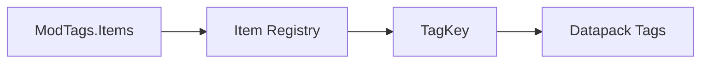

# Tags Package

> Ultimo aggiornamento: 2025-12-30

Definizione tag item per categorizzazione armi e item editabili.

---

## Panoramica



---

## Struttura Package

```
com.devmod.tags/
└── ModTags.java    # Definizione tag
```

---

## ModTags

Classe utility finale con tag items.

### Tag Definiti

| Tag | Descrizione |
|-----|-------------|
| `EDITABLE_MELEE_WEAPONS` | Armi melee editabili nell'editor |
| `EDITABLE_RANGED_WEAPONS` | Armi ranged editabili |
| `EDITABLE_SHIELDS` | Scudi editabili |
| `MELEE_WEAPONS` | Tutte le armi melee |
| `RANGED_WEAPONS` | Tutte le armi ranged |
| `NOT_EDITABLE` | Item esclusi dall'editing |

### Struttura

```java
public final class ModTags {
    private ModTags() {} // No instantiation

    public static final class Items {
        public static final TagKey<Item> EDITABLE_MELEE_WEAPONS;
        public static final TagKey<Item> EDITABLE_RANGED_WEAPONS;
        public static final TagKey<Item> EDITABLE_SHIELDS;
        public static final TagKey<Item> MELEE_WEAPONS;
        public static final TagKey<Item> RANGED_WEAPONS;
        public static final TagKey<Item> NOT_EDITABLE;

        private static TagKey<Item> tag(String name) {
            return TagKey.create(
                Registries.ITEM,
                ResourceLocation.fromNamespaceAndPath(DevMod.MODID, name)
            );
        }
    }
}
```

### Utilizzo

```java
// Check se item è in tag
ItemStack stack = player.getMainHandItem();
if (stack.is(ModTags.Items.EDITABLE_MELEE_WEAPONS)) {
    // Apri editor arma melee
}

// Iterare items in tag
BuiltInRegistries.ITEM.getTag(ModTags.Items.MELEE_WEAPONS)
    .ifPresent(tag -> {
        for (Holder<Item> holder : tag) {
            Item item = holder.value();
            // Process item
        }
    });
```

---

## File Datapack

I tag sono popolati via datapack in:

```
data/devmod/tags/item/
├── editable_melee_weapons.json
├── editable_ranged_weapons.json
├── editable_shields.json
├── melee_weapons.json
├── ranged_weapons.json
└── not_editable.json
```

### Esempio JSON

```json
{
  "replace": false,
  "values": [
    "minecraft:diamond_sword",
    "minecraft:iron_sword",
    "minecraft:golden_sword",
    "minecraft:stone_sword",
    "minecraft:wooden_sword",
    "minecraft:netherite_sword",
    "#c:swords"
  ]
}
```

---

## Integrazione

### Con Item Editor

```java
// In ItemEditorScreen
boolean canEdit(ItemStack stack) {
    if (stack.is(ModTags.Items.NOT_EDITABLE)) {
        return false;
    }
    return stack.is(ModTags.Items.EDITABLE_MELEE_WEAPONS)
        || stack.is(ModTags.Items.EDITABLE_RANGED_WEAPONS)
        || stack.is(ModTags.Items.EDITABLE_SHIELDS);
}
```

### Con Combat System

```java
// In HitHelper
boolean isMeleeWeapon(ItemStack stack) {
    return stack.is(ModTags.Items.MELEE_WEAPONS);
}

boolean isRangedWeapon(ItemStack stack) {
    return stack.is(ModTags.Items.RANGED_WEAPONS);
}
```

---

## Dipendenze

- Minecraft Registries - Item registry
- Minecraft TagKey - Tag system
- `com.devmod.DevMod` - MODID
