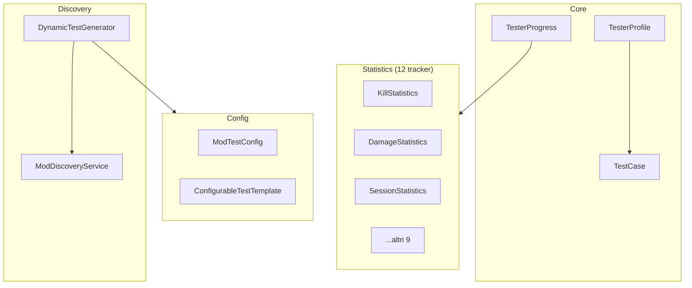

# Testing System

> Ultimo aggiornamento: 2025-12-30

Sistema di testing e progressione con tracking statistiche, achievement e generazione dinamica test.

---

## Panoramica



---

## Struttura Package

```
com.devmod.testing/
├── TestCase.java                    # Modello test case
├── TesterProgress.java              # Aggregatore statistiche
├── TesterProfile.java               # Profilo con XP/achievement
├── DevModArmorTestCases.java        # Test armor predefiniti
├── ModDiscoveryService.java         # Discovery mod caricati
├── DynamicTestGenerator.java        # Generatore test dinamici
├── config/
│   ├── ModTestConfig.java           # Configurazione template
│   └── ConfigurableTestTemplate.java # Template configurabile
└── stats/
    ├── KillStatistics.java          # Kill tracking
    ├── DamageStatistics.java        # Damage tracking
    ├── SessionStatistics.java       # Session tracking
    ├── EnchantmentStatistics.java   # Enchant tracking
    ├── PotionStatistics.java        # Potion tracking
    ├── ModInteractionTracker.java   # Mod interaction
    ├── CombatEventStatistics.java   # Combat events
    ├── OverlayUsageTracker.java     # Overlay usage
    ├── EnvironmentalDamageStats.java # Environmental damage
    ├── ExplosionStatistics.java     # Explosion tracking
    ├── AchievementTracker.java      # Achievement flags
    └── HazardTypeRegistry.java      # Hazard classification
```

---

## TestCase

Modello per singolo test case.

### TestStatus Enum

| Status | Colore | Descrizione |
|--------|--------|-------------|
| PENDING | Grigio | Non iniziato |
| IN_PROGRESS | Giallo | In corso |
| PASSED | Verde | Superato |
| FAILED | Rosso | Fallito |
| SKIPPED | Blu | Saltato |

### TestPriority Enum

| Priorità | Ordine |
|----------|--------|
| CRITICAL | 0 |
| HIGH | 1 |
| MEDIUM | 2 |
| LOW | 3 |

### Campi Principali

```java
String id, category, name, description, instructions
TestPriority priority
TestStatus status
Supplier<Boolean> autoValidator      // Auto-validazione
Function<TesterProgress, Float> progressChecker  // Progress 0.0-1.0
String testerComment, errorLog
float cachedProgress
```

### Metodi

```java
// Lifecycle
void startTest()
void markPassed() / markFailed() / markSkipped()
void reset()

// Validazione
boolean tryAutoValidate()
boolean runAutoValidation()

// Progress
float getProgress()
boolean checkAutoComplete()

// Report
String toReportString()
```

---

## TesterProgress

Singleton che aggrega 11 tracker specializzati.

### Delegate Services

```java
KillStatistics killStats
DamageStatistics damageStats
EnvironmentalDamageStats envStats
ExplosionStatistics explosionStats
PotionStatistics potionStats
EnchantmentStatistics enchantStats
ModInteractionTracker modTracker
CombatEventStatistics combatStats
OverlayUsageTracker overlayTracker
SessionStatistics sessionStats
AchievementTracker achievementTracker
```

### Metodi Recording

```java
void onMobKill(EntityType, Item weapon, BodyPart, boolean crit)
void onDamageDealt(float amount, BodyPart, Item weapon)
void onDamageTaken(float amount, DamageSource)
void onExplosion(boolean tnt, boolean creeper, int mobsKilled)
void onPotionUsed(MobEffect effect)
void onEnchantedKill(Enchantment enchant)
void onOverlayToggle(String overlayName)
void onSessionStart()
```

### Metodi Query

```java
int getTotalKills()
double getTotalDamageDealt()
int getHeadshots()
int getMobsKilledFromMod(String modId)
boolean hasInteractedWithMod(String modId)
```

### Persistenza

```java
void save() / load() / flush() / reset()
```

---

## TesterProfile

Profilo tester con sistema XP, achievement e badge.

### Sistema XP (7 livelli)

| Livello | Titolo | XP Richiesti |
|---------|--------|--------------|
| 1 | Novice | 0 |
| 2 | Apprentice | 100 |
| 3 | Journeyman | 300 |
| 4 | Expert | 600 |
| 5 | Master | 1000 |
| 6 | Grandmaster | 1500 |
| 7 | Legend | 2500 |

### Achievement Enum (40+ tipi)

**Categorie:**
- Kill, Combat, Precision, Alchemy
- Testing, Special, Exploration, Survival

### Badge Enum (7 tipi)

```java
BRONZE_TESTER, SILVER_TESTER, GOLD_TESTER, DIAMOND_TESTER
SPECIALIST, COMPLETIONIST, PERFECTIONIST
```

### Sistema Streak

```java
int currentDailyStreak
int maxDailyStreak
LocalDate lastTestDate
int testsCompletedToday
```

### Metodi

```java
// XP
void awardXP(int amount)
int calculateLevel()
float getXPProgress()

// Achievement
void unlockAchievement(Achievement)
void checkAchievements()
boolean hasAchievement(Achievement)

// Badge
void earnBadge(Badge)
void checkLevelBadges()
void checkCategoryBadges()

// Streak
void onTestCompleted()
float getStreakBonus()
```

---

## ModDiscoveryService

Singleton per discovery mod caricati.

### ModInfo

```java
record ModInfo(
    String modId,
    String displayName,
    String version,
    String description,
    List<Item> items,
    List<Block> blocks,
    List<EntityType> entities,
    List<MobEffect> effects,
    List<Enchantment> enchantments,
    List<Item> weapons,
    List<Item> armor,
    List<EntityType> hostileMobs
) {
    int getTotalContent()
    boolean hasCombatContent()
}
```

### ModCategory Enum (10 categorie)

```java
COMBAT, MAGIC, CREATURES, TOOLS, WORLD
FOOD, TECH, DECORATION, LIBRARY, UNKNOWN
```

### Metodi

```java
void scanMods()  // Discover all mods
List<ModInfo> getAllMods()
ModInfo getMod(String modId)
List<ModInfo> getModsByCategory(ModCategory)
List<ModInfo> getCombatMods()
List<Item> getAllWeapons()
List<EntityType> getAllHostileMobs()
String getSummary()
```

---

## DynamicTestGenerator

Generatore dinamico test basato su mod caricati.

### TestTemplate Interface

```java
interface TestTemplate {
    List<TestCase> generateTests(ModInfo mod)
    boolean appliesTo(ModInfo mod)
    String getName()
}
```

### Template Built-in

| Template | Descrizione |
|----------|-------------|
| DevModCoreTestTemplate | Test core DevMod |
| WeaponTestTemplate | Test armi con progress |
| MobTestTemplate | Test mob e boss |
| EffectTestTemplate | Test pozioni |
| ArmorTestTemplate | Test armature |
| GenericModTestTemplate | Compatibilità generica |
| IronSpellbooksTestTemplate | Template Iron's Spellbooks (9 scuole, 11 armor set) |

### Metodi

```java
void generateAllTests()
void registerTemplate(TestTemplate)
Map<String, List<TestCase>> getAllGeneratedTests()
List<TestCase> getTestsForMod(String modId)
List<TestCase> getAllTestsFlat()
int getTotalTestCount()
void regenerate()
String getSummary()
```

---

## Statistics Tracker (12 classi)

Tutti singleton thread-safe con persistenza JSON.

### KillStatistics

```java
// Tracking
Map<EntityType, Integer> killsByMobType
Map<Item, Integer> killsByWeapon
Map<BodyPart, Integer> killsByBodyPart
int totalKills, headshots, criticalHits
int currentKillStreak, maxKillStreak  // 10s timeout

// Metodi
void recordKill(EntityType, Item, BodyPart, boolean crit)
boolean hasKilledWithAllBodyParts()
```

### DamageStatistics

```java
// Thread-safe counters
DoubleAdder totalDamageDealt
DoubleAdder totalDamageTaken
LongAdder hitsDealt
double highestSingleHit  // Synchronized

// Metodi
void recordDamageDealt(float, BodyPart, Item)
void recordDamageTaken(float)
```

### EnvironmentalDamageStats

```java
// Per-hazard tracking
EnumMap<HazardType, Double> damageByType

// HazardType enum
FALL, FIRE, LAVA, DROWNING, EXPLOSION
POISON, WITHER, FREEZING, LIGHTNING
CACTUS, VOID, MAGIC, UNKNOWN

// Metodi
void recordEnvironmentalDamage(DamageSource, float)
// Returns true se prima esplosione sopravvissuta
```

### HazardTypeRegistry

Registry config-driven per classificazione hazard.

```java
// Pattern matching
record HazardPattern(
    HazardType type,
    List<String> patterns,
    boolean triggerAchievement,
    String achievementId
)

// Metodi
void load()  // Da JSON
HazardType classify(DamageSource)
void reload()
```

---

## Config System

### ModTestConfig

```java
class TestTemplateConfig {
    String modId, displayName, templateName
    List<SchoolDefinition> magicSchools
    List<String> armorSets
    List<MobDefinition> mobs
    List<String> structures
    List<CraftingStationDefinition> craftingStations
    List<SpellbookTierDefinition> spellbookTiers
    List<TestDefinition> coreTests, customTests
    boolean generateSchoolTests, generateArmorTests
    boolean generateMobTests, generateStructureTests
}
```

### ConfigurableTestTemplate

Implementa TestTemplate leggendo da config.

```java
// Progress evaluation
float evaluateProgress(TestDefinition, TesterProgress)
// Condizioni: killed_mobs, armor_used, weapon_used
```

---

## Dipendenze

- Gson - Serializzazione JSON
- NeoForge ModList - Discovery mod
- Minecraft Registries - Item/Entity lookup
- `com.devmod.util.ConfigPaths` - File paths
- SLF4J - Logging
- Java Concurrent - Thread safety
