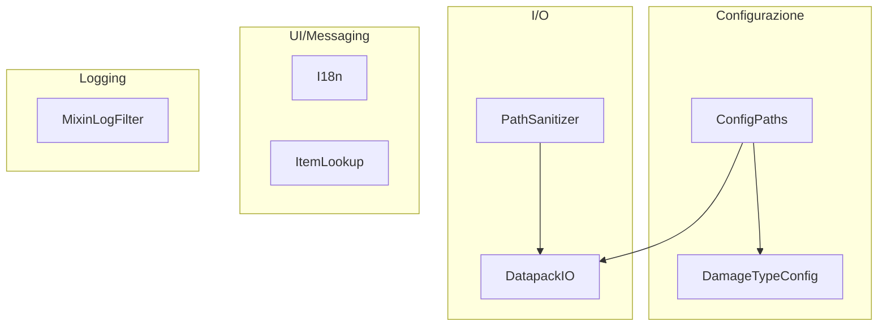
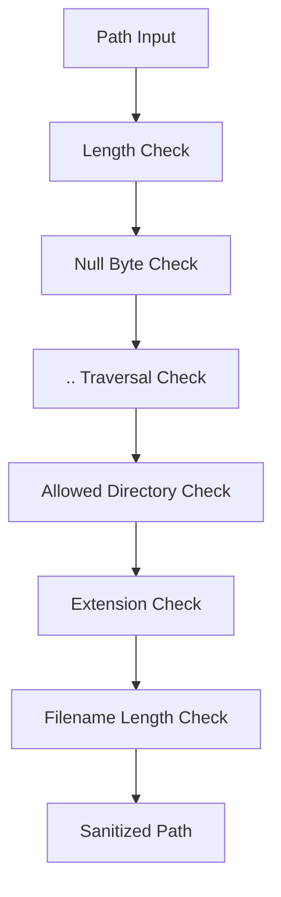
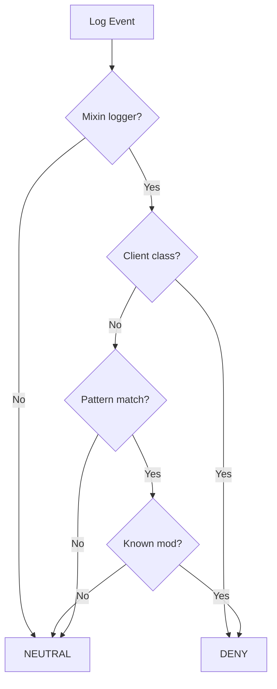

# Util Package

> Ultimo aggiornamento: 2025-12-30

Utility per configurazione, internazionalizzazione, I/O e sicurezza.

---

## Panoramica



---

## Struttura Package

```
com.devmod.util/
├── ConfigPaths.java        # Path configurazione
├── I18n.java               # Internazionalizzazione
├── ItemLookup.java         # Item registry lookup
├── DamageTypeConfig.java   # Config tipi danno
├── DatapackIO.java         # Import/export datapack
├── PathSanitizer.java      # Sicurezza path
└── MixinLogFilter.java     # Filtro log mixin
```

---

## ConfigPaths

Utility per path file di configurazione.

### Path Principali

```java
// Directory base
Path getConfigDir()           // config/devmod/
Path getGameDir()             // Directory gioco

// Config
Path getSettingsFile()        // settings.json
Path getMobConfigsDir()       // mob configs
Path getMobConfigsFile()      // mob_configs.json

// Telemetry
Path getTelemetrySettingsFile()
Path getTelemetryRoomsFile()
Path getTelemetryExportDir()

// Testing
Path getTestTemplatesDir()
Path getQASessionFile()
Path getTutorialFile()
Path getTesterProfileFile()
Path getTesterProgressFile()

// Quest
Path getQuestDataFile()

// Damage
Path getDamageTypesFile()
Path getDamageStatisticsFile()

// HUD
Path getImpactHudPresetsFile()

// Editor
Path getRecipesDir()
Path getItemEditorDir()
Path getItemEditorExportsDir()

// Weapon lists
Path getWeaponWhitelistFile()
Path getWeaponBlacklistFile()

// Reports
Path getQAReportsDir()
Path getLatestLogFile()
```

---

## I18n

Utility per componenti traducibili.

### Metodi Base

```java
// Traduzioni
Component translate(String key)
Component translate(String key, Object... args)

// Literal
Component literal(String text)
```

### Metodi Specializzati

```java
// Overlay status
Component overlayStatus(String overlayKey, boolean enabled)
// Output: "Debug Overlay: ON" (verde) o "OFF" (rosso)

Component overlayStatusWithCount(
    String overlayKey,
    boolean enabled,
    int count,
    String countKey
)

// Screen titles
Component screenTitle(String screenKey)
Component screenTitle(String screenKey, String name)

// UI elements
Component ui(String key)
Component ui(String key, Object... args)

// Feedback
Component error(String messageKey)    // Rosso
Component success(String messageKey)  // Verde
Component errorWithDetails(String key, String details)

// Network
Component network(String key)
Component network(String key, Object... args)

// Endurance
Component endurance(String key)
Component endurance(String key, Object... args)
```

---

## ItemLookup

Lookup item dal registry.

```java
Item getItem(ResourceLocation id)
// Usa BuiltInRegistries.ITEM
```

---

## DamageTypeConfig

Singleton per mapping tipi danno → label display.

### Inizializzazione

```java
// 50+ mapping default con formatting Minecraft
initializeDefaults()
// Es: "minecraft:player_attack" → "§cMelee Attack"
```

### Metodi

```java
// Load/Save
void load()   // Da JSON o crea default
void reload() // Reload runtime
void save()   // Persiste su disco

// Query
String getLabel(ResourceKey<?> damageTypeKey)
String getLabel(String resourceLocation)
String getLabelWithFallback(ResourceKey<?> key)
String getLabelWithFallback(String resourceLocation)

// Utility
String formatUnknownLabel(String resourceLocation)
// Converte snake_case → Title Case con colori

// Modifica
void setLabel(String resourceLocation, String label)
boolean hasLabel(ResourceKey<?> key)
Map<String, String> getAllMappings()
boolean isConfigLoaded()
```

---

## DatapackIO

Import/export override armi e armature in formato datapack.

### Export

```java
int exportOverrides(String packName)
// Esporta a: datapacks/<packName>/
// Crea:
// - pack.mcmeta
// - data/devmod/armor_overrides/*.json
// - data/devmod/weapon_overrides/*.json
// Ritorna: numero file esportati
```

### Import

```java
int importOverrides(String packName)
// Importa da: datapacks/<packName>/
// Ritorna: numero file importati
```

### Utility Interne

```java
void writePackMeta(Path base)
void writeArmor(Path, ResourceLocation, ArmorStats)
void writeWeapon(Path, ResourceLocation, WeaponStats)
JsonObject createExportMetadata()  // Timestamp + version
String getModVersion()
JsonObject readJson(Path file)
ArmorStats parseArmor(JsonObject)
WeaponStats parseWeapon(JsonObject)
```

---

## PathSanitizer

Sicurezza per operazioni file.

### Limiti

```java
MAX_FILENAME_LENGTH = 255
MAX_PATH_LENGTH = 4096

ALLOWED_READ_EXTENSIONS =
    {".json", ".toml", ".txt", ".log", ".md", ".jsonl", ".csv"}

ALLOWED_WRITE_EXTENSIONS =
    {".json", ".txt", ".md", ".jsonl", ".csv", ".png"}
```

### Sanitizzazione

```java
// Per lettura
Optional<Path> sanitizeForRead(Path path)
Optional<Path> sanitizeForRead(String pathStr)

// Per scrittura
Optional<Path> sanitizeForWrite(Path path)
Optional<Path> sanitizeForWrite(String pathStr)
```

### Controlli Eseguiti



### Utility

```java
// Filename sicuro
String sanitizeFilename(String filename)
// Solo: alphanumeric, dash, underscore, dot

// Build path sicuro
Optional<Path> buildSafePath(Path baseDir, String... subPath)

// Crea directory sicure
boolean createDirectoriesSafe(Path path)

// Check directory
boolean isPathInAllowedDirectory(Path path)
Set<Path> getAllowedBaseDirs()
```

---

## MixinLogFilter

Filtro Log4j2 per sopprimere warning mixin client-side.

### Pattern Filtrati

```java
// Regex pattern
MIXIN_TARGET_PATTERN = "target .* was not found"

// Mod con mixin client-only
KNOWN_CLIENT_MIXIN_MODS = {
    "scholar", "shield_api", "create", "jei",
    "jade", "rubidium", "embeddium", "sodium"
}

// Indicatori classi client
CLIENT_MIXIN_INDICATORS = {
    "ClientLevel", "Screen", "RenderSystem",
    "GuiGraphics", "KeyMapping", "Minecraft"
}
```

### Metodi

```java
// Installazione
static void install()  // Su root logger e tutti i logger
static boolean isInstalled()

// Stats
static int getFilteredCount()
static void logSummary()  // Log statistiche soppressione
```

### Logica Filtro



---

## Dipendenze

- NeoForge FMLPaths - Path di gioco
- Minecraft Registries - Item lookup
- Minecraft Component - UI text
- Gson - JSON serialization
- Log4j2 - Logging filter
- SLF4J - Logging
- Java NIO - File I/O
- `com.devmod.config.*` - Config managers
- `com.devmod.stats.*` - Stats classes
