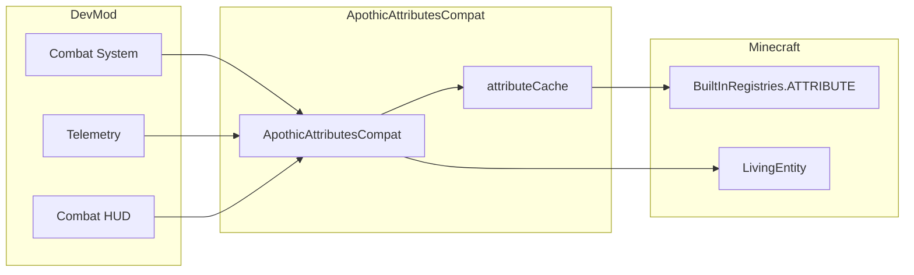

# Apothic Attributes Integration

> Last updated: 2025-12-30
> Status: CURRENT (verified against code)

## Overview

- Mod ID: `apothic_attributes`
- Module: `com.devmod.compat.mods.apothicattributes.ApothicAttributesCompat`
- Registration: `ModIntegrationManager`
- Gating: Registry lookup only; no hard dependency on Apothic Attributes
- Source: [GitHub](https://github.com/Shadows-of-Fire/Apothic-Attributes)

## Description

Apothic Attributes is a library mod that provides RPG-style attributes to Minecraft. This integration allows DevMod's combat and telemetry systems to read and utilize these extended attributes when present.

## Namespace History

| Version | Namespace |
|---------|-----------|
| 1.20.x | `attributeslib:*` |
| 1.21.x | `apothic_attributes:*` |

## Supported Attributes

### Combat Attributes

| Constant | ResourceLocation | Description |
|----------|-----------------|-------------|
| `CRIT_CHANCE` | `apothic_attributes:crit_chance` | Probability of critical strike (base: 5%) |
| `CRIT_DAMAGE` | `apothic_attributes:crit_damage` | Critical hit damage multiplier |
| `LIFE_STEAL` | `apothic_attributes:life_steal` | % damage returned as healing |
| `DODGE_CHANCE` | `apothic_attributes:dodge_chance` | Probability to dodge attacks |
| `ARMOR_PIERCE` | `apothic_attributes:armor_pierce` | Ignores flat armor points |
| `ARMOR_SHRED` | `apothic_attributes:armor_shred` | Reduces target armor permanently |
| `PROT_PIERCE` | `apothic_attributes:prot_pierce` | Ignores protection enchantments |
| `PROT_SHRED` | `apothic_attributes:prot_shred` | Reduces protection effectiveness |

### Ranged Attributes

| Constant | ResourceLocation | Description |
|----------|-----------------|-------------|
| `ARROW_DAMAGE` | `apothic_attributes:arrow_damage` | Bonus arrow damage |
| `ARROW_VELOCITY` | `apothic_attributes:arrow_velocity` | Arrow speed multiplier |
| `DRAW_SPEED` | `apothic_attributes:draw_speed` | Bow draw speed multiplier |

### Elemental Damage

| Constant | ResourceLocation | Description |
|----------|-----------------|-------------|
| `COLD_DAMAGE` | `apothic_attributes:cold_damage` | Bonus cold damage |
| `FIRE_DAMAGE` | `apothic_attributes:fire_damage` | Bonus fire damage |
| `CURRENT_HP_DAMAGE` | `apothic_attributes:current_hp_damage` | % current HP as bonus damage |

### Utility Attributes

| Constant | ResourceLocation | Description |
|----------|-----------------|-------------|
| `MINING_SPEED` | `apothic_attributes:mining_speed` | Mining speed bonus |
| `EXPERIENCE_GAINED` | `apothic_attributes:experience_gained` | XP gain multiplier |
| `HEALING_RECEIVED` | `apothic_attributes:healing_received` | Healing received multiplier |
| `GHOST_HEALTH` | `apothic_attributes:ghost_health` | Temporary health buffer |
| `OVERHEAL` | `apothic_attributes:overheal` | Allows healing above max HP |

## Exposed Helpers

```java
// Availability check
ApothicAttributesCompat.isAvailable()

// Generic attribute access
ApothicAttributesCompat.getAttribute(String attributeId)
ApothicAttributesCompat.getAttributeValue(LivingEntity, String attributeId)
ApothicAttributesCompat.getAttributeBaseValue(LivingEntity, String attributeId)

// Combat shortcuts
ApothicAttributesCompat.getCritChance(LivingEntity)
ApothicAttributesCompat.getCritDamage(LivingEntity)
ApothicAttributesCompat.getLifeSteal(LivingEntity)
ApothicAttributesCompat.getArmorShred(LivingEntity)
ApothicAttributesCompat.getArmorPierce(LivingEntity)
ApothicAttributesCompat.getDodgeChance(LivingEntity)

// Ranged shortcuts
ApothicAttributesCompat.getArrowDamage(LivingEntity)
ApothicAttributesCompat.getArrowVelocity(LivingEntity)
ApothicAttributesCompat.getDrawSpeed(LivingEntity)

// Utility shortcuts
ApothicAttributesCompat.getMiningSpeed(LivingEntity)
ApothicAttributesCompat.getExperienceGained(LivingEntity)
ApothicAttributesCompat.getHealingReceived(LivingEntity)

// Bulk queries
ApothicAttributesCompat.getAllAttributeValues(LivingEntity)
ApothicAttributesCompat.getCombatAttributes(LivingEntity)
ApothicAttributesCompat.hasApothicAttributes(LivingEntity)

// Display helpers
ApothicAttributesCompat.getCombatStatsString(LivingEntity)
ApothicAttributesCompat.getDisplayName(String attributeId)
ApothicAttributesCompat.getStatusSummary()
```

## Usage Pattern

```java
// Check availability before use
if (ApothicAttributesCompat.isAvailable()) {
    double critChance = ApothicAttributesCompat.getCritChance(player);
    if (random.nextDouble() < critChance) {
        double critMultiplier = ApothicAttributesCompat.getCritDamage(player);
        damage *= critMultiplier;
    }

    // Apply lifesteal
    double lifesteal = ApothicAttributesCompat.getLifeSteal(player);
    if (lifesteal > 0) {
        player.heal((float)(damage * lifesteal));
    }
}
```

## Data Flow



## Implementation Notes

- Uses `BuiltInRegistries.ATTRIBUTE.getHolder()` for attribute resolution
- Caches attribute holders in `Map<String, Optional<Holder<Attribute>>>`
- Returns `-1` for unavailable attributes (allows caller to detect missing data)
- All methods are no-ops returning safe defaults when mod is not present
- Priority: 22 (high, affects damage calculations)

## Version Compatibility

| DevMod | Apothic Attributes | Minecraft |
|--------|-------------------|-----------|
| 1.21.x | 2.x.x | 1.21.x |

## References

- [Apothic Attributes on CurseForge](https://www.curseforge.com/minecraft/mc-mods/apothic-attributes)
- [GitHub Repository](https://github.com/Shadows-of-Fire/Apothic-Attributes)
