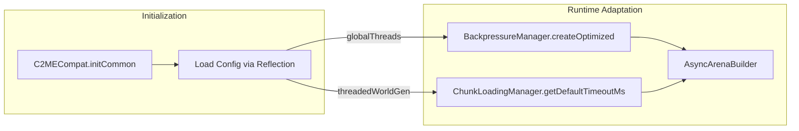

# C2ME Integration

> Last updated: 2025-12-30
> Status: CURRENT (verified against code)

## Overview

- Mod ID: `c2me`
- Module: `com.devmod.compat.mods.c2me.C2MECompat`
- Registration: `ModIntegrationManager`
- Gating: Reflection-based detection; no hard dependency
- Source: [GitHub](https://github.com/RelativityMC/C2ME-fabric)

## Description

C2ME (Concurrent Chunk Management Engine) is a performance mod that parallelizes chunk generation and loading across multiple threads. DevMod's integration adapts arena building parameters based on C2ME's presence and configuration.

## What C2ME Does

- Parallelizes chunk generation across N threads (configurable)
- Enables async serialization for chunk saves
- Reduces MSPT spikes from chunk operations
- Improves overall chunk throughput

## DevMod Integration

When C2ME is detected, DevMod automatically:

1. **Increases block placement rate** - more blocks/tick during arena builds
2. **Raises MSPT threshold** - less aggressive backpressure triggering
3. **Reduces chunk timeout** - parallel loading means faster completion

### Default Values

| Parameter | Without C2ME | With C2ME (4+ threads) | With C2ME (8+ threads) |
|-----------|-------------|------------------------|------------------------|
| `blocksPerTick` | 500 | 650 | 800 |
| `msptThreshold` | 40.0ms | 45.0ms | 50.0ms |
| `chunkTimeoutMs` | 30,000 | 25,000 | 20,000 |

## Exposed Helpers

```java
// Availability checks
C2MECompat.isAvailable()
C2MECompat.isApiAvailable()

// Config queries
C2MECompat.getConfig()                    // Map with globalThreads, asyncSerialization, etc.
C2MECompat.isThreadedWorldGenEnabled()
C2MECompat.isAsyncSerializationEnabled()

// Performance tuning recommendations
C2MECompat.getRecommendedBlocksPerTick()  // 500-800 based on thread count
C2MECompat.getRecommendedMsptThreshold()  // 40.0-50.0 based on features
C2MECompat.getRecommendedChunkTimeoutMs() // 20000-30000 based on features

// Telemetry
C2MECompat.getPerformanceInfo()
C2MECompat.getStatusSummary()
```

## Usage in Arena System

### BackpressureManager

```java
// Factory method auto-detects C2ME and adjusts defaults
BackpressureManager manager = BackpressureManager.createOptimized();

// When C2ME is present, logs:
// "[BackpressureManager] C2ME detected: threshold=50.0ms, blocks/tick=800"
```

### ChunkLoadingManager

```java
// Timeout adapts automatically via getDefaultTimeoutMs()
ChunkLoadResult result = chunkManager.ensureChunksLoaded(minX, minZ, maxX, maxZ);
// Uses 20-30s timeout depending on C2ME presence
```

### AsyncArenaBuilder

```java
// Constructor uses optimized BackpressureManager
AsyncArenaBuilder builder = new AsyncArenaBuilder(telemetry, blockPlacer, msptSupplier);
// Internally calls BackpressureManager.createOptimized()
```

## Data Flow



## Implementation Notes

- Uses reflection to access C2ME internals (multiple package paths tried)
- Config values are cached after first access
- All methods return safe defaults when C2ME is absent
- No compile-time dependency on C2ME
- Priority: 22 (high - affects performance systems)

## Version Compatibility

| DevMod | C2ME | Minecraft |
|--------|------|-----------|
| 1.21.x | 0.3.x | 1.21.x |

## References

- [C2ME on Modrinth](https://modrinth.com/mod/c2me-fabric)
- [C2ME on GitHub](https://github.com/RelativityMC/C2ME-fabric)
