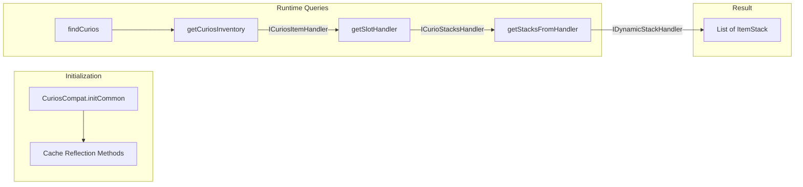

# Curios API Integration

> Last updated: 2025-12-30
> Status: CURRENT (verified against code)

## Overview

- Mod ID: `curios`
- Module: `com.devmod.compat.mods.curios.CuriosCompat`
- Registration: `ModIntegrationManager`
- Gating: Reflection-based detection; no hard dependency
- Source: [GitHub](https://github.com/TheIllusiveC4/Curios)

## Description

Curios API is an equipment slot system that adds customizable accessory slots (rings, necklaces, charms, etc.) to Minecraft. DevMod's integration provides utilities for detecting and querying equipped curios on players and entities.

## What Curios Does

- Adds configurable equipment slots beyond vanilla armor
- Provides API for mods to define custom slot types
- Handles rendering and attribute modifiers for equipped items
- Supports multiple items per slot type (e.g., 2 rings)

## DevMod Integration

When Curios is detected, DevMod provides:

1. **Equipment detection** - Query any entity's equipped curios
2. **Slot-specific queries** - Find items in specific slot types
3. **HUD integration** - Display curio attributes in combat overlays
4. **Item editor support** - Edit curio items via admin tools

### Slot Types

| Constant | Slot ID | Description |
|----------|---------|-------------|
| `SLOT_HEAD` | `head` | Head accessories (crowns, circlets) |
| `SLOT_NECKLACE` | `necklace` | Neck items (amulets, pendants) |
| `SLOT_BACK` | `back` | Back items (capes, wings) |
| `SLOT_BODY` | `body` | Body accessories (belts worn over armor) |
| `SLOT_HANDS` | `hands` | Hand items (gloves, bracelets) |
| `SLOT_RING` | `ring` | Finger rings |
| `SLOT_BELT` | `belt` | Belt items |
| `SLOT_CHARM` | `charm` | Charm items |
| `SLOT_CURIO` | `curio` | Generic curio slot |

## API Architecture

### Curios 9.x Class Hierarchy

```
CuriosApi
└── getCuriosInventory(LivingEntity) → Optional<ICuriosItemHandler>

ICuriosItemHandler
├── getCurios() → Map<String, ICurioStacksHandler>
└── getStacksHandler(String) → Optional<ICurioStacksHandler>

ICurioStacksHandler
├── getStacks() → IDynamicStackHandler
└── getSlots() → int

IDynamicStackHandler (extends IItemHandlerModifiable)
├── getStackInSlot(int) → ItemStack
└── getSlots() → int
```

### Reflection Caching

DevMod caches reflection references at initialization to avoid repeated lookups:

```java
// Cached at init time
private static Class<?> curiosApiClass;
private static Class<?> curiosItemHandlerClass;
private static Class<?> slotStacksHandlerClass;
private static Class<?> dynamicStackHandlerClass;

private static Method getCuriosInventoryMethod;
private static Method getStacksHandlerMethod;
private static Method getCuriosMethod;
private static Method getStacksMethod;
private static Method getSlotsMethod;
private static Method getStackInSlotMethod;      // From IDynamicStackHandler
private static Method getDynamicSlotsMethod;     // From IDynamicStackHandler
```

## Exposed Helpers

```java
// Availability check
CuriosCompat.isAvailable()

// Find curios by slot type
CuriosCompat.findCurios(entity, slotType)        // List<ItemStack>
CuriosCompat.findFirstCurio(entity, slotType)    // Optional<ItemStack>

// Get all equipped curios
CuriosCompat.getAllEquippedCurios(entity)        // List<ItemStack>

// Slot queries
CuriosCompat.hasCurioEquipped(entity, slotType)  // boolean
CuriosCompat.getCurioCount(entity, slotType)     // int
CuriosCompat.getTotalCurioCount(entity)          // int

// Player convenience methods
CuriosCompat.hasRingEquipped(player)             // boolean
CuriosCompat.hasNecklaceEquipped(player)         // boolean
CuriosCompat.getEquippedRings(player)            // List<ItemStack>
CuriosCompat.getEquippedNecklace(player)         // ItemStack (or EMPTY)
```

## Usage Examples

### Check for Ring with Attribute

```java
if (CuriosCompat.isAvailable()) {
    List<ItemStack> rings = CuriosCompat.getEquippedRings(player);
    for (ItemStack ring : rings) {
        if (ring.is(ModItems.POWER_RING)) {
            // Apply bonus
        }
    }
}
```

### Count Total Curios for Combat Calculations

```java
if (CuriosCompat.isAvailable()) {
    int curioCount = CuriosCompat.getTotalCurioCount(entity);
    double bonusMultiplier = 1.0 + (curioCount * 0.05); // +5% per curio
}
```

### Check Necklace for Immunity

```java
ItemStack necklace = CuriosCompat.getEquippedNecklace(player);
if (!necklace.isEmpty() && necklace.is(ModItems.FIRE_AMULET)) {
    // Grant fire immunity
}
```

## Data Flow



## Implementation Notes

- **Reflection-based**: No compile-time dependency on Curios
- **Method caching**: `IDynamicStackHandler` methods cached at init for performance
- **Multiple class paths**: Tries both `api.type.inventory` and `api.type.capability` for `ICurioStacksHandler`
- **Type verification**: Validates `IDynamicStackHandler` type before using cached methods
- **Safe defaults**: All methods return empty collections/optionals when Curios is absent
- **Priority**: 20 (medium-high - equipment API)

### Cached Method Strategy

The integration caches `IDynamicStackHandler.getStackInSlot()` and `getSlots()` at initialization:

```java
// At init: cache methods from IDynamicStackHandler interface
dynamicStackHandlerClass = Class.forName("...IDynamicStackHandler");
getStackInSlotMethod = dynamicStackHandlerClass.getMethod("getStackInSlot", int.class);
getDynamicSlotsMethod = dynamicStackHandlerClass.getMethod("getSlots");

// At runtime: use cached methods (no reflection lookup per call)
Method stackMethod = getStackInSlotMethod;
if (stackMethod == null) {
    // Fallback to runtime reflection only if interface not found at init
    stackMethod = stackHandler.getClass().getMethod("getStackInSlot", int.class);
}
```

This avoids `getMethod()` calls on every item access, improving performance for frequent curio queries.

## Version Compatibility

| DevMod | Curios | Minecraft | Loader |
|--------|--------|-----------|--------|
| 1.21.x | 9.x | 1.21.1 | NeoForge |

## References

- [Curios on CurseForge](https://www.curseforge.com/minecraft/mc-mods/curios)
- [Curios on Modrinth](https://modrinth.com/mod/curios)
- [Curios GitHub](https://github.com/TheIllusiveC4/Curios)
- [Curios Wiki](https://github.com/TheIllusiveC4/Curios/wiki)
