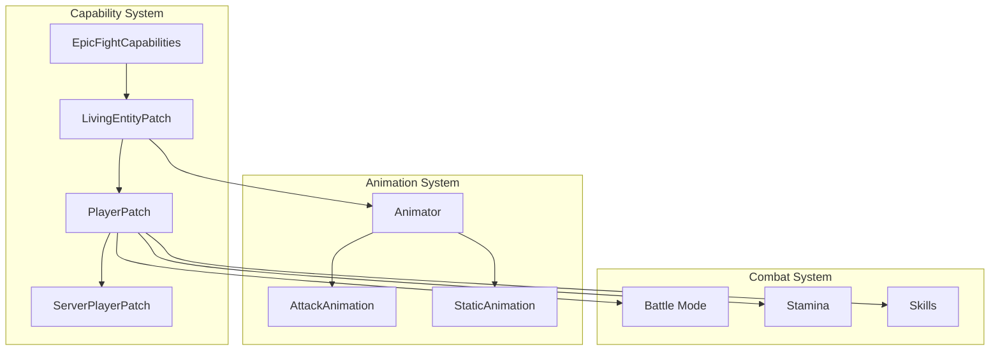
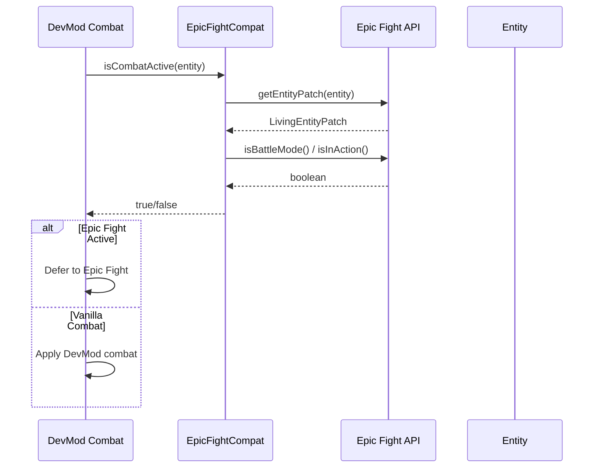
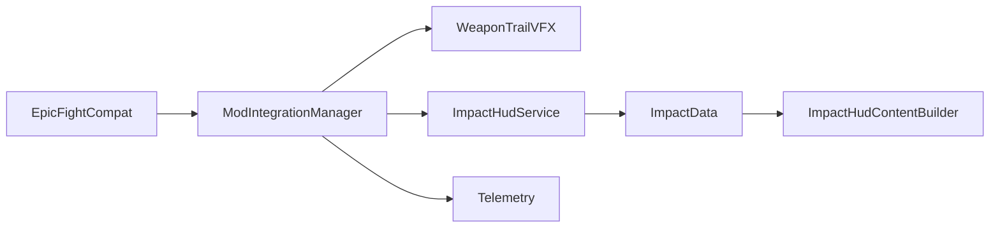

# Epic Fight Integration

> Last updated: 2025-12-30
> Status: CURRENT (verified against code)

## Overview

- Mod ID: `epicfight`
- Module: `com.devmod.compat.mods.epicfight.EpicFightCompat`
- Registration: `ModIntegrationManager`
- Gating: Reflection-based detection; no hard dependency
- Source: [GitHub](https://github.com/Epic-Fight/epicfight)
- Priority: 15 (very high - completely changes combat system)

## Description

Epic Fight is a comprehensive soulslike combat overhaul mod for Minecraft. It replaces the vanilla combat system with animations, combos, skills, stamina, dodging, and more. The mod has over 23 million downloads and is one of the most popular combat mods available.

DevMod integrates with Epic Fight to:
- Detect when Epic Fight combat is active
- Access entity patches for combat state
- Track animations and stamina
- Coordinate combat systems to avoid conflicts

## What Epic Fight Does

- **Combat Overhaul**: Replaces vanilla click-spam with animation-based attacks
- **Battle Mode**: Toggle between Epic Fight and vanilla combat
- **Stamina System**: Actions consume stamina, must manage resource
- **Skills**: Special moves and combos with custom animations
- **Weapon Movesets**: Each weapon type has unique attack patterns
- **Entity Patching**: Modifies entity behavior for combat compatibility
- **AI Combat**: Mobs use Epic Fight combat behaviors

## Epic Fight Architecture



### Core Classes

| Class | Package | Purpose |
|-------|---------|---------|
| `EpicFightCapabilities` | `yesman.epicfight.world.capabilities` | Access entity patches |
| `LivingEntityPatch` | `yesman.epicfight.world.capabilities.entitypatch` | Base patch for living entities |
| `PlayerPatch` | `yesman.epicfight.world.capabilities.entitypatch.player` | Player-specific patch |
| `ServerPlayerPatch` | `yesman.epicfight.world.capabilities.entitypatch.player` | Server-side player patch |
| `Animator` | `yesman.epicfight.api.animation` | Animation state management |
| `AttackAnimation` | `yesman.epicfight.api.animation.types` | Attack animation handling |

## DevMod Integration

### Combat Mode Detection

DevMod detects when Epic Fight combat is active to coordinate systems:



### Stamina Integration

For players, DevMod can read Epic Fight's stamina values:

```java
float stamina = EpicFightCompat.getStamina(player);
float maxStamina = EpicFightCompat.getMaxStamina(player);
float percent = EpicFightCompat.getStaminaPercent(player);
```

### Animation Tracking

Track current animation for telemetry and coordination:

```java
String animation = EpicFightCompat.getCurrentAnimationName(entity);
// Returns: "biped_attack_1", "biped_dodge", etc.
```

## Exposed Helpers

```java
// Availability checks
EpicFightCompat.isAvailable()           // true if Epic Fight loaded
EpicFightCompat.isApiAvailable()        // true if API accessible
EpicFightCompat.getStatusSummary()      // "Epic Fight: available [battle-mode] [stamina]"

// Entity patch access
EpicFightCompat.hasEntityPatch(entity)  // true if entity is patched
EpicFightCompat.getEntityPatch(entity)  // Raw patch object
EpicFightCompat.getPlayerPatch(player)  // PlayerPatch object

// Combat state
EpicFightCompat.isInBattleMode(player)  // true if player in battle mode
EpicFightCompat.isInAction(entity)      // true if performing action
EpicFightCompat.isCombatActive(entity)  // true if Epic Fight combat active

// Stamina (players only)
EpicFightCompat.getStamina(player)      // Current stamina (or -1)
EpicFightCompat.getMaxStamina(player)   // Max stamina (or -1)
EpicFightCompat.getStaminaPercent(player) // 0.0-1.0 (or -1)

// Animation
EpicFightCompat.getCurrentAnimationName(entity) // Animation registry name

// Full state (for telemetry)
EpicFightCompat.getCombatState(entity)  // Map with all combat info
EpicFightCompat.getTelemetryInfo()      // Map with integration info
```

## Combat State Map

`getCombatState(entity)` returns:

```java
{
    "available": true,
    "hasEntityPatch": true,
    "inAction": false,
    "currentAnimation": "biped_idle",
    "battleMode": true,        // players only
    "stamina": 85.0,           // players only
    "maxStamina": 100.0,       // players only
    "staminaPercent": 0.85     // players only
}
```

## Combat Attributes

Epic Fight adds custom attributes to the combat system:

| Attribute | Description |
|-----------|-------------|
| **Armor Negation** | Percentage of damage that ignores armor |
| **Impact** | Increases stun duration on hit targets |
| **Max Strikes** | Maximum enemies hit per swing |
| **Weight** | Reduces stun received, increases skill stamina cost |

## Implementation Notes

- Uses reflection to avoid hard dependency on Epic Fight
- All methods return safe defaults when Epic Fight is absent
- Entity patches are accessed via `EpicFightCapabilities.getEntityPatch()`
- Battle mode is player-only (mobs are always in "battle mode")
- Animation names are registry names from Epic Fight

### Package Structure

```java
// Main access point
"yesman.epicfight.world.capabilities.EpicFightCapabilities"

// Entity patches
"yesman.epicfight.world.capabilities.entitypatch.LivingEntityPatch"
"yesman.epicfight.world.capabilities.entitypatch.player.PlayerPatch"
"yesman.epicfight.world.capabilities.entitypatch.player.ServerPlayerPatch"

// Animation
"yesman.epicfight.api.animation.Animator"
"yesman.epicfight.api.animation.types.AttackAnimation"
"yesman.epicfight.gameasset.Animations"
```

## Usage Examples

### Check if Epic Fight Combat Active

```java
public void onEntityAttack(LivingEntity attacker, LivingEntity target) {
    if (EpicFightCompat.isCombatActive(attacker)) {
        // Epic Fight is handling combat - defer or coordinate
        LOGGER.debug("Epic Fight combat active for {}", attacker.getName().getString());
        return;
    }

    // Apply DevMod combat logic
    applyDevModCombat(attacker, target);
}
```

### Monitor Player Stamina

```java
public void onPlayerTick(Player player) {
    if (!EpicFightCompat.isAvailable()) return;

    float staminaPercent = EpicFightCompat.getStaminaPercent(player);
    if (staminaPercent >= 0 && staminaPercent < 0.2f) {
        // Player is low on stamina
        showStaminaWarning(player);
    }
}
```

### Track Animation for Telemetry

```java
public void recordCombatTelemetry(LivingEntity entity) {
    Map<String, Object> state = EpicFightCompat.getCombatState(entity);

    if ((boolean) state.getOrDefault("hasEntityPatch", false)) {
        telemetry.emit("combat.epicfight.state", Map.of(
            "entityType", entity.getType().toString(),
            "battleMode", state.getOrDefault("battleMode", false),
            "animation", state.getOrDefault("currentAnimation", "unknown"),
            "staminaPercent", state.getOrDefault("staminaPercent", -1)
        ));
    }
}
```

## Compatibility Considerations

### With DevMod Combat

When Epic Fight is active, DevMod should:
- Defer damage calculations to Epic Fight
- Use Epic Fight's hit detection for body part targeting
- Track stamina alongside DevMod's own systems
- Log Epic Fight animations in combat telemetry

### With Other Mods

Epic Fight has known compatibility issues with:
- Other combat overhaul mods
- Some entity mods (require datapacks)
- Certain rendering mods

DevMod's integration is read-only and doesn't modify Epic Fight behavior.

## Version Compatibility

| DevMod | Epic Fight | Minecraft |
|--------|------------|-----------|
| 1.21.x | 21.x | 1.21.x |
| 1.20.x | 20.x | 1.20.x |

## Integration Points

Epic Fight è integrato nei seguenti sistemi DevMod:

| Sistema | File | Funzionalità |
|---------|------|--------------|
| Combat VFX | `WeaponTrailVFX.java` | Swing detection via `isInAction()` e `isInBattleMode()` |
| Impact HUD | `ImpactHudService.java` | Auto-detect animation name e combat state |
| HUD Rendering | `ImpactHudContentBuilder.java` | Mostra Epic Fight info nell'overlay |
| Telemetry | `PlayerAttributeTelemetryService.java` | Snapshot con battle mode, stamina, inAction |
| Mod Integration | `ModIntegrationManager.java` | Facade API per tutto il progetto |

### Flusso Dati



## References

- [Epic Fight GitHub](https://github.com/Epic-Fight/epicfight)
- [Epic Fight Wiki](https://epicfight-docs.readthedocs.io/)
- [Epic Fight API Guide](https://epicfight-docs.readthedocs.io/API/Starting/)
- [Epic Fight on Modrinth](https://modrinth.com/mod/epic-fight)
- [Epic Fight on CurseForge](https://www.curseforge.com/minecraft/mc-mods/epic-fight-mod)
