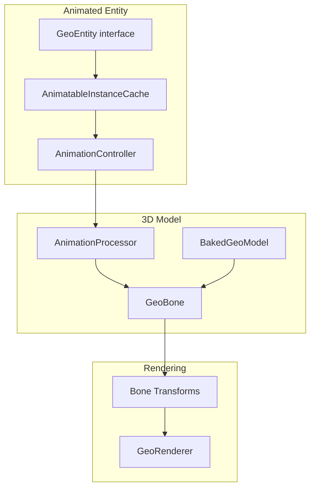
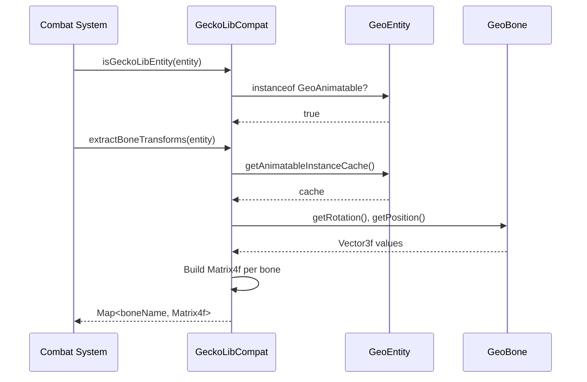

# GeckoLib Integration

> Last updated: 2025-12-30
> Status: CURRENT (verified against code)

## Overview

- Mod ID: `geckolib`
- Modules:
  - `com.devmod.compat.mods.geckolib.GeckoLibModuleCompat` (compat layer)
  - `com.devmod.collision.compat.GeckoLibCompat` (collision detection)
- Registration: `ModIntegrationManager`
- Gating: Reflection-based detection; no hard dependency
- Source: [GitHub](https://github.com/bernie-g/geckolib)
- Priority: 18 (high - affects rendering and collision)

## Description

GeckoLib is a powerful animation engine for Minecraft mods that provides complex 3D keyframe-based animations, 30+ easings, concurrent animation support, sound/particle keyframes, and more. It's used by hundreds of mods for animated entities, blocks, and items.

DevMod integrates with GeckoLib to extract bone transforms for **precision collision detection** on animated entities.

## What GeckoLib Does

- Provides skeletal animation system with hierarchical bones (`GeoBone`)
- Manages animation state via `AnimationController` and `AnimatableInstanceCache`
- Supports multiple animation controllers per entity
- Handles smooth transitions and blending between animations
- Works with Blockbench models exported in GeckoLib format

## GeckoLib Architecture



### Core Classes

| Class | Package | Purpose |
|-------|---------|---------|
| `GeoAnimatable` | `software.bernie.geckolib.animatable` | Base interface for animatable objects |
| `GeoEntity` | `software.bernie.geckolib.animatable` | Entity-specific animatable interface |
| `AnimatableInstanceCache` | `software.bernie.geckolib.animatable.instance` | Per-instance animation data storage |
| `AnimationController` | `software.bernie.geckolib.animation` | Manages animation state and transitions |
| `GeoBone` | `software.bernie.geckolib.cache.object` | Individual bone with position/rotation |
| `BakedGeoModel` | `software.bernie.geckolib.cache.object` | Optimized model with bone hierarchy |

## DevMod Integration

DevMod uses GeckoLib data for two purposes:

### 1. Collision Detection (Body Part Targeting)

Standard Minecraft entities use fixed `ModelPart` hitboxes. GeckoLib entities have dynamic bone transforms that change with animation. DevMod extracts these transforms to calculate accurate hitboxes.



### 2. Animation State Tracking

For telemetry and debugging, DevMod can query active animations:

```java
Map<String, Object> state = GeckoLibModuleCompat.getAnimationState(entity);
// Returns: {isGeckoLib: true, controllerCount: 2, activeAnimations: ["walk", "attack"]}
```

## Exposed Helpers

### GeckoLibModuleCompat (High-level API)

```java
// Availability
GeckoLibModuleCompat.isAvailable()              // true if GeckoLib loaded
GeckoLibModuleCompat.getStatusSummary()         // "GeckoLib: available [animation API]"

// Entity detection
GeckoLibModuleCompat.isGeckoLibEntity(entity)   // true if entity uses GeckoLib
GeckoLibModuleCompat.getGeckoLibEntityType(entity) // Model class name

// Bone transforms
GeckoLibModuleCompat.extractBoneTransforms(entity) // Map<String, Matrix4f>
GeckoLibModuleCompat.mapBoneName("LeftArm")        // "leftArm" (standardized)
GeckoLibModuleCompat.getStandardBoneMappings()     // All bone name mappings

// Animation state
GeckoLibModuleCompat.getAnimationState(entity)  // {controllerCount, activeAnimations}
GeckoLibModuleCompat.isAnimating(entity)        // true if has active animations
```

### GeckoLibCompat (Low-level API)

```java
// Detection
GeckoLibCompat.isGeckoLibPresent()              // Checks classpath
GeckoLibCompat.isGeckoLibEntity(entity)         // instanceof GeoAnimatable

// Transform extraction
GeckoLibCompat.extractGeckoLibTransforms(entity) // Raw bone transforms

// Bone mapping
GeckoLibCompat.mapBoneName(name)                 // Standardize bone name
GeckoLibCompat.STANDARD_BONE_MAPPINGS            // Immutable mapping table
```

## Bone Name Mappings

GeckoLib models use various naming conventions. DevMod maps them to standard names:

| GeckoLib Name | Standard Name |
|---------------|---------------|
| `head`, `Head` | `head` |
| `body`, `Body`, `torso`, `Torso` | `body` |
| `left_arm`, `LeftArm`, `leftArm` | `leftArm` |
| `right_arm`, `RightArm`, `rightArm` | `rightArm` |
| `left_leg`, `LeftLeg`, `leftLeg` | `leftLeg` |
| `right_leg`, `RightLeg`, `rightLeg` | `rightLeg` |

## Implementation Notes

- Uses reflection to avoid hard dependency on GeckoLib
- Supports both GeckoLib 4.x (NeoForge 1.21+) and 3.x (legacy)
- Bone transforms are extracted during entity tick, not render
- Transform matrices include both rotation and position
- All methods return safe defaults when GeckoLib is absent

### Class Detection Paths

```java
// GeckoLib 4.x (current)
"software.bernie.geckolib.animatable.GeoAnimatable"
"software.bernie.geckolib.cache.object.GeoBone"
"software.bernie.geckolib.animatable.instance.AnimatableInstanceCache"
"software.bernie.geckolib.animation.AnimationController"

// GeckoLib 3.x (legacy)
"software.bernie.geckolib3.core.IAnimatable"
"software.bernie.geckolib3.geo.render.built.GeoBone"
```

## Version Compatibility

| DevMod | GeckoLib | Minecraft |
|--------|----------|-----------|
| 1.21.x | 4.x | 1.21.x |
| (legacy) | 3.x | 1.20.x and below |

## Usage Example

```java
// In combat hit detection
public void onEntityHit(LivingEntity target, Vec3 hitPos) {
    if (GeckoLibModuleCompat.isGeckoLibEntity(target)) {
        // Use bone-accurate collision
        Map<String, Matrix4f> bones = GeckoLibModuleCompat.extractBoneTransforms(target);
        String hitBone = findClosestBone(hitPos, bones);
        String bodyPart = GeckoLibModuleCompat.mapBoneName(hitBone);
        applyDamageToBodyPart(target, bodyPart);
    } else {
        // Fall back to standard ModelPart collision
        applyStandardDamage(target);
    }
}
```

## References

- [GeckoLib GitHub](https://github.com/bernie-g/geckolib)
- [GeckoLib Wiki](https://github.com/bernie-g/geckolib/wiki)
- [GeckoLib Entities Guide](https://github.com/bernie-g/geckolib/wiki/Geckolib-Entities-(Geckolib4))
- [GeckoLib on Modrinth](https://modrinth.com/mod/geckolib)
- [GeckoLib on CurseForge](https://www.curseforge.com/minecraft/mc-mods/geckolib)
