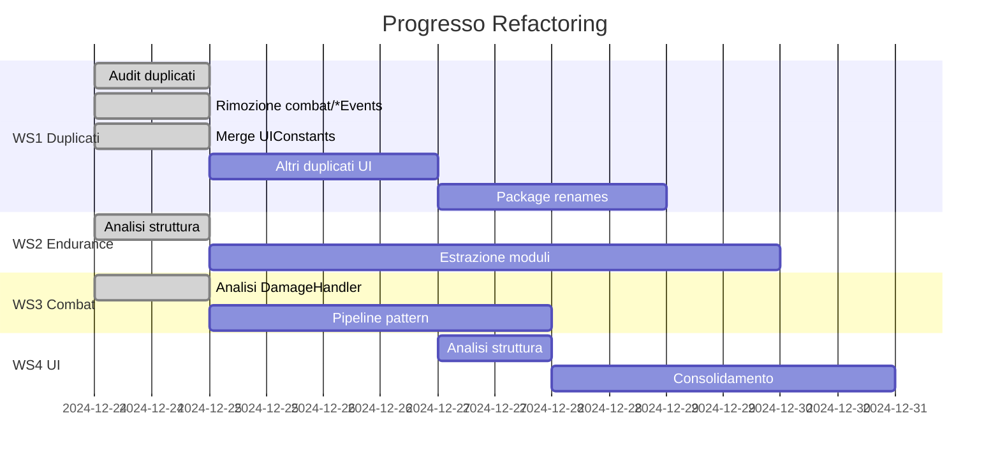

# Piano di Refactor Eseguibile

> Last updated: 2025-12-26
> Status: HISTORICAL

> **Versione**: 1.1
> **Data**: 24 Dicembre 2024
> **Prerequisito**: REFACTOR_AUDIT.md completato
> **Ultimo aggiornamento**: Sessione refactoring duplicati

---

## Stato Esecuzione Corrente



### Completato ✅

| Task | Stato | Note |
|------|-------|------|
| WS1.1: Rimozione `combat/ArrowEvents.java` | ✅ DONE | Canonical: `events/ArrowEvents.java` |
| WS1.1: Rimozione `combat/CombatEvents.java` | ✅ DONE | Canonical: `events/CombatEvents.java` |
| WS1.2: Merge UIConstants | ✅ DONE | 313 + 515 → 660 LOC unificato |
| WS1.2: Aggiornamento 50+ import | ✅ DONE | Tutti i file aggiornati |
| WS2: Analisi EnduranceQuestManager | ✅ DONE | 2939 LOC, 157 metodi analizzati |
| WS3: Analisi DamageHandler | ✅ DONE | 660 LOC, pipeline pattern identificato |

### In Corso 🔄

| Task | Stato | Blocchi |
|------|-------|---------|
| WS1.3: Altri duplicati UI | 🔄 IN ATTESA | API diverse tra versioni |
| WS1.4: Package renames | 🔄 IN ATTESA | Dopo consolidamento duplicati |

### Da Fare 📋

| Task | Priorità | Stima |
|------|----------|-------|
| WS2: Estrazione moduli Endurance | P0 | Sessione dedicata |
| WS3: Implementazione DamagePipeline | P0 | 1-2 sessioni |
| WS4: Consolidamento UI | P1 | 2-3 sessioni |
| WS1.5: Single-class packages | P2 | 1 sessione |

---

## Workstreams Paralleli

### Overview

```
WS1: Duplicates & Cleanup     ─────────────────────────────────────────►
WS2: Endurance Split          ────────────────────────────────────────────────────►
WS3: Combat Refactor          ──────────────────────────────────────────────►
WS4: UI Consolidation         ──────────────────────────────────────────────────────────►
                              │         │         │         │         │
                              P0        P0        P1        P1        P2
```

---

## WS1: Duplicates & Cleanup

### Scope
Eliminare duplicati, consolidare single-class packages, standardizzare naming.

### Target Package Tree (Finale)

```
com.devmod/
├── ui/
│   ├── core/              ← UIConstants (merged)
│   ├── components/        ← ConfirmDialog, ButtonRow, ScrollableArea
│   ├── overlay/           ← DebugOverlay, HelpOverlay, QuickHelpOverlay
│   ├── screens/           ← QuickTestWizard (moved from wizard/)
│   └── ...
├── events/                ← ArrowEvents, CombatEvents (canonical)
├── combat/                ← (rimuovi ArrowEvents, CombatEvents duplicati)
├── overlay/               ← (renamed from hud/)
├── transport/             ← (renamed from network/)
├── runtime/               ← (renamed from instance/)
└── util/                  ← ModTags, ArmorMigrationHelper
```

### Classi da Creare/Spostare/Rimuovere

| Azione | Sorgente | Destinazione | Stato |
|--------|----------|--------------|-------|
| ~~REMOVE~~ | ~~`combat/ArrowEvents.java`~~ | - | ✅ FATTO |
| ~~REMOVE~~ | ~~`combat/CombatEvents.java`~~ | - | ✅ FATTO |
| ~~MERGE~~ | ~~`ui/UIConstants.java` + `ui/editor/core/UIConstants.java`~~ | `ui/editor/core/UIConstants.java` | ✅ FATTO |
| MOVE | `ui/ConfirmDialog.java` | `ui/components/ConfirmDialog.java` | 🔄 API diverse |
| REMOVE | `ui/editor/systems/ConfirmDialog.java` | - | 🔄 API diverse |
| MOVE | `ui/HelpOverlay.java` | `ui/overlay/HelpOverlay.java` | 📋 TODO |
| REMOVE | `ui/editor/systems/HelpOverlay.java` | - | 📋 TODO |
| MOVE | `ui/DebugOverlay.java` | `ui/overlay/DebugOverlay.java` | 📋 TODO |
| REMOVE | `ui/editor/debug/DebugOverlay.java` | - | 📋 TODO |
| MOVE | `ui/testing/panel/ButtonRow.java` | `ui/components/ButtonRow.java` | 📋 TODO |
| REMOVE | `ui/editor/components/ButtonRow.java` | - | 📋 TODO |
| REMOVE | `ui/testing/pages/TelemetryPage.java` | - | 📋 TODO |
| REMOVE | `ui/testing/pages/DebugOverlaysPage.java` | - | 📋 TODO |
| RENAME | `hud/` → `overlay/` | Package rename | 📋 P2 |
| RENAME | `network/` → `transport/` | Package rename | 📋 P2 |
| RENAME | `instance/` → `runtime/` | Package rename | 📋 P2 |
| MOVE | `bridge/ClientUiBridge.java` | `client/ClientUiBridge.java` | 📋 TODO |
| MOVE | `tags/ModTags.java` | `util/ModTags.java` | 📋 TODO |
| MOVE | `ammo/AmmoSystem.java` | `combat/AmmoSystem.java` | 📋 TODO |
| MOVE | `migration/ArmorMigrationHelper.java` | `util/ArmorMigrationHelper.java` | 📋 TODO |

### API Boundary Rules

```
ui/core/           → può essere importato da qualsiasi ui/*
ui/components/     → può essere importato da ui/screens/, ui/editor/
ui/overlay/        → NON deve importare ui/screens/
events/            → NON deve importare telemetry/ (spezza ciclo)
```

### Rischi & Rollback

| Rischio | Mitigazione |
|---------|-------------|
| Import breakage | Commit piccoli, build check dopo ogni file |
| Runtime failure | Test smoke dopo ogni gruppo di modifiche |
| Mixin breakage | Verificare devmod.mixins.json |

### Definition of Done

- [ ] 0 classi duplicate (same name, different package)
- [ ] 0 package con singola classe (escluse API)
- [ ] `grep -r "com.devmod.hud" src/` = 0 risultati
- [ ] `grep -r "com.devmod.network" src/` = 0 risultati (solo transport)
- [ ] `grep -r "com.devmod.instance" src/` = 0 risultati (solo runtime)
- [ ] `./gradlew build` = SUCCESS

---

## WS2: Endurance Split

### Scope
Trasformare EnduranceQuestManager (2939 LOC, 210 metodi) in moduli con responsabilità singola.

### Target Package Tree (Finale)

```
com.devmod.endurance/
├── core/
│   ├── EnduranceOrchestrator.java      (facade, <300 LOC)
│   ├── EnduranceConstants.java         (costanti)
│   └── EnduranceConfig.java            (config wrapper)
├── session/
│   ├── SessionManager.java             (lifecycle sessioni)
│   ├── SessionState.java               (enum stati)
│   ├── SessionSnapshot.java            (snapshot inventario)
│   └── PlayerSessionData.java          (dati per player)
├── quest/
│   ├── QuestFlowController.java        (start/abort/giveup)
│   ├── QuestStateMachine.java          (transizioni stato)
│   └── QuestSettings.java              (settings per quest)
├── wave/
│   ├── WaveController.java             (controllo wave)
│   ├── WaveSpawnService.java           (spawn logic)
│   ├── DifficultyScaler.java           (scaling attributi)
│   └── WaveState.java                  (stato wave corrente)
├── perk/
│   └── PerkSystem.java                 (già esistente, ok)
├── reward/
│   └── RewardSystem.java               (già esistente, refactor later)
├── shop/
│   └── ShopManager.java                (già esistente)
├── recovery/
│   ├── DeathHandler.java               (gestione morte)
│   ├── InventoryRestorer.java          (restore inventario)
│   └── DisconnectHandler.java          (gestione disconnect)
├── telemetry/
│   └── EnduranceTelemetryFacade.java   (facade per telemetry)
└── ui/
    ├── EnduranceQuestScreen.java       (già esistente)
    └── KitSelectionScreen.java         (già esistente)
```

### Classi da Creare

| Classe | LOC Target | Responsabilità |
|--------|------------|----------------|
| `EnduranceOrchestrator.java` | <300 | Facade, delega a sotto-componenti |
| `SessionManager.java` | <250 | Lifecycle sessioni, tracking player |
| `QuestFlowController.java` | <200 | Start/abort/giveup logic |
| `QuestStateMachine.java` | <150 | State transitions, invariants |
| `WaveController.java` | <300 | Start/stop wave, countdown |
| `WaveSpawnService.java` | <200 | Spawn slots, policies |
| `DifficultyScaler.java` | <100 | Scaling per wave |
| `DeathHandler.java` | <150 | Death/respawn logic |
| `InventoryRestorer.java` | <100 | Snapshot/restore |
| `EnduranceTelemetryFacade.java` | <100 | Wrapper per telemetry events |

### Regole

1. **Nessun metodo > 50 LOC**
2. **Nessuna classe > 400 LOC** (hard limit)
3. **State machine puro** dove possibile (testabile)
4. **Orchestrator non contiene logica** (solo delegation)

### Rischi & Rollback

| Rischio | Mitigazione |
|---------|-------------|
| Regressione gameplay | Test manuale: start quest, complete wave, death |
| State corruption | Aggiungere invariant checks |
| Performance | Benchmark prima/dopo |

### Definition of Done

- [ ] `EnduranceQuestManager.java` < 400 LOC (o rimosso)
- [ ] Ogni nuova classe < 400 LOC
- [ ] Test smoke: start quest → death → respawn → complete wave
- [ ] `./gradlew build` = SUCCESS
- [ ] Nessuna regressione in test esistenti

---

## WS3: Combat Refactor

### Scope
Refactor DamageHandler (660 LOC) in pipeline/strategy pattern.

### Target Package Tree (Finale)

```
com.devmod.combat/
├── core/
│   ├── CombatSystem.java               (facade)
│   ├── DamageContext.java              (DTO input)
│   └── DamageResult.java               (DTO output)
├── pipeline/
│   ├── DamagePipeline.java             (orchestrator)
│   ├── DamageRule.java                 (interface)
│   └── RuleChain.java                  (chain of responsibility)
├── rules/
│   ├── WeaponBaseDamageRule.java       (danno base arma)
│   ├── BodyPartMultiplierRule.java     (moltiplicatore body part)
│   ├── ArmorPenetrationRule.java       (armor pen)
│   ├── CriticalHitRule.java            (critical hit)
│   ├── ElementalResistanceRule.java    (resistenze)
│   └── FinalClampRule.java             (clamp finale)
├── tracking/
│   ├── ActualDamageTracker.java        (già esistente)
│   └── HitContextRecorder.java         (recording per telemetry)
├── effects/
│   └── (visual effects, già in rendering/)
└── events/
    └── CombatEventHandler.java         (solo intercettazione)
```

### Classi da Creare

| Classe | LOC Target | Responsabilità |
|--------|------------|----------------|
| `DamageContext.java` | <50 | Input data per pipeline |
| `DamageResult.java` | <50 | Output data da pipeline |
| `DamagePipeline.java` | <100 | Esegue chain of rules |
| `DamageRule.java` | <20 | Interface per regole |
| `WeaponBaseDamageRule.java` | <80 | Calcolo danno base |
| `BodyPartMultiplierRule.java` | <60 | Moltiplicatore per body part |
| `ArmorPenetrationRule.java` | <80 | Calcolo armor pen |
| `CriticalHitRule.java` | <60 | Calcolo crit |
| `FinalClampRule.java` | <40 | Clamp 0.5-MaxHealth |

### Regole

1. **Ogni Rule è isolata e unit-testable**
2. **Pipeline immutabile** (no side effects durante calcolo)
3. **DamageHandler diventa thin wrapper** che chiama pipeline

### Definition of Done

- [ ] `DamageHandler.java` < 200 LOC
- [ ] Ogni Rule < 100 LOC
- [ ] Unit test per ogni Rule
- [ ] Output danno invariato (regression test)
- [ ] `./gradlew build` = SUCCESS

---

## WS4: UI Consolidation

### Scope
Riorganizzare ui/ (227 classi) in struttura navigabile.

### Target Package Tree (Finale)

```
com.devmod.ui/
├── core/
│   ├── UIConstants.java                (merged)
│   ├── Colors.java                     (palette colori)
│   └── Fonts.java                      (font settings)
├── components/
│   ├── buttons/
│   │   ├── EditorButton.java
│   │   ├── IconButton.java
│   │   └── ToggleButton.java
│   ├── inputs/
│   │   ├── TextInput.java
│   │   ├── NumberInput.java
│   │   └── SearchBox.java
│   ├── dialogs/
│   │   ├── ConfirmDialog.java
│   │   ├── AlertDialog.java
│   │   └── InputDialog.java
│   └── layout/
│       ├── ButtonRow.java
│       ├── ScrollableArea.java
│       └── GridLayout.java
├── overlay/
│   ├── DebugOverlay.java
│   ├── HelpOverlay.java
│   ├── QuickHelpOverlay.java
│   └── PerformanceOverlay.java
├── screens/
│   ├── WelcomeScreen.java
│   ├── SettingsScreen.java
│   └── QuickTestWizard.java
├── radial/
│   ├── RadialMenuScreenV3.java
│   ├── RadialAction.java
│   └── RadialMenuState.java
├── editor/
│   ├── ItemEditorScreen.java           (da splittare in futuro)
│   ├── tabs/
│   ├── modules/
│   └── systems/
├── unified/
│   └── pages/
├── testing/
│   └── (merge in screens/ o rimuovere duplicati)
└── hub/
    └── TestingHub.java
```

### Definition of Done

- [ ] 0 classi in `ui/` root (tutte in subpackage)
- [ ] 0 duplicati in ui/
- [ ] Ogni subpackage ha scopo chiaro
- [ ] `./gradlew build` = SUCCESS

---

## Ordine di Esecuzione

```
FASE 1 (P0):
  1.1 WS1: Eliminazione duplicati (events, combat)
  1.2 WS1: Merge UIConstants
  1.3 WS1: Consolidare single-class packages (root level)

FASE 2 (P0):
  2.1 WS2: Creare struttura endurance/core, session, quest
  2.2 WS2: Estrarre SessionManager da EnduranceQuestManager
  2.3 WS2: Estrarre QuestFlowController
  2.4 WS2: Estrarre WaveController

FASE 3 (P1):
  3.1 WS1: Naming rename (hud→overlay, network→transport, instance→runtime)
  3.2 WS4: Move duplicati UI in posizioni canoniche
  3.3 WS3: Creare pipeline combat

FASE 4 (P1):
  4.1 WS4: Consolidare ui/ structure
  4.2 WS1: Consolidare arena single-class packages

FASE 5 (P2):
  5.1 Domain layer
  5.2 Break dependency cycles
```

---

## Guardrails CI

### Script da Aggiungere

```bash
#!/bin/bash
# scripts/refactor-guardrails.sh

echo "=== REFACTOR GUARDRAILS ==="

# 1. No file > 600 LOC
echo "Checking for God classes (>600 LOC)..."
find src/main/java -name "*.java" -exec wc -l {} \; | awk '$1 > 600 {print "FAIL: " $2 " has " $1 " lines"}' | head -10

# 2. No duplicate class names in critical packages
echo "Checking duplicate class names..."
find src/main/java -name "*.java" -exec basename {} \; | sort | uniq -d

# 3. No old naming (hud/network/instance)
echo "Checking old naming..."
grep -r "com.devmod.hud[^a-z]" src/ --include="*.java" | head -5
grep -r "com.devmod.network[^a-z]" src/ --include="*.java" | head -5
grep -r "com.devmod.instance[^a-z]" src/ --include="*.java" | head -5

# 4. Report micro-packages
echo "Checking micro-packages (<2 classes)..."
find src/main/java/com/devmod -type d | while read dir; do
    count=$(find "$dir" -maxdepth 1 -name "*.java" 2>/dev/null | wc -l)
    if [ "$count" -eq 1 ]; then
        echo "WARNING: $dir has only 1 class"
    fi
done | head -10

echo "=== DONE ==="
```

---

## Execution Constraints

1. **Commit piccoli**: max 5 file per commit
2. **Build verde**: `./gradlew build` dopo ogni commit
3. **No feature creep**: solo refactor, no nuove funzionalità
4. **Backward compat**: wrapper @Deprecated se necessario
5. **Update docs**: aggiornare MIGRATION.md per breaking changes

---

*Piano creato: 24 Dicembre 2024*
