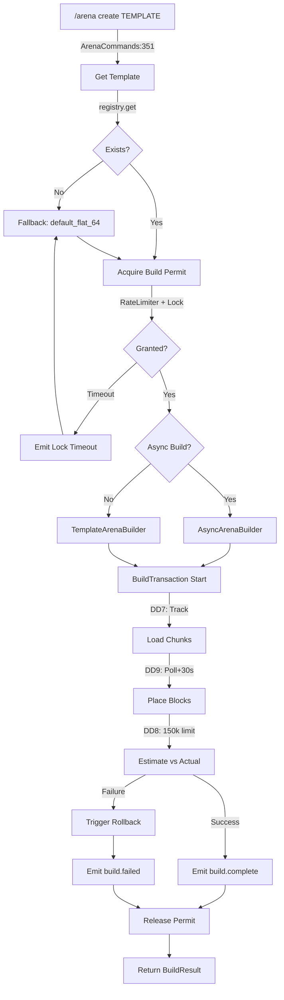
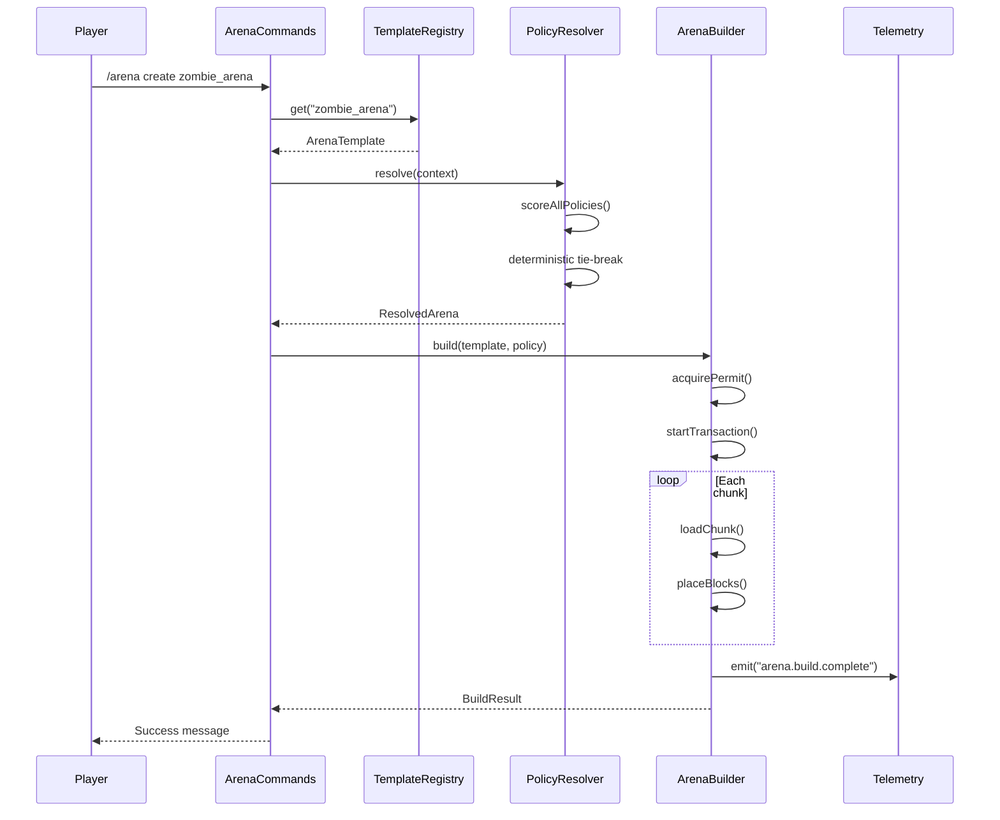

# Arena System

> **Audit Date**: 2024-12-23
> **Status**: ✅ CURRENT - Arena Template v2.23 implementato
> **Risk Level**: HIGH (lock mechanisms, race conditions)
> **Design Decisions**: 72 DD completate (DD1-DD72)

---

## 1. Purpose

The Arena System manages template-based arena creation, policy resolution, and automated testing. It provides:

- **Template Registry**: Load, validate, and hot-reload arena templates
- **Policy Resolution**: Match templates to game context (mob type, difficulty, quest type)
- **Transactional Building**: Safe arena construction with rollback support
- **Autosmoke Testing**: Scheduled automated test runs

---

## 2. Key Concepts

| Concept | Description | File Reference |
|---------|-------------|----------------|
| **ArenaTemplate** | Definition of an arena (structures, spawns, hazards) | `registry/ArenaTemplate.java:22` |
| **ArenaPolicy** | Rules for template selection based on context | `policy/ArenaPolicy.java:12` |
| **ResolvedArena** | Final template + policy combination | `policy/ResolvedArena.java` |
| **ResolveContext** | Input context (mobType, difficulty, questType, tags) | `policy/ResolveContext.java:12` |
| **BuildTransaction** | Tracked build operation with rollback | `builder/BuildTransaction.java` |

---

## 3. Components

### Registry Package (30 classes)
```
com.devmod.arena.registry/
├── ArenaTemplateRegistry.java:32      # Main registry (946 lines)
├── TemplateRegistryBootstrap.java:26  # Bootstrap initialization
├── TemplateValidator.java:10          # Template validation
├── TemplateLoader.java:20             # File loading
├── ArenaTemplate.java:22              # Template record
└── (exceptions: ParentNotFound, InheritanceCycle, DepthExceeded)
```

### Builder Package (10 classes)
```
com.devmod.arena.builder/
├── ArenaBuilder.java:45               # Core builder (DD7-DD10)
├── TemplateArenaBuilder.java:19       # Template wrapper
├── AsyncArenaBuilder.java:28          # Async execution
└── BuildTransaction.java              # Transaction tracking
```

### Policy Package (9 classes)
```
com.devmod.arena.policy/
├── PolicyResolver.java:31             # Main resolver (578 lines)
├── ArenaPolicy.java:12                # Policy record
├── ResolveContext.java:12             # Context record
└── ResolvedArena.java                 # Resolution result
```

### Command Package (3 classes)
```
com.devmod.arena.command/
├── ArenaCommands.java:72              # CLI commands (1209 lines)
└── ArenaActionRegistry.java:19        # Action registration
```

### Autosmoke Package (8 classes)
```
com.devmod.arena.autosmoke/
├── AutosmokeScheduler.java:29         # Cron scheduler
├── AutosmokeRunner.java               # Test execution
└── AutosmokeGuard.java                # Rate limiting
```

---

## 4. Entrypoints

### Commands

| Command | File:Line | Description |
|---------|-----------|-------------|
| `/arena create <template>` | `ArenaCommands.java:351` | Create arena |
| `/arena template list` | `ArenaCommands.java:520` | List templates |
| `/arena template info <id>` | `ArenaCommands.java:549` | Template details |
| `/arena template reload` | `ArenaCommands.java:607` | Hot reload |
| `/arena validate <id>` | `ArenaCommands.java:805` | Validate template |
| `/arena force <id> [min]` | `ArenaCommands.java:874` | Force template |
| `/arena autosmoke run` | `ArenaCommands.java:673` | Manual autosmoke |
| `/arena autosmoke status` | `ArenaCommands.java:719` | Check status |
| `/arena hud toggle` | `ArenaCommands.java:1069` | Toggle HUD |

### API Entry Points

```java
// ArenaServiceV2 (api/ArenaServiceV2.java)
prepareArenaForPartyV2(UUID partyId, ResolveContext context)
prepareArenaForPartyV2(UUID partyId, String templateId, String policyId)
resolveArena(ResolveContext context)
releaseArena(UUID arenaId)
```

---

## 5. End-to-End Flow



---

## 6. Runtime Sequence



---

## 7. Data & Telemetry

### Events Emitted

| Event | Location | Data |
|-------|----------|------|
| `arena.template.loaded` | Registry:240 | id, version, source |
| `arena.template.hot_reload` | Registry:343 | count, duration |
| `arena.policy.resolved` | PolicyResolver:426 | winner, score, alternatives |
| `arena.build.start` | Builder | arena_id, template_id |
| `arena.build.complete` | Builder | duration, blocks |
| `arena.build.failed` | Builder | error, rollback_status |
| `arena.autosmoke.complete` | Scheduler:221 | pass_count, fail_count |

### Persistence

| Type | Location | Format |
|------|----------|--------|
| Templates | `config/devmod/arena_templates/` | YAML/JSON |
| Structure Manifest | `config/devmod/structures_manifest.json` | JSON |
| Runtime State | In-memory (ConcurrentHashMap) | Volatile |

---

## 8. Failure Modes

| Failure | Cause | Recovery |
|---------|-------|----------|
| Template not found | Missing file or invalid ID | Fallback to `default_flat_64` |
| Inheritance cycle | Circular template extends | InheritanceCycleException |
| Lock timeout | Contention > 5s | Emit timeout, use fallback |
| Build over budget | > 150k blocks | Reject build, emit warning |
| Chunk load timeout | Chunks not available | Retry with exponential backoff |

---

## 9. Gaps / Risks

### Critical (P0)

| Gap | Description | File:Line | Impact |
|-----|-------------|-----------|--------|
| **TOCTOU Race** | Lock cleanup checks `!isLocked()` then removes | PolicyResolver:464-466 | Premature lock removal |
| **PolicyEngine Missing** | Docs reference non-existent class | - | Documentation mismatch |
| **No BuildHistoryStore** | Interface exists but no implementation | ArenaBuilder:77 | No build metrics learning |

### High (P1)

| Gap | Description | Impact |
|-----|-------------|--------|
| 3 Lock Mechanisms | PlayerLocks, TemplateLocks, RateLimiter | Deadlock potential |
| Hardcoded Timeouts | 5s, 30s not configurable | Inflexible under load |
| State Lost on Restart | Policies in-memory only | Configuration loss |

### Medium (P2)

| Gap | Description |
|-----|-------------|
| Telemetry Sparse | 20+ direct emit() calls, no central strategy |
| Snapshot Inconsistent | VersionDriftDetector used inconsistently |
| No Command Telemetry | Can't correlate command to build failure |

---

## 10. Next Actions

### Immediate
1. Fix TOCTOU race in `PolicyResolver.cleanupStaleLocks()`
2. Implement `BuildHistoryStore` for metrics
3. Document or remove PolicyEngine references

### Short-term
1. Consolidate lock mechanisms into single LockManager
2. Externalize timeouts to configuration
3. Add command-level telemetry

### Long-term
1. Implement persistent policy storage
2. Add comprehensive audit logging
3. Create integration tests for concurrent scenarios

---

## 11. Arena Template v2.23 Specification

Per la specifica completa del sistema Arena Template, vedere:

### Core Documentation

| Document | Description |
|----------|-------------|
| [[subsystems/arena-template-rework/TODO_ARENA_TEMPLATE]] | Specifica completa DD1-DD72 (canonical) |
| [[subsystems/arena-template-rework/PRODUCTION_MARKER_README]] | AutosmokeGuard (DD32) |
| [[runbook/arena-alerts]] | Runbook alert DD68 (48h monitoring) |

### Implementation Records (DD by Agent)

| Agent | DD Range | Area | Status |
|-------|----------|------|--------|
| [[subsystems/arena-template-rework/TODO_AGENT_01_COMPLETE]] | DD 1-6 | Registry & Resolver | ✅ |
| [[subsystems/arena-template-rework/TODO_AGENT_02_COMPLETE]] | DD 7-10 | Builder Transazionale | ✅ |
| [[subsystems/arena-template-rework/TODO_AGENT_03_COMPLETE]] | DD 11-12 | Budget & Async | ✅ |
| [[subsystems/arena-template-rework/TODO_AGENT_04_COMPLETE]] | DD 13-15 | Metriche & API | ✅ |
| [[subsystems/arena-template-rework/TODO_AGENT_05_COMPLETE]] | DD 16-21 | Observability & Persistence | ⚠️ DuckDbRepository missing |
| [[subsystems/arena-template-rework/TODO_AGENT_06_COMPLETE]] | DD 22-28 | Identity & Recovery | ✅ |
| [[subsystems/arena-template-rework/TODO_AGENT_07_COMPLETE]] | DD 29-36 | Operations & Security | ✅ |
| [[subsystems/arena-template-rework/TODO_AGENT_08_COMPLETE]] | DD 37-43 | Cleanup & Migration | ✅ |
| [[subsystems/arena-template-rework/TODO_AGENT_09_COMPLETE]] | DD 44-50 | Rollback & Spawn | ✅ |
| [[subsystems/arena-template-rework/TODO_AGENT_10_COMPLETE]] | DD 51-56 | Gamification & Balance | ✅ |
| [[subsystems/arena-template-rework/TODO_AGENT_11_COMPLETE]] | DD 57-62 | Telemetry & Concurrency | ✅ |
| [[subsystems/arena-template-rework/TODO_AGENT_12_COMPLETE]] | DD 63-72 | Pool & Readiness | ✅ |

### Schemas (Canonical Location)

| Schema | Path |
|--------|------|
| ArenaTemplate (L1) | `src/main/resources/schemas/arena_template.schema.json` |
| ArenaPolicy (L2) | `src/main/resources/schemas/arena_policy.schema.json` |

### KPI Target (DD72)

| Metric | Target |
|--------|--------|
| build_p95 | < 5s |
| rollback_rate | < 1% |
| completion_rate | > 75% |

---

## Cross-References

- [[MOC]] - Master index
- [[ENTRYPOINTS]] - All entry points
- [[areas/endurance/README]] - Uses arena system
- [[areas/telemetry/README]] - Arena telemetry
- [[cross_cutting/CONCURRENCY]] - Lock patterns
- [[subsystems/arena-template-rework/ARENA_TEMPLATE_AUDIT]] - Audit status e gap residui
- [[subsystems/arena-template-rework/DOCUMENTATION_AUDIT_REPORT]] - Audit doc 2024-12-23

---

*Generated from codebase analysis - 2024-12-23*
