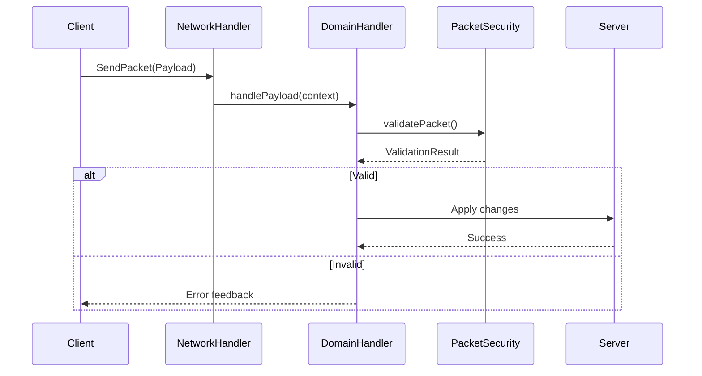

# Client/Server Boundary

> **Audit Date**: 2024-12-23
> **Status**: PARTIAL
> **Risk Level**: HIGH (potential crash on dedicated server)

---

## 1. Purpose

This document audits the separation between client and server code:

- **@OnlyIn(Dist.CLIENT)** usage
- **Network handler safety**
- **Mixin side annotations**
- **Package boundaries**

---

## 2. Key Concepts

| Concept | Description |
|---------|-------------|
| **Dist.CLIENT** | Client-only code annotation |
| **Dist.DEDICATED_SERVER** | Server-only code |
| **playToServer** | Client→Server packet |
| **playToClient** | Server→Client packet |
| **ClientVFXProxy** | Safe proxy for VFX calls |

---

## 3. Package Boundaries

### Client-Only Packages

| Package | Classes | Description |
|---------|---------|-------------|
| `client/` | 12 | Client bridge, input |
| `client/input/` | 3 | Keybind handlers |
| `ui/` | 68+ | All UI screens |
| `ui/radial/` | 15 | Radial menu |
| `ui/editor/` | 100+ | Editor components |
| `hud/` | 29 | HUD overlays |
| `rendering/` | 24 | Debug rendering |
| `mixin/` (client) | 5 | Client mixins |

### Server-Only Logic

| Component | File | Description |
|-----------|------|-------------|
| `EnduranceQuestManager` | endurance/ | Quest orchestration |
| `PartyManager` | party/ | Party management |
| `RewardSystem` | endurance/ | Reward calculation |
| `PerkSystem` | endurance/ | Perk application |
| `PacketSecurityService` | network/ | Validation layer |

---

## 4. Network Architecture

### Channel Registration

```java
// NetworkHandler.java - 46 channels
registrar.playToServer(...)  // 28 client→server
registrar.playToClient(...)  // 18 server→client
```

### Handler Pattern



### Domain Handlers

| Handler | Payloads | Direction |
|---------|----------|-----------|
| `MobItemNetworkHandler` | Weapon, Armor, Mob stats | Bidirectional |
| `EnduranceNetworkHandler` | Quest, Perk, Reward | Bidirectional |
| `PartyNetworkHandler` | Party sync, notification | Bidirectional |
| `ShieldNetworkHandler` | Shield state, impact | Server→Client |
| `ConfigNetworkHandler` | Recipe, config sync | Bidirectional |
| `AbilityNetworkHandler` | Ability, stamina | Bidirectional |

---

## 5. Critical Gaps

### P0: Direct Minecraft Import in Handler

**File**: `ConfigNetworkHandler.java:34-37`

```java
// PROBLEM: Direct client access in network handler
context.enqueueWork(() -> {
    Minecraft mc = Minecraft.getInstance(); // ClassNotFoundException on server!
    if (mc.screen instanceof ItemEditorScreen screen) {
        screen.onServerConfirm(payload);
    }
});
```

**Impact**: Server crash if class loaded

**Fix**: Move to `@OnlyIn(Dist.CLIENT)` method

### P0: ClientConfigFeedback Not Annotated

**File**: `ClientConfigFeedback.java`

```java
// MISSING @OnlyIn(Dist.CLIENT)
public class ClientConfigFeedback {
    public static void handleMobConfigConfirm(...) {
        Minecraft mc = Minecraft.getInstance(); // CRASH on server
    }
}
```

**Fix**: Add `@OnlyIn(Dist.CLIENT)` annotation

### P1: Static Import of Client Classes

**File**: `EnduranceNetworkHandler.java:6`

```java
import com.frenkvs.devmod.actions.client.ClientActionContexts;
```

**Risk**: ClassNotFoundException when handler class loads on server

**Fix**: Use lazy loading or reflection

---

## 6. Safe Patterns

### ClientVFXProxy (Correct)

```java
public static void addImpactVFX(Vec3 pos, Vec3 dir, ImpactData data) {
    if (!FMLEnvironment.dist.isClient()) return;  // Runtime check

    try {
        initClient();  // @OnlyIn(Dist.CLIENT)
        addImpactVFXMethod.invoke(null, pos, dir, data);
    } catch (Exception e) {
        LOGGER.error("Error calling addImpactVFX", e);
    }
}
```

**Why Safe**:
- Runtime dist check before any client code
- Reflection avoids static import
- @OnlyIn on initialization method
- Try-catch for ClassNotFoundException

---

## 7. Mixin Side Safety

### Missing Annotations

| Mixin | Target | Status |
|-------|--------|--------|
| `GameRendererMixin` | GameRenderer | Missing @OnlyIn |
| `LivingEntityRendererMixin` | LivingEntityRenderer | Missing @OnlyIn |
| `ModelPartTransformMixin` | ModelPart | Missing @OnlyIn |
| `DebugRendererMixin` | DebugRenderer | Missing @OnlyIn |
| `CameraShakeMixin` | Camera | Missing @OnlyIn |

**Risk**: Low (target classes don't exist on server), but violates best practices

**Fix**: Add `@OnlyIn(Dist.CLIENT)` to all client mixins

---

## 8. Security Layer

### PacketSecurityService

```java
public ValidationResult validatePacket(
    ServerPlayer player,
    String packetType,
    boolean requiresOp
) {
    // 1. Permission check
    if (requiresOp && !isOperator(player)) {
        return ValidationResult.fail("Requires operator");
    }

    // 2. Rate limiting (10 pkt/sec per type)
    if (!checkRateLimit(player.getUUID(), packetType)) {
        return ValidationResult.fail("Rate limit exceeded");
    }

    return ValidationResult.success();
}
```

**Features**:
- 350+ bounds validation constants
- Per-player rate limiting
- Permission checking
- Value clamping

---

## 9. Recommendations

### Immediate (P0)

1. **Annotate ClientConfigFeedback**
   ```java
   @OnlyIn(Dist.CLIENT)
   public class ClientConfigFeedback { ... }
   ```

2. **Fix ConfigNetworkHandler**
   - Move client logic to separate @OnlyIn method

3. **Annotate Client Mixins**
   - Add @OnlyIn(Dist.CLIENT) to all 5 client mixins

### Short-term (P1)

4. **Use Lazy Import Pattern**
   ```java
   // Instead of static import
   Class.forName("...ClientActionContexts");
   ```

5. **Add Dist-Side Tests**
   - Load handlers on fake server
   - Verify no ClassNotFoundException

### Documentation

6. **Package Policy**
   ```
   client-only: client/, ui/, rendering/, hud/
   shared: network/, actions/, telemetry/
   server-only: (implicit in network handlers)
   ```

---

## 10. Summary

| Metric | Count |
|--------|-------|
| Client-Only Classes | 144+ annotated |
| Network Channels | 46 |
| Client→Server Payloads | 28 |
| Server→Client Payloads | 18 |
| Critical Gaps | 3 |
| Missing Mixin Annotations | 5 |

**Risk Level**: MEDIUM - Legitimate crash scenario exists if handlers load client classes on dedicated server.

---

## Cross-References

- [[MOC]] - Master index
- [[ENTRYPOINTS]] - Network entry points
- [[cross_cutting/CONCURRENCY]] - Thread safety
- [[areas/radial/README]] - Client UI

---

*Generated from codebase analysis - 2024-12-23*
