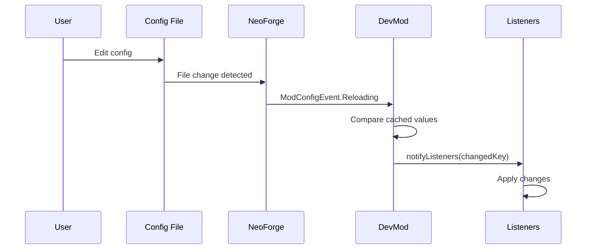
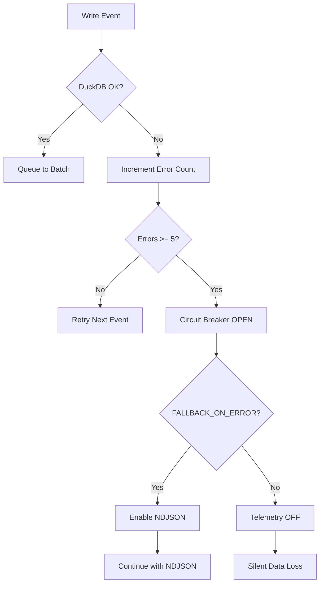

# Config System

> **Audit Date**: 2024-12-23
> **Status**: PARTIAL
> **Risk Level**: MEDIUM (validation gaps, corruption risk)

---

## 1. Purpose

The Config System manages all mod configuration:

- **NeoForge ModConfigSpec**: Type-safe config with validation
- **Hot-Reload**: Runtime config updates with listeners
- **Feature Flags**: Enable/disable features dynamically
- **Circuit Breaker**: Graceful degradation on failures

---

## 2. Key Concepts

| Concept | Description | File Reference |
|---------|-------------|----------------|
| **ModConfigSpec** | NeoForge typed config | `Config.java`, `EditorClientConfig.java` |
| **ConfigChangeListener** | Hot-reload callbacks | `EditorConfig.java:79` |
| **Circuit Breaker** | DuckDB failure handling | `DuckDBBatchWriter.java:76` |
| **Feature Flags** | Runtime toggles | Various config classes |

---

## 3. Config Files

### Java Config Classes

| File | Purpose | Type |
|------|---------|------|
| `Config.java` | Main mod config | NeoForge TOML |
| `ModConfig.java` | Runtime state | Static variables |
| `EditorClientConfig.java` | Editor settings | NeoForge TOML |
| `EditorConfig.java` | Hot-reload bridge | Listener pattern |
| `DuckDBConfig.java` | Telemetry config | JVM properties |
| `TelemetryConfig.java` | Room definitions | JSON |
| `RadialMenuConfig.java` | Menu config | JSON |
| `ArenaTemplateConfig.java` | Arena templates | JSON |

### Runtime Files

| Path | Format | Purpose |
|------|--------|---------|
| `config/devmod-client.toml` | TOML | Client settings |
| `config/devmod/mob_configs.json` | JSON | Mob configurations |
| `config/devmod/settings.json` | JSON | General settings |
| `config/devmod/arena_templates/` | JSON | Arena templates |
| `config/snapshots/<UUID>.dat` | NBT | Player snapshots |

---

## 4. Hot-Reload Mechanism

### NeoForge Event Flow



### Listener Pattern

```java
// EditorConfig.java
private static final List<ConfigChangeListener> listeners =
    new CopyOnWriteArrayList<>();

public static void onConfigReload() {
    EditorUiScale newScale = EditorClientConfig.EDITOR_UI_SCALE.get();
    if (cachedUiScale != newScale) {
        cachedUiScale = newScale;
        notifyListeners("uiScale");
    }
}
```

### Priority Resolution

1. NeoForge config (.toml)
2. System property (`-Ddevmod.editor.uiScale=...`)
3. Environment variable (`DEVMOD_EDITOR_UISCALE=...`)
4. Default value

---

## 5. Feature Flags

### DuckDB Flags

| Flag | Default | Override |
|------|---------|----------|
| `ENABLED` | true | `-Ddevmod.duckdb.enabled=false` |
| `NDJSON_FALLBACK` | false | `-Ddevmod.duckdb.ndjson_fallback=true` |
| `FALLBACK_ON_ERROR` | true | `-Ddevmod.duckdb.fallback_on_error=false` |
| `LOG_BATCH_TIMING` | false | `-Ddevmod.duckdb.log_batch_timing=true` |
| `LOG_INSERTS` | false | `-Ddevmod.duckdb.log_inserts=true` |

### Editor Flags

| Flag | Default | Description |
|------|---------|-------------|
| `EDITOR_SOUNDS_ENABLED` | true | Sound effects |
| `EDITOR_DEFAULT_MODE` | PREVIEW | PREVIEW or APPLY |
| `EDITOR_UI_SCALE` | AUTO | UI scaling |
| `EDITOR_WEAPON_HEURISTIC_ENABLED` | true | Auto-detect weapons |

### Combat Flags

| Flag | Default | Description |
|------|---------|-------------|
| `BODY_PART_DETECTION_ENABLED` | true | Body part hits |
| `OBB_HITBOX_ENABLED` | true | OBB vs AABB |
| `OBB_DEBUG_AXES` | false | Debug visualization |

### Radial Menu Flags

| Flag | Default | Description |
|------|---------|-------------|
| `releaseToSelect` | true | Release key to activate |
| `enableAnimations` | true | Smooth transitions |
| `enableSounds` | true | Feedback sounds |
| `closeOnToggle` | false | Close after toggle |

---

## 6. Circuit Breaker Pattern

### DuckDB Failure Handling



### Backpressure Management

```java
// Priority-based dropping
CRITICAL: hit, death, wave_end    // Never drop
HIGH: spawn, heal, perk           // Drop at 80% queue
NORMAL: ability, alert            // Drop at 50% queue
LOW: movement, snapshots          // Drop first
```

---

## 7. Validation

### Present Validations

| Field | Range | File |
|-------|-------|------|
| `TELEMETRY_TICK_INTERVAL` | 1-100 | Config.java |
| `HEAD_DAMAGE_MULTIPLIER` | 0.1-10.0 | Config.java |
| `IMPACT_HUD_OFFSET_X` | 0-200 | Config.java |
| `IMPACT_VFX_DURATION_MS` | 100-5000 | Config.java |
| `MOB_SEARCH_RADIUS` | 32-512 | Config.java |

### Missing Validations

| Field | Issue | Risk |
|-------|-------|------|
| `DuckDBConfig.BATCH_SIZE` | No bounds | Performance |
| `RadialMenuConfig.innerRadius` | No non-negative | Rendering |
| `RadialMenuConfig.outerRadius` | No < innerRadius check | UI broken |
| `TelemetryConfig.RoomDefinition` | No coordinate validation | Data errors |

---

## 8. Gaps / Risks

### High (P1)

| Gap | Description | Impact |
|-----|-------------|--------|
| No JSON Schema | No validation on load | Corrupt config accepted |
| No Atomic Write | Direct overwrite | Data loss on crash |
| Silent Failures | Catch-all exceptions | Issues hidden |

### Medium (P2)

| Gap | Description |
|-----|-------------|
| No Backup | Config overwritten without backup |
| Race Conditions | Hot-reload without locks |
| DuckDB No Repair | Circuit breaker without recovery |

### Low (P3)

| Gap | Description |
|-----|-------------|
| Hardcoded Thresholds | Not configurable |
| Missing Bounds | Some fields unchecked |

---

## 9. Recommendations

### Immediate

1. **Add JSON Schema Validation**
   ```java
   JsonSchema schema = JsonSchemaFactory.getInstance().getSchema(schemaUri);
   Set<ValidationMessage> errors = schema.validate(configJson);
   ```

2. **Implement Atomic Writes**
   ```java
   Files.write(tempPath, data);
   Files.move(tempPath, configPath, StandardCopyOption.ATOMIC_MOVE);
   ```

3. **Add Config Backup**
   ```java
   Files.copy(configPath, backupPath, StandardCopyOption.REPLACE_EXISTING);
   ```

### Short-term

4. Add bounds checking for DuckDBConfig
5. Improve error logging (structured)
6. Add read-write locks for hot-reload

### Long-term

7. Implement DuckDB repair mechanism
8. Add config versioning/migration
9. Create config health dashboard

---

## 10. Configuration Examples

### Production

```properties
-Ddevmod.duckdb.enabled=true
-Ddevmod.duckdb.ndjson_fallback=false
-Ddevmod.duckdb.batch_size=100
```

### Development

```properties
-Ddevmod.duckdb.ndjson_fallback=true
-Ddevmod.duckdb.log_batch_timing=true
-Ddevmod.editor.gridValidation=true
```

---

## Cross-References

- [[MOC]] - Master index
- [[areas/telemetry/README]] - DuckDB config
- [[areas/radial/README]] - Menu config
- [[cross_cutting/ERROR_HANDLING]] - Error patterns

---

*Generated from codebase analysis - 2024-12-23*
