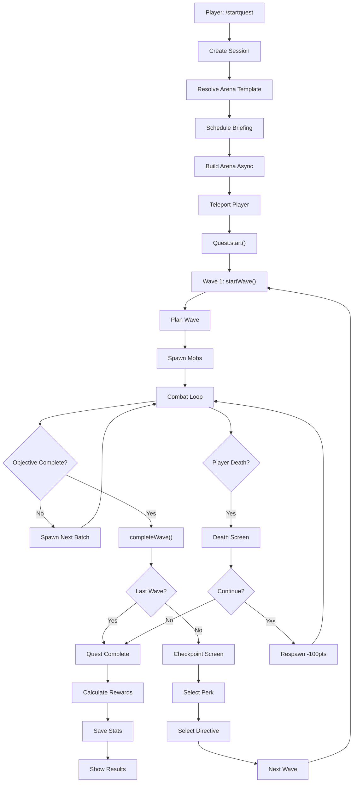
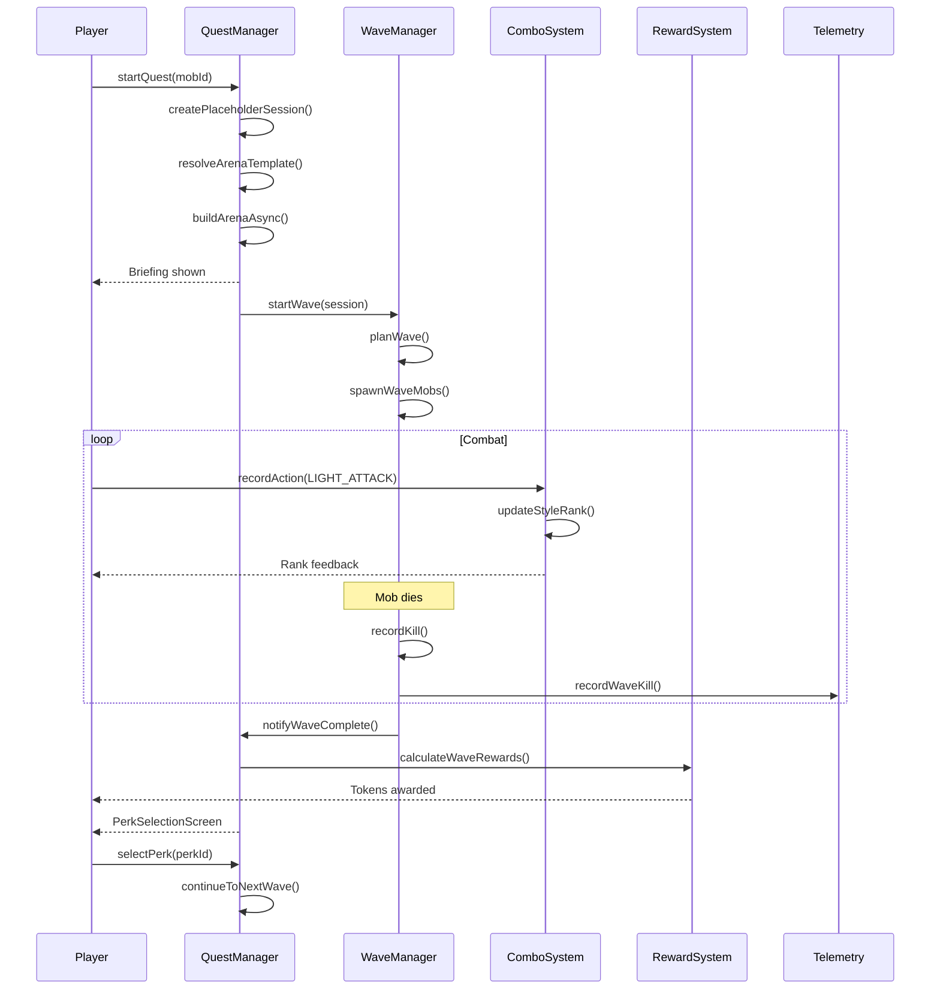

# Endurance System

> **Audit Date**: 2024-12-23
> **Status**: PARTIAL
> **Risk Level**: MEDIUM (wave sync, session management)

---

## 1. Purpose

The Endurance System implements a roguelike wave-based quest mode with:

- **Wave Management**: Progressive enemy waves with scaling difficulty
- **Combo System**: DMC-style scoring (D→SSS ranks)
- **Perk System**: Roguelike upgrades between waves
- **Reward System**: Tokens, loot, and achievements
- **Boss Waves**: Special boss encounters every 5 waves

---

## 2. Key Concepts

| Concept | Description | File Reference |
|---------|-------------|----------------|
| **EnduranceQuest** | Quest session data model | `EnduranceQuest.java` |
| **WaveManager** | Spawn orchestration | `WaveManager.java:1-1290` |
| **WaveDirective** | Wave behavior presets | `WaveDirective.java:17` |
| **ComboSystem** | Style scoring (D→SSS) | `ComboSystem.java:1-500+` |
| **SpawnAffix** | Mob modifiers (RUSH, BRUTE, ELITE) | `SpawnAffix.java:26` |
| **PerkSystem** | Roguelike upgrades | `PerkSystem.java:1-400+` |
| **RewardSystem** | Currency and loot | `RewardSystem.java:1-600+` |

---

## 3. Components

### Core (12 classes)
```
com.devmod.endurance/
├── EnduranceQuestManager.java     # Orchestrator (1809+ lines)
├── EnduranceQuest.java            # Quest model (301 lines)
├── EnduranceQuestState.java       # State enum (19 lines)
├── EnduranceQuestPersistence.java # Persistence (80+ lines)
├── EnduranceSessionHandler.java   # Session lifecycle
├── EnduranceEventHandler.java     # Central event hub
└── CombatTracker.java             # Combat stats
```

### Wave System (6 classes)
```
├── WaveManager.java               # Wave orchestration (1290 lines)
├── WaveDirector.java              # Wave planning (250+ lines)
├── WaveDirective.java             # Directive record
├── WaveObjectiveState.java        # Objectives
├── BossWaveSystem.java            # Boss mechanics (300+ lines)
└── InstanceArenaManager.java      # Arena lifecycle
```

### Combat & Progression (5 classes)
```
├── ComboSystem.java               # DMC scoring (500+ lines)
├── PerkSystem.java                # Roguelike perks (400+ lines)
├── RewardSystem.java              # Loot & currency (600+ lines)
├── GamificationManager.java       # Badges
└── ArenaContext.java              # Arena state
```

### UI Screens (9 classes)
```
├── EnduranceQuestScreen.java      # Main quest UI
├── EnduranceShopScreen.java       # Shop UI
├── PerkSelectionScreen.java       # Perk choices
├── WaveDirectiveScreen.java       # Directive selection
├── WaveCheckpointScreen.java      # Between waves
├── KitSelectionScreen.java        # Kit selector
├── QuestCompletionScreen.java     # Results
├── QuestDeathScreen.java          # Death UI
└── QuestExitConfirmScreen.java    # Exit confirm
```

---

## 4. Entrypoints

### Commands

| Command | Action ID | Description |
|---------|-----------|-------------|
| `/startquest <mobId>` | `ENDURANCE_QUEST_START` | Start quest |
| `/continuequest` | `ENDURANCE_QUEST_CONTINUE` | Continue after death |
| `/exitquest` | `ENDURANCE_QUEST_EXIT` | Exit quest |

### Keybinds

| Key | Action | Description |
|-----|--------|-------------|
| `F10` | Open Endurance Quest | Main quest screen |
| `F11` | Quest Continue | Continue quest |
| `F12` | Quest Exit | Exit quest |
| `\` | Toggle Quest HUD | Show/hide HUD |

### Event Handlers

| Event | Handler | Line |
|-------|---------|------|
| `ServerTickEvent` | `onServerTick(Post)` | 458 |
| `LivingDamageEvent` | `onLivingDamage()` | 466 |
| `LivingDeathEvent` | `onLivingDeath()` | 485 |
| `CriticalHitEvent` | `onCriticalHit()` | 515 |
| `PlayerLoggedInEvent` | `onPlayerLogIn()` | 527 |

---

## 5. End-to-End Flow



---

## 6. Runtime Sequence



---

## 7. Data & Telemetry

### Events Emitted

| Event | Data |
|-------|------|
| `wave_start` | wave_number, mob_count |
| `wave_complete` | kills, duration, DPS |
| `combo_change` | old_rank, new_rank, score |
| `perk_selection` | perk_id, tier, category |
| `boss_fight_start` | archetype, health |
| `token_gain` | amount, reason |
| `achievement_unlock` | id, title |

### Persistence

| Data | Location | Format |
|------|----------|--------|
| Player Stats | `dataDir/endurance_stats/<UUID>.json` | GSON |
| Kit Presets | `dataDir/endurance_kits/` | GSON |
| Session State | In-memory | Transient |

### DuckDB Tables

| Table | Purpose |
|-------|---------|
| `endurance_sessions` | Quest sessions |
| `endurance_waves` | Wave events |
| `endurance_combos` | Combo changes |
| `endurance_perks` | Perk selections |
| `endurance_rewards` | Reward grants |
| `endurance_bosses` | Boss fights |

---

## 8. Failure Modes

| Failure | Cause | Recovery |
|---------|-------|----------|
| Session orphaned | Async build fails | Timeout cleanup needed |
| Wave not completing | Race in objective check | Manual wave complete |
| Objective unreachable | Elite dies before target set | Replace objective target |
| Double token grant | Race in completion | Per-player locks |

---

## 9. Gaps / Risks

### Critical (P0)

| Gap | Description | Impact |
|-----|-------------|--------|
| Session Orphan | No timeout for pending sessions | Memory leak |
| Wave Sync Race | Objective check vs wave tick race | Wave stuck |
| Objective Replacement | Silent fail if deadId null | Uncompletable objective |

### High (P1)

| Gap | Description |
|-----|-------------|
| Combo Carryover | No reset between waves |
| Affix Stacking | No interaction rules defined |
| Elite Chance Logic | min() logic potentially wrong |

### Medium (P2)

| Gap | Description |
|-----|-------------|
| No Save Backup | Direct overwrite, no atomic rename |
| No Schema Version | Old saves break on upgrade |
| Spawn Position Duplicated | 150 lines repeated in 2 methods |

---

## 10. Next Actions

### Immediate
1. Add timeout cleanup for pending sessions
2. Fix wave completion sync race
3. Verify double-spending prevention

### Short-term
1. Consolidate spawn position logic
2. Add schema version migration
3. Document affix interaction rules

### Long-term
1. Implement save file backups
2. Add combo reset on wave complete
3. Create integration tests for wave flow

---

## Cross-References

- [[MOC]] - Master index
- [[areas/arena/README]] - Arena integration
- [[areas/telemetry/README]] - Endurance telemetry
- [[TRACEABILITY_MATRIX]] - Feature tracing

---

*Generated from codebase analysis - 2024-12-23*
