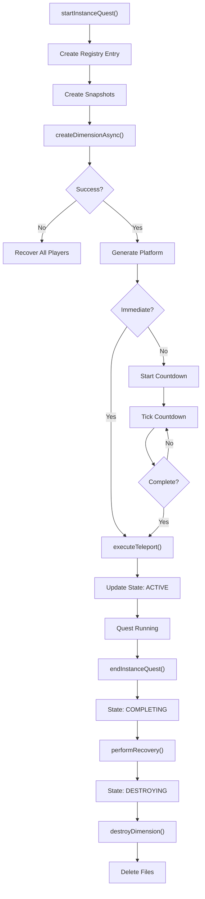
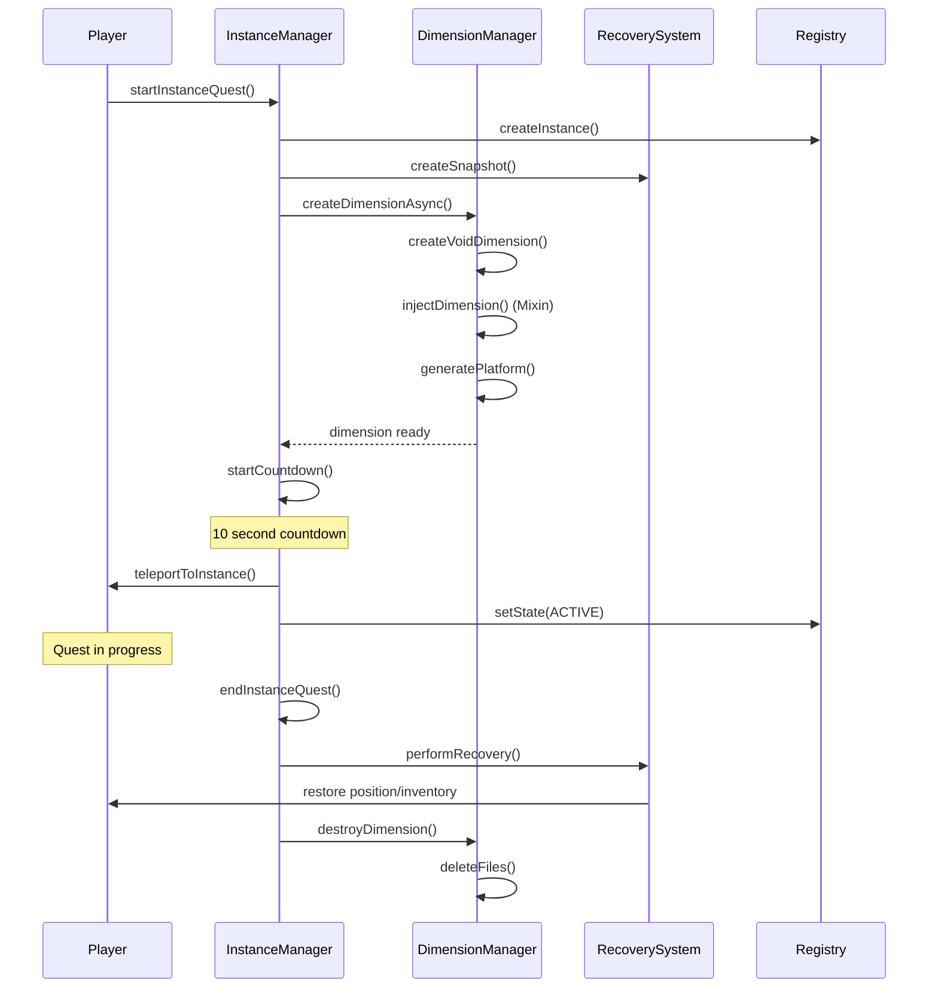

# Instance System

> **Audit Date**: 2024-12-23
> **Status**: PARTIAL
> **Risk Level**: MEDIUM (async operations, state management)

---

## 1. Purpose

The Instance System manages dynamic dimension creation for quest instances:

- **Dynamic Dimensions**: Runtime void dimension creation
- **Player Teleportation**: Safe teleport with countdown
- **State Recovery**: Snapshot-based player recovery
- **Cleanup**: Automatic orphan cleanup on startup

---

## 2. Key Concepts

| Concept | Description | File Reference |
|---------|-------------|----------------|
| **InstanceData** | Instance data model | `InstanceData.java:19-521` |
| **InstanceState** | 6-state machine (CREATING→DESTROYED) | `InstanceState.java:16-92` |
| **PlayerInstanceState** | 5-state player flow | `PlayerInstanceState.java:19-97` |
| **PlayerInstanceSnapshot** | NBT serialization | `PlayerInstanceSnapshot.java:27-607` |
| **DynamicDimensionManager** | Dimension lifecycle | `DynamicDimensionManager.java:56-758` |

---

## 3. Components

### Core (4 classes)
```
com.frenkvs.devmod.instance/
├── InstanceManager.java           # Orchestrator (650 lines)
├── InstanceRegistry.java          # Persistence (487 lines)
├── InstanceState.java             # Instance state enum
└── InstanceData.java              # Instance data model (521 lines)
```

### Dimension Management (2 classes)
```
├── DynamicDimensionManager.java   # Dimension lifecycle (758 lines)
└── InstanceLoadSettings.java      # Chunk configuration
```

### Recovery (2 classes)
```
├── RecoverySystem.java            # Snapshot recovery (583 lines)
└── PlayerInstanceSnapshot.java    # NBT serialization (607 lines)
```

### Integration (2 classes)
```
├── InstanceEventHandler.java      # Event hooks (224 lines)
└── InstanceArenaManager.java      # Arena bridge (198 lines)
```

---

## 4. Entrypoints

### Event Handlers

| Event | Handler | Line |
|-------|---------|------|
| `ServerStartedEvent` | `onServerStarted()` | 42 |
| `ServerStoppingEvent` | `onServerStopping()` | 48 |
| `ServerTickEvent.Post` | `onServerTick()` | 56 |
| `PlayerLoggedInEvent` | `onPlayerLoggedIn()` | 100 |
| `PlayerLoggedOutEvent` | `onPlayerLoggedOut()` | 108 |
| `LivingDeathEvent` | `onPlayerDeath()` | 116 |
| `PlayerRespawnEvent` | `onPlayerRespawn()` | 146 |
| `PlayerChangedDimensionEvent` | `onPlayerChangeDimension()` | 168 |

### API Methods

| Method | File:Line | Purpose |
|--------|-----------|---------|
| `startInstanceQuestImmediate()` | InstanceManager:105 | Immediate teleport |
| `startInstanceQuest()` | InstanceManager:125 | Countdown teleport |
| `endInstanceQuest()` | InstanceManager:447 | End and return players |
| `forceEndPlayerInstances()` | InstanceManager:504 | Force cleanup |

---

## 5. End-to-End Flow



---

## 6. Runtime Sequence



---

## 7. Data & Telemetry

### State Machines

**InstanceState:**
```
CREATING → READY → ACTIVE → COMPLETING → DESTROYING → DESTROYED
```

**PlayerInstanceState:**
```
NORMAL → PREPARING → IN_TRANSIT → IN_INSTANCE → RETURNING → NORMAL
```

### Persistence

| Data | Location | Format |
|------|----------|--------|
| Instance Registry | In-memory | ConcurrentHashMap |
| Player Snapshots | `config/snapshots/<UUID>.dat` | NBT |
| Dimension Files | `world/dimensions/devmod/instance_<UUID>` | World data |

### Snapshot Contents

```
PlayerInstanceSnapshot:
├── playerId, instanceId, state
├── position (dimension, x, y, z, yaw, pitch)
├── inventory, enderChest
├── gameMode, health, food
├── potionEffects, xp
└── questMetadata (type, mob, waves)
```

---

## 8. Failure Modes

| Failure | Cause | Recovery |
|---------|-------|----------|
| Dimension creation fails | Mixin error | Recover players via snapshot |
| Player disconnects mid-teleport | Network | Snapshot preserved, recovery on login |
| Server crash during quest | Power loss | Startup cleanup + recovery |
| Orphaned dimension | Incomplete cleanup | `cleanupOrphanedDimensionFolders()` |

---

## 9. Gaps / Risks

### High (P0/P1)

| Gap | Description | Impact |
|-----|-------------|--------|
| Async Exception Handling | `createDimensionAsync()` no timeout | Stuck creation |
| Mixin Safety | `MinecraftServerAccessor` no fallback | Crash if mixin fails |
| Dimension Rollback | No cleanup on partial creation | Orphaned files |

### Medium (P2)

| Gap | Description |
|-----|-------------|
| setState No Validation | Invalid transitions silently ignored |
| Snapshot Orphans | Files never auto-deleted |
| Destroy Delay Hardcoded | 5000ms not configurable |

---

## 10. Next Actions

### Immediate
1. Add timeout to dimension creation
2. Add mixin reflection fallback
3. Implement creation rollback

### Short-term
1. Add state transition validation
2. Implement periodic snapshot cleanup
3. Make destroy delay configurable

---

## Cross-References

- [[MOC]] - Master index
- [[areas/arena/README]] - Arena integration
- [[areas/endurance/README]] - Quest integration
- [[cross_cutting/CONCURRENCY]] - Async patterns

---

*Generated from codebase analysis - 2024-12-23*
