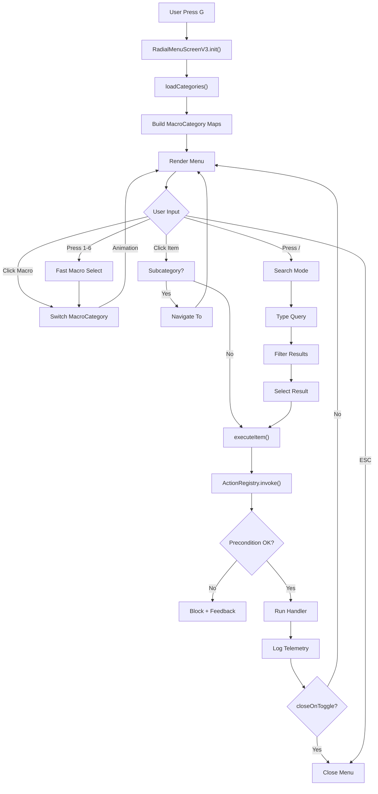
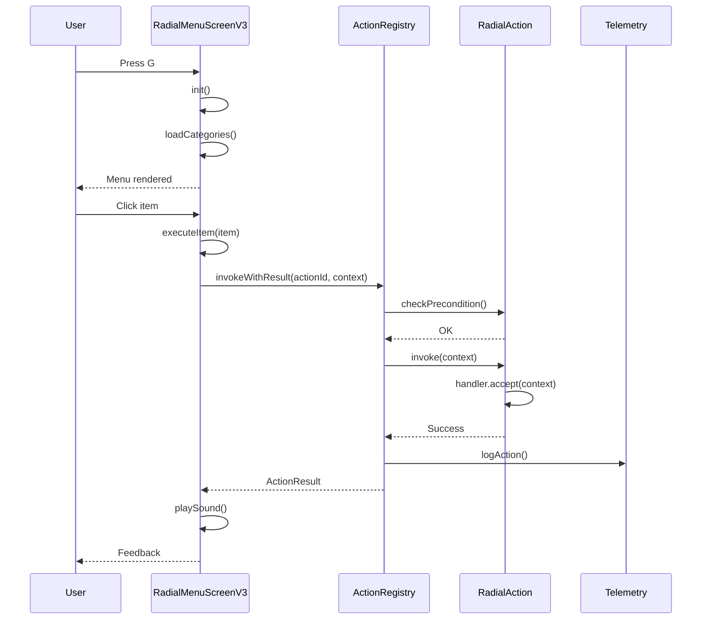

# Radial Menu / UX System

> **Audit Date**: 2024-12-23
> **Status**: DONE (with critical gaps)
> **Risk Level**: HIGH (API mismatch, runtime failures)

---

## 1. Purpose

The Radial Menu system provides:

- **Quick Access**: G key opens radial menu
- **6 Macro Categories**: ANALYZE, TELEMETRY, COMBAT, ARENA, PLAY, TOOLS
- **24 Categories**: Organized actions per macro
- **Action Registry**: Unified action execution
- **Favorites**: Quick access ring
- **Search**: Type to search actions

---

## 2. Key Concepts

| Concept | Description | File Reference |
|---------|-------------|----------------|
| **RadialMenuScreenV3** | Main UI screen | `ui/radial/RadialMenuScreenV3.java:1-1330` |
| **RadialAction** | Action definition | `actions/RadialAction.java:1-309` |
| **ActionRegistry** | Global action registry | `actions/ActionRegistry.java:1-178` |
| **RadialCategory** | Category container | `ui/radial/RadialCategory.java:1-231` |
| **MacroCategory** | 6 macro groupings | `ui/radial/model/MacroCategory.java:1-140` |

---

## 3. Components

### Radial Menu UI
```
com.frenkvs.devmod.ui.radial/
├── RadialMenuScreenV3.java        # Main screen (1330 lines)
├── RadialCategory.java            # Category container (231 lines)
├── RadialMenuItem.java            # Menu item (254 lines)
├── RadialMenuRegistry.java        # Category registry (743 lines)
├── RadialMenuConfig.java          # Configuration (150+ lines)
├── RadialAnimator.java            # Animations (animation/)
└── model/MacroCategory.java       # Macro enum (140 lines)
```

### Action System
```
com.frenkvs.devmod.actions/
├── RadialAction.java              # Action builder (309 lines)
├── ActionRegistry.java            # Registry (178 lines)
├── ActionContext.java             # Execution context (360 lines)
├── ActionType.java                # Action types (50 lines)
├── DevModActions.java             # Common actions (134 lines)
└── client/
    ├── ActionKeybindRegistry.java # Keybind hints (37 lines)
    └── DevModClientActions.java   # Client actions (156 lines)
```

### Input Handling
```
com.frenkvs.devmod.client.input/
└── KeyInputHandler.java           # 32+ keybinds (418 lines)
```

---

## 4. Entrypoints

### Primary Keybinds

| Key | Action | Description |
|-----|--------|-------------|
| `G` | Open Radial Menu | Primary entry point |
| `K` | Open Settings | Settings screen |
| `M` | Open Weapon Editor | Editor UI |
| `J` | Open Dashboard | Telemetry dashboard |
| `N` | Open QA Testing | Testing hub |

### Debug Overlays (Toggle)

| Key | Overlay |
|-----|---------|
| `O` | Debug Overlay |
| `L` | Light Overlay |
| `H` | Heatmap |
| `R` | Room Bounds |
| `P` | Pathfinding |
| `F8` | FPS Tracker |

### Menu Internal Keybinds

| Key | Action |
|-----|--------|
| `1-6` | Select Macro (ANALYZE→TOOLS) |
| `7-0, -, =` | Select Category (0-5) |
| `Q-P` | Execute Item (0-8) |
| `/` or `F` | Toggle Search |
| `LEFT/RIGHT` | Navigate Categories |
| `ESC` | Close Menu |

---

## 5. End-to-End Flow



---

## 6. Runtime Sequence



---

## 7. Data & Telemetry

### Events Emitted

| Event | Data |
|-------|------|
| `radial_menu_opened` | macro, timestamp |
| `radial_menu_closed` | duration_ms, actions_taken |
| `radial_action_invoked` | action_id, category, success |
| `radial_action_blocked` | action_id, reason |
| `radial_search_used` | query, result_count |

### Persistence

| Data | Location | Status |
|------|----------|--------|
| Favorites | Config file | NOT IMPLEMENTED |
| Usage Stats | Config file | NOT IMPLEMENTED |
| Config | `RadialMenuConfig` | Working |

---

## 8. Failure Modes

| Failure | Cause | Recovery |
|---------|-------|----------|
| Action not found | Registry lookup fails | Error feedback |
| Permission denied | Precondition fails | Block action |
| Offline telemetry | No connection | Try-catch wrapper |
| Config corrupt | Invalid values | Fallback defaults |

---

## 9. Gaps / Risks

### Critical (P0)

| Gap | Description | File:Line | Impact |
|-----|-------------|-----------|--------|
| **API Mismatch** | RadialMenuItem calls methods not in RadialAction | `RadialMenuItem.java:36-75` | RUNTIME FAILURE |
| **Dual RadialAction** | Two RadialAction classes exist (ui vs actions) | Multiple | Confusion |
| **ActionId Lookup Fails** | `getRegistryId()` doesn't exist | `RadialMenuScreenV3.java:1179` | Action not executed |
| **ActionKeybindRegistry Empty** | Never populated | `ActionKeybindRegistry.java` | No keybind hints |
| **Dynamic Item Visibility** | `cachedTargetEntity` not available at init | `RadialMenuScreenV3.java:292-315` | First open broken |

### High (P1)

| Gap | Description |
|-----|-------------|
| Macro Switch Bounds | selectedCategoryIndex may be out-of-bounds |
| Long Press No Feedback | User doesn't know long-press occurred |
| Favorites No Undo | One-way operation |
| Search No Ranking | Simple match, no fuzzy scoring |
| Telemetry Offline Risk | No try-catch on logging |

### Medium (P2)

| Gap | Description |
|-----|-------------|
| Config No Validation | Invalid ranges not caught |
| Edit Mode Hidden | No visual indicator |
| Favorites Not Persisted | Lost on restart |
| Usage Stats Not Saved | Can't rank by frequency |

---

## 10. Next Actions

### Immediate (Critical)
1. Unify RadialAction API (ui vs actions)
2. Fix getRegistryId() or remove call
3. Populate ActionKeybindRegistry

### Short-term
1. Implement favorites persistence
2. Add long-press visual feedback
3. Add config validation

### Long-term
1. Implement fuzzy search
2. Add usage statistics tracking
3. Add edit mode visual indicator

---

## Action Types

```java
ActionType.NAVIGATE_SCREEN      // Open Screen
ActionType.RUN_SERVER_COMMAND   // /command
ActionType.SEND_SERVER_RPC      // Network packet
ActionType.TOGGLE_SETTING       // Boolean toggle
ActionType.OPEN_EXTERNAL        // URL
ActionType.TRIGGER_EVENT        // One-shot
ActionType.SUBCATEGORY          // Navigate sub
```

---

## Cross-References

- [[MOC]] - Master index
- [[ENTRYPOINTS]] - All keybinds
- [[cross_cutting/CLIENT_SERVER]] - Client-only actions
- [[areas/config/README]] - Config system

---

*Generated from codebase analysis - 2024-12-23*
