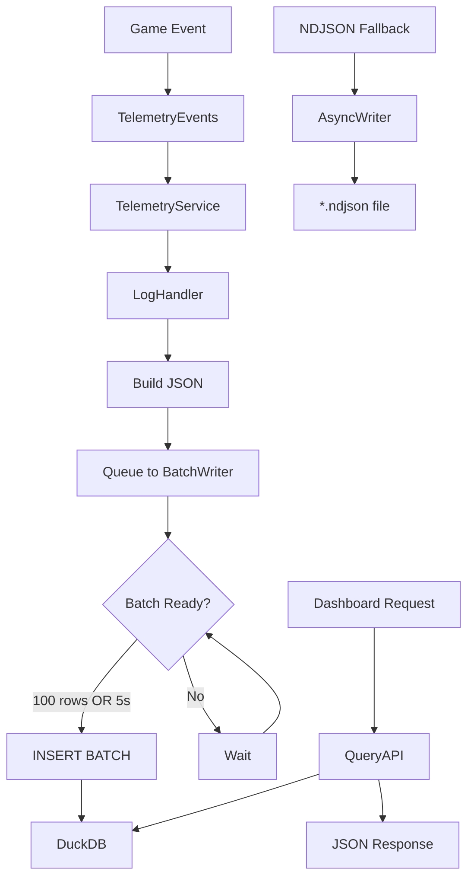
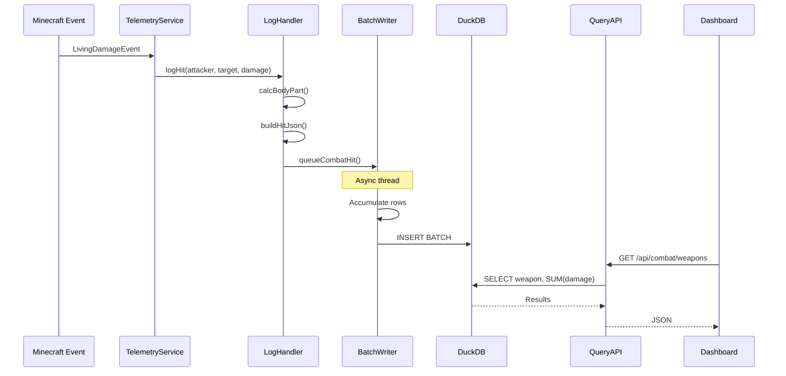

# Telemetry System

> **Audit Date**: 2024-12-23
> **Status**: PARTIAL
> **Risk Level**: MEDIUM (missing event hooks, schema migration)

---

## 1. Purpose

The Telemetry System provides comprehensive analytics and data collection:

- **DuckDB Storage**: 37 tables for structured analytics
- **Combat Tracking**: Hits, deaths, fights, TTK metrics
- **Spatial Analytics**: Heatmaps, alerts, room transitions
- **Dashboard**: HTTP REST API for visualization
- **Export**: CSV, JSON, PNG heatmap export

---

## 2. Key Concepts

| Concept | Description | File Reference |
|---------|-------------|----------------|
| **TelemetryService** | Central orchestrator | `TelemetryService.java:987` |
| **DuckDBBatchWriter** | Async batch insert | `duckdb/DuckDBBatchWriter.java:1473` |
| **DuckDBQueryAPI** | Analytics queries | `duckdb/DuckDBQueryAPI.java:1392` |
| **FightSessionService** | Fight grouping | `FightSessionService.java` |
| **HeatmapService** | Spatial aggregation | `HeatmapService.java:441` |

---

## 3. Components

### Core (3 classes)
```
com.devmod.telemetry/
├── TelemetryService.java          # Orchestrator (987 lines)
├── TelemetryEvents.java           # Event handlers (334 lines)
└── TelemetryLogHandlers.java      # Logging delegates (526 lines)
```

### DuckDB Integration (11 classes)
```
telemetry/duckdb/
├── DuckDBTelemetryService.java    # Main service (1337 lines)
├── DuckDBSchemaManager.java       # Schema + migrations (1225 lines)
├── DuckDBBatchWriter.java         # Batch writer (1473 lines)
├── DuckDBQueryAPI.java            # Query API (1392 lines)
├── DuckDBConnectionManager.java   # Connection pool
├── DuckDBConfig.java              # Configuration (196 lines)
├── DuckDBMigrationService.java    # Migrations V1-V8
└── TelemetryPacketHandler.java    # Network handler (749 lines)
```

### Tracking Services (12 classes)
```
├── EntityTrackingService.java     # Stuck, camping, aggro (464 lines)
├── PlayerTrackingService.java     # Room, OOB tracking (503 lines)
├── DamageTrackingService.java     # Damage aggregation
├── BossPhaseService.java          # Boss detection
├── DungeonSessionService.java     # Dungeon runs (560 lines)
├── EconomyMetricsService.java     # Loot, trades (737 lines)
├── EnduranceTelemetryService.java # Quest tracking (1302 lines)
└── PlayerProgressionService.java  # XP, advancements (474 lines)
```

### Spatial Services (8 classes)
```
├── HeatmapService.java            # Heatmap aggregation (441 lines)
├── SpatialMetricsService.java     # Entity density
├── DesireLinesService.java        # Movement patterns
├── BacktrackingService.java       # Room backtracking
├── LightAnalysisService.java      # Light/spawnability
└── RoomAnalysisService.java       # Room analytics
```

### Dashboard (2 classes)
```
├── TelemetryDashboardServer.java  # HTTP server (1025 lines)
└── TelemetryAnalyticsHandlers.java # REST handlers (952 lines)
```

---

## 4. Entrypoints

### Commands

| Command | Description |
|---------|-------------|
| `/devmod telemetry reload` | Reload config |
| `/devmod telemetry dump weapons` | Weapon summaries |
| `/devmod telemetry dump rooms` | Room summaries |
| `/devmod telemetry export heatmaps` | Export heatmaps |
| `/devmod telemetry export csv` | CSV export |
| `/devmod telemetry export all` | Full export |

### Dashboard REST API (Port 8642)

| Endpoint | Description |
|----------|-------------|
| `GET /api/health` | Health check |
| `GET /api/combat/hits` | Recent hits |
| `GET /api/combat/weapons` | Weapon rankings |
| `GET /api/endurance/sessions` | Quest sessions |
| `GET /api/spatial/heatmaps?type=` | Heatmap data |
| `GET /export/csv?table=` | CSV download |

---

## 5. End-to-End Flow



---

## 6. Runtime Sequence



---

## 7. Data & Telemetry

### DuckDB Schema (37 Tables)

#### Combat Events (5 tables)
| Table | Key Fields |
|-------|------------|
| `combat_hits` | ts, room, attacker, target, damage, body_part |
| `combat_deaths` | ts, room, target, cause, ttk_ms |
| `combat_heals` | ts, target, heal_amount, source |
| `combat_spawns` | ts, room, entity_name, spawn_fail |
| `combat_fights` | start_ts, duration_ms, hits, kills |

#### Endurance Events (10 tables)
| Table | Key Fields |
|-------|------------|
| `endurance_sessions` | session_id, player_id, waves, outcome |
| `endurance_waves` | session_id, wave_number, mob_count |
| `endurance_combos` | player_id, old_rank, new_rank |
| `endurance_perks` | player_id, perk_id, tier |
| `endurance_rewards` | player_id, currency, amount |

#### Spatial Events (3 tables)
| Table | Key Fields |
|-------|------------|
| `spatial_heatmaps` | ts, type, room, x/y/z, count |
| `spatial_alerts` | ts, type, player, room |
| `spatial_room_transitions` | ts, player_id, room |

### Heatmap Types

| Type | Description |
|------|-------------|
| `stuck` | Entity stuck locations |
| `aggro_drop` | Aggro reset points |
| `death` | Death locations |
| `movement` | Player movement |
| `camping` | Safe spot camping |
| `kiting` | Kiting paths |

---

## 8. Failure Modes

| Failure | Cause | Recovery |
|---------|-------|----------|
| DuckDB write error | Disk full, corruption | Circuit breaker → NDJSON |
| Batch timeout | Queue full | Increase queue capacity |
| Schema mismatch | Version upgrade | Migration service |
| Dashboard unavailable | Port conflict | Check 8642 binding |

---

## 9. Gaps / Risks

### Critical (P0)

| Gap | Description | Impact |
|-----|-------------|--------|
| Missing Ability Hooks | `logAbility()` never called | No ability data |
| Incomplete Dungeon Tracking | Rewards not tracked | Economy gaps |
| Skill Integration Unclear | Trackers exist but not hooked | Silent failure |

### High (P1)

| Gap | Description |
|-----|-------------|
| Circuit Breaker Silent | State change not logged clearly |
| Memory Leak Risk | 12+ services need cleanup |
| No Migration Path Tests | V1→V8 not validated |

### Medium (P2)

| Gap | Description |
|-----|-------------|
| Heatmap 60s Flush | Data loss on crash |
| Dual-Write Overhead | +0.2ms with NDJSON fallback |
| Dashboard Port Hardcoded | No config option |

---

## 10. Next Actions

### Immediate
1. Implement ability event hooks
2. Audit dungeon tracking completeness
3. Add circuit breaker state logging

### Short-term
1. Add migration path validation tests
2. Benchmark batch size optimization
3. Reduce heatmap flush interval

### Long-term
1. Make dashboard port configurable
2. Add memory usage metrics
3. Implement query caching

---

## Configuration

### Production
```
-Ddevmod.duckdb.enabled=true
-Ddevmod.duckdb.ndjson_fallback=false
-Ddevmod.duckdb.batch_size=100
-Ddevmod.duckdb.flush_interval_ms=5000
```

### Development
```
-Ddevmod.duckdb.ndjson_fallback=true
-Ddevmod.duckdb.log_batch_timing=true
```

---

## Cross-References

- [[MOC]] - Master index
- [[areas/endurance/README]] - Endurance telemetry
- [[areas/arena/README]] - Arena telemetry
- [[cross_cutting/TELEMETRY_CONVENTIONS]] - Naming conventions

---

*Generated from codebase analysis - 2024-12-23*
