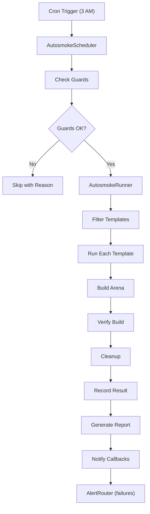

# Tools / QA / Autosmoke

> **Audit Date**: 2024-12-23
> **Status**: DONE
> **Risk Level**: LOW (comprehensive testing infrastructure)

---

## 1. Purpose

The Tools/QA system provides comprehensive testing infrastructure:

- **GameTest**: NeoForge in-game testing framework
- **JUnit**: 655+ unit tests with coverage
- **Autosmoke**: Scheduled automated arena tests
- **QA Tracking**: Achievement-style test progression
- **CI Gates**: 7 blocking release checks

---

## 2. Key Concepts

| Concept | Description | File Reference |
|---------|-------------|----------------|
| **GameTest** | In-game automated tests | `gametest/` package |
| **Autosmoke** | Cron-scheduled arena tests | `AutosmokeScheduler.java` |
| **QAEventTracker** | Event-driven test completion | `QAEventTracker.java` |
| **TestHarnessCommands** | Manual test commands | `/devtest *` |

---

## 3. Components

### GameTest Framework

| Component | File | Tests | Description |
|-----------|------|-------|-------------|
| `DevModGameTests` | gametest/ | 5 | Core mod tests |
| `L0BootVerificationTests` | gametest/ | 8 | Boot verification (required) |
| `InstanceSystemGameTests` | gametest/ | 12 | Instance system |
| `TestHarnessCommands` | gametest/ | - | Manual commands (773 lines) |

### QA Testing UI

| Component | File | Description |
|-----------|------|-------------|
| `QATestingScreen` | testing/ | Test selection UI (1252 lines) |
| `QAEventTracker` | testing/ | Event auto-completion (513 lines) |
| `QANotificationSystem` | testing/ | Toast notifications (310 lines) |
| `TesterProgress` | testing/ | Gameplay metrics |
| `TesterProfile` | testing/ | Gamification (XP, badges) |

### Autosmoke System

| Component | File | Description |
|-----------|------|-------------|
| `AutosmokeScheduler` | arena/autosmoke/ | Cron scheduler (457 lines) |
| `AutosmokeRunner` | arena/autosmoke/ | Test executor |
| `AutosmokeGuard` | arena/autosmoke/ | Triple protection |

---

## 4. Test Commands

### /devtest Commands

```
/devtest hud <on|off|toggle>    - Toggle Impact HUD
/devtest hud export|import      - Save/load HUD preset
/devtest panel <on|off|toggle>  - Toggle 3D panel
/devtest debug <on|off|toggle>  - Toggle debug renderer
/devtest debugbox <size>        - Add debug box
/devtest debugclear             - Clear debug shapes
/devtest info                   - Show system status
/devtest bodypart <part>        - Show body part info
```

### /devtest endurance Commands

```
/devtest endurance stats        - Quest statistics
/devtest endurance perks        - Perk usage stats
/devtest endurance smoke        - DuckDB row counts
/devtest endurance export       - Export to NDJSON
/devtest endurance autosmoke    - Run 2-wave smoke test
```

### /devtest qa

```
/devtest qa                     - Open QA Testing Screen
```

---

## 5. Test Categories

### GameTest Batches

| Batch | Tests | Required | Description |
|-------|-------|----------|-------------|
| `core` | 5 | Yes | Weapon, damage, crits |
| `network` | 3 | Yes | Payload serialization |
| `l0_boot` | 8 | Yes | Server startup |
| `instance_smoke` | 4 | Yes | Instance init |
| `instance_state` | 4 | No | State machine |
| `instance_flow` | 4 | No | Data flow |
| `instance_recovery` | 4 | No | Recovery |
| `entities` | 3 | No | Body part, mob config |
| `config` | 2 | No | Persistence |

### QA Test Categories

| Category | Tests | Auto-Complete |
|----------|-------|---------------|
| Damage System | 5 | Event-driven |
| Overlay Tests | 7 | Toggle detection |
| UI Tests | 3 | Screen open |
| Performance | 3 | Metric sampling |
| Telemetry | 2 | Export success |

---

## 6. Autosmoke Architecture



### Triple Guard

1. **Environment Variable**: `DEVMOD_AUTOSMOKE_ENABLED`
2. **Config Flag**: `autosmoke.enabled=true`
3. **Marker File**: `.autosmoke_enabled`

### Schedule Configuration

```java
// Default: Daily at 3 AM
ScheduleConfig.defaultConfig() = "0 3 * * *"

// Custom cron
ScheduleConfig.fromCron("0 */4 * * *")  // Every 4 hours

// Manual trigger
scheduler.triggerNow()  // Returns CompletableFuture<Report>
```

---

## 7. CI/CD Integration

### Build Workflow

```yaml
# .github/workflows/build.yml
on: [push, pull_request]
jobs:
  build:
    - Setup JDK 21
    - ./gradlew build
    - Upload JAR artifact
```

### Release Gate (DD70)

```yaml
# .github/workflows/release-gate.yml
7 Blocking Checks:

1. Dependency Security   ./gradlew dependencyCheckAnalyze
2. Static Analysis       ./gradlew spotbugsMain pmdMain
3. Unit Tests           ./gradlew test
4. Integration Tests    ./gradlew integrationTest
5. Deprecation Warnings ./gradlew compileJava -PdeprecationAsError
6. Migration Audit      grep legacy API usage
7. Build Verification   ./gradlew build -x test
```

### Coverage Policy

| Tier | Target | Code |
|------|--------|------|
| Core Logic | 80% | cleanup, template, validation |
| MC-Dependent | 60% | monitor, world, entity |
| Network/UI | 50% | handlers, screens |

---

## 8. Test Metrics

| Metric | Count |
|--------|-------|
| JUnit Unit Tests | 655 |
| GameTest Methods | 51 |
| Test Files | 114 |
| CI Gates | 7 (all blocking) |
| QA Auto-Complete | 51% |

### Key Test Files

| Test | File | Purpose |
|------|------|---------|
| InstanceSystemLogicTest | 24 tests | State machines |
| ErrorRecoveryScenarioTest | 17 tests | Failure modes |
| EdgeCaseStressTest | 27 tests | Stress testing |
| MultiplayerConcurrencyTest | 12 tests | Race conditions |
| QuestLifecycleSimulationTest | 15 tests | Full workflow |

---

## 9. Gaps / Risks

### Medium Priority

| Gap | Description | Impact |
|-----|-------------|--------|
| Autosmoke Edge Cases | Recovery scenarios limited | Missed failures |
| Network Lag Simulation | No latency testing | Multiplayer bugs |
| UI Stress Testing | 50+ pages, ~10 covered | UI regressions |

### Low Priority

| Gap | Description |
|-----|-------------|
| Performance Baselines | No absolute thresholds |
| Telemetry Query Coverage | Analytics queries limited |
| QA Auto-Complete | ~20 tests need manual validation |

---

## 10. Recommendations

### Short-term

1. Add edge case recovery tests for autosmoke
2. Implement network lag simulation
3. Expand UI page coverage

### Medium-term

4. Add performance baselines with alerts
5. Increase telemetry query coverage
6. Implement remaining QA auto-validators

### Long-term

7. Add fuzzing for network payloads
8. Implement mutation testing
9. Create visual regression testing

---

## Cross-References

- [[MOC]] - Master index
- [[areas/arena/README]] - Autosmoke integration
- [[areas/telemetry/README]] - Test telemetry
- [[AUDIT_REPORT]] - Test gaps

---

*Generated from codebase analysis - 2024-12-23*
